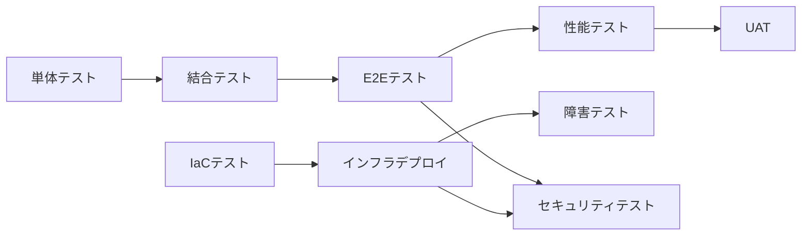

# 2.5.2 テスト戦略策定

## 目的

プロジェクト全体のテスト戦略を決定し、効率的なテスト実施を計画します。

---

## 🎯 テスト戦略の要素

### 1. テストレベルの定義 ⭐⭐⭐

**8つのテストレベル**:

| テストレベル | 目的 | 担当 | 優先度 |
|------------|------|------|-------|
| 単体テスト | コードの正確性 | **Coder** | ⭐⭐⭐ |
| 結合テスト | モジュール間連携 | **QA** | ⭐⭐⭐ |
| E2Eテスト | ユーザーシナリオ | **QA** | ⭐⭐ |
| インフラテスト | IaC の検証 | **SRE** | ⭐⭐⭐ |
| 性能テスト | 非機能要件検証 | **QA + SRE** | ⭐⭐ |
| 障害テスト | 可用性検証 | **SRE** | ⭐⭐ |
| セキュリティテスト | 脆弱性検証 | **QA + SRE** | ⭐⭐⭐ |
| UAT | ユーザー受入 | **QA + PM** | ⭐⭐⭐ |

---

### 1.1 テストレベル境界と担当責務

#### Coder の責務（単体テスト）

```
責務:
- 実装と同時に単体テストを作成
- カバレッジ 80% 以上を維持
- 境界値テスト、異常系テストを含める

完了基準:
- [ ] 全関数/メソッドにテストが存在
- [ ] カバレッジ 80% 以上
- [ ] CI でテストが PASS

ゲート条件:
- 単体テスト未作成の場合、コードレビューで差し戻し
```

#### QA の責務（結合テスト、E2Eテスト、UAT）

```
責務:
- テスト計画書の作成
- 結合テスト、E2Eテストの設計・実装
- テスト結果の報告
- UAT の調整・実施支援

完了基準:
- [ ] テスト計画書が承認済み
- [ ] 結合テストが全て PASS
- [ ] E2E テストが主要シナリオをカバー
- [ ] UAT でユーザー承認取得

ゲート条件:
- テスト計画書未作成の場合、テスト実施不可
- 結合テスト失敗時、デプロイ不可
```

#### SRE の責務（インフラテスト、障害テスト）

```
責務:
- IaC の検証（CloudFormation/Terraform）
- インフラ構成のテスト
- 障害復旧テスト（フェイルオーバー等）
- 性能テスト（インフラ観点）

完了基準:
- [ ] IaC テンプレートの検証 PASS
- [ ] デプロイ後のヘルスチェック PASS
- [ ] 障害復旧テストの実施・記録
- [ ] 性能要件の達成確認

ゲート条件:
- IaC 検証失敗時、デプロイ不可
- 障害復旧テスト未実施の場合、本番リリース不可
```

---

### 1.2 テストレベル間の依存関係



**依存ルール**:
1. 単体テスト PASS → 結合テスト開始
2. 結合テスト PASS → E2E テスト開始
3. IaC テスト PASS → インフラデプロイ
4. E2E テスト + インフラデプロイ完了 → 性能テスト・セキュリティテスト
5. 全テスト PASS → UAT

---

### 2. テスト自動化の範囲 ⭐⭐⭐

**自動化すべきテスト**:
- ✅ 単体テスト（100%自動化）
- ✅ 結合テスト（API, DB）
- ✅ E2Eテスト（重要シナリオ）
- ✅ 性能テスト
- ✅ セキュリティテスト（脆弱性スキャン）

**手動テスト**:
- UAT（ユーザー参加）
- 探索的テスト

---

### 3. テストカバレッジ目標 ⭐⭐⭐

**目標**:
- 単体テスト: **80%以上**
- 重要な業務ロジック: **90%以上**

---

### 4. テスト環境 ⭐⭐

**環境構成**:
- **開発環境（dev）**: 開発者の手元テスト
- **テスト環境（stg）**: 結合テスト、E2Eテスト
- **性能テスト環境（perf）**: 性能テスト専用
- **本番環境（prd）**: UAT後にリリース

---

### 5. テストデータ管理 ⭐⭐

**原則**:
- ✅ テストデータは専用のものを使用
- ✅ 本番データは使用しない
- ✅ 個人情報を含まない
- ✅ 自動生成可能にする

---

## 📝 テスト戦略ドキュメント

**記載内容**:
1. テストレベルと優先順位
2. テスト自動化の範囲
3. テストカバレッジ目標
4. テスト環境構成
5. テストスケジュール
6. テスト体制
7. リスクと対策

---

**作成日**: 2025-10-19
**対象フェーズ**: テスト
**重要度**: ⭐⭐⭐ 必須
