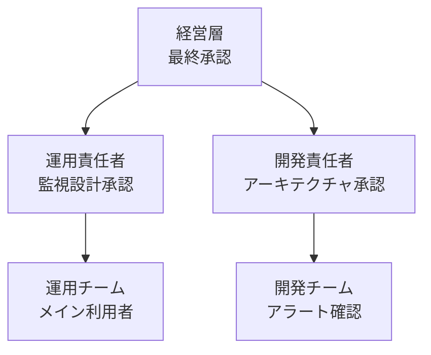
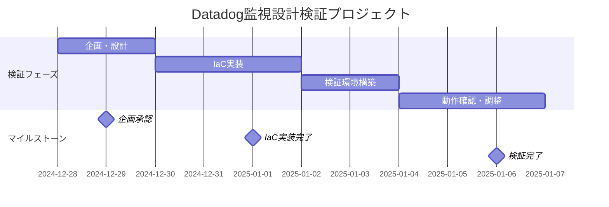

# Datadog監視設計検証プロジェクト

## 1. プロジェクト概要

**プロジェクト名:** Datadog監視設計検証プロジェクト
**略称:** Datadog PoC

**目的:**
オンプレミスからAWSへの移行に備え、親子関係を考慮した監視設計を実装・検証し、アラートストームを回避する監視基盤を構築する。

**対象範囲:**
運用チーム（メイン利用者）および開発チーム（アラート確認時）を対象とした監視基盤のIaC実装

**実施期間:**
2025年年末年始（検証期間）

**承認日:** 2025年12月28日
**承認者:** [承認者名を記載]

---

## 2. ビジネス背景

### 事業環境の変化

オンプレミス環境からAWSクラウドへの移行を検討しており、監視基盤もクラウドネイティブな構成へ移行する必要があります。従来のオンプレミス監視では、アラート設定が個別に管理されており、親子関係の設計が不十分でした。

### 経営方針との整合性

クラウド移行に伴い、以下の方針を実現する必要があります：

1. **運用効率化**: アラートストームの回避により、運用チームの負担を軽減
2. **迅速な障害対応**: 親子関係を明確にし、根本原因を素早く特定
3. **IaCによる自動化**: 新規テナント追加時の運用負荷を最小化

### 技術トレンド

クラウド監視では、Datadog、CloudWatch、Prometheusなどの選択肢がありますが、マルチテナント環境での実績が豊富なDatadogは、親子関係の監視設計に適しています。Infrastructure as Code（IaC）による監視設定の自動化も一般的になっています。

---

## 3. 現状の課題

### アラートストームの発生

**現状:**
プロセスが死亡すると、関連する複数のアラート（プロセス死亡、サービス停止、依存サービス異常など）が大量に発報され、運用チームが本当の根本原因を見極めるのに時間がかかっています。

**具体的な問題:**
- プロセス1つの異常で、10〜20件のアラートが同時に発報
- 運用チームがアラートの整理に月平均20時間を費やしている
- 夜間障害時に不要なアラートで運用担当者が起こされるケースが月2〜3回発生

**課題の原因:**
- 監視設計に親子関係が実装されていない
- プロセス死亡が検知されても、関連アラートが抑制されない
- 監視設定が属人化しており、設計方針が統一されていない

**放置した場合のリスク:**
- AWS移行後もアラートストームが継続し、運用負荷が増大
- 本当に重要なアラートが埋もれ、障害対応が遅延
- 運用担当者の疲弊とモチベーション低下

### 新規テナント追加時の運用負荷

**現状:**
新規テナントを追加する際、監視設定を手動で作成しており、設定ミスが発生しやすい状況です。

**具体的な問題:**
- 新規テナント追加に平均4時間を要する
- 設定ミスによる監視漏れが、10テナント追加ごとに1〜2件発生
- テナント数が増加（現在10〜100社想定）すると、運用が破綻する可能性

**課題の原因:**
- IaCが導入されておらず、手動設定に依存
- 監視設定のテンプレート化が不十分
- テナント構成のバリエーションが多く、標準化が困難

---

## 4. プロジェクトの目的

### 主要目的

親子関係を考慮したDatadog監視設計をTerraformでIaC化し、新規テナント追加時に自動展開できる仕組みを構築する。これにより、アラートストームを回避し、運用チームの負荷を軽減する。

### 具体的な目標値

- **アラート数削減**: プロセス死亡時のアラート数を10〜20件 → 1〜3件に削減（80〜90%削減）
- **新規テナント追加時間**: 平均4時間 → 平均30分に短縮（87.5%削減）
- **監視設定ミス**: 10テナント追加ごとに1〜2件 → 0件（IaCによる標準化）
- **アラート対応時間**: 平均20時間/月 → 平均5時間/月に削減（75%削減）

### 実現方法の概要

1. **親子関係の監視設計**
   - プロセス監視を親アラートとして定義
   - サービス監視を子アラートとして定義
   - 親アラート発報時に子アラートを自動抑制

2. **IaC実装**
   - Terraformでモニター設定を管理
   - テナント構成をパラメータ化
   - 新規テナント追加時はvariablesファイルを更新するだけで自動展開

3. **検証環境での実証**
   - 年末年始で検証環境を構築
   - 実際のアラート発報パターンを確認
   - IaCでの展開手順を確立

---

## 5. 期待される効果

### 定量的効果

#### アラート対応時間削減効果

- アラート対応時間: 月20時間 → 月5時間（月15時間削減）
- 運用担当者の時給を5,000円として、月7.5万円削減（年間90万円削減）

#### 新規テナント追加効率化

- 新規テナント追加時間: 平均4時間 → 平均30分（3.5時間削減）
- 年間10テナント追加を想定: 35時間削減
- 金額換算: 17.5万円削減/年

#### 監視設定ミス削減効果

- IaCによる標準化で設定ミスが0件に
- 監視漏れによる障害検知遅延がなくなり、平均復旧時間（MTTR）が短縮
- 推定効果: 年間2件の重大インシデント回避（影響額100万円/件と仮定）= 200万円/年

#### 合計効果

- **年間削減効果**: 90万円 + 17.5万円 + 200万円 = **307.5万円/年**

#### ROI（投資対効果）

- **初期投資**: 検証期間の人件費（1名 × 1週間 = 約20万円）
- **年間効果**: 307.5万円
- **ROI**: 307.5万円 ÷ 20万円 = **15.4倍**
- **投資回収期間**: 約0.8ヶ月（実質即座に回収）

### 定性的効果

- 運用チームのストレス軽減（アラートストーム回避）
- 夜間障害時の不要な起床がなくなり、運用担当者のワークライフバランス改善
- 監視設計のノウハウがコード化され、属人性が解消
- AWS移行後の運用品質向上
- 新規テナント追加がスムーズになり、ビジネス拡大に対応可能

---

## 6. ステークホルダー

### ステークホルダー一覧

| 名前 | 所属 | 役割 | 権限 | 期待値 | 懸念点 |
|------|------|------|------|--------|--------|
| [運用責任者名] | 運用チーム | 運用責任者 | 監視設計承認 | アラート削減、運用効率化 | 移行コスト、学習コスト |
| [開発責任者名] | 開発チーム | 開発責任者 | アーキテクチャ承認 | 技術的妥当性 | IaC保守負荷 |
| [承認者名] | 経営層 | プロジェクト承認者 | 最終承認、予算承認 | ROI、運用品質向上 | 初期投資 |

### ステークホルダーマップ

### 意思決定フロー

- **監視設計承認**: 運用責任者が承認 → 経営層報告
- **技術選定**: 開発責任者が承認 → 経営層報告
- **予算追加**: 運用責任者が申請 → 経営層承認

---

## 7. プロジェクトスコープ

### やること

#### 対象範囲
- Datadog監視設計の実装（親子関係の定義）
- Terraformによる監視設定のIaC化
- 検証環境での動作確認
- 新規テナント追加手順の確立
- Datadog APIキー設定手順の作成

#### 主要機能
1. **親子関係監視設計**
   - プロセス監視（親アラート）
   - サービス監視（子アラート）
   - 親アラート発報時の子アラート抑制ロジック

2. **IaC実装**
   - Terraformでモニター定義を管理
   - テナント構成のパラメータ化
   - 環境変数（dev/stg/prod）の管理

3. **検証環境構築**
   - AWS検証環境の構築
   - アラート発報パターンの確認
   - IaC展開手順の確立

### やらないこと（スコープ外）

以下は、今回の検証プロジェクトスコープ外です：

1. **本番環境への適用**
   - 理由: 検証フェーズのため、本番適用は次フェーズで実施

2. **他の監視ツール（CloudWatch、Prometheusなど）との比較検証**
   - 理由: Datadogに絞って検証（予算・期間の制約）

3. **全テナントへの一括適用**
   - 理由: 段階的展開（パイロットテナント → 全テナント）

4. **カスタムメトリクスの実装**
   - 理由: 基本的な監視設計に集中（フェーズ2で検討）

### 将来的に検討すること

1. 本番環境への適用（検証完了後）
2. カスタムメトリクスの実装（フェーズ2）
3. 異常検知のAI活用（フェーズ3）
4. 他の監視ツールとの統合（必要に応じて）

---

## 8. 成功基準（KPI）

### 定量的KPI

| KPI | 現状 | 目標 | 測定方法 | 測定タイミング |
|-----|------|------|----------|---------------|
| アラート数（プロセス死亡時） | 10〜20件 | 1〜3件 | 検証環境でプロセス停止テスト | 検証期間中 |
| 新規テナント追加時間 | 平均4時間 | 平均30分 | 実測（タイマー計測） | 検証期間中 |
| 監視設定ミス | 10テナント追加ごとに1〜2件 | 0件 | IaCによる設定確認 | 検証期間中 |
| IaC展開成功率 | - | 100% | Terraform apply結果 | 検証期間中 |

### 成功の定義

**【最低限の成功】**
- アラート数を10〜20件 → 5〜7件に削減（50%削減）
- 親子関係の監視設計が動作することを確認

**【成功】**
- アラート数を10〜20件 → 1〜3件に削減（80〜90%削減）
- 新規テナント追加が30分以内で完了
- IaC展開が100%成功

**【大成功】**
- アラート数を10〜20件 → 1件に削減（95%削減）
- 新規テナント追加が15分以内で完了
- 本番適用の目処が立つ

### 測定計画

- **検証期間中**: 毎日アラート数を記録
- **検証完了時**: 新規テナント追加デモを実施
- **検証後**: 運用チームへのヒアリング（満足度、改善点）

---

## 9. 概算予算・スケジュール

### 概算予算

#### 初期検証費用: 約20万円

| 項目 | 金額 | 内訳 |
|------|------|------|
| 検証期間人件費 | 20万円 | 1名 × 1週間 × 4万円/日 |
| Datadog試用（無料） | 0円 | 無料トライアル利用 |
| AWS検証環境（無料枠） | 0円 | 無料枠内で実施 |
| **合計** | **20万円** | |

#### 年間運用費（本番適用時）: 約60万円/年

| 項目 | 金額 |
|------|------|
| Datadog利用料 | 50万円/年（100ホスト想定） |
| AWS費用増加分 | 10万円/年 |
| **合計** | **60万円/年** |

**注記**: 本番適用時の費用は、テナント数・ホスト数により変動します。

### スケジュール

### マイルストーン

| マイルストーン | 日付 | 承認者 |
|---------------|------|--------|
| 企画承認 | 2024年12月29日 | [承認者名] |
| IaC実装完了 | 2025年1月1日 | 開発責任者 |
| 検証完了 | 2025年1月6日 | 運用責任者 |

---

## 10. リスクと対策

| リスク | 影響度 | 発生確率 | 影響 | 対策 | リスクオーナー |
|--------|--------|----------|------|------|---------------|
| Datadog APIキー設定ミス | 高 | 中 | 監視設定が動作しない | 事前に設定手順書を作成、環境変数での管理を徹底 | 開発責任者 |
| 親子関係ロジックの不具合 | 高 | 中 | アラート抑制が効かない | 複数パターンでテスト、ログ出力で動作確認 | 開発責任者 |
| IaC実装の複雑化 | 中 | 中 | 保守負荷増大 | シンプルな設計を心がける、ドキュメント整備 | 開発責任者 |
| AWS無料枠超過 | 低 | 低 | 追加コスト発生 | 無料枠内で実施、コスト監視を設定 | 運用責任者 |
| 年末年始の作業遅延 | 中 | 中 | 検証完了遅延 | バッファを2日確保、優先順位を明確化 | PM |

---

## 11. 次のステップ

### 企画承認後のアクション

1. **要件定義フェーズの開始**（2024年12月29日〜）
   - 監視対象の詳細化
   - 親子関係の定義
   - アラート抑制ロジックの設計
   - Terraform構成の設計

2. **準備すべきこと**
   - AWS CLIの動作確認
   - Datadog APIキーの取得・設定
   - Terraform実行環境の準備
   - 検証用テナント構成の定義

3. **承認プロセス**
   - 企画書レビュー: 2024年12月28日
   - 承認: 2024年12月29日
   - 要件定義フェーズキックオフ: 2024年12月29日

### Datadog APIキー設定手順（概要）

**注記**: 詳細な手順は次フェーズで作成しますが、概要は以下の通りです：

1. Datadogアカウント作成（無料トライアル）
2. Organization Settings → API Keysから取得
3. 環境変数に設定（TF_VAR_datadog_api_key）
4. Terraform実行時に自動読み込み

### 問い合わせ先

- プロジェクトマネージャー: [PM名]
- 運用責任者: [運用責任者名]
- 開発責任者: [開発責任者名]

---

**文書バージョン**: 1.0
**作成日**: 2024年12月28日
**最終更新日**: 2024年12月28日
