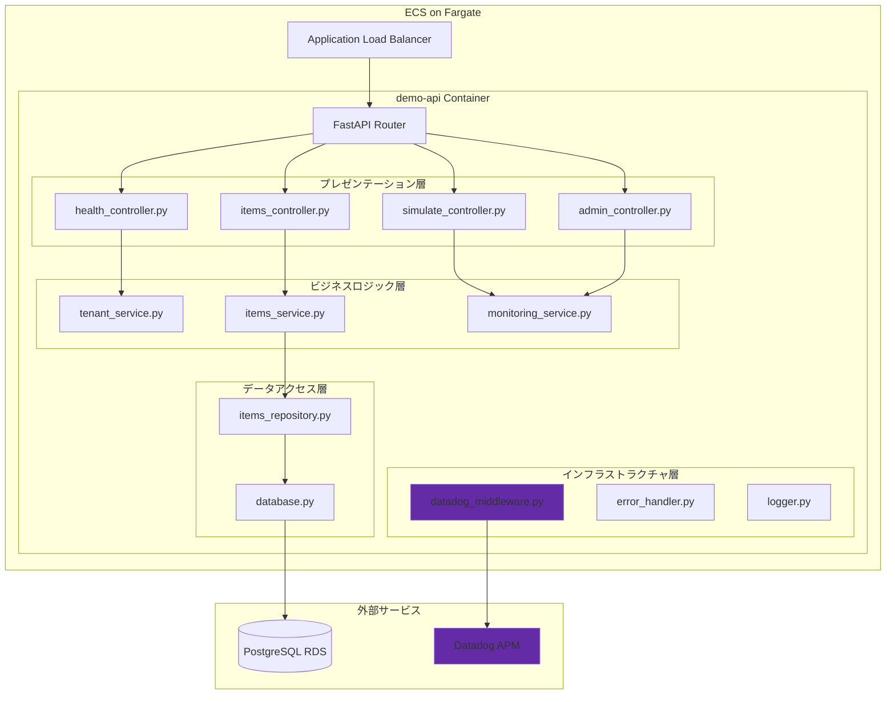
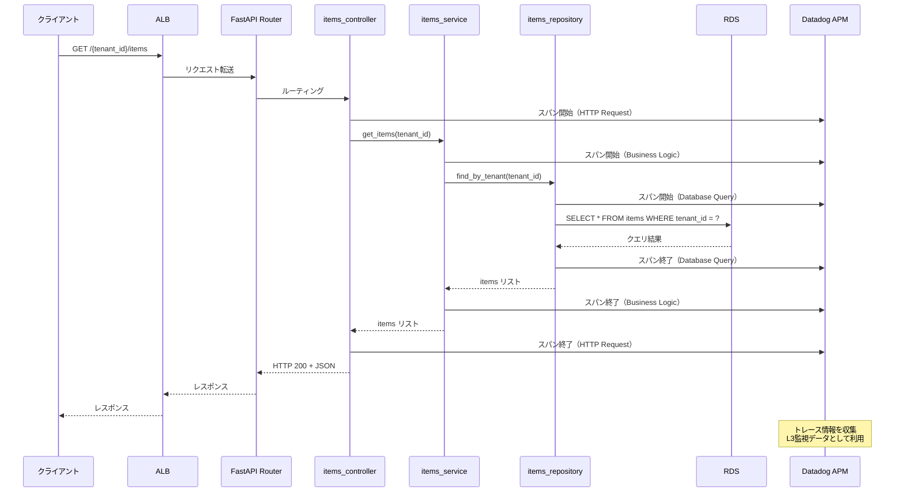
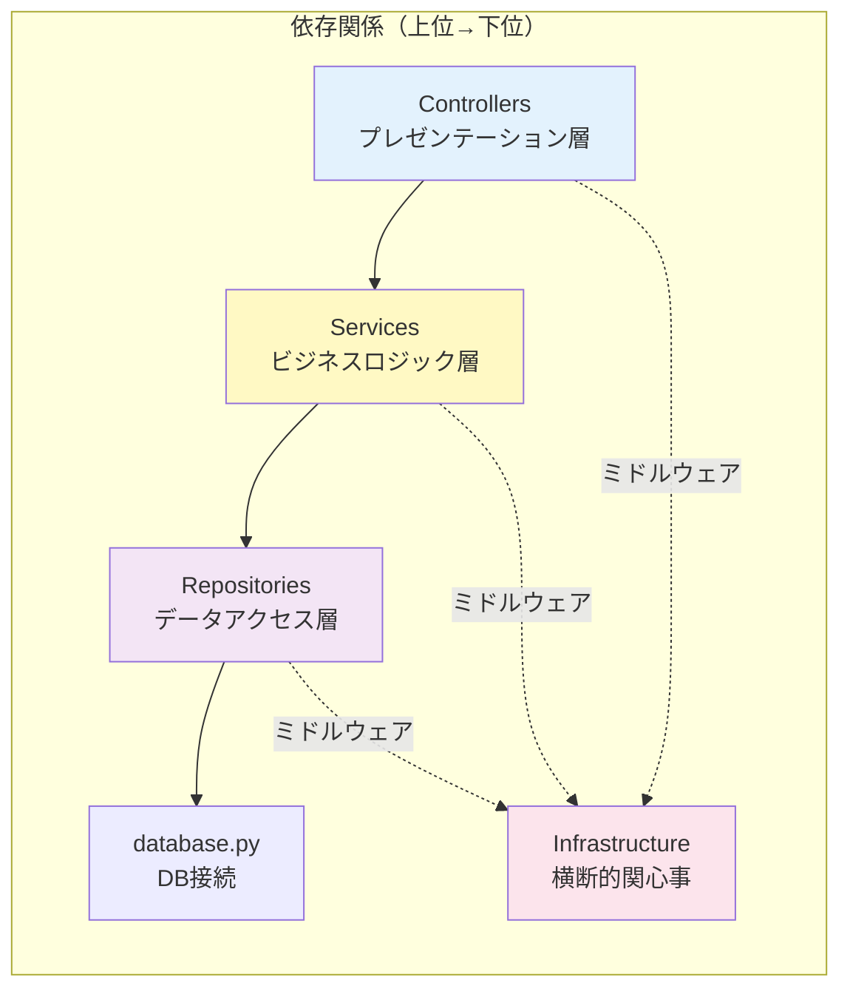

# アーキテクチャ概要

## 📋 ドキュメント情報

| 項目 | 内容 |
|------|------|
| ドキュメント名 | アーキテクチャ概要 |
| バージョン | 1.0 |
| 作成日 | 2025-12-28 |
| 作成者 | App-Architect |

---

## 🎯 アーキテクチャ方針

### 基本方針
- **シンプルなモノリスアーキテクチャ**: PoC 用途のため、マイクロサービス化せずシンプルに構成
- **レイヤードアーキテクチャ**: 責務分離により保守性を確保
- **監視優先設計**: Datadog APM統合を前提とした設計
- **マルチテナント対応**: tenant_id をパスパラメータで受け取り、リソースを分離

### 参照した技術標準
- `.claude/docs/40_standards/41_app/languages/python.md` - Python規約
- `.claude/docs/40_standards/49_common/security.md` - セキュリティ基準

---

## 🏗️ 全体構成図

---

## 📐 レイヤー設計

### 1. プレゼンテーション層（Controllers）

**責務**: HTTP リクエスト/レスポンスの処理

| コントローラー | 責務 | 対応エンドポイント |
|--------------|------|------------------|
| health_controller.py | ヘルスチェック処理 | GET /{tenant_id}/health |
| simulate_controller.py | 障害シミュレーション処理 | POST /{tenant_id}/simulate/error POST /{tenant_id}/simulate/latency |
| items_controller.py | サンプルデータCRUD処理 | GET/POST /{tenant_id}/items GET /{tenant_id}/items/{id} |
| admin_controller.py | 管理機能処理 | POST /admin/shutdown |

**役割**:
- リクエストパラメータのバリデーション
- サービス層の呼び出し
- レスポンスの整形
- **監視**: Datadog APM によるエンドポイント別トレース

---

### 2. ビジネスロジック層（Services）

**責務**: ビジネスルールの実装

| サービス | 責務 |
|---------|------|
| tenant_service.py | テナント検証、テナント固有ロジック |
| items_service.py | サンプルデータのビジネスロジック |
| monitoring_service.py | 監視データ生成（エラー/レイテンシシミュレーション） |

**役割**:
- テナント分離の実現（tenant_id の検証）
- ビジネスルールの実行
- リポジトリ層の呼び出し
- トランザクション制御

---

### 3. データアクセス層（Repositories）

**責務**: データベースとのやり取り

| リポジトリ | 責務 |
|----------|------|
| items_repository.py | items テーブルの CRUD 操作 |
| database.py | データベースセッション管理、接続設定 |

**役割**:
- SQLAlchemy を使用した ORM 操作
- クエリの最適化
- データベース接続管理

---

### 4. インフラストラクチャ層（Infrastructure）

**責務**: 横断的関心事

| コンポーネント | 責務 |
|--------------|------|
| datadog_middleware.py | Datadog APM 統合（ddtrace） |
| error_handler.py | グローバルエラーハンドリング |
| logger.py | 構造化ログ出力 |

**役割**:
- ミドルウェアによる共通処理
- Datadog APM トレース送信
- エラーハンドリング統一
- ログフォーマット統一

---

## 🔄 データフロー

### リクエスト処理フロー（サンプルデータ取得）

---

## 🧩 コンポーネント間の依存関係

**依存関係の原則**:
- ✅ 上位層 → 下位層への依存のみ許可
- ❌ 下位層 → 上位層への依存は禁止
- ✅ インフラストラクチャ層（ミドルウェア）は全層から利用可能

---

## 🎨 アーキテクチャパターンの選定理由

### レイヤードアーキテクチャを採用した理由

| 理由 | 詳細 |
|------|------|
| **責務分離** | プレゼンテーション/ビジネスロジック/データアクセスを明確に分離 |
| **保守性** | レイヤーごとに独立して変更・テストが可能 |
| **テスタビリティ** | 各レイヤーを個別にモック化してテスト可能 |
| **PoCに適合** | シンプルで理解しやすく、短期間で開発可能 |

### 代替案との比較

| アーキテクチャ | 採用可否 | 理由 |
|--------------|---------|------|
| **レイヤードアーキテクチャ** | ✅ 採用 | シンプル、保守性高、PoCに最適 |
| ヘキサゴナルアーキテクチャ | ❌ 不採用 | PoC用途には過剰設計 |
| マイクロサービス | ❌ 不採用 | PoCの規模には複雑すぎる |
| モジュラーモノリス | △ 検討可 | レイヤードで十分だが、本番移行時に検討 |

---

## 🔍 非機能要件への対応

### NFR-003: 対応テナント数 10〜100

**対応方針**:
- テナント別にリソース分離（tenant_id でフィルタリング）
- 水平スケーリング可能な設計（ECS タスク数増加）
- データベース接続プーリング（SQLAlchemy）

### NFR-002: アラート発報遅延 5分以内

**対応方針**:
- Datadog APM リアルタイムトレース送信
- 構造化ログの即座送信
- FastAPI の非同期処理活用

---

## 📊 技術選定サマリー

| 技術要素 | 選定技術 | 選定理由 |
|---------|---------|---------|
| **言語** | Python 3.10+ | Datadog APM統合が容易、チーム習熟度高 |
| **Webフレームワーク** | FastAPI | 高速、非同期対応、自動ドキュメント生成 |
| **ORM** | SQLAlchemy | Python標準的ORM、型安全性 |
| **監視統合** | ddtrace（Datadog APM） | 要件定義書で指定 |
| **アーキテクチャ** | レイヤードアーキテクチャ | シンプル、保守性高、PoCに最適 |

---

## 🚀 次のステップ

1. コンポーネント設計（モジュール分割、依存関係詳細）
2. データモデル設計（ER図、items テーブル定義）
3. API設計（7エンドポイント詳細）
4. セキュリティ設計（テナント検証、エラーハンドリング）
5. 実装方針（ディレクトリ構成、命名規則）

---

## 📝 改訂履歴

| 日付 | バージョン | 変更内容 | 作成者 |
|------|-----------|----------|--------|
| 2025-12-28 | 1.0 | 初版作成 | App-Architect |
