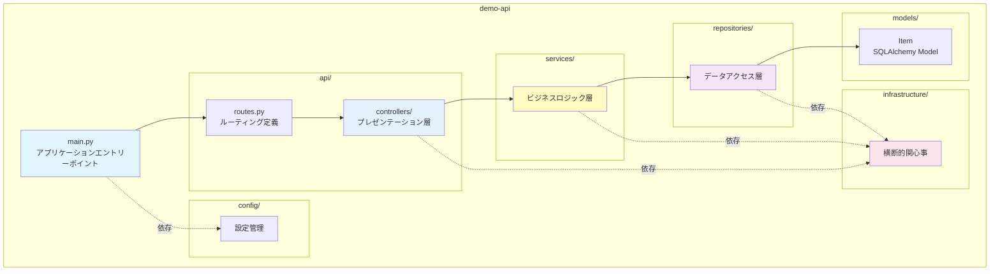
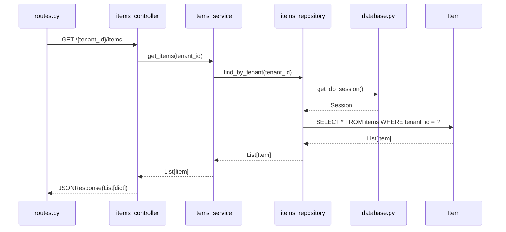

# コンポーネント設計

## 📋 ドキュメント情報

| 項目 | 内容 |
|------|------|
| ドキュメント名 | コンポーネント設計 |
| バージョン | 1.1 |
| 作成日 | 2025-12-28 |
| 作成者 | App-Architect |

---

## 🧩 モジュール構成

### 全体モジュール構成図



---

## 📁 モジュール詳細

### 1. main.py（アプリケーションエントリーポイント）

**責務**: FastAPI アプリケーションの初期化と起動

| 機能 | 詳細 |
|------|------|
| FastAPIインスタンス作成 | アプリケーションインスタンスの初期化 |
| ミドルウェア登録 | Datadog APM、CORS、エラーハンドラー |
| ルーター登録 | routes.py のルーティング定義を読み込み |
| データベース初期化 | 起動時にRDS接続確認 |
| Uvicornサーバー起動 | 非同期サーバーの起動 |

**依存関係**:
- `api/routes.py`
- `infrastructure/datadog_middleware.py`
- `infrastructure/error_handler.py`
- `config/settings.py`

---

### 2. api/routes.py（ルーティング定義）

**責務**: URLパスとコントローラーのマッピング

| エンドポイント | コントローラー | 機能 |
|-------------|--------------|------|
| GET /{tenant_id}/health | health_controller.health_check | ヘルスチェック |
| POST /{tenant_id}/simulate/error | simulate_controller.simulate_error | エラー発生テスト |
| POST /{tenant_id}/simulate/latency | simulate_controller.simulate_latency | 遅延発生テスト |
| GET /{tenant_id}/items | items_controller.get_items | サンプルデータ一覧 |
| POST /{tenant_id}/items | items_controller.create_item | サンプルデータ作成 |
| GET /{tenant_id}/items/{id} | items_controller.get_item | サンプルデータ詳細 |
| POST /admin/shutdown | admin_controller.shutdown | ECSタスク停止 |

**依存関係**:
- `api/controllers/health_controller.py`
- `api/controllers/simulate_controller.py`
- `api/controllers/items_controller.py`
- `api/controllers/admin_controller.py`

---

### 3. api/controllers/（プレゼンテーション層）

#### 3.1 health_controller.py

**責務**: ヘルスチェックエンドポイント処理

| 関数 | 戻り値 | 説明 |
|------|--------|------|
| health_check(tenant_id: str) | dict | テナント別ヘルスチェック結果を返す |

**処理内容**:
1. tenant_id の検証（tenant_service）
2. データベース接続確認（items_repository）
3. ヘルス状態の返却（JSON）

**Datadog 監視**: FR-003-1（L3 ヘルスチェック監視）

---

#### 3.2 simulate_controller.py

**責務**: 障害シミュレーション処理

| 関数 | 戻り値 | 説明 |
|------|--------|------|
| simulate_error(tenant_id: str, error_type: str) | dict | 意図的にエラーを発生させる |
| simulate_latency(tenant_id: str, latency_ms: int) | dict | 意図的に遅延を発生させる |

**処理内容（simulate_error）**:
1. tenant_id の検証
2. error_type に応じてエラー発生（monitoring_service）
3. エラーログの出力（logger）
4. エラーレスポンスの返却

**Datadog 監視**: FR-003-2（L3 エラーログ監視）

---

#### 3.3 items_controller.py

**責務**: サンプルデータCRUD処理

| 関数 | 戻り値 | 説明 |
|------|--------|------|
| get_items(tenant_id: str) | List[dict] | テナント別サンプルデータ一覧を返す |
| create_item(tenant_id: str, request: ItemCreateRequest) | dict | サンプルデータを作成 |
| get_item(tenant_id: str, id: int) | dict | サンプルデータ詳細を返す |

**処理内容（get_items）**:
1. tenant_id の検証
2. items_service.get_items(tenant_id) を呼び出し
3. JSON レスポンスの返却

**Datadog 監視**: FR-001（L0 RDS監視）

---

#### 3.4 admin_controller.py

**責務**: 管理機能処理

| 関数 | 戻り値 | 説明 |
|------|--------|------|
| shutdown() | dict | ECSタスクを停止させる |

**処理内容**:
1. os._exit(0) でプロセス終了
2. ECS が異常終了を検知

**Datadog 監視**: FR-002-2（L2 ECS Task 停止監視）

---

### 4. services/（ビジネスロジック層）

#### 4.1 tenant_service.py

**責務**: テナント検証、テナント固有ロジック

| 関数 | 戻り値 | 説明 |
|------|--------|------|
| validate_tenant(tenant_id: str) | bool | テナントIDの有効性を検証 |
| get_tenant_config(tenant_id: str) | dict | テナント固有設定を取得 |

**処理内容（validate_tenant）**:
1. tenant_id が有効なテナントリスト（tenant-a/b/c）に含まれるか確認
2. 無効な場合は例外を発生

---

#### 4.2 items_service.py

**責務**: サンプルデータのビジネスロジック

| 関数 | 戻り値 | 説明 |
|------|--------|------|
| get_items(tenant_id: str) | List[Item] | テナント別サンプルデータ一覧を取得 |
| create_item(tenant_id: str, name: str, description: str) | Item | サンプルデータを作成 |
| get_item(tenant_id: str, id: int) | Item | サンプルデータ詳細を取得 |

**処理内容（get_items）**:
1. items_repository.find_by_tenant(tenant_id) を呼び出し
2. ビジネスロジック適用（必要に応じて）
3. Item リストを返却

---

#### 4.3 monitoring_service.py

**責務**: 監視データ生成（エラー/レイテンシシミュレーション）

| 関数 | 戻り値 | 説明 |
|------|--------|------|
| generate_error(error_type: str) | None | エラーを発生させる |
| generate_latency(latency_ms: int) | None | 遅延を発生させる |

**処理内容（generate_error）**:
1. error_type に応じて例外を発生
   - "500": HTTP 500 Internal Server Error
   - "timeout": タイムアウトエラー
   - "db_error": データベースエラー
2. エラーログを出力（logger）

---

### 5. repositories/（データアクセス層）

#### 5.1 items_repository.py

**責務**: items テーブルの CRUD 操作

| 関数 | 戻り値 | 説明 |
|------|--------|------|
| find_by_tenant(tenant_id: str) | List[Item] | テナント別に items を取得 |
| find_by_id(id: int) | Item \| None | ID で item を取得 |
| save(item: Item) | Item | item を保存 |
| delete(id: int) | None | item を削除 |

**処理内容（find_by_tenant）**:
1. SQLAlchemy セッション取得（database.py）
2. `SELECT * FROM items WHERE tenant_id = ?` 実行
3. Item リストを返却

**依存関係**:
- `models/item.py`
- `repositories/database.py`

---

#### 5.2 database.py

**責務**: データベースセッション管理、接続設定

| 関数 | 戻り値 | 説明 |
|------|--------|------|
| get_db_session() | Session | データベースセッションを返す |
| init_db() | None | データベース初期化（テーブル作成） |

**処理内容（get_db_session）**:
1. SQLAlchemy Engine 作成（接続プール）
2. Session 作成
3. 依存性注入（FastAPI Depends）で利用

**接続文字列**:
- 環境変数 `DATABASE_URL` から取得
- 本番環境: Secrets Manager から取得（セキュリティ設計で詳細化）

---

### 6. models/（SQLAlchemy Model）

#### 6.1 item.py

**責務**: items テーブルのエンティティ定義

| カラム | 型 | 制約 | 説明 |
|--------|-----|------|------|
| id | Integer | PK, AutoIncrement | サンプルデータID |
| tenant_id | String(50) | NOT NULL | テナントID |
| name | String(100) | NOT NULL | サンプルデータ名 |
| description | Text | NULL | サンプルデータ説明 |
| created_at | DateTime | NOT NULL | 作成日時 |
| updated_at | DateTime | NOT NULL | 更新日時 |

**インデックス**:
- `idx_tenant_id`: tenant_id でインデックス作成（検索高速化）

---

### 7. infrastructure/（横断的関心事）

#### 7.1 datadog_middleware.py

**責務**: Datadog APM 統合（ddtrace）

| 機能 | 詳細 |
|------|------|
| ddtrace 初期化 | FastAPI アプリケーションに ddtrace を統合 |
| トレース送信 | Datadog にトレース情報を送信 |
| カスタムタグ設定 | **tenant_id をタグとして付与**（重要） |

**設定**:
- 環境変数 `DD_SERVICE`（demo-api）
- 環境変数 `DD_ENV`（poc）
- 環境変数 `DD_VERSION`（アプリバージョン）

**実装詳細（tenant_id タグ設定）**:

```python
# datadog_middleware.py での実装例
from fastapi import Request
from ddtrace import tracer

async def datadog_middleware(request: Request, call_next):
    """
    Datadog APM ミドルウェア

    処理内容:
    1. リクエストからtenant_idを抽出
    2. Datadog トレースにtenant_idタグを付与
    3. テナント別監視を実現

    前提条件:
    - ddtrace パッケージがインストール済み
    - DD_SERVICE, DD_ENV 環境変数が設定済み
    """
    # パスパラメータから tenant_id を取得
    tenant_id = request.path_params.get('tenant_id')

    # ⭐重要: Datadog トレースに tenant_id タグを付与
    if tenant_id:
        span = tracer.current_span()
        if span:
            span.set_tag('tenant_id', tenant_id)
            span.set_tag('http.url', request.url.path)
            span.set_tag('http.method', request.method)

    response = await call_next(request)
    return response
```

**タグ付与の重要性**:
- Datadog でテナント別にメトリクスをフィルタリング可能
- `tenant:tenant-a` でテナントAの監視データのみ抽出
- インフラ監視設計との整合性を確保（フィルタ仕様統一）

---

#### 7.2 error_handler.py

**責務**: グローバルエラーハンドリング

| 関数 | 戻り値 | 説明 |
|------|--------|------|
| handle_exception(request, exc) | JSONResponse | 例外を捕捉してJSON形式でエラーレスポンス |

**処理内容**:
1. 例外をキャッチ
2. エラーログ出力（logger）
3. HTTP 500 エラーレスポンスを返す

---

#### 7.3 logger.py

**責務**: 構造化ログ出力

| 関数 | 戻り値 | 説明 |
|------|--------|------|
| get_logger(name: str) | Logger | 構造化ログのロガーを返す |

**ログフォーマット**:
- JSON形式（Datadog ログ収集に最適）
- 必須フィールド: timestamp, level, message, tenant_id, trace_id

---

### 8. config/（設定管理）

#### 8.1 settings.py

**責務**: 環境変数の読み込み、設定管理

| 設定項目 | 環境変数 | デフォルト値 |
|---------|---------|------------|
| DATABASE_URL | DATABASE_URL | postgresql://localhost/demo |
| DD_SERVICE | DD_SERVICE | demo-api |
| DD_ENV | DD_ENV | poc |
| VALID_TENANTS | VALID_TENANTS | tenant-a,tenant-b,tenant-c |

**処理内容**:
- 環境変数を読み込み
- Pydantic Settings を使用して型安全に管理

---

## 📊 コンポーネント依存関係マトリクス

| コンポーネント | 依存先 | 依存内容 |
|------------|--------|---------|
| main.py | routes.py, datadog_middleware, error_handler, settings | アプリ初期化 |
| routes.py | controllers | ルーティング定義 |
| health_controller | tenant_service, items_repository | ヘルスチェック |
| simulate_controller | tenant_service, monitoring_service | シミュレーション |
| items_controller | tenant_service, items_service | サンプルデータCRUD |
| admin_controller | なし | タスク停止 |
| tenant_service | settings | テナント検証 |
| items_service | items_repository | ビジネスロジック |
| monitoring_service | logger | 監視データ生成 |
| items_repository | database, item | データアクセス |
| database | settings | DB接続管理 |
| datadog_middleware | ddtrace | APM統合 |
| error_handler | logger | エラーハンドリング |
| logger | settings | ログ設定 |

---

## 🔄 コンポーネント間のデータフロー（サンプルデータ一覧取得）



---

## 📦 モジュールサイズ見積もり

| モジュール | 行数（推定） | 複雑度 |
|----------|-------------|--------|
| main.py | 50行 | 低 |
| routes.py | 30行 | 低 |
| health_controller.py | 30行 | 低 |
| simulate_controller.py | 60行 | 中 |
| items_controller.py | 80行 | 中 |
| admin_controller.py | 20行 | 低 |
| tenant_service.py | 40行 | 低 |
| items_service.py | 60行 | 中 |
| monitoring_service.py | 50行 | 中 |
| items_repository.py | 80行 | 中 |
| database.py | 40行 | 中 |
| item.py | 30行 | 低 |
| datadog_middleware.py | 40行 | 中 |
| error_handler.py | 30行 | 低 |
| logger.py | 40行 | 低 |
| settings.py | 30行 | 低 |
| **合計** | **620行** | - |

---

## 📝 改訂履歴

| 日付 | バージョン | 変更内容 | 作成者 |
|------|-----------|----------|--------|
| 2025-12-28 | 1.0 | 初版作成 | App-Architect |
| 2025-12-28 | 1.1 | datadog_middleware.py の実装詳細（tenant_id タグ設定）を追記 | App-Architect |
