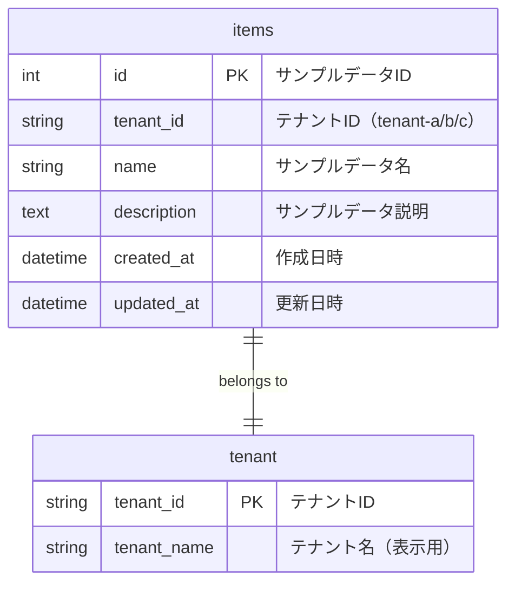
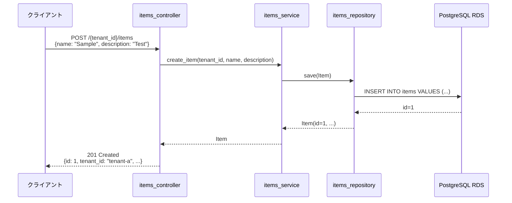

# データモデル設計

## 📋 ドキュメント情報

| 項目 | 内容 |
|------|------|
| ドキュメント名 | データモデル設計 |
| バージョン | 1.1 |
| 作成日 | 2025-12-28 |
| 作成者 | App-Architect |

---

## 🎯 データモデル設計方針

### 基本方針
- **シンプルな正規化**: PoC用途のため、過剰な正規化は避ける
- **マルチテナント対応**: すべてのテーブルに tenant_id を持たせる
- **監視データ生成用**: RDS 監視（FR-001）のためのサンプルデータ格納
- **拡張性確保**: 本番移行時にスキーマ拡張可能な設計

---

## 📐 ER図



**注記**:
- `tenant` テーブルは将来の拡張用（PoC では未実装）
- PoC では `tenant_id` を文字列リテラルで管理（設定ファイル）

---

## 📊 エンティティ定義

### items テーブル

**概要**: サンプルデータを格納するテーブル（RDS監視用）

| カラム | 型 | 制約 | デフォルト値 | 説明 |
|--------|-----|------|------------|------|
| id | INTEGER | PK, AUTO_INCREMENT | - | サンプルデータID（主キー） |
| tenant_id | VARCHAR(50) | NOT NULL, INDEX | - | テナントID（tenant-a, tenant-b, tenant-c） |
| name | VARCHAR(100) | NOT NULL | - | サンプルデータ名 |
| description | TEXT | NULL | NULL | サンプルデータ説明 |
| created_at | TIMESTAMP | NOT NULL | CURRENT_TIMESTAMP | 作成日時 |
| updated_at | TIMESTAMP | NOT NULL | CURRENT_TIMESTAMP ON UPDATE | 更新日時 |

---

### インデックス設計

| インデックス名 | カラム | 種類 | 目的 |
|--------------|--------|------|------|
| PRIMARY | id | PRIMARY KEY | 主キー |
| idx_tenant_id | tenant_id | INDEX | テナント別検索の高速化 |

**インデックス選定理由**:
- `idx_tenant_id`: `GET /{tenant_id}/items` でテナント別絞り込みが頻繁に発生するため

---

## 🗂️ SQLAlchemy Model 定義

### Item Model（item.py）

```python
from sqlalchemy import Column, Integer, String, Text, DateTime, Index
from sqlalchemy.ext.declarative import declarative_base
from datetime import datetime

Base = declarative_base()

class Item(Base):
    """
    サンプルデータエンティティ

    目的: RDS監視（FR-001）のためのサンプルデータ格納
    影響範囲: items_repository でCRUD操作される
    前提条件: tenant_id は有効なテナント（tenant-a/b/c）であること
    """
    __tablename__ = 'items'

    # カラム定義
    id = Column(Integer, primary_key=True, autoincrement=True, comment='サンプルデータID')
    tenant_id = Column(String(50), nullable=False, index=True, comment='テナントID')
    name = Column(String(100), nullable=False, comment='サンプルデータ名')
    description = Column(Text, nullable=True, comment='サンプルデータ説明')
    created_at = Column(DateTime, nullable=False, default=datetime.utcnow, comment='作成日時')
    updated_at = Column(DateTime, nullable=False, default=datetime.utcnow, onupdate=datetime.utcnow, comment='更新日時')

    # インデックス定義
    __table_args__ = (
        Index('idx_tenant_id', 'tenant_id'),
    )

    def to_dict(self) -> dict:
        """
        辞書形式に変換（API レスポンス用）

        戻り値:
            dict: JSON シリアライズ可能な辞書
        """
        return {
            'id': self.id,
            'tenant_id': self.tenant_id,
            'name': self.name,
            'description': self.description,
            'created_at': self.created_at.isoformat() if self.created_at else None,
            'updated_at': self.updated_at.isoformat() if self.updated_at else None,
        }
```

---

## 🔄 データライフサイクル

### サンプルデータ作成フロー



---

## 📈 データ量見積もり

### PoC環境の想定データ量

| テナント | サンプルデータ数 | データサイズ（推定） |
|---------|----------------|-------------------|
| tenant-a | 100件 | 10KB |
| tenant-b | 100件 | 10KB |
| tenant-c | 100件 | 10KB |
| **合計** | **300件** | **30KB** |

**監視目的**: RDS 接続数、CPU使用率、ストレージ使用量の監視データ生成
**データ量増加の理由**: RDS 監視の実効性向上（30件 → 300件）

---

## 🗄️ データベース初期化スクリプト

### テーブル作成（DDL）

```sql
-- items テーブル作成
CREATE TABLE items (
    id SERIAL PRIMARY KEY,
    tenant_id VARCHAR(50) NOT NULL,
    name VARCHAR(100) NOT NULL,
    description TEXT,
    created_at TIMESTAMP NOT NULL DEFAULT CURRENT_TIMESTAMP,
    updated_at TIMESTAMP NOT NULL DEFAULT CURRENT_TIMESTAMP
);

-- インデックス作成
CREATE INDEX idx_tenant_id ON items(tenant_id);

-- 更新日時の自動更新トリガー（PostgreSQL）
CREATE OR REPLACE FUNCTION update_updated_at_column()
RETURNS TRIGGER AS $$
BEGIN
   NEW.updated_at = NOW();
   RETURN NEW;
END;
$$ LANGUAGE plpgsql;

CREATE TRIGGER update_items_updated_at
BEFORE UPDATE ON items
FOR EACH ROW
EXECUTE FUNCTION update_updated_at_column();
```

---

### 初期データ投入（DML）

```sql
-- tenant-a 用サンプルデータ（100件）
DO $$
BEGIN
    FOR i IN 1..100 LOOP
        INSERT INTO items (tenant_id, name, description) VALUES
        ('tenant-a', 'Sample Item ' || i, 'This is sample item ' || i || ' for tenant-a');
    END LOOP;
END $$;

-- tenant-b 用サンプルデータ（100件）
DO $$
BEGIN
    FOR i IN 1..100 LOOP
        INSERT INTO items (tenant_id, name, description) VALUES
        ('tenant-b', 'Sample Item ' || i, 'This is sample item ' || i || ' for tenant-b');
    END LOOP;
END $$;

-- tenant-c 用サンプルデータ（100件）
DO $$
BEGIN
    FOR i IN 1..100 LOOP
        INSERT INTO items (tenant_id, name, description) VALUES
        ('tenant-c', 'Sample Item ' || i, 'This is sample item ' || i || ' for tenant-c');
    END LOOP;
END $$;
```

**実行方法**:
- SQLAlchemy の `init_db()` 関数で自動実行
- 本番環境ではマイグレーションツール（Alembic）を使用

---

## 🔍 データアクセスパターン

### 主要なクエリパターン

#### 1. テナント別サンプルデータ一覧取得

```sql
SELECT * FROM items
WHERE tenant_id = 'tenant-a'
ORDER BY created_at DESC;
```

**使用箇所**: `GET /{tenant_id}/items`
**インデックス使用**: `idx_tenant_id`

---

#### 2. サンプルデータ詳細取得

```sql
SELECT * FROM items
WHERE id = 1;
```

**使用箇所**: `GET /{tenant_id}/items/{id}`
**インデックス使用**: PRIMARY KEY (id)

---

#### 3. サンプルデータ作成

```sql
INSERT INTO items (tenant_id, name, description, created_at, updated_at)
VALUES ('tenant-a', 'New Item', 'Description', NOW(), NOW());
```

**使用箇所**: `POST /{tenant_id}/items`

---

## 🔐 データセキュリティ

### テナント分離

**方針**: Row-Level Security（アプリケーションレベルで実現）

```python
# items_repository.py での実装例
def find_by_tenant(tenant_id: str) -> List[Item]:
    """
    テナント別にサンプルデータを取得

    セキュリティ: tenant_id でフィルタリングし、他テナントのデータを取得不可
    """
    session = get_db_session()
    return session.query(Item).filter(Item.tenant_id == tenant_id).all()
```

**重要**: WHERE句に必ず `tenant_id = ?` を含める

---

### データ暗号化

**転送中の暗号化**:
- RDS への接続時に TLS/SSL を使用（接続文字列に `sslmode=require`）

**保管時の暗号化**:
- RDS の暗号化機能を有効化（インフラ設計で設定）

---

## 📊 監視対象メトリクス（FR-001: L0 RDS監視）

| メトリクス | 閾値 | 監視目的 |
|----------|------|---------|
| RDS CPU使用率 | 95%以上 | items テーブルへのクエリ負荷監視 |
| RDS 接続数 | 上限の90%以上 | アプリケーション接続数監視 |
| RDS FreeableMemory | 総メモリの10%未満 | メモリ不足検知 |
| RDS FreeStorageSpace | ストレージ総量の5%未満 | ストレージ不足検知 |

**データモデルとの関連**:
- items テーブルの CRUD 操作が RDS 監視データを生成

---

## 🚀 将来の拡張性

### 本番移行時の拡張案

1. **tenant テーブルの追加**
   - tenant_id をマスターテーブルで管理
   - テナント固有設定（閾値、監視レベル等）を格納

2. **パーティショニング**
   - tenant_id でパーティション分割
   - 大量テナント対応時のクエリ高速化

3. **監査ログテーブルの追加**
   - items の作成・更新・削除履歴を記録
   - セキュリティ監査用

---

## 📝 改訂履歴

| 日付 | バージョン | 変更内容 | 作成者 |
|------|-----------|----------|--------|
| 2025-12-28 | 1.0 | 初版作成 | App-Architect |
| 2025-12-28 | 1.1 | データ量を30件→300件に増加（RDS監視の実効性向上） | App-Architect |
