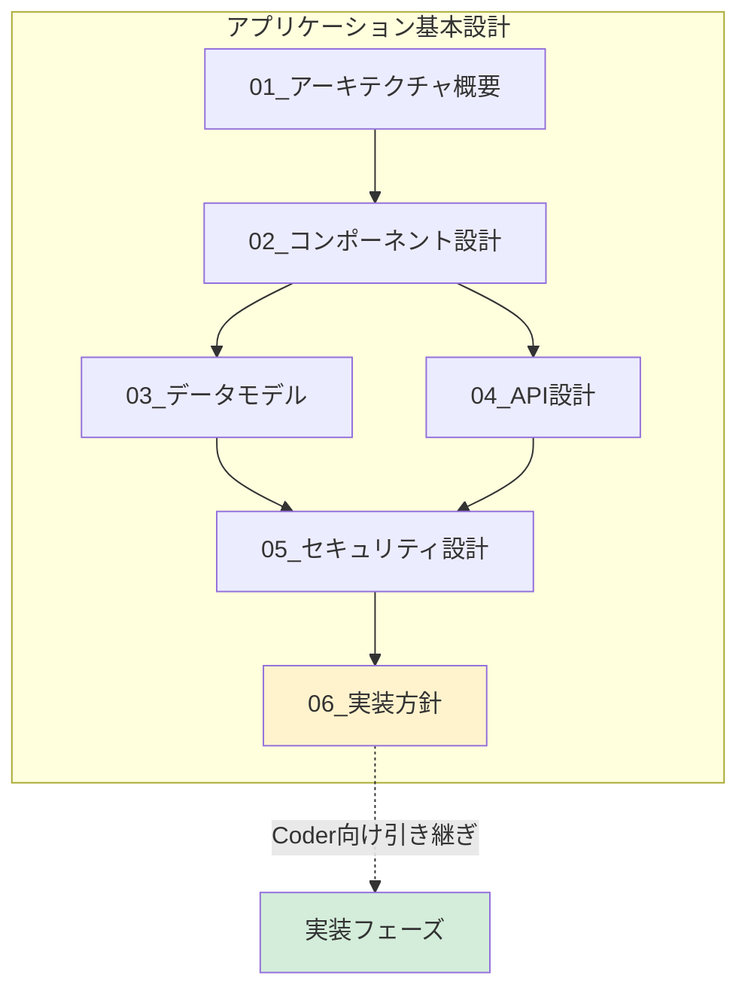

# アプリケーション基本設計 - INDEX

## 📋 ドキュメント情報

| 項目 | 内容 |
|------|------|
| プロジェクト名 | Datadog for AWS Terraform - demo-api |
| バージョン | 1.0 |
| 作成日 | 2025-12-28 |
| ステータス | ドラフト |
| 作成者 | App-Architect |

---

## 📚 基本設計書一覧

本ディレクトリには、demo-api アプリケーションの基本設計書が格納されています。

| # | ドキュメント | 概要 | レビュー状態 |
|---|------------|------|------------|
| 1 | [01_アーキテクチャ概要.md](./01_アーキテクチャ概要.md) | 全体構成図、レイヤー設計 | Draft |
| 2 | [02_コンポーネント設計.md](./02_コンポーネント設計.md) | モジュール構成、依存関係 | Draft |
| 3 | [03_データモデル.md](./03_データモデル.md) | ER図、items テーブル定義 | Draft |
| 4 | [04_API設計.md](./04_API設計.md) | 7エンドポイント詳細 | Draft |
| 5 | [05_セキュリティ設計.md](./05_セキュリティ設計.md) | テナント検証、エラーハンドリング | Draft |
| 6 | [06_実装方針.md](./06_実装方針.md) | ディレクトリ構成、命名規則（Coder向け） | Draft |

---

## 🎯 プロジェクト概要

### 目的
Datadog 監視 PoC における demo-api は、マルチテナント環境で監視データを生成するサンプルアプリケーションです。

### 主な機能
- **L0監視対象**: RDS接続によるデータベース操作
- **L2監視対象**: ECS タスク死活監視（shutdown エンドポイント）
- **L3監視対象**: テナント別のヘルスチェック、エラー発生、レイテンシ

### 技術スタック
- **言語**: Python 3.10+
- **フレームワーク**: FastAPI
- **ORM**: SQLAlchemy
- **監視統合**: Datadog APM（ddtrace）
- **データベース**: PostgreSQL (RDS)
- **実行環境**: ECS on Fargate

---

## 🔗 関連ドキュメント

| ドキュメント | パス |
|-------------|------|
| 要件定義書 | `../../02_要件定義/要件定義書.md` |
| 技術標準（Python） | `.claude/docs/40_standards/41_app/languages/python.md` |
| 技術標準（セキュリティ） | `.claude/docs/40_standards/49_common/security.md` |
| インフラ設計書 | `../../04_インフラ設計/` |

---

## 📊 設計の全体像

---

## 🚀 レビュー状況

### レビュー予定

| レビュアー | 対象 | 状態 |
|-----------|------|------|
| Coder | 実装可能性 | Pending |
| Consultant | ビジネス要件整合性 | Pending |
| Infra-Architect | インフラ設計との整合性（データベース） | Pending |

### レビュー完了条件

- [ ] すべての基本設計書（6ファイル）が作成済み
- [ ] 技術標準との整合性確認済み
- [ ] 要件定義書との整合性確認済み
- [ ] Coder、Consultant からのクロスレビュー承認
- [ ] PM レビュー承認
- [ ] ユーザー承認

---

## 📝 改訂履歴

| 日付 | バージョン | 変更内容 | 作成者 |
|------|-----------|----------|--------|
| 2025-12-28 | 1.0 | 初版作成 | App-Architect |
