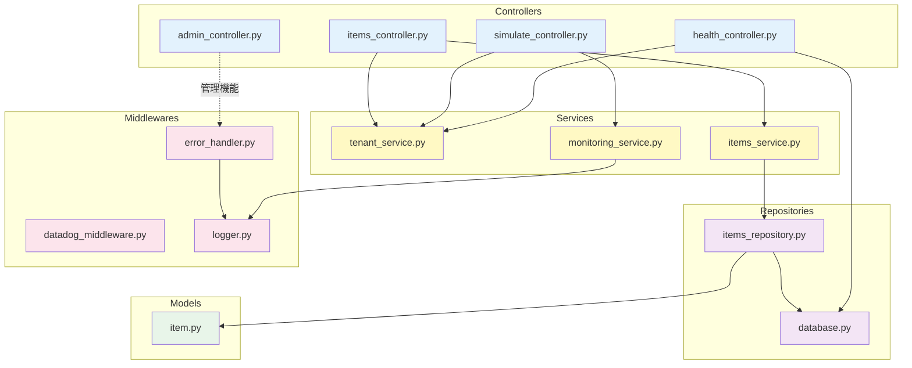

# 詳細設計 INDEX

## 📋 ドキュメント情報

| 項目 | 内容 |
|------|------|
| ドキュメント名 | 詳細設計 INDEX |
| バージョン | 2.0 |
| 作成日 | 2025-12-28 |
| 作成者 | App-Architect |

---

## 🎯 詳細設計の目的

**このドキュメントは詳細設計書の目次（INDEX）です。**

- 各モジュールの詳細設計ファイルを列挙
- モジュール間の依存関係を明示
- Coder が実装時に参照すべきドキュメントを整理

---

## 📁 基本設計との関係

### 基本設計書（参照先）

| ドキュメント | パス | 概要 |
|-------------|------|------|
| アーキテクチャ概要 | `../01_基本設計/01_アーキテクチャ概要.md` | レイヤー設計、全体構成 |
| コンポーネント設計 | `../01_基本設計/02_コンポーネント設計.md` | モジュール構成、依存関係 |
| データモデル | `../01_基本設計/03_データモデル.md` | ER図、エンティティ定義 |
| API設計 | `../01_基本設計/04_API設計.md` | エンドポイント、リクエスト/レスポンス |
| セキュリティ設計 | `../01_基本設計/05_セキュリティ設計.md` | 認証・認可、セキュリティ要件 |
| 実装方針 | `../01_基本設計/06_実装方針.md` | ディレクトリ構成、命名規則 |

### 詳細設計の責務

- **基本設計**: アーキテクチャ、レイヤー設計、API仕様（WHAT）
- **詳細設計**: 各モジュールの内部実装方針（HOW）

---

## 📚 詳細設計ファイル構成

### ディレクトリ構造

```
docs/03_アプリケーション設計/02_詳細設計/
├── INDEX.md                          # 目次（このファイル）
├── controllers/
│   ├── health.md                     # ✅ ヘルスチェック詳細設計
│   ├── simulate.md                   # ✅ 障害シミュレーション詳細設計
│   ├── items.md                      # ✅ サンプルデータCRUD詳細設計
│   └── admin.md                      # ✅ 管理機能詳細設計
├── services/
│   ├── tenant_service.md             # ✅ テナント検証詳細設計
│   ├── items_service.md              # ✅ サンプルデータビジネスロジック詳細設計
│   └── monitoring_service.md         # ✅ 監視データ生成詳細設計
├── repositories/
│   ├── items_repository.md           # ✅ itemsテーブルCRUD詳細設計
│   └── database.md                   # ✅ データベースセッション管理詳細設計
├── models/
│   └── item.md                       # ✅ SQLAlchemy Model詳細設計
└── middlewares/
    ├── datadog_middleware.md         # ✅ Datadog APM統合詳細設計
    ├── error_handler.md              # ✅ エラーハンドリング詳細設計
    └── logger.md                     # ✅ 構造化ログ詳細設計
```

---

## 📦 モジュール詳細設計一覧

### 1. Controllers（プレゼンテーション層）

| ファイル | モジュール | 概要 | 主要機能 | ステータス |
|---------|----------|------|---------|----------|
| `controllers/health.md` | `health_controller.py` | ヘルスチェック処理 | - テナント検証<br>- DB接続確認<br>- ヘルス状態返却 | ✅ 完成 |
| `controllers/simulate.md` | `simulate_controller.py` | 障害シミュレーション処理 | - エラー発生テスト<br>- レイテンシ発生テスト<br>- 監視データ生成 | ✅ 完成 |
| `controllers/items.md` | `items_controller.py` | サンプルデータCRUD処理 | - データ一覧取得<br>- データ作成<br>- データ詳細取得 | ✅ 完成 |
| `controllers/admin.md` | `admin_controller.py` | 管理機能処理 | - ECSタスク停止 | ✅ 完成 |

**依存関係**:
- `health_controller.py` → `tenant_service.py`, `database.py`
- `simulate_controller.py` → `tenant_service.py`, `monitoring_service.py`
- `items_controller.py` → `tenant_service.py`, `items_service.py`
- `admin_controller.py` → なし

---

### 2. Services（ビジネスロジック層）

| ファイル | モジュール | 概要 | 主要機能 | ステータス |
|---------|----------|------|---------|----------|
| `services/tenant_service.md` | `tenant_service.py` | テナント検証 | - テナントID検証<br>- テナント設定取得<br>- 無効テナントエラー | ✅ 完成 |
| `services/items_service.md` | `items_service.py` | サンプルデータビジネスロジック | - データ一覧取得<br>- データ作成<br>- データ取得 | ✅ 完成 |
| `services/monitoring_service.md` | `monitoring_service.py` | 監視データ生成 | - エラー発生<br>- レイテンシ発生<br>- ログ出力 | ✅ 完成 |

**依存関係**:
- `tenant_service.py` → `settings.py`
- `items_service.py` → `items_repository.py`
- `monitoring_service.py` → `logger.py`

---

### 3. Repositories（データアクセス層）

| ファイル | モジュール | 概要 | 主要機能 | ステータス |
|---------|----------|------|---------|----------|
| `repositories/items_repository.md` | `items_repository.py` | itemsテーブルCRUD操作 | - テナント別データ取得<br>- ID別データ取得<br>- データ保存<br>- データ削除 | ✅ 完成 |
| `repositories/database.md` | `database.py` | データベースセッション管理 | - セッション取得<br>- DB初期化<br>- 接続プール管理 | ✅ 完成 |

**依存関係**:
- `items_repository.py` → `database.py`, `item.py`
- `database.py` → `settings.py`

---

### 4. Models（SQLAlchemy Model）

| ファイル | モジュール | 概要 | 主要機能 | ステータス |
|---------|----------|------|---------|----------|
| `models/item.md` | `item.py` | itemsテーブルエンティティ定義 | - カラム定義<br>- インデックス定義<br>- リレーションシップ | ✅ 完成 |

**依存関係**:
- `item.py` → SQLAlchemy（ORM）

---

### 5. Middlewares（横断的関心事）

| ファイル | モジュール | 概要 | 主要機能 | ステータス |
|---------|----------|------|---------|----------|
| `middlewares/datadog_middleware.md` | `datadog_middleware.py` | Datadog APM統合 | - ddtrace初期化<br>- トレース送信<br>- カスタムタグ設定 | ✅ 完成 |
| `middlewares/error_handler.md` | `error_handler.py` | エラーハンドリング | - 例外キャッチ<br>- エラーログ出力<br>- エラーレスポンス返却 | ✅ 完成 |
| `middlewares/logger.md` | `logger.py` | 構造化ログ出力 | - JSON形式ログ<br>- トレースID付与<br>- ログレベル管理 | ✅ 完成 |

**依存関係**:
- `datadog_middleware.py` → `ddtrace`
- `error_handler.py` → `logger.py`
- `logger.py` → `settings.py`

---

## 🔄 モジュール間依存関係図



---

## 📊 詳細設計の記載内容（テンプレート）

### 各詳細設計ファイルに含めるべき項目

#### 1. ドキュメント情報
- ドキュメント名
- バージョン
- 作成日
- 作成者

#### 2. モジュール概要
- 責務
- 主要機能
- 依存関係

#### 3. クラス設計
- クラス名
- 属性（プロパティ）
- メソッド一覧

#### 4. メソッド詳細設計
- 関数シグネチャ（引数、戻り値、型ヒント）
- 処理フロー（擬似コード）
- エラーハンドリング
- ログ出力内容
- Datadog監視項目（該当する場合）

#### 5. シーケンス図（重要な処理）
- リクエストからレスポンスまでの処理フロー
- モジュール間の呼び出し関係

#### 6. データ構造
- リクエスト/レスポンス形式
- 内部データ構造（DTO等）

#### 7. 例外処理
- 発生する例外
- エラーハンドリング方針

#### 8. テスト方針
- 単体テストで検証すべき項目
- モック対象

---

## 🚀 実装時の参照順序（Coder向け）

### ステップ1: 全体理解
1. **INDEX.md（このファイル）を読む**
   - モジュール構成を理解
   - 依存関係を確認

2. **基本設計を読む**
   - `../01_基本設計/01_アーキテクチャ概要.md`
   - `../01_基本設計/02_コンポーネント設計.md`
   - `../01_基本設計/06_実装方針.md`

---

### ステップ2: レイヤー別実装

#### Phase 1: Models（データモデル）
1. ✅ `models/item.md` を読む
2. `item.py` を実装

#### Phase 2: Repositories（データアクセス層）
1. ✅ `repositories/database.md` を読む
2. `database.py` を実装
3. ✅ `repositories/items_repository.md` を読む
4. `items_repository.py` を実装

#### Phase 3: Services（ビジネスロジック層）
1. ✅ `services/tenant_service.md` を読む
2. `tenant_service.py` を実装
3. ✅ `services/items_service.md` を読む
4. `items_service.py` を実装
5. ✅ `services/monitoring_service.md` を読む
6. `monitoring_service.py` を実装

#### Phase 4: Controllers（プレゼンテーション層）
1. ✅ `controllers/health.md` を読む
2. `health_controller.py` を実装
3. ✅ `controllers/items.md` を読む
4. `items_controller.py` を実装
5. ✅ `controllers/simulate.md` を読む
6. `simulate_controller.py` を実装
7. ✅ `controllers/admin.md` を読む
8. `admin_controller.py` を実装

#### Phase 5: Middlewares（横断的関心事）
1. ✅ `middlewares/logger.md` を読む
2. `logger.py` を実装
3. ✅ `middlewares/error_handler.md` を読む
4. `error_handler.py` を実装
5. ✅ `middlewares/datadog_middleware.md` を読む
6. `datadog_middleware.py` を実装

---

## 🔍 詳細設計書のレビュー観点

### Coder が詳細設計書をレビューする際の観点

#### 1. 実装可能性
- [ ] 擬似コードが具体的か
- [ ] 処理フローが明確か
- [ ] 依存関係が適切か

#### 2. 技術標準準拠
- [ ] Python規約に準拠しているか
- [ ] 型ヒントが明記されているか
- [ ] Docstringの記載方針が明確か

#### 3. テスト可能性
- [ ] 単体テストで検証すべき項目が明確か
- [ ] モック対象が明確か
- [ ] テストカバレッジ目標が明確か

#### 4. セキュリティ
- [ ] SQLインジェクション対策が明記されているか
- [ ] テナント分離の実現方法が明確か
- [ ] シークレット管理方針が明確か

#### 5. Datadog監視
- [ ] 監視項目が明確か
- [ ] トレース送信箇所が明確か
- [ ] ログ出力内容が明確か

---

## 📝 詳細設計書作成ステータス

### 作成状況

| カテゴリ | ファイル | ステータス | 備考 |
|---------|---------|----------|------|
| Controllers | `controllers/health.md` | ✅ 完成 | 2025-12-28 作成 |
| Controllers | `controllers/simulate.md` | ✅ 完成 | 2025-12-28 作成 |
| Controllers | `controllers/items.md` | ✅ 完成 | 2025-12-28 作成 |
| Controllers | `controllers/admin.md` | ✅ 完成 | 2025-12-28 作成 |
| Services | `services/tenant_service.md` | ✅ 完成 | 2025-12-28 作成 |
| Services | `services/items_service.md` | ✅ 完成 | 2025-12-28 作成 |
| Services | `services/monitoring_service.md` | ✅ 完成 | 2025-12-28 作成 |
| Repositories | `repositories/items_repository.md` | ✅ 完成 | 2025-12-28 作成 |
| Repositories | `repositories/database.md` | ✅ 完成 | 2025-12-28 作成 |
| Models | `models/item.md` | ✅ 完成 | 2025-12-28 作成 |
| Middlewares | `middlewares/datadog_middleware.md` | ✅ 完成 | 2025-12-28 作成 |
| Middlewares | `middlewares/error_handler.md` | ✅ 完成 | 2025-12-28 作成 |
| Middlewares | `middlewares/logger.md` | ✅ 完成 | 2025-12-28 作成 |

**全13ファイル作成完了** ✅

---

## 🎯 詳細設計書作成の優先順位

### 推奨作成順序

**YOU MUST: 下位レイヤーから上位レイヤーへ**

1. **Models**（依存なし）
   - ✅ `models/item.md`

2. **Repositories**（Models に依存）
   - ✅ `repositories/database.md`
   - ✅ `repositories/items_repository.md`

3. **Services**（Repositories に依存）
   - ✅ `services/tenant_service.md`
   - ✅ `services/items_service.md`
   - ✅ `services/monitoring_service.md`

4. **Controllers**（Services に依存）
   - ✅ `controllers/health.md`
   - ✅ `controllers/items.md`
   - ✅ `controllers/simulate.md`
   - ✅ `controllers/admin.md`

5. **Middlewares**（全層から利用）
   - ✅ `middlewares/logger.md`
   - ✅ `middlewares/error_handler.md`
   - ✅ `middlewares/datadog_middleware.md`

---

## 📚 参照ドキュメント

### 実装時に参照すべきドキュメント

| ドキュメント | パス | 目的 |
|-------------|------|------|
| 基本設計 - アーキテクチャ概要 | `../01_基本設計/01_アーキテクチャ概要.md` | 全体構成理解 |
| 基本設計 - コンポーネント設計 | `../01_基本設計/02_コンポーネント設計.md` | モジュール構成 |
| 基本設計 - データモデル | `../01_基本設計/03_データモデル.md` | ER図、エンティティ定義 |
| 基本設計 - API設計 | `../01_基本設計/04_API設計.md` | エンドポイント詳細 |
| 基本設計 - セキュリティ設計 | `../01_基本設計/05_セキュリティ設計.md` | セキュリティ要件 |
| 基本設計 - 実装方針 | `../01_基本設計/06_実装方針.md` | ディレクトリ構成、命名規則 |
| Python技術標準 | `.claude/docs/40_standards/41_app/languages/python.md` | コーディング規約 |
| セキュリティ基準 | `.claude/docs/40_standards/49_common/security.md` | セキュリティ対策 |

---

## 🚨 重要な注意事項

### Coder への指示

1. **設計書に従う**: 独自判断で設計を変更しない
2. **基本設計を優先**: 詳細設計と基本設計が矛盾する場合、基本設計を優先（PMに報告）
3. **技術標準に準拠**: Python規約、セキュリティ基準を遵守
4. **疑問点は報告**: 実装可能性に疑問がある場合、PMに報告
5. **レビュー要請**: 詳細設計書に不備がある場合、App-Architectにレビュー要請

---

## 📝 改訂履歴

| 日付 | バージョン | 変更内容 | 作成者 |
|------|-----------|----------|--------|
| 2025-12-28 | 1.0 | 初版作成（INDEX のみ） | App-Architect |
| 2025-12-28 | 2.0 | 全13ファイル詳細設計書作成完了、ステータス更新 | App-Architect |
