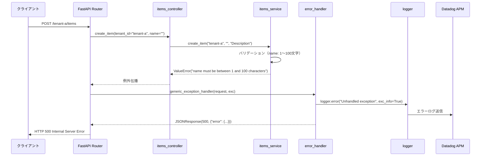

# error_handler.py - エラーハンドリング 詳細設計

## 📋 ドキュメント情報

| 項目 | 内容 |
|------|------|
| ドキュメント名 | error_handler.py - エラーハンドリング 詳細設計 |
| バージョン | 1.0 |
| 作成日 | 2025-12-28 |
| 作成者 | App-Architect |

---

## 🎯 モジュール概要

### 責務
グローバルエラーハンドリング（FastAPI Exception Handler）

### 主要機能
1. **例外キャッチ**: すべての例外を統一的にハンドリング
2. **エラーログ出力**: エラー発生時の構造化ログ出力
3. **エラーレスポンス返却**: 統一されたエラーレスポンス形式

### 依存関係
- **使用技術**: FastAPI, Python 3.10+
- **依存先**: `logger.py`
- **依存元**: FastAPI アプリケーション（main.py）

---

## 📊 関数設計

### 関数一覧

| 関数 | 説明 | 戻り値 |
|------|------|--------|
| `setup_error_handlers(app: FastAPI)` | エラーハンドラ登録 | None |
| `generic_exception_handler(request, exc)` | 汎用例外ハンドラ | JSONResponse |
| `validation_exception_handler(request, exc)` | バリデーション例外ハンドラ | JSONResponse |
| `http_exception_handler(request, exc)` | HTTP例外ハンドラ | JSONResponse |

---

## 📐 関数詳細

### 1. `setup_error_handlers(app: FastAPI)`

**目的**: FastAPI アプリケーションにエラーハンドラを登録

**関数シグネチャ**:
```python
from fastapi import FastAPI, Request, HTTPException
from fastapi.responses import JSONResponse
from fastapi.exceptions import RequestValidationError
from logger import setup_logger

logger = setup_logger("demo-api")

def setup_error_handlers(app: FastAPI) -> None:
    """
    FastAPI アプリケーションにエラーハンドラを登録

    Args:
        app (FastAPI): FastAPI アプリケーションインスタンス

    目的:
        - すべての例外を統一的にハンドリング
        - エラーログ出力
        - 統一されたエラーレスポンス返却

    影響範囲:
        - すべてのエンドポイント

    前提条件:
        - FastAPI アプリケーションが初期化されている
    """
    app.add_exception_handler(Exception, generic_exception_handler)
    app.add_exception_handler(RequestValidationError, validation_exception_handler)
    app.add_exception_handler(HTTPException, http_exception_handler)
```

**処理フロー**:
```python
1. Exception（汎用例外）ハンドラを登録
2. RequestValidationError（バリデーション例外）ハンドラを登録
3. HTTPException（HTTP例外）ハンドラを登録
```

---

### 2. `generic_exception_handler(request: Request, exc: Exception)`

**目的**: 汎用例外ハンドラ（すべての例外をキャッチ）

**関数シグネチャ**:
```python
async def generic_exception_handler(request: Request, exc: Exception) -> JSONResponse:
    """
    汎用例外ハンドラ

    Args:
        request (Request): FastAPI リクエスト
        exc (Exception): 発生した例外

    Returns:
        JSONResponse: エラーレスポンス（500 Internal Server Error）

    エラーレスポンス形式:
        {
            "error": {
                "code": "INTERNAL_SERVER_ERROR",
                "message": "An unexpected error occurred",
                "timestamp": "2025-12-28T10:00:00Z"
            }
        }
    """
    # エラーログ出力
    logger.error(
        f"Unhandled exception: {str(exc)}",
        exc_info=True,
        extra={
            "path": request.url.path,
            "method": request.method,
        }
    )

    # エラーレスポンス返却
    return JSONResponse(
        status_code=500,
        content={
            "error": {
                "code": "INTERNAL_SERVER_ERROR",
                "message": "An unexpected error occurred",
                "timestamp": datetime.datetime.utcnow().isoformat() + "Z"
            }
        }
    )
```

**処理フロー**:
```python
1. エラーログ出力（exc_info=True で例外情報を含める）
2. エラーレスポンス返却（500 Internal Server Error）
```

---

### 3. `validation_exception_handler(request: Request, exc: RequestValidationError)`

**目的**: バリデーション例外ハンドラ（FastAPI の RequestValidationError をキャッチ）

**関数シグネチャ**:
```python
async def validation_exception_handler(request: Request, exc: RequestValidationError) -> JSONResponse:
    """
    バリデーション例外ハンドラ

    Args:
        request (Request): FastAPI リクエスト
        exc (RequestValidationError): バリデーションエラー

    Returns:
        JSONResponse: エラーレスポンス（400 Bad Request）

    エラーレスポンス形式:
        {
            "error": {
                "code": "VALIDATION_ERROR",
                "message": "Validation failed",
                "field": "name",
                "details": ["name must be between 1 and 100 characters"],
                "timestamp": "2025-12-28T10:00:00Z"
            }
        }
    """
    # バリデーションエラーの詳細を取得
    errors = exc.errors()
    first_error = errors[0] if errors else {}

    field = ".".join([str(loc) for loc in first_error.get("loc", [])])
    message = first_error.get("msg", "Validation failed")

    # エラーログ出力
    logger.warning(
        f"Validation error: {message}",
        extra={
            "path": request.url.path,
            "method": request.method,
            "field": field,
        }
    )

    # エラーレスポンス返却
    return JSONResponse(
        status_code=400,
        content={
            "error": {
                "code": "VALIDATION_ERROR",
                "message": message,
                "field": field,
                "details": [err["msg"] for err in errors],
                "timestamp": datetime.datetime.utcnow().isoformat() + "Z"
            }
        }
    )
```

**処理フロー**:
```python
1. exc.errors() でバリデーションエラーの詳細を取得
2. 最初のエラーからフィールド名とメッセージを取得
3. エラーログ出力（WARNING レベル）
4. エラーレスポンス返却（400 Bad Request）
```

---

### 4. `http_exception_handler(request: Request, exc: HTTPException)`

**目的**: HTTP例外ハンドラ（FastAPI の HTTPException をキャッチ）

**関数シグネチャ**:
```python
async def http_exception_handler(request: Request, exc: HTTPException) -> JSONResponse:
    """
    HTTP例外ハンドラ

    Args:
        request (Request): FastAPI リクエスト
        exc (HTTPException): HTTP例外

    Returns:
        JSONResponse: エラーレスポンス

    エラーレスポンス形式:
        {
            "error": {
                "code": "INVALID_TENANT",
                "message": "Tenant 'tenant-x' is not valid",
                "field": "tenant_id",
                "timestamp": "2025-12-28T10:00:00Z"
            }
        }
    """
    # エラーコードをステータスコードから推測
    status_code = exc.status_code
    error_code = "UNKNOWN_ERROR"

    if status_code == 400:
        error_code = "BAD_REQUEST"
    elif status_code == 404:
        error_code = "NOT_FOUND"
    elif status_code == 500:
        error_code = "INTERNAL_SERVER_ERROR"
    elif status_code == 503:
        error_code = "SERVICE_UNAVAILABLE"

    # エラーログ出力
    logger.warning(
        f"HTTP exception: {exc.detail}",
        extra={
            "path": request.url.path,
            "method": request.method,
            "status_code": status_code,
        }
    )

    # エラーレスポンス返却
    return JSONResponse(
        status_code=status_code,
        content={
            "error": {
                "code": error_code,
                "message": exc.detail,
                "timestamp": datetime.datetime.utcnow().isoformat() + "Z"
            }
        }
    )
```

**処理フロー**:
```python
1. exc.status_code からエラーコードを推測
2. エラーログ出力（WARNING レベル）
3. エラーレスポンス返却（元のステータスコード）
```

---

## 🔄 シーケンス図

### エラーハンドリングフロー



---

## 📊 データ構造

### 汎用例外レスポンス（500）

```json
{
  "error": {
    "code": "INTERNAL_SERVER_ERROR",
    "message": "An unexpected error occurred",
    "timestamp": "2025-12-28T10:00:00Z"
  }
}
```

### バリデーション例外レスポンス（400）

```json
{
  "error": {
    "code": "VALIDATION_ERROR",
    "message": "name must be between 1 and 100 characters",
    "field": "name",
    "details": [
      "name must be between 1 and 100 characters"
    ],
    "timestamp": "2025-12-28T10:00:00Z"
  }
}
```

### HTTP例外レスポンス（404）

```json
{
  "error": {
    "code": "NOT_FOUND",
    "message": "Item with id 999 not found for tenant 'tenant-a'",
    "timestamp": "2025-12-28T10:00:00Z"
  }
}
```

---

## 🚨 例外処理マッピング

### エラーコード一覧

| HTTPステータス | エラーコード | 説明 | ログレベル |
|--------------|-----------|------|----------|
| 400 | BAD_REQUEST | リクエストエラー | WARNING |
| 400 | VALIDATION_ERROR | バリデーションエラー | WARNING |
| 400 | INVALID_TENANT | 無効なテナント | WARNING |
| 404 | NOT_FOUND | リソース未存在 | WARNING |
| 404 | ITEM_NOT_FOUND | アイテム未存在 | WARNING |
| 500 | INTERNAL_SERVER_ERROR | サーバーエラー | ERROR |
| 500 | DATABASE_ERROR | データベースエラー | ERROR |
| 500 | SIMULATED_ERROR | シミュレーションエラー | ERROR |
| 503 | SERVICE_UNAVAILABLE | サービス利用不可 | ERROR |

---

## 🧪 テスト方針

### 単体テスト項目

#### 1. 汎用例外ハンドラテスト

```python
import pytest
from fastapi.testclient import TestClient

def test_generic_exception_handler(client: TestClient):
    """
    generic_exception_handler のテスト

    検証項目:
        - 例外発生時に500エラーが返るか
        - エラーレスポンスが統一形式か
    """
    # 例外を発生させるエンドポイントを用意
    response = client.get("/error")

    assert response.status_code == 500
    assert response.json()["error"]["code"] == "INTERNAL_SERVER_ERROR"
```

#### 2. バリデーション例外ハンドラテスト

```python
def test_validation_exception_handler(client: TestClient):
    """
    validation_exception_handler のテスト

    検証項目:
        - バリデーションエラー時に400エラーが返るか
        - フィールド名とエラーメッセージが含まれるか
    """
    response = client.post(
        "/tenant-a/items",
        json={"name": "", "description": "Description"}
    )

    assert response.status_code == 400
    assert response.json()["error"]["code"] == "VALIDATION_ERROR"
    assert "name" in response.json()["error"]["field"]
```

---

## 📝 実装時の注意事項

### 1. エラーログ出力

**例外情報を含める**:
```python
logger.error(
    "Unhandled exception",
    exc_info=True,  # 例外情報を含める
    extra={...}
)
```

### 2. センシティブ情報の除外

**エラーメッセージに機密情報を含めない**:
```python
# ❌ BAD: パスワードを含む
raise HTTPException(status_code=400, detail=f"Invalid password: {password}")

# ✅ GOOD: パスワードを含めない
raise HTTPException(status_code=400, detail="Invalid credentials")
```

### 3. Datadog 連携

**エラーログは自動的に Datadog に送信**:
- logger.py が JSON形式で出力
- Datadog Agent が収集
- トレースIDで紐付け

---

## 🔗 関連ドキュメント

| ドキュメント | パス | 目的 |
|-------------|------|------|
| 基本設計 - API設計 | `../../01_基本設計/04_API設計.md` | エラーレスポンス形式 |
| Middleware 詳細設計 | `./logger.md` | 構造化ログ |
| Controller 詳細設計 | `../controllers/` | エラーハンドリング例 |

---

## 📝 改訂履歴

| 日付 | バージョン | 変更内容 | 作成者 |
|------|-----------|----------|--------|
| 2025-12-28 | 1.0 | 初版作成 | App-Architect |
