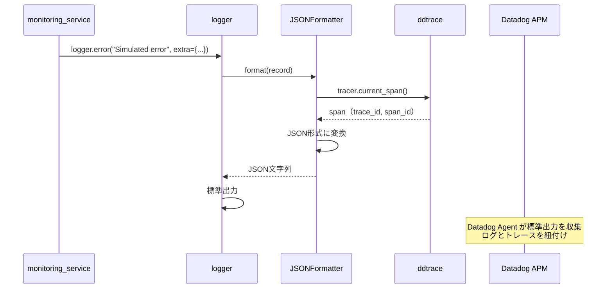

# logger.py - 構造化ログ 詳細設計

## 📋 ドキュメント情報

| 項目 | 内容 |
|------|------|
| ドキュメント名 | logger.py - 構造化ログ 詳細設計 |
| バージョン | 1.0 |
| 作成日 | 2025-12-28 |
| 作成者 | App-Architect |

---

## 🎯 モジュール概要

### 責務
構造化ログ出力（JSON形式、Datadog連携）

### 主要機能
1. **JSON形式ログ**: 構造化ログ出力
2. **トレースID付与**: Datadog APM トレースIDを自動付与
3. **ログレベル管理**: 環境変数によるログレベル制御

### 依存関係
- **使用技術**: Python logging, JSON
- **依存先**: `settings.py`（環境変数）, `ddtrace`（Datadog APM）
- **依存元**: すべてのモジュール

---

## 📊 モジュール設計

### グローバル変数とセットアップ

```python
import logging
import json
import os
from ddtrace import tracer

# ログレベル（環境変数から取得）
LOG_LEVEL = os.getenv("LOG_LEVEL", "INFO")

# ロガー設定
def setup_logger(name: str = "demo-api") -> logging.Logger:
    """
    構造化ログを出力するロガーをセットアップ

    Args:
        name (str): ロガー名（デフォルト: "demo-api"）

    Returns:
        logging.Logger: 設定済みロガー

    目的:
        - JSON形式の構造化ログ出力
        - Datadog APM トレースID自動付与
        - 環境変数によるログレベル制御

    影響範囲:
        - すべてのモジュールで使用

    前提条件:
        - LOG_LEVEL 環境変数が設定されている（デフォルト: INFO）
    """
    logger = logging.getLogger(name)
    logger.setLevel(getattr(logging, LOG_LEVEL))

    # ハンドラ設定（標準出力）
    handler = logging.StreamHandler()
    handler.setLevel(getattr(logging, LOG_LEVEL))

    # フォーマッター設定（JSON形式）
    formatter = JSONFormatter()
    handler.setFormatter(formatter)

    logger.addHandler(handler)

    return logger
```

---

## 🔧 クラス設計

### クラス名: JSONFormatter

**責務**: JSON形式のログフォーマット

---

## 📐 メソッド詳細

### 1. `format(record: logging.LogRecord)`

**目的**: ログレコードをJSON形式に変換

**関数シグネチャ**:
```python
import datetime

class JSONFormatter(logging.Formatter):
    """
    JSON形式のログフォーマッター

    責務:
        - ログレコードをJSON形式に変換
        - Datadog APM トレースID、スパンIDを自動付与
        - ISO 8601形式のタイムスタンプ

    影響範囲:
        - すべてのログ出力
    """

    def format(self, record: logging.LogRecord) -> str:
        """
        ログレコードをJSON形式に変換

        Args:
            record (logging.LogRecord): ログレコード

        Returns:
            str: JSON形式のログ文字列

        出力例:
            {
                "timestamp": "2025-12-28T10:00:00Z",
                "level": "INFO",
                "message": "Request received",
                "trace_id": "abc123",
                "span_id": "def456",
                "tenant_id": "tenant-a"
            }
        """
        # 基本フィールド
        log_data = {
            "timestamp": datetime.datetime.utcnow().isoformat() + "Z",
            "level": record.levelname,
            "message": record.getMessage(),
            "module": record.module,
            "function": record.funcName,
            "line": record.lineno,
        }

        # Datadog APM トレースID、スパンID を付与
        span = tracer.current_span()
        if span:
            log_data["dd.trace_id"] = span.trace_id
            log_data["dd.span_id"] = span.span_id

        # extra フィールドを追加（tenant_id 等）
        if hasattr(record, "tenant_id"):
            log_data["tenant_id"] = record.tenant_id

        if hasattr(record, "error_type"):
            log_data["error_type"] = record.error_type

        if hasattr(record, "latency_ms"):
            log_data["latency_ms"] = record.latency_ms

        if hasattr(record, "simulated"):
            log_data["simulated"] = record.simulated

        # 例外情報を追加
        if record.exc_info:
            log_data["exception"] = self.formatException(record.exc_info)

        return json.dumps(log_data, ensure_ascii=False)
```

**処理フロー**:
```python
1. 基本フィールド（timestamp, level, message 等）を設定
2. Datadog APM トレースID、スパンID を取得して追加
3. extra フィールド（tenant_id 等）を追加
4. 例外情報があれば追加
5. JSON形式に変換して返却
```

---

## 📊 ログ出力例

### 通常ログ

```json
{
  "timestamp": "2025-12-28T10:00:00Z",
  "level": "INFO",
  "message": "Request received",
  "module": "items_controller",
  "function": "get_items",
  "line": 45,
  "dd.trace_id": "123456789",
  "dd.span_id": "987654321",
  "tenant_id": "tenant-a"
}
```

### エラーログ（例外情報付き）

```json
{
  "timestamp": "2025-12-28T10:00:00Z",
  "level": "ERROR",
  "message": "Simulated error: 500",
  "module": "monitoring_service",
  "function": "simulate_error",
  "line": 67,
  "dd.trace_id": "123456789",
  "dd.span_id": "987654321",
  "tenant_id": "tenant-a",
  "error_type": "500",
  "simulated": true,
  "exception": "Traceback (most recent call last):\n  File ...\nException: Simulated error of type '500'"
}
```

### レイテンシログ

```json
{
  "timestamp": "2025-12-28T10:00:00Z",
  "level": "INFO",
  "message": "Simulating latency: 2000ms",
  "module": "monitoring_service",
  "function": "simulate_latency",
  "line": 89,
  "dd.trace_id": "123456789",
  "dd.span_id": "987654321",
  "tenant_id": "tenant-a",
  "latency_ms": 2000,
  "simulated": true
}
```

---

## 🔄 シーケンス図

### ログ出力フロー（Datadog連携）



---

## 🧩 使用例

### ロガーの初期化

```python
from logger import setup_logger

# アプリケーション起動時に初期化
logger = setup_logger("demo-api")
```

### 通常ログ出力

```python
logger.info("Request received", extra={"tenant_id": "tenant-a"})
```

### エラーログ出力（例外情報付き）

```python
try:
    # 処理
    ...
except Exception as e:
    logger.error(
        "Database connection failed",
        exc_info=True,  # 例外情報を含める
        extra={"tenant_id": "tenant-a"}
    )
```

### カスタムフィールド付きログ出力

```python
logger.info(
    "Simulating latency",
    extra={
        "tenant_id": "tenant-a",
        "latency_ms": 2000,
        "simulated": True
    }
)
```

---

## 🚨 例外処理

### 発生する例外と対処方法

| 例外 | 発生条件 | 対処方法 |
|------|---------|---------|
| なし | logger は例外を発生させない | - |

**重要**: logger.py は例外を発生させず、ログ出力に失敗しても処理を継続。

---

## 🧪 テスト方針

### 単体テスト項目

#### 1. JSON形式ログ出力テスト

```python
def test_json_formatter():
    """
    JSONFormatter のテスト

    検証項目:
        - ログレコードがJSON形式に変換されるか
        - 必須フィールド（timestamp, level, message）が含まれるか
    """
    # Arrange
    formatter = JSONFormatter()
    record = logging.LogRecord(
        name="demo-api",
        level=logging.INFO,
        pathname="test.py",
        lineno=10,
        msg="Test message",
        args=(),
        exc_info=None
    )

    # Act
    result = formatter.format(record)
    log_data = json.loads(result)

    # Assert
    assert log_data["level"] == "INFO"
    assert log_data["message"] == "Test message"
    assert "timestamp" in log_data
```

#### 2. トレースID付与テスト

```python
from unittest.mock import patch, Mock

def test_trace_id_inclusion():
    """
    トレースID付与のテスト

    検証項目:
        - Datadog APM トレースIDがログに含まれるか
    """
    # Arrange
    formatter = JSONFormatter()
    record = logging.LogRecord(
        name="demo-api",
        level=logging.INFO,
        pathname="test.py",
        lineno=10,
        msg="Test message",
        args=(),
        exc_info=None
    )

    # Mock tracer
    mock_span = Mock()
    mock_span.trace_id = 123456789
    mock_span.span_id = 987654321

    with patch('logger.tracer.current_span', return_value=mock_span):
        # Act
        result = formatter.format(record)
        log_data = json.loads(result)

        # Assert
        assert log_data["dd.trace_id"] == 123456789
        assert log_data["dd.span_id"] == 987654321
```

#### 3. extra フィールドテスト

```python
def test_extra_fields():
    """
    extra フィールドのテスト

    検証項目:
        - extra フィールド（tenant_id 等）がログに含まれるか
    """
    # Arrange
    formatter = JSONFormatter()
    record = logging.LogRecord(
        name="demo-api",
        level=logging.INFO,
        pathname="test.py",
        lineno=10,
        msg="Test message",
        args=(),
        exc_info=None
    )
    record.tenant_id = "tenant-a"
    record.latency_ms = 2000

    # Act
    result = formatter.format(record)
    log_data = json.loads(result)

    # Assert
    assert log_data["tenant_id"] == "tenant-a"
    assert log_data["latency_ms"] == 2000
```

---

## 📝 実装時の注意事項

### 1. ログレベル

**環境変数で制御**:
```bash
# 開発環境
LOG_LEVEL=DEBUG

# 本番環境
LOG_LEVEL=INFO
```

**ログレベル一覧**:
- `DEBUG`: デバッグ情報（開発環境のみ）
- `INFO`: 通常情報
- `WARNING`: 警告
- `ERROR`: エラー
- `CRITICAL`: 致命的エラー

### 2. Datadog 連携

**Datadog Agent 設定**:
```yaml
# datadog.yaml
logs_enabled: true
logs_config:
  container_collect_all: true
  processing_rules:
    - type: multi_line
      name: json_logs
      pattern: ^\{
```

**ECS タスク定義**:
```json
{
  "logConfiguration": {
    "logDriver": "awslogs",
    "options": {
      "awslogs-group": "/ecs/demo-api",
      "awslogs-region": "us-east-1",
      "awslogs-stream-prefix": "ecs"
    }
  }
}
```

### 3. パフォーマンス

**ログ出力は非同期**:
- Python logging はデフォルトで非同期
- 標準出力へのログ出力はブロッキング操作だが、影響は最小限

**過度なログ出力は避ける**:
- ループ内でのログ出力は控える
- DEBUG レベルは開発環境のみ

---

## 🔗 関連ドキュメント

| ドキュメント | パス | 目的 |
|-------------|------|------|
| 基本設計 - セキュリティ設計 | `../../01_基本設計/05_セキュリティ設計.md` | ログセキュリティ |
| Middleware 詳細設計 | `./datadog_middleware.md` | Datadog APM統合 |
| Service 詳細設計 | `../services/monitoring_service.md` | 使用例 |

---

## 📝 改訂履歴

| 日付 | バージョン | 変更内容 | 作成者 |
|------|-----------|----------|--------|
| 2025-12-28 | 1.0 | 初版作成 | App-Architect |
