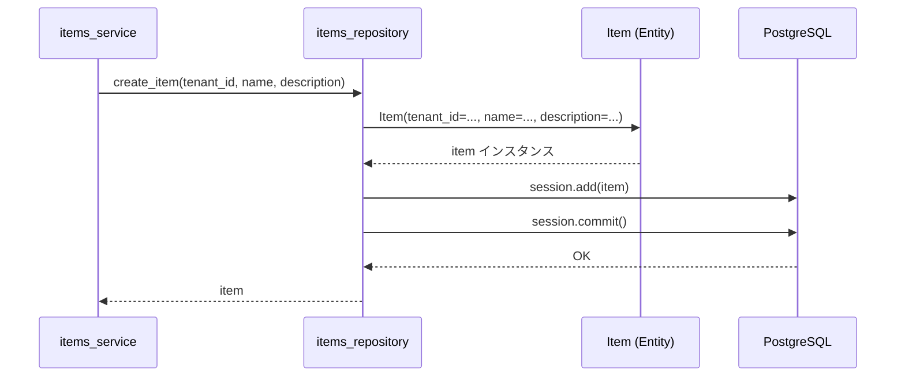

# item.py - SQLAlchemy Model 詳細設計

## 📋 ドキュメント情報

| 項目 | 内容 |
|------|------|
| ドキュメント名 | item.py - SQLAlchemy Model 詳細設計 |
| バージョン | 1.0 |
| 作成日 | 2025-12-28 |
| 作成者 | App-Architect |

---

## 🎯 モジュール概要

### 責務
items テーブルのエンティティ定義（SQLAlchemy ORM Model）

### 主要機能
1. **テーブル定義**: items テーブルのカラム、制約、インデックスを定義
2. **テナント分離**: tenant_id によるマルチテナント対応
3. **型安全性**: Python 型ヒントとの統合

### 依存関係
- **使用技術**: SQLAlchemy 2.0+
- **依存先**: なし（最下位レイヤー）
- **依存元**: `items_repository.py`

---

## 📊 クラス設計

### クラス名: Item

**責務**: items テーブルのエンティティ表現

**継承**: `Base` (SQLAlchemy Declarative Base)

---

## 🔧 属性（カラム）定義

### テーブル定義

```python
from sqlalchemy import Column, Integer, String, Text, DateTime, Index
from sqlalchemy.ext.declarative import declarative_base
from datetime import datetime

Base = declarative_base()

class Item(Base):
    """
    items テーブルのエンティティ定義

    責務:
        - サンプルデータの永続化
        - テナント別データ分離
        - RDS監視データ生成（FR-001）

    影響範囲:
        - items_repository.py: CRUD操作で使用
        - items_service.py: ビジネスロジックで使用

    前提条件:
        - PostgreSQL RDS が利用可能
        - tenant_id は有効なテナントID（tenant-a, tenant-b, tenant-c）
    """
    __tablename__ = 'items'

    # プライマリキー
    id = Column(Integer, primary_key=True, autoincrement=True, comment='サンプルデータID')

    # テナント分離
    tenant_id = Column(String(50), nullable=False, index=True, comment='テナントID')

    # データフィールド
    name = Column(String(100), nullable=False, comment='サンプルデータ名')
    description = Column(Text, nullable=True, comment='サンプルデータ説明')

    # タイムスタンプ
    created_at = Column(DateTime, nullable=False, default=datetime.utcnow, comment='作成日時')
    updated_at = Column(DateTime, nullable=False, default=datetime.utcnow, onupdate=datetime.utcnow, comment='更新日時')

    # 複合インデックス: テナント別クエリ最適化
    __table_args__ = (
        Index('idx_tenant_id_created_at', 'tenant_id', 'created_at'),
    )
```

---

## 📐 属性詳細

| カラム名 | 型 | NULL許可 | デフォルト値 | 制約 | 説明 |
|---------|-----|---------|------------|------|------|
| id | Integer | ❌ | autoincrement | PRIMARY KEY | サンプルデータID |
| tenant_id | String(50) | ❌ | - | INDEX | テナントID（tenant-a, tenant-b, tenant-c） |
| name | String(100) | ❌ | - | - | サンプルデータ名 |
| description | Text | ✅ | NULL | - | サンプルデータ説明 |
| created_at | DateTime | ❌ | datetime.utcnow | - | 作成日時（UTC） |
| updated_at | DateTime | ❌ | datetime.utcnow | ON UPDATE | 更新日時（UTC） |

---

## 🔍 インデックス設計

### 1. プライマリキーインデックス（自動作成）
- **カラム**: `id`
- **種別**: PRIMARY KEY
- **目的**: 主キー制約、高速検索

### 2. テナントIDインデックス（単一カラム）
- **カラム**: `tenant_id`
- **種別**: BTREE
- **目的**: テナント別フィルタリング高速化

### 3. 複合インデックス（テナントID + 作成日時）
- **カラム**: `(tenant_id, created_at)`
- **種別**: BTREE
- **目的**: テナント別 + 時系列ソート高速化
- **想定クエリ**:
  ```sql
  SELECT * FROM items
  WHERE tenant_id = 'tenant-a'
  ORDER BY created_at DESC;
  ```

---

## 🎨 メソッド詳細設計

### メソッド一覧

| メソッド | 説明 | 戻り値 |
|---------|------|--------|
| `__repr__()` | オブジェクト文字列表現 | str |
| `to_dict()` | 辞書形式変換（API レスポンス用） | dict |

---

### 1. `__repr__()`

**目的**: デバッグ時の可読性向上

**関数シグネチャ**:
```python
def __repr__(self) -> str:
    """
    オブジェクトの文字列表現を返す

    Returns:
        str: "<Item(id=1, tenant_id='tenant-a', name='Sample Item 1')>"
    """
    return f"<Item(id={self.id}, tenant_id='{self.tenant_id}', name='{self.name}')>"
```

---

### 2. `to_dict()`

**目的**: API レスポンス用に辞書形式に変換

**関数シグネチャ**:
```python
def to_dict(self) -> dict:
    """
    エンティティを辞書形式に変換（API レスポンス用）

    Returns:
        dict: {
            "id": int,
            "tenant_id": str,
            "name": str,
            "description": str | None,
            "created_at": str (ISO 8601形式),
            "updated_at": str (ISO 8601形式)
        }
    """
    return {
        "id": self.id,
        "tenant_id": self.tenant_id,
        "name": self.name,
        "description": self.description,
        "created_at": self.created_at.isoformat() + "Z" if self.created_at else None,
        "updated_at": self.updated_at.isoformat() + "Z" if self.updated_at else None,
    }
```

---

## 🔄 シーケンス図

### エンティティ生成フロー



---

## 📊 データ構造

### Item インスタンス例

```python
item = Item(
    id=1,
    tenant_id="tenant-a",
    name="Sample Item 1",
    description="This is a sample item for tenant-a",
    created_at=datetime(2025, 12, 28, 10, 0, 0),
    updated_at=datetime(2025, 12, 28, 10, 0, 0)
)
```

### to_dict() 出力例

```json
{
  "id": 1,
  "tenant_id": "tenant-a",
  "name": "Sample Item 1",
  "description": "This is a sample item for tenant-a",
  "created_at": "2025-12-28T10:00:00Z",
  "updated_at": "2025-12-28T10:00:00Z"
}
```

---

## 🚨 例外処理

### SQLAlchemy が発生する例外

| 例外 | 発生条件 | 対処方法 |
|------|---------|---------|
| `IntegrityError` | プライマリキー重複、NOT NULL 制約違反 | Repository 層でキャッチし、適切なエラーメッセージを返す |
| `DataError` | データ型不一致（例: name が 100 文字超過） | Controller 層でバリデーション |
| `OperationalError` | DB接続失敗 | Repository 層でキャッチし、DATABASE_ERROR を返す |

**重要**: Model 層では例外処理を行わない。Repository 層に委譲。

---

## 🧪 テスト方針

### 単体テスト項目

#### 1. エンティティ生成テスト

```python
def test_item_creation():
    """
    Item エンティティの生成テスト

    検証項目:
        - 必須カラムが正しく設定されるか
        - デフォルト値（created_at, updated_at）が自動設定されるか
    """
    item = Item(
        tenant_id="tenant-a",
        name="Test Item",
        description="Test Description"
    )

    assert item.tenant_id == "tenant-a"
    assert item.name == "Test Item"
    assert item.description == "Test Description"
    assert item.created_at is not None
    assert item.updated_at is not None
```

#### 2. to_dict() 変換テスト

```python
def test_to_dict():
    """
    to_dict() メソッドのテスト

    検証項目:
        - すべてのカラムが辞書に含まれるか
        - datetime が ISO 8601 形式に変換されるか
    """
    item = Item(
        id=1,
        tenant_id="tenant-a",
        name="Test Item",
        description="Test Description",
        created_at=datetime(2025, 12, 28, 10, 0, 0),
        updated_at=datetime(2025, 12, 28, 10, 0, 0)
    )

    result = item.to_dict()

    assert result["id"] == 1
    assert result["tenant_id"] == "tenant-a"
    assert result["name"] == "Test Item"
    assert result["created_at"] == "2025-12-28T10:00:00Z"
```

#### 3. __repr__() テスト

```python
def test_repr():
    """
    __repr__() メソッドのテスト

    検証項目:
        - 可読性のある文字列表現が返されるか
    """
    item = Item(id=1, tenant_id="tenant-a", name="Test Item")

    result = repr(item)

    assert "Item(id=1" in result
    assert "tenant_id='tenant-a'" in result
    assert "name='Test Item'" in result
```

---

## 📝 実装時の注意事項

### 1. タイムゾーン
- **常に UTC を使用**: `datetime.utcnow()`
- **API レスポンス**: ISO 8601 形式 + "Z" サフィックス

### 2. テナント分離
- **tenant_id は必須**: すべてのデータに tenant_id を設定
- **インデックス**: テナント別クエリを高速化

### 3. 型ヒント
- **Coder へ**: すべてのメソッドに型ヒントを付与
- **例**: `def to_dict(self) -> dict:`

### 4. Docstring
- **日本語で記載**: 目的、影響範囲、前提条件を明記
- **AI 協業前提**: コンテキストを明確に記載

---

## 🔗 関連ドキュメント

| ドキュメント | パス | 目的 |
|-------------|------|------|
| 基本設計 - データモデル | `../../01_基本設計/03_データモデル.md` | ER図、テーブル定義 |
| 基本設計 - 実装方針 | `../../01_基本設計/06_実装方針.md` | ディレクトリ構成 |
| Python技術標準 | `.claude/docs/40_standards/41_app/languages/python.md` | コーディング規約 |
| Repository 詳細設計 | `../repositories/items_repository.md` | CRUD 操作 |

---

## 📝 改訂履歴

| 日付 | バージョン | 変更内容 | 作成者 |
|------|-----------|----------|--------|
| 2025-12-28 | 1.0 | 初版作成 | App-Architect |
