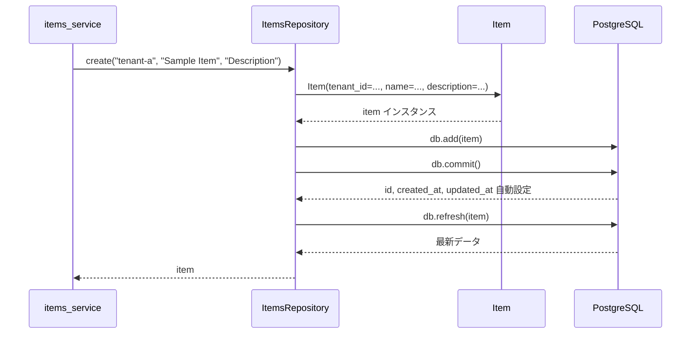

# items_repository.py - itemsテーブルCRUD 詳細設計

## 📋 ドキュメント情報

| 項目 | 内容 |
|------|------|
| ドキュメント名 | items_repository.py - itemsテーブルCRUD 詳細設計 |
| バージョン | 1.0 |
| 作成日 | 2025-12-28 |
| 作成者 | App-Architect |

---

## 🎯 モジュール概要

### 責務
items テーブルへのCRUD操作（データアクセス層）

### 主要機能
1. **データ取得**: テナント別、ID別のデータ取得
2. **データ作成**: サンプルデータの永続化
3. **データ削除**: サンプルデータの削除（オプション）

### 依存関係
- **使用技術**: SQLAlchemy 2.0+
- **依存先**: `database.py`, `item.py`
- **依存元**: `items_service.py`

---

## 📊 クラス設計

### クラス名: ItemsRepository

**責務**: items テーブルへのCRUD操作

---

## 🔧 メソッド詳細設計

### メソッド一覧

| メソッド | 説明 | 戻り値 |
|---------|------|--------|
| `__init__(db: Session)` | コンストラクタ | None |
| `find_by_tenant(tenant_id: str)` | テナント別データ一覧取得 | list[Item] |
| `find_by_id(tenant_id: str, item_id: int)` | ID別データ取得 | Item \| None |
| `create(tenant_id: str, name: str, description: str)` | データ作成 | Item |
| `delete(tenant_id: str, item_id: int)` | データ削除 | bool |

---

## 📐 メソッド詳細

### 1. `__init__(db: Session)`

**目的**: コンストラクタ（セッション注入）

**関数シグネチャ**:
```python
from sqlalchemy.orm import Session
from models.item import Item

class ItemsRepository:
    """
    items テーブルへのCRUD操作を担当するリポジトリ

    責務:
        - テナント別データ取得
        - ID別データ取得
        - データ作成
        - データ削除

    影響範囲:
        - items_service.py から呼び出される

    前提条件:
        - database.py の get_db() でセッションが注入される
    """

    def __init__(self, db: Session):
        """
        コンストラクタ

        Args:
            db (Session): SQLAlchemy セッション
        """
        self.db = db
```

---

### 2. `find_by_tenant(tenant_id: str)`

**目的**: テナント別データ一覧取得

**関数シグネチャ**:
```python
def find_by_tenant(self, tenant_id: str) -> list[Item]:
    """
    テナント別にサンプルデータ一覧を取得

    Args:
        tenant_id (str): テナントID（例: "tenant-a"）

    Returns:
        list[Item]: サンプルデータ一覧（作成日時の降順）

    例外:
        OperationalError: DB接続失敗時
    """
    return self.db.query(Item)\
        .filter(Item.tenant_id == tenant_id)\
        .order_by(Item.created_at.desc())\
        .all()
```

**処理フロー**:
```python
1. Item モデルをクエリ
2. tenant_id でフィルタリング
3. created_at の降順でソート
4. all() で全件取得
5. list[Item] を返却
```

**SQL例**:
```sql
SELECT * FROM items
WHERE tenant_id = 'tenant-a'
ORDER BY created_at DESC;
```

**Datadog 監視**:
- **スパン名**: `postgres.query`
- **リソース**: `SELECT * FROM items WHERE tenant_id = ?`
- **タグ**: `tenant_id=tenant-a`

---

### 3. `find_by_id(tenant_id: str, item_id: int)`

**目的**: ID別データ取得（テナント分離）

**関数シグネチャ**:
```python
def find_by_id(self, tenant_id: str, item_id: int) -> Item | None:
    """
    ID別にサンプルデータを取得（テナント分離）

    Args:
        tenant_id (str): テナントID
        item_id (int): サンプルデータID

    Returns:
        Item | None: サンプルデータ（見つからない場合は None）

    例外:
        OperationalError: DB接続失敗時

    注意:
        - テナント分離のため、tenant_id と item_id の両方でフィルタリング
        - tenant-a のユーザーが tenant-b のデータを取得できないようにする
    """
    return self.db.query(Item)\
        .filter(Item.tenant_id == tenant_id)\
        .filter(Item.id == item_id)\
        .first()
```

**処理フロー**:
```python
1. Item モデルをクエリ
2. tenant_id でフィルタリング（テナント分離）
3. id でフィルタリング
4. first() で最初の1件取得（なければ None）
5. Item | None を返却
```

**SQL例**:
```sql
SELECT * FROM items
WHERE tenant_id = 'tenant-a' AND id = 1
LIMIT 1;
```

**テナント分離の重要性**:
```python
# ❌ BAD: テナント分離なし（他テナントのデータを取得できてしまう）
def find_by_id_bad(self, item_id: int) -> Item | None:
    return self.db.query(Item).filter(Item.id == item_id).first()

# ✅ GOOD: テナント分離あり
def find_by_id(self, tenant_id: str, item_id: int) -> Item | None:
    return self.db.query(Item)\
        .filter(Item.tenant_id == tenant_id)\
        .filter(Item.id == item_id)\
        .first()
```

---

### 4. `create(tenant_id: str, name: str, description: str | None)`

**目的**: サンプルデータ作成

**関数シグネチャ**:
```python
def create(self, tenant_id: str, name: str, description: str | None = None) -> Item:
    """
    サンプルデータを作成

    Args:
        tenant_id (str): テナントID
        name (str): サンプルデータ名（1〜100文字）
        description (str | None): サンプルデータ説明（任意、0〜500文字）

    Returns:
        Item: 作成されたサンプルデータ

    例外:
        IntegrityError: NOT NULL 制約違反
        DataError: データ型不一致（name が 100 文字超過等）
        OperationalError: DB接続失敗時
    """
    item = Item(
        tenant_id=tenant_id,
        name=name,
        description=description
    )

    self.db.add(item)
    self.db.commit()
    self.db.refresh(item)  # DB から最新データを取得（id, created_at 等）

    return item
```

**処理フロー**:
```python
1. Item インスタンス生成
2. db.add() でセッションに追加
3. db.commit() でトランザクション確定
4. db.refresh() でDBから最新データ取得（id, created_at が自動設定される）
5. Item を返却
```

**SQL例**:
```sql
INSERT INTO items (tenant_id, name, description, created_at, updated_at)
VALUES ('tenant-a', 'Sample Item 1', 'Description', NOW(), NOW())
RETURNING id, created_at, updated_at;
```

**エラーハンドリング**:
```python
from sqlalchemy.exc import IntegrityError, DataError

try:
    item = repository.create("tenant-a", "Sample Item", "Description")
except IntegrityError as e:
    # NOT NULL 制約違反等
    raise ValueError("Invalid data") from e
except DataError as e:
    # データ型不一致（name が 100 文字超過等）
    raise ValueError("Data validation failed") from e
```

---

### 5. `delete(tenant_id: str, item_id: int)`

**目的**: サンプルデータ削除（オプション）

**関数シグネチャ**:
```python
def delete(self, tenant_id: str, item_id: int) -> bool:
    """
    サンプルデータを削除（テナント分離）

    Args:
        tenant_id (str): テナントID
        item_id (int): サンプルデータID

    Returns:
        bool: True（削除成功）、False（データが見つからない）

    例外:
        OperationalError: DB接続失敗時
    """
    item = self.find_by_id(tenant_id, item_id)

    if not item:
        return False

    self.db.delete(item)
    self.db.commit()

    return True
```

**処理フロー**:
```python
1. find_by_id() でデータ取得
2. データが見つからない場合は False を返却
3. db.delete() でセッションから削除
4. db.commit() でトランザクション確定
5. True を返却
```

**SQL例**:
```sql
DELETE FROM items
WHERE tenant_id = 'tenant-a' AND id = 1;
```

---

## 🔄 シーケンス図

### データ作成フロー



---

## 📊 データ構造

### find_by_tenant() の戻り値例

```python
[
    Item(id=1, tenant_id="tenant-a", name="Sample Item 1", ...),
    Item(id=2, tenant_id="tenant-a", name="Sample Item 2", ...)
]
```

### create() の戻り値例

```python
Item(
    id=3,
    tenant_id="tenant-a",
    name="New Sample Item",
    description="Description",
    created_at=datetime(2025, 12, 28, 10, 0, 0),
    updated_at=datetime(2025, 12, 28, 10, 0, 0)
)
```

---

## 🚨 例外処理

### 発生する例外と対処方法

| 例外 | 発生条件 | 対処方法 |
|------|---------|---------|
| `IntegrityError` | NOT NULL 制約違反、プライマリキー重複 | Service 層でキャッチし、400 Bad Request を返す |
| `DataError` | データ型不一致（name が 100 文字超過等） | Service 層でキャッチし、400 Bad Request を返す |
| `OperationalError` | DB接続失敗、ネットワーク障害 | Service 層でキャッチし、500 Internal Server Error を返す |

**重要**: Repository 層では例外をキャッチせず、Service 層に委譲。

---

## 🧪 テスト方針

### 単体テスト項目

#### 1. テナント別データ取得テスト

```python
def test_find_by_tenant(db_session):
    """
    find_by_tenant() のテスト

    検証項目:
        - テナント別にデータを取得できるか
        - 他テナントのデータが含まれないか
        - 作成日時の降順でソートされているか
    """
    # Arrange
    item1 = Item(tenant_id="tenant-a", name="Item 1")
    item2 = Item(tenant_id="tenant-a", name="Item 2")
    item3 = Item(tenant_id="tenant-b", name="Item 3")
    db_session.add_all([item1, item2, item3])
    db_session.commit()

    repository = ItemsRepository(db_session)

    # Act
    items = repository.find_by_tenant("tenant-a")

    # Assert
    assert len(items) == 2
    assert items[0].tenant_id == "tenant-a"
    assert items[1].tenant_id == "tenant-a"
    # 降順確認
    assert items[0].created_at >= items[1].created_at
```

#### 2. ID別データ取得テスト（テナント分離）

```python
def test_find_by_id_with_tenant_isolation(db_session):
    """
    find_by_id() のテスト（テナント分離）

    検証項目:
        - 正しいテナントIDとitem_idでデータを取得できるか
        - 他テナントのデータは取得できないか
    """
    # Arrange
    item_a = Item(id=1, tenant_id="tenant-a", name="Item A")
    item_b = Item(id=2, tenant_id="tenant-b", name="Item B")
    db_session.add_all([item_a, item_b])
    db_session.commit()

    repository = ItemsRepository(db_session)

    # Act
    result_a = repository.find_by_id("tenant-a", 1)
    result_b = repository.find_by_id("tenant-a", 2)  # 他テナントのデータ

    # Assert
    assert result_a is not None
    assert result_a.id == 1
    assert result_b is None  # テナント分離により取得できない
```

#### 3. データ作成テスト

```python
def test_create(db_session):
    """
    create() のテスト

    検証項目:
        - データが正しく作成されるか
        - id, created_at, updated_at が自動設定されるか
    """
    # Arrange
    repository = ItemsRepository(db_session)

    # Act
    item = repository.create("tenant-a", "New Item", "Description")

    # Assert
    assert item.id is not None
    assert item.tenant_id == "tenant-a"
    assert item.name == "New Item"
    assert item.description == "Description"
    assert item.created_at is not None
    assert item.updated_at is not None
```

---

## 📝 実装時の注意事項

### 1. テナント分離

**すべてのクエリで tenant_id をフィルタリング**:
```python
# ✅ GOOD
def find_by_id(self, tenant_id: str, item_id: int) -> Item | None:
    return self.db.query(Item)\
        .filter(Item.tenant_id == tenant_id)\
        .filter(Item.id == item_id)\
        .first()

# ❌ BAD: テナント分離なし
def find_by_id(self, item_id: int) -> Item | None:
    return self.db.query(Item).filter(Item.id == item_id).first()
```

### 2. トランザクション制御

**Repository 層でコミット**:
```python
def create(self, tenant_id: str, name: str, description: str | None = None) -> Item:
    item = Item(tenant_id=tenant_id, name=name, description=description)
    self.db.add(item)
    self.db.commit()  # Repository 層でコミット
    self.db.refresh(item)
    return item
```

**理由**: Service 層で複数の Repository を呼び出す場合、トランザクション制御が複雑になるため、Repository 層でコミット。

### 3. 型ヒント

**Python 3.10+ の型ヒントを使用**:
```python
from typing import Optional

# ✅ GOOD (Python 3.10+)
def find_by_id(self, tenant_id: str, item_id: int) -> Item | None:
    ...

# ✅ GOOD (Python 3.9以下)
def find_by_id(self, tenant_id: str, item_id: int) -> Optional[Item]:
    ...
```

---

## 🔗 関連ドキュメント

| ドキュメント | パス | 目的 |
|-------------|------|------|
| 基本設計 - データモデル | `../../01_基本設計/03_データモデル.md` | ER図、テーブル定義 |
| Model 詳細設計 | `../models/item.md` | Item エンティティ |
| Database 詳細設計 | `./database.md` | セッション管理 |
| Service 詳細設計 | `../services/items_service.md` | ビジネスロジック |

---

## 📝 改訂履歴

| 日付 | バージョン | 変更内容 | 作成者 |
|------|-----------|----------|--------|
| 2025-12-28 | 1.0 | 初版作成 | App-Architect |
