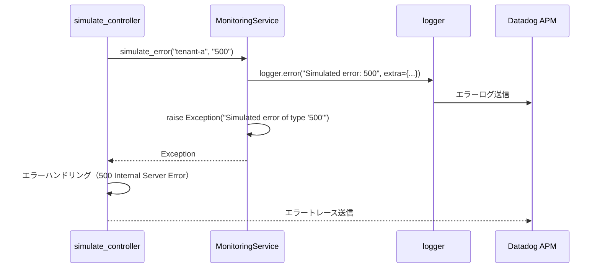
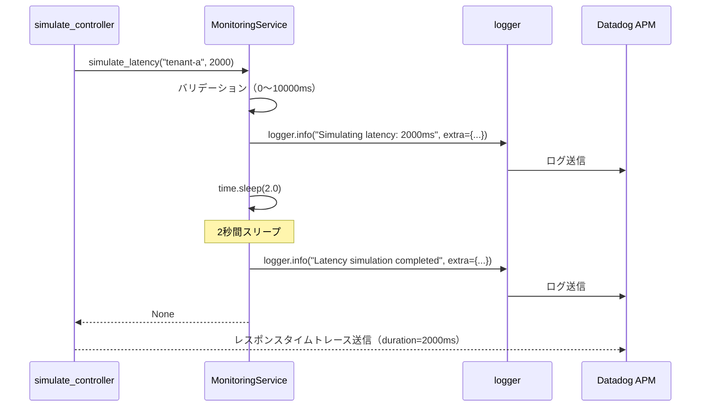

# monitoring_service.py - 監視データ生成 詳細設計

## 📋 ドキュメント情報

| 項目 | 内容 |
|------|------|
| ドキュメント名 | monitoring_service.py - 監視データ生成 詳細設計 |
| バージョン | 1.0 |
| 作成日 | 2025-12-28 |
| 作成者 | App-Architect |

---

## 🎯 モジュール概要

### 責務
Datadog監視データ生成（エラー、レイテンシシミュレーション）

### 主要機能
1. **エラー発生**: 意図的なエラー発生（FR-003-2）
2. **レイテンシ発生**: 意図的な遅延発生（FR-003-3）
3. **ログ出力**: 構造化ログ出力

### 依存関係
- **使用技術**: Python 3.10+
- **依存先**: `logger.py`（構造化ログ）
- **依存元**: `simulate_controller.py`

---

## 📊 クラス設計

### クラス名: MonitoringService

**責務**: 監視データ生成（エラー、レイテンシ）

---

## 🔧 メソッド詳細設計

### メソッド一覧

| メソッド | 説明 | 戻り値 |
|---------|------|--------|
| `__init__(logger)` | コンストラクタ | None |
| `simulate_error(tenant_id: str, error_type: str)` | エラー発生 | Never (常に例外を raise) |
| `simulate_latency(tenant_id: str, latency_ms: int)` | レイテンシ発生 | None |

---

## 📐 メソッド詳細

### 1. `__init__(logger)`

**目的**: コンストラクタ（Logger注入）

**関数シグネチャ**:
```python
import time
from typing import Never

class MonitoringService:
    """
    監視データ生成を担当するサービス

    責務:
        - エラー発生シミュレーション（FR-003-2）
        - レイテンシ発生シミュレーション（FR-003-3）
        - 構造化ログ出力

    影響範囲:
        - simulate_controller.py から呼び出される

    前提条件:
        - logger が正しく初期化されている
    """

    def __init__(self, logger):
        """
        コンストラクタ

        Args:
            logger: 構造化ログ出力インスタンス
        """
        self.logger = logger
```

---

### 2. `simulate_error(tenant_id: str, error_type: str)`

**目的**: エラー発生シミュレーション（L3 エラーログ監視用）

**関数シグネチャ**:
```python
def simulate_error(self, tenant_id: str, error_type: str) -> Never:
    """
    エラー発生シミュレーション

    Args:
        tenant_id (str): テナントID
        error_type (str): エラー種別（"500", "timeout", "db_error"）

    Raises:
        Exception: 常に例外を raise（意図的なエラー）

    Datadog 監視:
        - FR-003-2: テナント別エラーログ監視
        - アラート条件: テナント別エラーログが5分間で閾値を超えた場合

    例:
        >>> service = MonitoringService(logger)
        >>> service.simulate_error("tenant-a", "500")
        Exception: Simulated error of type '500' for tenant 'tenant-a'
    """
    # 構造化ログ出力
    self.logger.error(
        f"Simulated error: {error_type}",
        extra={
            "tenant_id": tenant_id,
            "error_type": error_type,
            "simulated": True,  # シミュレーションフラグ
        }
    )

    # エラー種別に応じた例外を raise
    if error_type == "500":
        raise Exception(f"Simulated error of type '500' for tenant '{tenant_id}'")
    elif error_type == "timeout":
        raise TimeoutError(f"Simulated timeout for tenant '{tenant_id}'")
    elif error_type == "db_error":
        raise ConnectionError(f"Simulated database error for tenant '{tenant_id}'")
    else:
        raise ValueError(f"Invalid error_type: {error_type}")
```

**処理フロー**:
```python
1. 構造化ログ出力（ERROR レベル）
2. error_type に応じた例外を raise
   - "500" → Exception
   - "timeout" → TimeoutError
   - "db_error" → ConnectionError
   - その他 → ValueError
```

**ログ出力例（JSON形式）**:
```json
{
  "timestamp": "2025-12-28T10:00:00Z",
  "level": "ERROR",
  "message": "Simulated error: 500",
  "tenant_id": "tenant-a",
  "error_type": "500",
  "simulated": true,
  "trace_id": "abc123",
  "span_id": "def456"
}
```

**Datadog 監視**:
- **Monitor**: テナント別エラーログ監視
- **クエリ**: `status:error tenant_id:tenant-a simulated:true`
- **アラート条件**: 5分間で閾値（例: 10件）を超えた場合

---

### 3. `simulate_latency(tenant_id: str, latency_ms: int)`

**目的**: レイテンシ発生シミュレーション（L3 レイテンシ監視用）

**関数シグネチャ**:
```python
def simulate_latency(self, tenant_id: str, latency_ms: int) -> None:
    """
    レイテンシ発生シミュレーション

    Args:
        tenant_id (str): テナントID
        latency_ms (int): 遅延時間（ミリ秒、0〜10000）

    Raises:
        ValueError: latency_ms が範囲外の場合

    Datadog 監視:
        - FR-003-3: テナント別レイテンシ監視
        - アラート条件: p99レイテンシが閾値を超えた場合

    例:
        >>> service = MonitoringService(logger)
        >>> service.simulate_latency("tenant-a", 2000)
        # 2秒間スリープ
    """
    # バリデーション
    if latency_ms < 0 or latency_ms > 10000:
        raise ValueError("latency_ms must be between 0 and 10000")

    # 構造化ログ出力
    self.logger.info(
        f"Simulating latency: {latency_ms}ms",
        extra={
            "tenant_id": tenant_id,
            "latency_ms": latency_ms,
            "simulated": True,
        }
    )

    # 意図的な遅延
    time.sleep(latency_ms / 1000.0)  # ミリ秒 → 秒に変換

    # 完了ログ
    self.logger.info(
        f"Latency simulation completed: {latency_ms}ms",
        extra={
            "tenant_id": tenant_id,
            "latency_ms": latency_ms,
            "simulated": True,
        }
    )
```

**処理フロー**:
```python
1. latency_ms のバリデーション（0〜10000）
2. 構造化ログ出力（開始）
3. time.sleep() で意図的な遅延
4. 構造化ログ出力（完了）
```

**ログ出力例（JSON形式）**:
```json
{
  "timestamp": "2025-12-28T10:00:00Z",
  "level": "INFO",
  "message": "Simulating latency: 2000ms",
  "tenant_id": "tenant-a",
  "latency_ms": 2000,
  "simulated": true
}
```

**Datadog 監視**:
- **Monitor**: テナント別レイテンシ監視
- **メトリクス**: `trace.http.request.duration` (p99)
- **アラート条件**: p99レイテンシが閾値（例: 1000ms）を超えた場合

---

## 🔄 シーケンス図

### エラー発生シミュレーションフロー



---

### レイテンシ発生シミュレーションフロー



---

## 📊 データ構造

### simulate_error() のログ出力

```json
{
  "timestamp": "2025-12-28T10:00:00Z",
  "level": "ERROR",
  "message": "Simulated error: 500",
  "tenant_id": "tenant-a",
  "error_type": "500",
  "simulated": true,
  "trace_id": "abc123",
  "span_id": "def456"
}
```

### simulate_latency() のログ出力（開始）

```json
{
  "timestamp": "2025-12-28T10:00:00Z",
  "level": "INFO",
  "message": "Simulating latency: 2000ms",
  "tenant_id": "tenant-a",
  "latency_ms": 2000,
  "simulated": true
}
```

---

## 🚨 例外処理

### 発生する例外と対処方法

| 例外 | 発生条件 | 対処方法 |
|------|---------|---------|
| `Exception` | simulate_error() で error_type="500" | Controller 層でキャッチし、500 Internal Server Error を返す |
| `TimeoutError` | simulate_error() で error_type="timeout" | Controller 層でキャッチし、500 Internal Server Error を返す |
| `ConnectionError` | simulate_error() で error_type="db_error" | Controller 層でキャッチし、500 Internal Server Error を返す |
| `ValueError` | simulate_error() で無効な error_type | Controller 層でキャッチし、400 Bad Request を返す |
| `ValueError` | simulate_latency() で latency_ms が範囲外 | Controller 層でキャッチし、400 Bad Request を返す |

**重要**: MonitoringService は意図的に例外を raise。Controller 層でエラーハンドリング。

---

## 🧪 テスト方針

### 単体テスト項目

#### 1. エラー発生テスト（error_type="500"）

```python
def test_simulate_error_500():
    """
    simulate_error() のテスト（error_type="500"）

    検証項目:
        - Exception が発生するか
        - エラーログが出力されるか
    """
    # Arrange
    mock_logger = Mock()
    service = MonitoringService(mock_logger)

    # Act & Assert
    with pytest.raises(Exception, match="Simulated error of type '500'"):
        service.simulate_error("tenant-a", "500")

    # ログ出力確認
    mock_logger.error.assert_called_once()
```

#### 2. レイテンシ発生テスト

```python
def test_simulate_latency():
    """
    simulate_latency() のテスト

    検証項目:
        - 指定したミリ秒だけスリープするか
        - ログが出力されるか
    """
    # Arrange
    mock_logger = Mock()
    service = MonitoringService(mock_logger)

    # Act
    start_time = time.time()
    service.simulate_latency("tenant-a", 1000)
    elapsed_time = time.time() - start_time

    # Assert
    assert elapsed_time >= 1.0  # 1秒以上経過
    assert elapsed_time < 1.1   # 1.1秒未満（誤差考慮）

    # ログ出力確認（開始と完了の2回）
    assert mock_logger.info.call_count == 2
```

#### 3. レイテンシバリデーションテスト（範囲外）

```python
def test_simulate_latency_invalid_range():
    """
    simulate_latency() のテスト（範囲外）

    検証項目:
        - latency_ms が範囲外の場合に ValueError が発生するか
    """
    # Arrange
    mock_logger = Mock()
    service = MonitoringService(mock_logger)

    # Act & Assert
    with pytest.raises(ValueError, match="latency_ms must be between 0 and 10000"):
        service.simulate_latency("tenant-a", -1)  # 負の値

    with pytest.raises(ValueError, match="latency_ms must be between 0 and 10000"):
        service.simulate_latency("tenant-a", 10001)  # 10000 超過
```

---

## 📝 実装時の注意事項

### 1. シミュレーションフラグ

**ログに simulated: true を含める**:
```python
self.logger.error(
    f"Simulated error: {error_type}",
    extra={
        "tenant_id": tenant_id,
        "error_type": error_type,
        "simulated": True,  # シミュレーションフラグ
    }
)
```

**理由**: 本番環境の実エラーとシミュレーションエラーを区別するため。

**Datadog Monitor で除外**:
```
status:error tenant_id:tenant-a -simulated:true
```

### 2. レイテンシ上限

**最大 10 秒**:
```python
if latency_ms < 0 or latency_ms > 10000:
    raise ValueError("latency_ms must be between 0 and 10000")
```

**理由**: 過度な遅延によるタイムアウトを防ぐため。

### 3. エラー種別

**サポートするエラー種別**:
- `"500"`: 一般的なサーバーエラー
- `"timeout"`: タイムアウトエラー
- `"db_error"`: データベース接続エラー

**将来拡張**:
- `"memory_error"`: メモリ不足エラー
- `"network_error"`: ネットワークエラー

---

## 🔗 関連ドキュメント

| ドキュメント | パス | 目的 |
|-------------|------|------|
| 基本設計 - API設計 | `../../01_基本設計/04_API設計.md` | シミュレーションエンドポイント |
| Controller 詳細設計 | `../controllers/simulate.md` | 使用例 |
| Middleware 詳細設計 | `../middlewares/logger.md` | 構造化ログ |

---

## 📝 改訂履歴

| 日付 | バージョン | 変更内容 | 作成者 |
|------|-----------|----------|--------|
| 2025-12-28 | 1.0 | 初版作成 | App-Architect |
