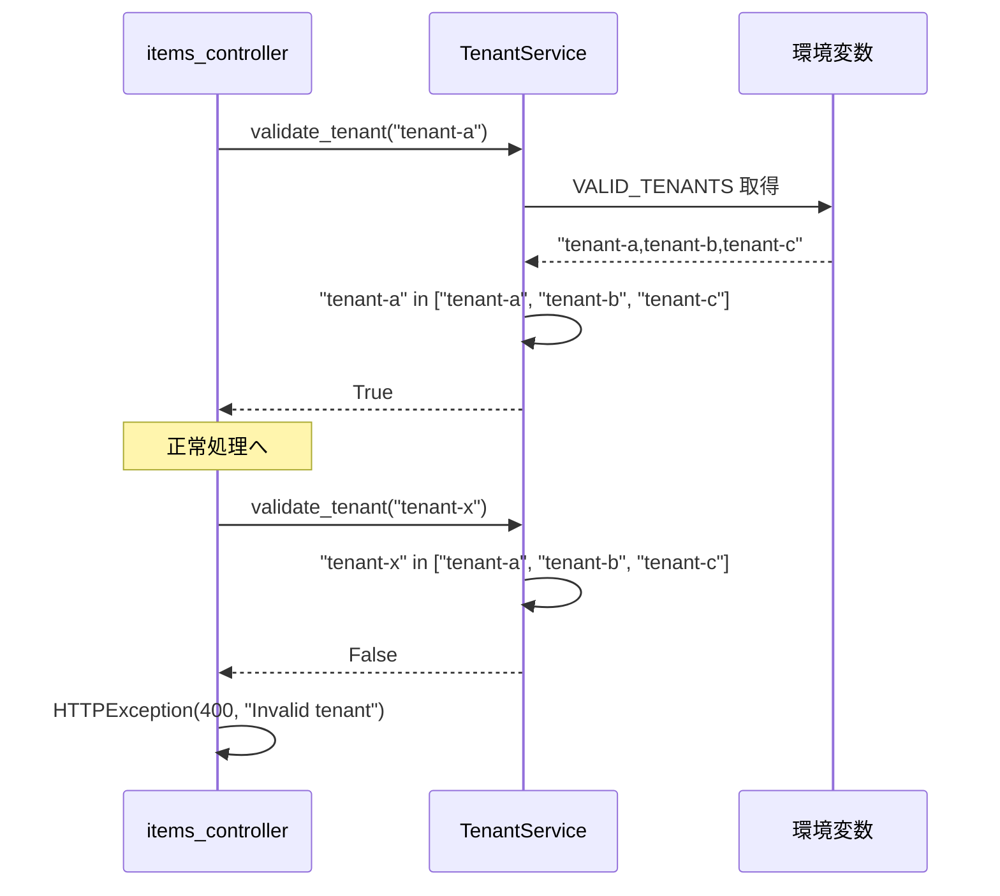

# tenant_service.py - テナント検証 詳細設計

## 📋 ドキュメント情報

| 項目 | 内容 |
|------|------|
| ドキュメント名 | tenant_service.py - テナント検証 詳細設計 |
| バージョン | 1.0 |
| 作成日 | 2025-12-28 |
| 作成者 | App-Architect |

---

## 🎯 モジュール概要

### 責務
テナントID の検証とテナント固有ロジック

### 主要機能
1. **テナント検証**: tenant_id の有効性チェック
2. **テナント設定取得**: テナント別の設定情報取得（将来拡張用）

### 依存関係
- **使用技術**: Python 3.10+
- **依存先**: `settings.py`（環境変数）
- **依存元**: `health_controller.py`, `items_controller.py`, `simulate_controller.py`

---

## 📊 クラス設計

### クラス名: TenantService

**責務**: テナント検証とテナント固有ロジック

---

## 🔧 メソッド詳細設計

### メソッド一覧

| メソッド | 説明 | 戻り値 |
|---------|------|--------|
| `__init__()` | コンストラクタ | None |
| `validate_tenant(tenant_id: str)` | テナントID検証 | bool |
| `get_valid_tenants()` | 有効なテナントIDリスト取得 | list[str] |
| `get_tenant_config(tenant_id: str)` | テナント別設定取得（将来拡張用） | dict |

---

## 📐 メソッド詳細

### 1. `__init__()`

**目的**: コンストラクタ（有効なテナントIDリストの初期化）

**関数シグネチャ**:
```python
import os

class TenantService:
    """
    テナント検証とテナント固有ロジックを担当するサービス

    責務:
        - テナントIDの有効性チェック
        - テナント別設定の取得

    影響範囲:
        - すべての Controller（テナントID検証で使用）

    前提条件:
        - 環境変数 VALID_TENANTS が設定されている（カンマ区切り）
    """

    def __init__(self):
        """
        コンストラクタ

        目的:
            - 有効なテナントIDリストを環境変数から取得
        """
        # 環境変数から有効なテナントIDリストを取得
        valid_tenants_str = os.getenv("VALID_TENANTS", "tenant-a,tenant-b,tenant-c")
        self.valid_tenants = [t.strip() for t in valid_tenants_str.split(",")]
```

**処理フロー**:
```python
1. 環境変数 VALID_TENANTS を取得
2. カンマ区切りで分割してリスト化
3. self.valid_tenants に格納
```

**環境変数設定例**:
```bash
# デフォルト（PoC環境）
VALID_TENANTS=tenant-a,tenant-b,tenant-c

# 本番環境（動的に追加可能）
VALID_TENANTS=tenant-a,tenant-b,tenant-c,tenant-d,tenant-e
```

---

### 2. `validate_tenant(tenant_id: str)`

**目的**: テナントIDの有効性チェック

**関数シグネチャ**:
```python
def validate_tenant(self, tenant_id: str) -> bool:
    """
    テナントIDが有効かチェックする

    Args:
        tenant_id (str): テナントID（例: "tenant-a"）

    Returns:
        bool: True（有効）、False（無効）

    例:
        >>> service = TenantService()
        >>> service.validate_tenant("tenant-a")
        True
        >>> service.validate_tenant("tenant-x")
        False
    """
    return tenant_id in self.valid_tenants
```

**処理フロー**:
```python
1. tenant_id が self.valid_tenants に含まれるかチェック
2. 含まれる場合は True、含まれない場合は False を返却
```

**使用例（Controller）**:
```python
from services.tenant_service import TenantService

tenant_service = TenantService()

@app.get("/{tenant_id}/items")
def get_items(tenant_id: str):
    if not tenant_service.validate_tenant(tenant_id):
        raise HTTPException(status_code=400, detail="Invalid tenant")

    # 正常処理
    ...
```

---

### 3. `get_valid_tenants()`

**目的**: 有効なテナントIDリストを取得

**関数シグネチャ**:
```python
def get_valid_tenants(self) -> list[str]:
    """
    有効なテナントIDリストを取得

    Returns:
        list[str]: 有効なテナントIDリスト（例: ["tenant-a", "tenant-b", "tenant-c"]）

    用途:
        - 管理画面でのテナント一覧表示
        - テスト時のテナント一覧取得
    """
    return self.valid_tenants
```

**処理フロー**:
```python
1. self.valid_tenants を返却
```

**使用例**:
```python
>>> service = TenantService()
>>> service.get_valid_tenants()
["tenant-a", "tenant-b", "tenant-c"]
```

---

### 4. `get_tenant_config(tenant_id: str)`

**目的**: テナント別設定取得（将来拡張用）

**関数シグネチャ**:
```python
def get_tenant_config(self, tenant_id: str) -> dict:
    """
    テナント別設定を取得（将来拡張用）

    Args:
        tenant_id (str): テナントID

    Returns:
        dict: テナント別設定

    将来拡張例:
        - テナント別のデータベース接続先
        - テナント別のAPI制限（レートリミット）
        - テナント別の機能フラグ

    現在の実装:
        - デフォルト設定を返す
    """
    # 現在はデフォルト設定のみ
    return {
        "tenant_id": tenant_id,
        "max_items": 1000,  # テナント別の最大データ数
        "rate_limit": 100,  # API制限（リクエスト/分）
    }
```

**処理フロー**:
```python
1. デフォルト設定を返却（将来拡張時にDBから取得等）
```

**将来拡張イメージ**:
```python
def get_tenant_config(self, tenant_id: str) -> dict:
    # 将来: DBからテナント別設定を取得
    config = db.query(TenantConfig).filter_by(tenant_id=tenant_id).first()
    if config:
        return config.to_dict()

    # デフォルト設定
    return {
        "tenant_id": tenant_id,
        "max_items": 1000,
        "rate_limit": 100,
    }
```

---

## 🔄 シーケンス図

### テナント検証フロー



---

## 📊 データ構造

### valid_tenants リスト例

```python
["tenant-a", "tenant-b", "tenant-c"]
```

### get_tenant_config() の戻り値例

```json
{
  "tenant_id": "tenant-a",
  "max_items": 1000,
  "rate_limit": 100
}
```

---

## 🚨 例外処理

### 発生する例外と対処方法

| 例外 | 発生条件 | 対処方法 |
|------|---------|---------|
| `ValueError` | 環境変数 VALID_TENANTS が空 | デフォルト値を使用 |
| なし | validate_tenant() は例外を発生させず、bool を返す | Controller 層で判定 |

**重要**: TenantService は例外を発生させず、bool または dict を返却。Controller 層でエラーハンドリング。

---

## 🧪 テスト方針

### 単体テスト項目

#### 1. テナント検証テスト（有効なテナント）

```python
def test_validate_tenant_valid():
    """
    validate_tenant() のテスト（有効なテナント）

    検証項目:
        - 有効なテナントIDで True が返るか
    """
    # Arrange
    service = TenantService()

    # Act
    result = service.validate_tenant("tenant-a")

    # Assert
    assert result is True
```

#### 2. テナント検証テスト（無効なテナント）

```python
def test_validate_tenant_invalid():
    """
    validate_tenant() のテスト（無効なテナント）

    検証項目:
        - 無効なテナントIDで False が返るか
    """
    # Arrange
    service = TenantService()

    # Act
    result = service.validate_tenant("tenant-x")

    # Assert
    assert result is False
```

#### 3. 有効なテナント一覧取得テスト

```python
def test_get_valid_tenants():
    """
    get_valid_tenants() のテスト

    検証項目:
        - 有効なテナントIDリストが返るか
    """
    # Arrange
    service = TenantService()

    # Act
    result = service.get_valid_tenants()

    # Assert
    assert result == ["tenant-a", "tenant-b", "tenant-c"]
```

#### 4. テナント別設定取得テスト

```python
def test_get_tenant_config():
    """
    get_tenant_config() のテスト

    検証項目:
        - テナント別設定が返るか
    """
    # Arrange
    service = TenantService()

    # Act
    result = service.get_tenant_config("tenant-a")

    # Assert
    assert result["tenant_id"] == "tenant-a"
    assert result["max_items"] == 1000
    assert result["rate_limit"] == 100
```

---

## 📝 実装時の注意事項

### 1. 環境変数設定

**ECS タスク定義での環境変数設定**:
```json
{
  "name": "VALID_TENANTS",
  "value": "tenant-a,tenant-b,tenant-c"
}
```

**ローカル開発環境（.env）**:
```
VALID_TENANTS=tenant-a,tenant-b,tenant-c
```

### 2. シングルトンパターン（オプション）

**現在の実装**: 各 Controller で `TenantService()` を new
**将来拡張**: シングルトンパターンで一度だけ初期化

```python
# シングルトンパターン例（将来拡張）
class TenantService:
    _instance = None

    def __new__(cls):
        if cls._instance is None:
            cls._instance = super().__new__(cls)
        return cls._instance
```

### 3. キャッシュ（将来拡張）

**現在の実装**: 環境変数から毎回取得
**将来拡張**: Redis 等でキャッシュ

```python
# Redis キャッシュ例（将来拡張）
import redis

class TenantService:
    def __init__(self):
        self.redis = redis.Redis()

    def validate_tenant(self, tenant_id: str) -> bool:
        # Redis からキャッシュ取得
        cached = self.redis.get(f"tenant:{tenant_id}")
        if cached:
            return True

        # DBから取得してキャッシュ
        ...
```

---

## 🔗 関連ドキュメント

| ドキュメント | パス | 目的 |
|-------------|------|------|
| 基本設計 - セキュリティ設計 | `../../01_基本設計/05_セキュリティ設計.md` | テナント検証方針 |
| 基本設計 - 実装方針 | `../../01_基本設計/06_実装方針.md` | ディレクトリ構成 |
| Controller 詳細設計 | `../controllers/` | 使用例 |

---

## 📝 改訂履歴

| 日付 | バージョン | 変更内容 | 作成者 |
|------|-----------|----------|--------|
| 2025-12-28 | 1.0 | 初版作成 | App-Architect |
