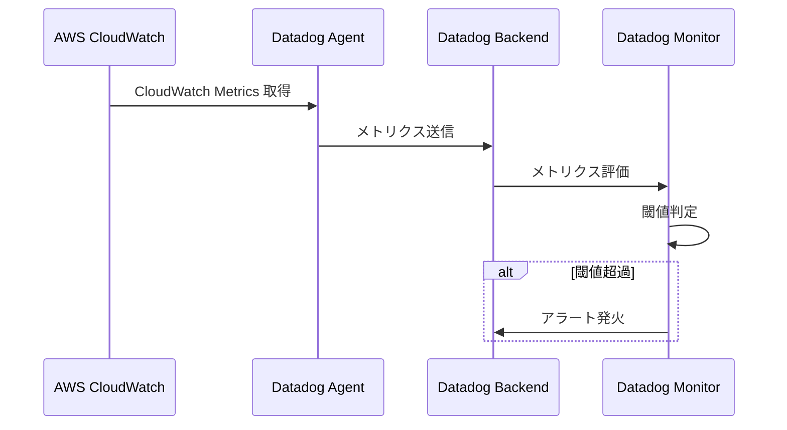
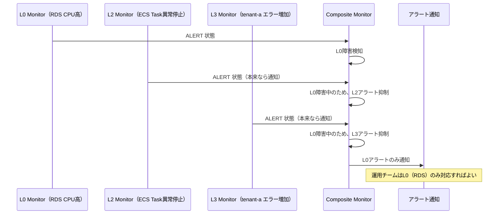

# システム構成図

## 1. 全体構成図

### Datadog監視基盤の全体像（Mermaid）

```mermaid
graph TB
    subgraph "AWS Environment (既存)"
        subgraph "VPC"
            ALB[Application Load Balancer<br/>監視対象]

            subgraph "ECS Cluster"
                ECSTask1[ECS Task: tenant-a<br/>監視対象]
                ECSTask2[ECS Task: tenant-b<br/>監視対象]
                ECSTask3[ECS Task: tenant-c<br/>監視対象]
            end

            RDS[(RDS PostgreSQL<br/>監視対象)]

            VPCFlow[VPC Flow Logs<br/>監視対象]
        end

        ECR[ECR<br/>脆弱性スキャン対象]
    end

    subgraph "Datadog Platform (SaaS)"
        subgraph "L0: インフラ監視"
            L0_RDS[RDS Monitor<br/>CPU/接続数/メモリ/ストレージ]
            L0_ECS[ECS Cluster Monitor<br/>Running Tasks]
            L0_VPC[VPC Flow Logs Monitor<br/>異常検知]
            L0_Agent[Datadog Agent Monitor<br/>死活監視]
        end

        subgraph "L2: サービス監視"
            L2_ALB[ALB Target Group Monitor<br/>ヘルス/レスポンスタイム]
            L2_Task[ECS Task Monitor<br/>タスク状態/リソース]
            L2_ECR[ECR Vulnerability Monitor<br/>脆弱性検出]
        end

        subgraph "L3: テナント監視"
            L3_HealthA[Health Monitor: tenant-a]
            L3_HealthB[Health Monitor: tenant-b]
            L3_HealthC[Health Monitor: tenant-c]
            L3_ErrorA[Error Log Monitor: tenant-a]
            L3_LatencyA[Latency Monitor: tenant-a]
        end

        subgraph "Composite Monitor"
            Composite_L0[L0 Composite<br/>インフラ障害判定]
            Composite_L2[L2 Composite<br/>サービス障害判定]
            Composite_L3[L3 Composite<br/>テナント障害判定]
        end
    end

    subgraph "Terraform (IaC)"
        Module_L0[module: level0-infra]
        Module_L2[module: level2-service]
        Module_L3[module: level3-tenant<br/>for_each: tenants]
        Module_Composite[module: composite]
    end

    %% 監視対象 → Datadog
    RDS -->|CloudWatch Metrics| L0_RDS
    ECSTask1 -->|CloudWatch Metrics| L0_ECS
    VPCFlow -->|CloudWatch Logs| L0_VPC
    ALB -->|CloudWatch Metrics| L2_ALB
    ECSTask1 -->|Container Metrics| L2_Task
    ECR -->|Scan Results| L2_ECR
    ECSTask1 -->|Application Logs| L3_HealthA
    ECSTask2 -->|Application Logs| L3_HealthB
    ECSTask3 -->|Application Logs| L3_HealthC

    %% Composite Monitor の親子関係
    L0_RDS --> Composite_L0
    L0_ECS --> Composite_L0
    L0_VPC --> Composite_L0
    L0_Agent --> Composite_L0

    L2_ALB --> Composite_L2
    L2_Task --> Composite_L2
    L2_ECR --> Composite_L2

    L3_HealthA --> Composite_L3
    L3_ErrorA --> Composite_L3
    L3_LatencyA --> Composite_L3

    Composite_L0 -.->|L0障害時、L2/L3抑制| Composite_L2
    Composite_L0 -.->|L0障害時、L2/L3抑制| Composite_L3
    Composite_L2 -.->|L2障害時、L3抑制| Composite_L3

    %% Terraform によるデプロイ
    Module_L0 -.->|terraform apply| L0_RDS
    Module_L2 -.->|terraform apply| L2_ALB
    Module_L3 -.->|terraform apply<br/>for_each| L3_HealthA
    Module_Composite -.->|terraform apply| Composite_L0
```

## 2. システム構成要素

### 監視対象リソース（AWS既存環境）

| コンポーネント | AWSサービス | 監視レイヤー | 監視項目 |
|--------------|-------------|------------|----------|
| データベース | RDS PostgreSQL | L0 | CPU使用率、接続数、メモリ、ストレージ |
| コンピュート基盤 | ECS Cluster | L0 | Running Tasks 数 |
| ネットワーク | VPC Flow Logs | L0 | 異常パターン検知 |
| 監視エージェント | Datadog Agent（ECS Task内） | L0 | Agent 死活監視 |
| ロードバランサー | ALB | L2 | Target Group Health、レスポンスタイム |
| アプリケーション | ECS Task | L2 | タスク状態、リソース使用率 |
| コンテナレジストリ | ECR | L2 | イメージ脆弱性スキャン |
| テナント別エンドポイント | /{tenant_id}/health | L3 | ヘルスチェック（200 OK） |
| テナント別ログ | CloudWatch Logs | L3 | エラーログ数、レイテンシ（p99） |

### Datadog監視コンポーネント（新規構築）

| コンポーネント | 種類 | 管理方法 | 役割 |
|--------------|------|---------|------|
| L0 Monitor | Datadog Monitor（Metric Monitor） | Terraform（level0-infra） | インフラ基盤の異常検知 |
| L2 Monitor | Datadog Monitor（Metric Monitor） | Terraform（level2-service） | サービスレイヤーの異常検知 |
| L3 Monitor | Datadog Monitor（Log Monitor、APM Monitor） | Terraform（level3-tenant、for_each） | テナント固有の異常検知 |
| Composite Monitor | Datadog Composite Monitor | Terraform（composite） | 親子関係によるアラート抑制 |
| Dashboard | Datadog Dashboard | 手動作成（PoCスコープ外） | 可視化 |

### Terraform モジュール構成（4モジュール）

| モジュール名 | 責務 | 入力パラメータ例 |
|-----------|------|----------------|
| level0-infra | L0インフラ監視の作成 | RDS識別子、ECSクラスター名 |
| level2-service | L2サービス監視の作成 | ALB ARN、ECSサービス名 |
| level3-tenant | L3テナント監視の作成（for_each） | tenant_id、閾値（errors_threshold、latency_threshold） |
| composite | Composite Monitor の作成 | L0/L2/L3のモニターID |

## 3. データフロー

### 3.1 メトリクス収集フロー

### 3.2 Composite Monitor のアラート抑制フロー

## 4. 冗長化・可用性設計

### Datadog Platform（SaaS）

| 項目 | 値 | 備考 |
|------|-----|------|
| SLA | 99.9% | Datadog公式SLA |
| データセンター | マルチリージョン | Datadog側で自動冗長化 |
| メトリクス保持期間 | 15ヶ月 | 標準プラン |

### AWS監視対象リソース

| リソース | 可用性設計 | 備考 |
|---------|-----------|------|
| RDS | Multi-AZ | 既存設定（PoC環境） |
| ECS Cluster | Multi-AZ | 既存設定（PoC環境） |
| ALB | Multi-AZ | 既存設定（PoC環境） |

**注**: PoCではAWS側の冗長化設計は既存環境を利用。新規構築なし。

## 5. スケーラビリティ設計

### テナント追加のスケーラビリティ

| 項目 | 現状 | 目標 |
|------|------|------|
| テナント数 | 3（tenant-a/b/c） | 10〜100テナント対応可能 |
| 追加所要時間 | - | terraform apply 完了まで5分以内 |
| 追加方法 | tfvarsに1行追加 → apply | 既存テナントに影響なし |

### Datadog Monitor のスケーラビリティ

| 項目 | 設計値 | 備考 |
|------|--------|------|
| Monitor 総数 | L0（7個） + L2（3個） + L3（3個/テナント） + Composite（3個） | 3テナントで計16個 |
| 100テナント時 | L0（7） + L2（3） + L3（300） + Composite（3） = 313個 | Datadogプラン上限内 |

## 6. コスト設計（概算）

### Datadog 利用料金（参考）

| 項目 | 単価（概算） | 想定値 | 月額 |
|------|-------------|--------|------|
| Infrastructure Monitoring | $15/host/月 | 10 hosts | $150 |
| Log Management | $0.10/GB/月 | 100 GB | $10 |
| APM（オプション） | $31/host/月 | 0 hosts | $0 |
| **合計** | - | - | **$160/月** |

**注**: PoCのため、無料トライアルまたは既存契約を利用想定。本番適用時に正式契約。

## 7. 制約・前提条件

### AWS環境の前提

| 項目 | 前提条件 |
|------|---------|
| RDS | 既存稼働中（Multi-AZ構成） |
| ECS Cluster | 既存稼働中（Fargate利用） |
| ALB | 既存稼働中 |
| VPC | 既存VPC利用 |
| CloudWatch Logs | 既存ログ出力設定済み |

### Datadog 環境の前提

| 項目 | 前提条件 |
|------|---------|
| Datadog アカウント | 作成済み |
| API Key | 取得済み、環境変数で管理 |
| APP Key | 取得済み、環境変数で管理 |

### Terraform 実行環境の前提

| 項目 | 前提条件 |
|------|---------|
| OS | Windows（開発環境） |
| Terraform | v1.5以上 |
| AWS CLI | 設定済み（AWS監視対象参照用） |
| Git | バージョン管理用 |

## 8. 関連ドキュメント

| ドキュメント | パス |
|-------------|------|
| ネットワーク設計 | [02_ネットワーク設計.md](02_ネットワーク設計.md) |
| セキュリティ設計 | [03_セキュリティ設計.md](03_セキュリティ設計.md) |
| 監視設計（重要） | [05_監視設計.md](05_監視設計.md) |
| IaC構成方針 | [10_IaC方針.md](10_IaC方針.md) |
| 要件定義書 | ../../02_要件定義/要件定義書.md |

---

**作成日**: 2025-12-28
**作成者**: Infra-Architect
**バージョン**: 1.0
**ステータス**: Draft
