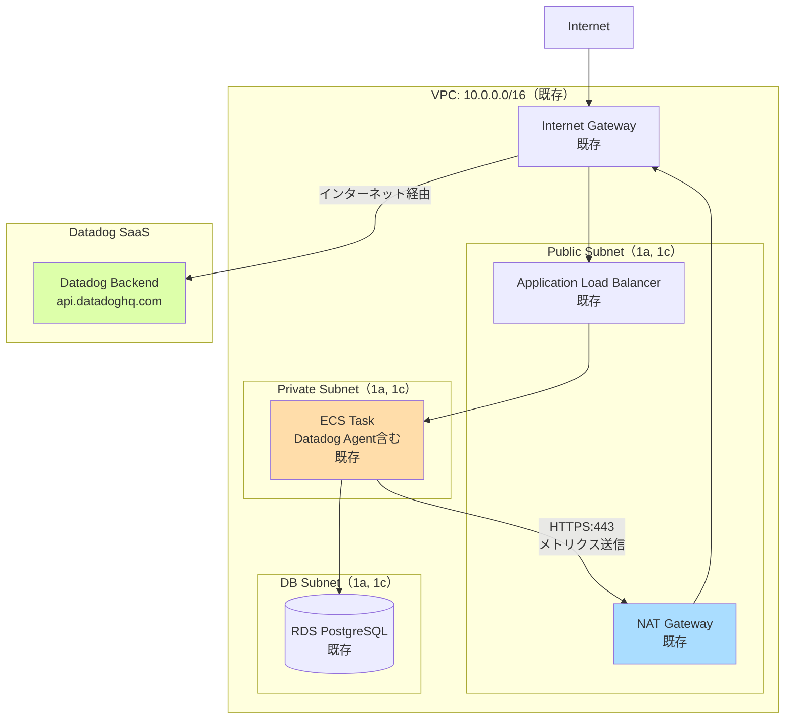

# ネットワーク設計

## 1. 概要

本PoCでは、**既存AWS環境を利用**し、Datadog監視設定のみを新規構築します。
そのため、ネットワーク設計は既存VPC構成の確認と、Datadog Agentの通信要件を中心に記載します。

## 2. VPC設計（既存環境）

### VPC構成

| 項目 | 値 | 備考 |
|------|-----|------|
| VPC CIDR | （既存環境に依存） | 例: 10.0.0.0/16 |
| リージョン | ap-northeast-1（東京） | 要件定義書より |
| DNS解決 | 有効 | 既存設定 |
| DNSホスト名 | 有効 | 既存設定 |

**注**: 既存VPC構成は変更しません。

## 3. サブネット設計（既存環境）

### サブネット構成（想定）

| サブネット名 | CIDR（例） | AZ | 用途 | 既存リソース |
|------------|----------|-----|------|------------|
| public-subnet-1a | 10.0.1.0/24 | ap-northeast-1a | ALB、NAT Gateway | ALB |
| public-subnet-1c | 10.0.2.0/24 | ap-northeast-1c | ALB、NAT Gateway | ALB |
| private-subnet-1a | 10.0.11.0/24 | ap-northeast-1a | ECS Fargate | ECS Task（Datadog Agent含む） |
| private-subnet-1c | 10.0.12.0/24 | ap-northeast-1c | ECS Fargate | ECS Task（Datadog Agent含む） |
| db-subnet-1a | 10.0.21.0/24 | ap-northeast-1a | RDS | RDS Primary |
| db-subnet-1c | 10.0.22.0/24 | ap-northeast-1c | RDS | RDS Standby（Multi-AZ） |

**注**: 上記は一般的なVPC構成例です。実際の値は既存環境の設定を確認してください。

## 4. ルーティング設計（既存環境）

### パブリックサブネットルートテーブル

| 宛先 | ターゲット | 用途 |
|------|-----------|------|
| 10.0.0.0/16 | local | VPC内通信 |
| 0.0.0.0/0 | Internet Gateway | インターネット通信 |

### プライベートサブネットルートテーブル

| 宛先 | ターゲット | 用途 |
|------|-----------|------|
| 10.0.0.0/16 | local | VPC内通信 |
| 0.0.0.0/0 | NAT Gateway | アウトバウンド通信（Datadog API通信に必須） |

**重要**: Datadog Agent は Datadog SaaS（インターネット）へメトリクスを送信するため、プライベートサブネットからのアウトバウンド通信（NAT Gateway経由）が必要です。

### データベースサブネットルートテーブル

| 宛先 | ターゲット | 用途 |
|------|-----------|------|
| 10.0.0.0/16 | local | VPC内通信のみ |

**セキュリティ**: DBサブネットはインターネットアクセス不可（Datadog Agentは不要）

## 5. Datadog Agent の通信要件

### 5.1 通信先

| 宛先 | プロトコル | ポート | 用途 |
|------|-----------|--------|------|
| `https://api.datadoghq.com` | HTTPS | 443 | メトリクス送信 |
| `https://app.datadoghq.com` | HTTPS | 443 | ログ送信（オプション） |
| `https://intake.logs.datadoghq.com` | HTTPS | 443 | ログ送信 |

**注**: Datadog SaaSはグローバルIPアドレス。NAT Gateway経由でアクセス。

### 5.2 ネットワーク要件

| 要件 | 値 | 備考 |
|------|-----|------|
| DNS解決 | 必要 | `*.datadoghq.com` を解決できること |
| プロキシ | 不要 | 直接HTTPS通信（NAT Gateway経由） |
| 送信帯域 | 低（目安: 1 Mbps/host） | メトリクスは軽量 |
| レイテンシ許容 | 1秒以内 | 通常、ap-northeast-1 → Datadog SaaS は100ms以下 |

## 6. Security Groups設計（既存環境 + 確認事項）

### ECS Task Security Group（Datadog Agent含む）

| 方向 | プロトコル | ポート | 送信元/送信先 | 用途 | 設定状況 |
|------|-----------|--------|--------------|------|---------|
| Inbound | HTTP | 8080 | ALB SG | ALBからのトラフィック | 既存設定 |
| Outbound | HTTPS | 443 | 0.0.0.0/0 | Datadog API通信 | **要確認** |
| Outbound | PostgreSQL | 5432 | RDS SG | RDSへの接続 | 既存設定 |

**重要**: Datadog Agent がメトリクスを送信するため、ECS Task SGの**Outbound HTTPS (443) が許可されているか確認**してください。
- ✅ 既に許可されている場合: 追加設定不要
- ❌ 許可されていない場合: SG修正が必要（既存環境への影響を考慮）

### RDS Security Group（参考）

| 方向 | プロトコル | ポート | 送信元/送信先 | 用途 |
|------|-----------|--------|--------------|------|
| Inbound | PostgreSQL | 5432 | ECS SG | ECSからのDB接続 |
| Outbound | - | - | - | 不要（DBは受信のみ） |

**注**: RDS SGは既存設定のまま変更不要。

## 7. VPC Endpoints（オプション）

### Datadog用のPrivateLink（コスト削減・セキュリティ強化）

Datadog は PrivateLink（VPC Endpoint）をサポートしており、NAT Gateway経由せずにDatadog SaaSへプライベート接続が可能です。

| 項目 | 値 | 備考 |
|------|-----|------|
| VPC Endpoint 種類 | Interface Endpoint | AWS PrivateLink |
| サービス名 | `com.amazonaws.vpce.ap-northeast-1.vpce-svc-xxxxxx`（Datadog提供） | Datadog公式ドキュメント参照 |
| サブネット | private-subnet-1a, private-subnet-1c | ECS Taskと同じサブネット |
| Security Group | 新規作成（Datadog Endpoint SG） | Inbound: なし、Outbound: 不要 |
| DNS有効化 | 有効 | `*.datadoghq.com` を自動解決 |

**メリット**:
- NAT Gateway料金削減（0.045 USD/GB → 0 USD/GB）
- セキュリティ強化（インターネット経由不要）

**デメリット**:
- VPC Endpoint 利用料（0.01 USD/時間 = 約7.2 USD/月）
- PoCスコープ外（追加設定が必要）

**PoC判断**: PoCでは**NAT Gateway経由**とし、本番移行時にPrivateLinkを検討。

## 8. ネットワーク設計図（Mermaid）



**凡例**:
- オレンジ: ECS Task（Datadog Agent含む）
- 青: NAT Gateway（Datadog通信に必須）
- 緑: Datadog SaaS

## 9. IP アドレス管理

### 静的IPアドレス（不要）

| リソース | IPアドレス | 備考 |
|---------|----------|------|
| Datadog Agent | 動的（DHCP） | ECS Fargate はENIを自動割り当て |
| NAT Gateway | Elastic IP（既存） | 既存設定のまま |

**注**: Datadog通信に静的IPアドレスは不要。

### DNS設定

| ドメイン | レコード | 値 | 管理 |
|---------|---------|-----|------|
| `*.datadoghq.com` | A | Datadog SaaSのIP（変動） | Datadog側で管理 |

**注**: VPC内のDNS解決が有効であれば、追加設定不要。

## 10. ネットワーク監視（VPC Flow Logs）

### VPC Flow Logs 設定（既存確認）

| 項目 | 値 | 備考 |
|------|-----|------|
| 対象 | VPC全体 | 既存設定を確認 |
| 送信先 | CloudWatch Logs | 既存設定を確認 |
| フィルタ | ALL（Accept + Reject） | Datadog が異常パターンを検知 |

**Datadog監視要件**:
- L0監視として、VPC Flow Logs の異常パターンを検知（FR-001-6）
- 既存VPC Flow Logsが有効であれば、追加設定不要

### VPC Flow Logs が無効の場合

以下コマンドで有効化（既存環境への影響を考慮し、PMと調整）:

```bash
# CloudWatch Logs グループ作成
aws logs create-log-group --log-group-name /aws/vpc/flowlogs

# VPC Flow Logs 有効化
aws ec2 create-flow-logs \
  --resource-type VPC \
  --resource-ids vpc-xxxxxx \
  --traffic-type ALL \
  --log-destination-type cloud-watch-logs \
  --log-group-name /aws/vpc/flowlogs
```

**注**: PoCスコープでは、VPC Flow Logsが既存有効であることを前提とします。

## 11. 帯域・レイテンシ設計

### 想定トラフィック

| 方向 | トラフィック量 | 備考 |
|------|--------------|------|
| ECS → Datadog | 1 Mbps/host（メトリクス送信） | 10 hosts = 10 Mbps |
| ECS → RDS | 既存トラフィック | Datadog監視による増加はほぼなし |
| ALB → ECS | 既存トラフィック | Datadog監視による増加はほぼなし |

### レイテンシ目標

| 経路 | 目標レイテンシ | 実測値（想定） |
|------|-------------|--------------|
| ECS → Datadog SaaS | 1秒以内 | 100ms以下（ap-northeast-1 → Datadog） |

**注**: Datadog SaaSはグローバルCDNを使用しており、低レイテンシを実現。

## 12. ネットワーク構成変更の影響範囲

### 既存環境への影響

| 変更項目 | 影響範囲 | 対応 |
|---------|---------|------|
| VPC構成 | **影響なし** | 変更不要 |
| Security Groups | **要確認**（ECS SG の Outbound HTTPS:443） | 既存許可されていれば影響なし |
| NAT Gateway | **影響なし** | 既存利用、帯域増加も軽微（10 Mbps程度） |
| VPC Flow Logs | **影響なし** | 既存有効であれば追加設定不要 |

**重要**: 唯一の確認事項は、**ECS Task SGのOutbound HTTPS (443)許可**です。

## 13. トラブルシューティング

### Datadog Agent がメトリクスを送信できない場合

| 症状 | 原因 | 対処 |
|------|------|------|
| Datadog UI にメトリクスが表示されない | Security Group で HTTPS:443 がブロック | ECS SG の Outbound 443 を許可 |
| | NAT Gateway が停止 | NAT Gateway のステータス確認 |
| | DNS解決失敗 | VPC の DNS解決設定を確認 |
| | API Key 誤り | 環境変数 `DD_API_KEY` を確認 |

### 確認コマンド（ECS Task内）

```bash
# Datadog Agent のステータス確認
datadog-agent status

# Datadog API への疎通確認
curl -v https://api.datadoghq.com/api/v1/validate -H "DD-API-KEY: ${DD_API_KEY}"
```

## 14. 関連ドキュメント

| ドキュメント | パス |
|-------------|------|
| システム構成図 | [01_システム構成図.md](01_システム構成図.md) |
| セキュリティ設計 | [03_セキュリティ設計.md](03_セキュリティ設計.md) |
| 監視設計 | [05_監視設計.md](05_監視設計.md) |
| 要件定義書 | ../../02_要件定義/要件定義書.md |

---

**作成日**: 2025-12-28
**作成者**: Infra-Architect
**バージョン**: 1.0
**ステータス**: Draft
