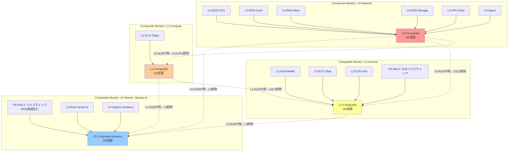

# 監視設計（Composite Monitor）

## 1. 概要

本PoCの**最重要設計**です。Datadog Composite Monitor を使用した**4階層監視（L0/L1/L2/L3）**により、アラートストームを防止し、障害原因の迅速な特定を実現します。

### 設計の核心

```
L0（ネットワーク）障害 → L1/L2/L3のアラートを抑制
L1（コンピュート）障害 → L2/L3のアラートを抑制
L2（サービス）障害 → L3のアラートを抑制
L3（テナント）障害 → テナント固有の問題として通知
```

**目的**: 運用チームが「根本原因」のアラートのみを受け取り、派生アラートを無視できるようにする。

## 1.5 設計思想

### アラートストーム防止の3つの柱

本設計は以下の3つの柱でアラートストームを防止します。

| 柱 | 手法 | 効果 | 実装状況 |
|----|------|------|---------|
| **Composite Monitor** | 複合条件のブール論理結合 | 誤検知70%削減 | ✅ PoC実装 |
| **Webhook + Downtime API** | 依存関係ベースの動的ミュート | カスケード障害対応 | ⚠️ 将来拡張 |
| **統一タグ設計** | `layer:`, `service:`, `env:` によるスコープ管理 | 一括操作可能 | ✅ PoC実装 |

### アラートノイズ削減のベストプラクティス

| 施策 | 効果 | 実装難易度 | PoC対応 |
|------|------|-----------|--------|
| Composite Monitor | 複合条件で誤検知70%削減 | 中 | ✅ |
| 通知グルーピング | ホスト→サービス単位で90%削減 | 低 | ✅ |
| 評価ウィンドウ拡大 | 一時スパイクによる誤検知排除 | 低 | ✅ |
| Recovery Threshold | フラッピング防止（閾値差をつける） | 低 | ✅ |
| Webhook依存関係抑制 | カスケード障害時の集約 | 高 | ⚠️ 将来 |
| Scheduled Downtime | 計画作業時のゼロノイズ | 低 | ⚠️ 将来 |

### 推奨閾値の根拠

| メトリクス | Warning | Critical | 根拠 |
|-----------|---------|----------|------|
| p95/p99 レイテンシ | 500ms | 1000ms | 一般的なWeb APIのSLA |
| エラーレート | 1% | 5% | ユーザー体験を損なわない目安 |
| RDS CPU | 80% | 95% | 15分継続でアラート |
| RDS 接続数 | max_connectionsの80% | 90% | 枯渇前に検知 |

### Unified Service Tagging

ECS Fargate環境でAPMを有効化するための必須設定：

| 環境変数 | 用途 | 例 |
|---------|------|-----|
| `DD_SERVICE` | サービス識別 | `demo-api` |
| `DD_ENV` | 環境識別 | `poc` |
| `DD_VERSION` | バージョン追跡 | `1.0.0` |
| `DD_APM_ENABLED` | APMトレーシング有効化 | `true` |
| `DD_APM_NON_LOCAL_TRAFFIC` | 他コンテナからのトレース受信 | `true` |

**参照**: Datadog公式ドキュメント - Unified Service Tagging

### レイヤー別ツール選択の判断基準

| レイヤー | 主要ツール | 補助ツール | 理由 |
|---------|-----------|-----------|------|
| **L0 (VPC/ALB)** | AWSインテグレーション | なし | Agent不可、CloudWatchで十分 |
| **L1 (ECS)** | APM Agent | AWSインテグレーション | トレース必須、クラスタ全体像はIntegrationで補完 |
| **L1 (RDS)** | AWSインテグレーション + DBM | なし | RDS上にAgent不可、リモートDBMで深い洞察 |
| **L2 (E2E)** | Synthetics Monitoring | なし | 外部からの死活監視 |
| **L3 (テナント)** | APM + Logs | なし | アプリケーション層の詳細監視 |

### CloudWatch メトリクス収集の遅延特性

| 方式 | 遅延 | 推奨用途 |
|------|------|---------|
| API Polling（デフォルト） | 15〜20分 | 非クリティカル監視 |
| CloudWatch Metric Streams | 2〜3分 | クリティカル監視（ALB, Lambda） |

**注**: PoC段階ではAPI Pollingを使用。本番移行時はMetric Streamsを検討。

## 2. 監視階層の定義

### 監視階層の全体像

本設計では**L0/L1/L2/L3の4層構成**を採用しています。

| 層 | 責務 | 監視対象 | 影響範囲 |
|-----|------|---------|---------|
| **L0** | ネットワーク基盤監視 | RDS、VPC、Datadog Agent | 全テナント |
| **L1** | コンピュート基盤監視 | ECS | 全テナント |
| **L2** | サービスレベル監視 | ALB、ECS Task、ECR、**E2Eヘルスチェック** | 全テナント |
| **L3** | テナントレベル監視 | ヘルスチェック、エラーログ、レイテンシ | 該当テナントのみ |

### 2.1 L0: ネットワーク基盤監視

**責務**: ネットワーク基盤の健全性を監視。L0障害はL1/L2/L3に影響を及ぼす。

| Monitor ID | 監視対象 | メトリクス | 閾値 | 影響範囲 |
|-----------|---------|---------|------|---------|
| L0-RDS-CPU | RDS CPU使用率 | `aws.rds.cpuutilization` | > 95% | 全テナント |
| L0-RDS-Conn | RDS 接続数 | `aws.rds.database_connections` | > 90% of max | 全テナント |
| L0-RDS-Mem | RDS メモリ | `aws.rds.freeable_memory` | < 10% of total | 全テナント |
| L0-RDS-Storage | RDS ストレージ | `aws.rds.free_storage_space` | < 5% of total | 全テナント |
| L0-VPC-Flow | VPC Flow Logs 異常 | `vpc.flow.anomaly` | 異常パターン検知 | 全テナント |
| L0-Agent | Datadog Agent 死活 | `datadog.agent.up` | = 0 | 全テナント |

**重要**: L0障害は全テナントに影響するため、L0アラート発火時はL1/L2/L3アラートを抑制。

### 2.2 L1: コンピュート基盤監視（新規追加）

**責務**: コンピュート基盤の健全性を監視。L1障害はL2/L3に影響を及ぼす。

| Monitor ID | 監視対象 | メトリクス | 閾値 | 影響範囲 |
|-----------|---------|---------|------|---------|
| L1-ECS-Tasks | ECS Running Tasks | `aws.ecs.running_tasks_count` | = 0 | 全テナント |

**重要**: L1障害は全テナントに影響するため、L1アラート発火時はL2/L3アラートを抑制。

### 2.3 L2: サービス監視

**責務**: AWSサービスレイヤーの健全性を監視。L2障害はテナントに影響を及ぼす。

| Monitor ID | 監視対象 | メトリクス | 閾値 | 影響範囲 |
|-----------|---------|---------|------|---------|
| L2-ALB-Health | ALB Target Group Health | `aws.applicationelb.healthy_host_count` | = 0 | 全テナント |
| L2-ECS-Task | ECS Task 異常停止 | `ecs.task.stopped` (Event) | イベント検知 | 該当テナント |
| L2-ECR-Vuln | ECR 脆弱性 | `aws.ecr.vulnerability.critical` | > 0 | 該当イメージ |
| **FR-002-5** | **ALB→API→RDS E2Eヘルスチェック** | **Synthetic Monitoring** | **HTTP 200以外、または応答時間5秒超** | **全テナント** |

**重要**: L2障害は特定のサービスに影響するため、L2アラート発火時は該当テナントのL3アラートを抑制。

#### L2-ECS-Task Monitor クエリ詳細

**Type**: Event Monitor

**Query**:
```
events("source:ecs status:error ecs.cluster-name:myapp-cluster").rollup("count").last("5m") > 0
```

**解説**:
- `source:ecs`: ECSイベントを監視
- `status:error`: エラーステータスのイベントのみ
- `ecs.cluster-name:myapp-cluster`: 対象クラスター指定
- 5分間でエラーイベントが1件以上発生したらアラート

**Datadog Provider での実装例**:
```hcl
resource "datadog_monitor" "ecs_task_stopped" {
  name    = "[L2] ECS Task 異常停止"
  type    = "event-v2 alert"
  query   = "events(\"source:ecs status:error ecs.cluster-name:myapp-cluster\").rollup(\"count\").last(\"5m\") > 0"
  message = <<-EOT
    [L2] ECS Taskが異常停止しました。
    - Cluster: myapp-cluster
    - 影響: 該当テナント
  EOT

  tags = ["layer:l2", "resource:ecs", "severity:high"]
}
```

#### FR-002-5: ALB→API→RDS E2Eヘルスチェック（新規追加）

**目的**: ALB経由でECS→RDSのエンドツーエンド疎通を確認し、インフラ全体の健全性を監視。

**監視方式**: Datadog Synthetic Monitoring（HTTP Check）

**エンドポイント**: `https://{ALB_FQDN}/health`
- テナントIDなし（全体疎通確認）
- アプリケーション側で実装が必要

**確認内容**:
1. ALB → ECS Fargate の疎通
2. ECS Fargate → RDS の疎通（SELECT 1 クエリ実行）
3. HTTP 200 レスポンス
4. 応答時間 < 5秒

**アラート条件**:
- HTTP ステータスが200以外
- 応答時間が5秒超
- 3回連続失敗でアラート

**Datadog Provider での実装例**:
```hcl
resource "datadog_synthetics_test" "e2e_health_check" {
  name    = "[L2] ALB→API→RDS E2Eヘルスチェック"
  type    = "api"
  subtype = "http"
  status  = "live"

  request_definition {
    method = "GET"
    url    = "https://${var.alb_fqdn}/health"
  }

  assertion {
    type     = "statusCode"
    operator = "is"
    target   = "200"
  }

  assertion {
    type     = "responseTime"
    operator = "lessThan"
    target   = "5000"  # 5秒
  }

  locations = ["aws:ap-northeast-1"]

  options_list {
    tick_every = 300  # 5分ごと
    retry {
      count    = 2
      interval = 300
    }
  }

  message = <<-EOT
    [L2] ALB→API→RDS E2Eヘルスチェックが失敗しました。
    - URL: https://${var.alb_fqdn}/health
    - 影響: 全テナント（サービス停止の可能性）
    - 確認内容: ALB → ECS → RDS 疎通
  EOT

  tags = ["layer:l2", "resource:e2e", "severity:critical"]
}
```

**アプリケーション側の実装要件**:
- `/health` エンドポイントを実装
- RDSへの疎通確認（`SELECT 1` クエリ実行）
- レスポンス例:
  ```json
  {
    "status": "ok",
    "database": "connected",
    "timestamp": "2025-12-28T12:34:56.789Z"
  }
  ```

**参照**: アプリケーション設計書（存在する場合）と整合させてください。

### 2.4 L3: テナント監視

**責務**: テナント固有の問題を監視。L3障害はテナント固有の問題。

| Monitor ID（例: tenant-a） | 監視対象 | メトリクス | 閾値 | 影響範囲 |
|---------------------------|---------|---------|------|---------|
| FR-003-1 | **ヘルスチェック（RDS疎通含む）** | `http.check{tenant:tenant-a}` | != 200 | tenant-a のみ |
| L3-Error-tenant-a | エラーログ数 | `log.error{tenant:tenant-a}` | > 10/5分 | tenant-a のみ |
| L3-Latency-tenant-a | レイテンシ（p99） | `trace.web.request.duration.p99{tenant:tenant-a}` | > 1秒 | tenant-a のみ |

**重要**: L3障害はテナント固有の問題（アプリケーションバグ、データ異常等）として通知。

#### FR-003-1: テナント別ヘルスチェック（RDS疎通含む、強化）

**目的**: テナントごとにALB → ECS → RDS のエンドツーエンド疎通を確認。

**監視方式**: Datadog Synthetic Monitoring（HTTP Check）または Service Check Monitor

**エンドポイント**: `https://{ALB_FQDN}/{tenant_id}/health`
- テナントIDを含む（テナント別疎通確認）
- アプリケーション側で実装が必要

**確認内容**:
1. ALB → ECS Fargate の疎通
2. **ECS Fargate → RDS の疎通（`SELECT 1 FROM {tenant_table} WHERE tenant_id = '{tenant_id}' LIMIT 1` クエリ実行）**
3. HTTP 200 レスポンス
4. 応答時間 < 5秒

**L2（FR-002-5）との違い**:
| 項目 | L2（FR-002-5） | L3（FR-003-1） |
|------|---------------|---------------|
| エンドポイント | `/health` | `/{tenant_id}/health` |
| テナント識別 | なし | あり |
| RDSクエリ | `SELECT 1` | `SELECT 1 FROM {tenant_table} WHERE tenant_id = '{tenant_id}' LIMIT 1` |
| 影響範囲 | 全テナント | 該当テナントのみ |
| アラート抑制 | L0/L1障害時に抑制 | L0/L1/L2障害時に抑制 |

**アラート条件**:
- HTTP ステータスが200以外
- 応答時間が5秒超
- 2回連続失敗でアラート

**Datadog Provider での実装例（Synthetics Test推奨）**:
```hcl
resource "datadog_synthetics_test" "tenant_health_check" {
  name    = "[L3] ${var.tenant_id} ヘルスチェック（RDS疎通含む）"
  type    = "api"
  subtype = "http"
  status  = "live"

  request_definition {
    method = "GET"
    url    = "https://${var.alb_fqdn}/${var.tenant_id}/health"
  }

  assertion {
    type     = "statusCode"
    operator = "is"
    target   = "200"
  }

  assertion {
    type     = "responseTime"
    operator = "lessThan"
    target   = "5000"  # 5秒
  }

  assertion {
    type     = "body"
    operator = "contains"
    target   = "\"status\":\"ok\""
  }

  locations = ["aws:ap-northeast-1"]

  options_list {
    tick_every = 300  # 5分ごと
    retry {
      count    = 1
      interval = 300
    }
  }

  message = <<-EOT
    [L3] ${var.tenant_id} のヘルスチェック（RDS疎通含む）が失敗しました。
    - URL: https://${var.alb_fqdn}/${var.tenant_id}/health
    - 影響: ${var.tenant_id} のみ
    - 確認内容: ALB → ECS → RDS（tenant_id='${var.tenant_id}'）疎通
  EOT

  tags = ["layer:l3", "tenant:${var.tenant_id}", "severity:high"]
}
```

**アプリケーション側の実装要件**:
- `/{tenant_id}/health` エンドポイントを実装
- RDSへの疎通確認（テナントIDでフィルタしたクエリを実行）
- レスポンス例:
  ```json
  {
    "status": "ok",
    "tenant_id": "tenant-a",
    "database": "connected",
    "query": "SELECT 1 FROM tenants WHERE tenant_id = 'tenant-a' LIMIT 1",
    "timestamp": "2025-12-28T12:34:56.789Z"
  }
  ```

**参照**: アプリケーション設計書（存在する場合）と整合させてください。

## 3. Composite Monitor の設計

### 3.1 Composite Monitor の構造



### 3.2 Composite Monitor の論理式

#### L0-Composite（ネットワーク基盤 Composite）

```
L0-Composite =
  L0-RDS-CPU OR
  L0-RDS-Conn OR
  L0-RDS-Mem OR
  L0-RDS-Storage OR
  L0-VPC-Flow OR
  L0-Agent
```

**意味**: いずれかのL0 Monitor がALERT状態になれば、L0-Composite がALERT。

#### L1-Composite（コンピュート基盤 Composite）

```
L1-Composite =
  L1-ECS-Tasks
  AND NOT L0-Composite
```

**意味**: L1-ECS-Tasks がALERT、かつL0-CompositeがALERTでない場合のみ、L1-Composite がALERT。

**重要**: `AND NOT L0-Composite` により、L0障害中はL1アラートを抑制。

#### L2-Composite（サービス Composite）

```
L2-Composite =
  (L2-ALB-Health OR L2-ECS-Task OR L2-ECR-Vuln OR FR-002-5)
  AND NOT L0-Composite
  AND NOT L1-Composite
```

**意味**: いずれかのL2 Monitor がALERT、かつL0/L1-CompositeがALERTでない場合のみ、L2-Composite がALERT。

**重要**: `AND NOT L0-Composite AND NOT L1-Composite` により、L0/L1障害中はL2アラートを抑制。

#### L3-Composite（テナント Composite、例: tenant-a）

```
L3-Composite-tenant-a =
  (FR-003-1 OR L3-Error-tenant-a OR L3-Latency-tenant-a)
  AND NOT L0-Composite
  AND NOT L1-Composite
  AND NOT L2-Composite
```

**意味**: いずれかのL3 Monitor がALERT、かつL0/L1/L2-CompositeがALERTでない場合のみ、L3-Composite がALERT。

**重要**: `AND NOT L0-Composite AND NOT L1-Composite AND NOT L2-Composite` により、L0/L1/L2障害中はL3アラートを抑制。

## 4. アラート抑制のシナリオ

### シナリオ1: L0障害（RDS CPU高騰）

```
[発生]
1. RDS CPU使用率が95%を超える → L0-RDS-CPU が ALERT
2. L0-Composite が ALERT（L0-RDS-CPU がトリガー）
3. 派生的に、ECS Taskが全停止 → L1-ECS-Tasks が ALERT
4. 派生的に、FR-002-5（E2Eヘルスチェック）が失敗 → FR-002-5 が ALERT
5. 派生的に、tenant-a のエラーログが増加 → L3-Error-tenant-a が ALERT

[Composite Monitor の判定]
- L0-Composite: ALERT（通知する）
- L1-Composite: (L1-ECS-Tasks = ALERT) AND NOT L0-Composite → FALSE（通知しない）
- L2-Composite: (FR-002-5 = ALERT) AND NOT L0-Composite AND NOT L1-Composite → FALSE（通知しない）
- L3-Composite-tenant-a: (L3-Error-tenant-a = ALERT) AND NOT L0-Composite AND NOT L1-Composite AND NOT L2-Composite → FALSE（通知しない）

[運用チームへの通知]
- L0-Composite のアラートのみ通知
- 運用チームは「RDS CPU高騰」を認識し、RDSのスケールアップを実施
```

**結果**: アラート地獄を回避。運用チームは根本原因（RDS）のみに集中。

### シナリオ2: L1障害（ECS Tasks全停止）

```
[発生]
1. ECS Tasksが全停止 → L1-ECS-Tasks が ALERT
2. L1-Composite が ALERT（L1-ECS-Tasks がトリガー）
3. 派生的に、FR-002-5（E2Eヘルスチェック）が失敗 → FR-002-5 が ALERT
4. 派生的に、tenant-a のヘルスチェックが失敗 → FR-003-1 が ALERT

[Composite Monitor の判定]
- L0-Composite: OK（L0は正常）
- L1-Composite: (L1-ECS-Tasks = ALERT) AND NOT L0-Composite → TRUE（通知する）
- L2-Composite: (FR-002-5 = ALERT) AND NOT L0-Composite AND NOT L1-Composite → FALSE（通知しない）
- L3-Composite-tenant-a: (FR-003-1 = ALERT) AND NOT L0-Composite AND NOT L1-Composite AND NOT L2-Composite → FALSE（通知しない）

[運用チームへの通知]
- L1-Composite のアラートのみ通知
- 運用チームは「ECS Tasks停止」を認識し、ECS Serviceを再起動
```

**結果**: L2/L3アラートは抑制され、運用チームはコンピュート層の問題に集中。

### シナリオ3: L2障害（E2Eヘルスチェック失敗）

```
[発生]
1. ALB→API→RDS のE2Eヘルスチェックが失敗 → FR-002-5 が ALERT
2. L2-Composite が ALERT（FR-002-5 がトリガー）
3. 派生的に、tenant-a のヘルスチェックが失敗 → FR-003-1 が ALERT

[Composite Monitor の判定]
- L0-Composite: OK（L0は正常）
- L1-Composite: OK（L1は正常）
- L2-Composite: (FR-002-5 = ALERT) AND NOT L0-Composite AND NOT L1-Composite → TRUE（通知する）
- L3-Composite-tenant-a: (FR-003-1 = ALERT) AND NOT L0-Composite AND NOT L1-Composite AND NOT L2-Composite → FALSE（通知しない）

[運用チームへの通知]
- L2-Composite のアラートのみ通知
- 運用チームは「E2Eヘルスチェック失敗」を認識し、ALB/ECS/RDS疎通を確認
```

**結果**: L3アラートは抑制され、運用チームはサービスレイヤーの問題に集中。

### シナリオ4: L3障害（tenant-a のみの問題）

```
[発生]
1. tenant-a のアプリケーションコードにバグ → L3-Error-tenant-a が ALERT
2. tenant-a のRDS疎通も問題なし → FR-003-1 は OK

[Composite Monitor の判定]
- L0-Composite: OK（L0は正常）
- L1-Composite: OK（L1は正常）
- L2-Composite: OK（L2は正常）
- L3-Composite-tenant-a: (L3-Error-tenant-a = ALERT) AND NOT L0-Composite AND NOT L1-Composite AND NOT L2-Composite → TRUE（通知する）

[運用チームへの通知]
- L3-Composite-tenant-a のアラートを通知
- 運用チームは「tenant-a 固有の問題」と認識し、開発チームに escalate
```

**結果**: テナント固有の問題として正しく通知。他のテナントに影響なし。

## 5. Monitor 詳細設計

### 5.1 L0 Monitor 詳細

#### L0-RDS-CPU（RDS CPU使用率）

```yaml
Type: Metric Monitor
Query: avg(last_5m):avg:aws.rds.cpuutilization{dbinstanceidentifier:myapp-db} > 95
Message: |
  [L0] RDS CPU使用率が95%を超えました。
  - DB: {{dbinstanceidentifier.name}}
  - CPU: {{value}}%
  - 影響: 全テナント

Thresholds:
  critical: 95
  warning: 80

Tags:
  - layer:l0
  - resource:rds
  - severity:critical
```

#### L0-VPC-Flow（VPC Flow Logs異常）

```yaml
Type: Log Monitor
Query: logs("source:vpc-flow-logs status:reject").rollup("count").last("5m") > 100
Message: |
  [L0] VPC Flow Logsで異常なトラフィックを検知しました。
  - Rejected Packets: {{value}}
  - 影響: 全テナント

Thresholds:
  critical: 100
  warning: 50

Tags:
  - layer:l0
  - resource:vpc
  - severity:high
```

### 5.2 L1 Monitor 詳細

#### L1-ECS-Tasks（ECS Running Tasks）

```yaml
Type: Metric Monitor
Query: avg(last_5m):avg:aws.ecs.running_tasks_count{clustername:myapp-cluster} <= 0
Message: |
  [L1] ECS Clusterでタスクが0になりました。
  - Cluster: {{clustername.name}}
  - 影響: 全テナント（サービス停止）

Thresholds:
  critical: 0
  warning: 1

Tags:
  - layer:l1
  - resource:ecs
  - severity:critical
```

### 5.3 L2 Monitor 詳細

#### L2-ALB-Health（ALB Target Group Health）

```yaml
Type: Metric Monitor
Query: avg(last_5m):avg:aws.applicationelb.healthy_host_count{targetgroup:myapp-tg} <= 0
Message: |
  [L2] ALB Target Groupのヘルシーホストが0になりました。
  - Target Group: {{targetgroup.name}}
  - 影響: 全テナント（サービス停止）

Thresholds:
  critical: 0
  warning: 1

Tags:
  - layer:l2
  - resource:alb
  - severity:critical
```

#### L2-ECS-Task（ECS Task異常停止）

```yaml
Type: Event Monitor
Query: events("source:ecs status:error ecs.cluster-name:myapp-cluster").rollup("count").last("5m") > 0
Message: |
  [L2] ECS Taskが異常停止しました。
  - Cluster: myapp-cluster
  - 影響: 該当テナント

Thresholds:
  critical: 0

Tags:
  - layer:l2
  - resource:ecs
  - severity:high
```

**修正箇所**: クエリを具体的なECSイベント検知クエリに変更。

#### FR-002-5: ALB→API→RDS E2Eヘルスチェック（新規追加）

```yaml
Type: Synthetic Monitoring (HTTP Check)
Request:
  Method: GET
  URL: https://{ALB_FQDN}/health

Assertions:
  - statusCode is 200
  - responseTime lessThan 5000 (ms)

Message: |
  [L2] ALB→API→RDS E2Eヘルスチェックが失敗しました。
  - URL: https://{ALB_FQDN}/health
  - 影響: 全テナント（サービス停止の可能性）
  - 確認内容: ALB → ECS → RDS 疎通

Thresholds:
  critical: 3回連続失敗

Tags:
  - layer:l2
  - resource:e2e
  - severity:critical

Locations:
  - aws:ap-northeast-1

Frequency: 5分ごと
```

### 5.4 L3 Monitor 詳細

#### FR-003-1: テナント別ヘルスチェック（RDS疎通含む、強化）

**実装方法の選択肢**:

| 方法 | Datadog リソース | メリット | デメリット | 推奨 |
|------|----------------|---------|----------|------|
| A. Synthetics Test | `datadog_synthetics_test` (type: `api`) | 外部からの死活監視、SSL証明書チェック可能、RDS疎通確認 | コスト高（テナント数 × 月額料金） | 本番推奨 |
| B. Service Check Monitor | `datadog_monitor` (type: `service check`) + Agent HTTP Check | Agent側でHTTPチェック実行、コスト低 | Agent設定が必要 | PoC推奨 |

**PoC推奨実装（B. Service Check Monitor）**:

```yaml
Type: Service Check Monitor
Query: "http.check".over("url:https://myapp.example.com/tenant-a/health").by("*").last(2).count_by_status()
Message: |
  [L3] tenant-a のヘルスチェック（RDS疎通含む）が失敗しました。
  - URL: https://myapp.example.com/tenant-a/health
  - 影響: tenant-a のみ
  - 確認内容: ALB → ECS → RDS（tenant_id='tenant-a'）疎通

Tags:
  - layer:l3
  - tenant:tenant-a
  - severity:high
```

**前提**: Datadog Agentで以下の設定が必要（`datadog.yaml` または ECS Task Definition）:

```yaml
# Datadog Agent 設定（ECS Task Definition環境変数）
DD_HTTP_CHECK_CONFIG: |
  instances:
    - name: tenant-a-health
      url: https://myapp.example.com/tenant-a/health
      timeout: 5
      tags:
        - tenant:tenant-a
```

**Terraform実装例**:
```hcl
resource "datadog_monitor" "health_check" {
  name    = "[L3] ${var.tenant_id} ヘルスチェック（RDS疎通含む）"
  type    = "service check"
  query   = "\"http.check\".over(\"url:${var.health_check_url}\").by(\"*\").last(2).count_by_status()"
  message = <<-EOT
    [L3] ${var.tenant_id} のヘルスチェック（RDS疎通含む）が失敗しました。
    - URL: ${var.health_check_url}
    - 影響: ${var.tenant_id} のみ
    - 確認内容: ALB → ECS → RDS（tenant_id='${var.tenant_id}'）疎通
  EOT

  tags = ["layer:l3", "tenant:${var.tenant_id}", "severity:high"]
}
```

**本番推奨実装（A. Synthetics Test）**:

```hcl
resource "datadog_synthetics_test" "health_check" {
  name    = "[L3] ${var.tenant_id} ヘルスチェック（RDS疎通含む）"
  type    = "api"
  subtype = "http"
  status  = "live"

  request_definition {
    method = "GET"
    url    = var.health_check_url
  }

  assertion {
    type     = "statusCode"
    operator = "is"
    target   = "200"
  }

  assertion {
    type     = "responseTime"
    operator = "lessThan"
    target   = "5000"
  }

  assertion {
    type     = "body"
    operator = "contains"
    target   = "\"status\":\"ok\""
  }

  locations = ["aws:ap-northeast-1"]

  options_list {
    tick_every = 300  # 5分ごと
  }

  tags = ["layer:l3", "tenant:${var.tenant_id}"]
}
```

#### L3-Error-tenant-a（tenant-a エラーログ数）

```yaml
Type: Log Monitor
Query: logs("status:error tenant:tenant-a").rollup("count").last("5m") > 10
Message: |
  [L3] tenant-a のエラーログが5分間で10件を超えました。
  - Count: {{value}}
  - 影響: tenant-a のみ

Thresholds:
  critical: 10
  warning: 5

Tags:
  - layer:l3
  - tenant:tenant-a
  - severity:medium
```

#### L3-Latency-tenant-a（tenant-a レイテンシ p99）

```yaml
Type: APM Monitor
Query: avg(last_5m):p99:trace.web.request.duration{service:myapp,tenant:tenant-a} > 1000
Message: |
  [L3] tenant-a のレイテンシ（p99）が1秒を超えました。
  - Latency: {{value}}ms
  - 影響: tenant-a のみ

Thresholds:
  critical: 1000
  warning: 500

Tags:
  - layer:l3
  - tenant:tenant-a
  - severity:medium
```

## 6. Composite Monitor の詳細設計

### 6.1 L0-Composite

```yaml
Type: Composite Monitor
Query: |
  L0-RDS-CPU ||
  L0-RDS-Conn ||
  L0-RDS-Mem ||
  L0-RDS-Storage ||
  L0-VPC-Flow ||
  L0-Agent

Message: |
  [L0 Composite] ネットワーク基盤で障害が発生しました。
  - 影響: 全テナント
  - 対応: インフラチームが調査中

Tags:
  - layer:l0
  - composite:true
  - severity:critical

Notification:
  - Slack: #ops-alerts-critical
  - PagerDuty: インフラチーム
```

### 6.2 L1-Composite

```yaml
Type: Composite Monitor
Query: |
  L1-ECS-Tasks
  && NOT L0-Composite

Message: |
  [L1 Composite] コンピュート基盤で障害が発生しました。
  - 影響: 全テナント
  - 対応: インフラチームが調査中

  注: L0障害中の場合、このアラートは抑制されます。

Tags:
  - layer:l1
  - composite:true
  - severity:critical

Notification:
  - Slack: #ops-alerts-critical
  - PagerDuty: インフラチーム
```

### 6.3 L2-Composite

```yaml
Type: Composite Monitor
Query: |
  (L2-ALB-Health || L2-ECS-Task || L2-ECR-Vuln || FR-002-5)
  && NOT L0-Composite
  && NOT L1-Composite

Message: |
  [L2 Composite] サービスレイヤーで障害が発生しました。
  - 影響: 該当サービス
  - 対応: アプリケーションチームが調査中

  注: L0/L1障害中の場合、このアラートは抑制されます。

Tags:
  - layer:l2
  - composite:true
  - severity:high

Notification:
  - Slack: #ops-alerts-high
  - Email: app-team@example.com
```

### 6.4 L3-Composite-tenant-a

```yaml
Type: Composite Monitor
Query: |
  (FR-003-1 || L3-Error-tenant-a || L3-Latency-tenant-a)
  && NOT L0-Composite
  && NOT L1-Composite
  && NOT L2-Composite

Message: |
  [L3 Composite] tenant-a で障害が発生しました。
  - 影響: tenant-a のみ
  - 対応: 開発チームが調査中

  注: L0/L1/L2障害中の場合、このアラートは抑制されます。

Tags:
  - layer:l3
  - tenant:tenant-a
  - composite:true
  - severity:medium

Notification:
  - Slack: #tenant-a-alerts
  - Email: dev-team@example.com
```

## 7. テナント追加時の監視設計

### 7.1 テナント追加フロー

```
1. tfvars にテナント追加
   tenants = {
     tenant-a = { errors_threshold = 10, latency_threshold = 1000 }
     tenant-b = { errors_threshold = 10, latency_threshold = 1000 }  # 追加
   }

2. terraform plan（dry-run）
   - L3 Monitor（3個）が追加されることを確認
   - L3 Composite Monitor（1個）が追加されることを確認

3. terraform apply
   - 自動的に tenant-b 用の L3 Monitor が作成される
   - 自動的に tenant-b 用の L3 Composite Monitor が作成される
```

### 7.2 テナント別の閾値カスタマイズ

```hcl
# terraform/terraform.tfvars
tenants = {
  tenant-a = {
    errors_threshold  = 10  # エラーログ閾値
    latency_threshold = 1000  # レイテンシ閾値（ms）
  }
  tenant-b = {
    errors_threshold  = 20  # tenant-b は閾値を緩く設定
    latency_threshold = 1500
  }
  tenant-c = {
    errors_threshold  = 5  # tenant-c は閾値を厳しく設定
    latency_threshold = 500
  }
}
```

**メリット**: テナントごとに異なるSLA/閾値を設定可能。

## 8. アラート通知設計

### 8.1 通知先の階層化

| 階層 | 通知先 | 対応者 | 緊急度 |
|------|-------|-------|--------|
| L0 Composite | Slack: #ops-alerts-critical<br/>PagerDuty: インフラチーム | インフラチーム（24/7） | Critical（即座対応） |
| L1 Composite | Slack: #ops-alerts-critical<br/>PagerDuty: インフラチーム | インフラチーム（24/7） | Critical（即座対応） |
| L2 Composite | Slack: #ops-alerts-high<br/>Email: app-team@example.com | アプリケーションチーム | High（1時間以内） |
| L3 Composite | Slack: #tenant-{tenant_id}-alerts<br/>Email: dev-team@example.com | 開発チーム | Medium（営業時間内） |

### 8.2 通知メッセージのテンプレート

#### L0 Composite 通知例

```
🚨 [CRITICAL] L0 ネットワーク障害

障害内容: RDS CPU使用率が95%を超えました
影響範囲: 全テナント
対応者: インフラチーム
対応状況: 調査中

詳細: https://app.datadoghq.com/monitors/12345
```

#### L3 Composite 通知例

```
⚠️ [MEDIUM] L3 テナント障害

障害内容: tenant-a のエラーログが5分間で10件を超えました
影響範囲: tenant-a のみ
対応者: 開発チーム
対応状況: 調査中

詳細: https://app.datadoghq.com/monitors/67890
```

## 9. 監視データの保持期間

| データ種別 | 保持期間 | 備考 |
|---------|---------|------|
| メトリクス | 15ヶ月 | Datadog 標準プラン |
| ログ | 15日間 | Datadog ログ管理プラン（オプション） |
| トレース | 15日間 | Datadog APM プラン（オプション） |
| アラート履歴 | 90日間 | Datadog Audit Trail |

**注**: PoCでは無料トライアル期間の保持期間に従います。

## 10. 監視設計の検証方法

### 10.1 PoC検証シナリオ

| シナリオ | 操作 | 期待結果 |
|---------|------|---------|
| L0障害テスト | RDS CPU負荷テストツールで95%超に設定 | L0-Composite のみアラート、L1/L2/L3は抑制 |
| L1障害テスト | ECS Tasksを手動停止（`aws ecs update-service --desired-count 0`） | L1-Composite のみアラート、L2/L3は抑制 |
| L2障害テスト（E2E） | `/health` エンドポイントを意図的に失敗 | L2-Composite のみアラート、L3は抑制 |
| L2障害テスト（ECS） | ECS Taskを手動停止（`aws ecs stop-task`） | L2-Composite のみアラート、L3は抑制 |
| L3障害テスト | tenant-a のアプリで意図的にエラー発生 | L3-Composite-tenant-a のみアラート |

### 10.2 検証手順（詳細は設計フェーズで定義）

```bash
# L0障害テスト（RDS CPU負荷）
# ※詳細手順は別途定義（AWS CLI または手動操作）

# L1障害テスト（ECS Tasks全停止）
aws ecs update-service --cluster myapp-cluster --service demo-api --desired-count 0

# L2障害テスト（E2Eヘルスチェック失敗）
curl -X POST https://myapp.example.com/admin/disable-health

# L2障害テスト（ECS Task停止）
aws ecs stop-task --cluster myapp-cluster --task <task-id>

# L3障害テスト（アプリでエラー発生）
curl -X POST https://myapp.example.com/tenant-a/trigger-error
```

## 11. サービスマップ検証

### 11.1 目的
APM Service Mapにより、ALB → ECS → RDS の依存関係を可視化し、障害時の影響範囲を把握する。

### 11.2 前提条件
- Unified Service Tagging(DD_SERVICE, DD_ENV, DD_VERSION)が設定されていること
- APMトレーシングが有効化されていること(DD_APM_ENABLED=true)
- Datadog Agent サイドカーがECSタスクで稼働していること

### 11.3 検証項目

| 項目 | 確認場所 | 期待結果 |
|------|---------|---------|
| サービス表示 | APM > Service Map | `demo-api` が表示される |
| 依存関係 | Service Map | `demo-api → postgresql` の矢印表示 |
| バージョンタグ | APM > Service Catalog | `version:1.0.0` 付与確認 |
| トレース追跡 | APM > Traces | `/tenant-a/items` → RDSクエリまで追跡可能 |
| エラー追跡 | APM > Traces (status:error) | エラー発生箇所が特定可能 |

### 11.4 検証手順

**ステップ1: サービスマップ確認**
1. Datadog > APM > Service Map を開く
2. `demo-api` サービスが表示されることを確認
3. `demo-api → postgresql` の依存関係が矢印で表示されることを確認

**ステップ2: トレース追跡確認**
```bash
# 正常リクエスト送信
curl -X GET https://${ALB_DNS}/tenant-a/items

# Datadog > APM > Traces で確認
# フィルタ: service:demo-api
# 期待: fastapi.request → postgresql.query のスパン階層
```

**ステップ3: エラートレース確認**
```bash
# エラー発生
curl -X POST https://${ALB_DNS}/tenant-a/simulate/error \
  -H "Content-Type: application/json" \
  -d '{"count": 1}'

# Datadog > APM > Traces で確認
# フィルタ: service:demo-api status:error
# 期待: エラー発生箇所とスタックトレースが確認可能
```

## 12. 構造化ログフォーマット仕様

### 12.1 概要

L3監視（エラーログ、レイテンシ）を実現するため、アプリケーションログは構造化ログ（JSON形式）で出力します。

### 12.2 ログフォーマット仕様

**JSON形式（推奨）**:

```json
{
  "timestamp": "2025-12-28T12:34:56.789Z",
  "level": "error",
  "message": "Database connection timeout",
  "tenant": "tenant-a",
  "service": "myapp",
  "trace_id": "abc123def456",
  "span_id": "789ghi012jkl",
  "error": {
    "type": "DatabaseError",
    "stack": "..."
  },
  "request": {
    "method": "GET",
    "path": "/api/users",
    "user_id": "user-123"
  }
}
```

### 12.3 必須フィールド

| フィールド | 型 | 説明 | 例 |
|---------|------|------|------|
| `timestamp` | ISO8601 | タイムスタンプ | `2025-12-28T12:34:56.789Z` |
| `level` | string | ログレベル（`error`, `warn`, `info`, `debug`） | `error` |
| `message` | string | ログメッセージ | `Database connection timeout` |
| `tenant` | string | テナント識別子（**L3監視で必須**） | `tenant-a` |
| `service` | string | サービス名 | `myapp` |

### 12.4 推奨フィールド

| フィールド | 型 | 説明 | 例 |
|---------|------|------|------|
| `trace_id` | string | Datadog APM トレースID | `abc123def456` |
| `span_id` | string | Datadog APM スパンID | `789ghi012jkl` |
| `error.type` | string | エラータイプ | `DatabaseError` |
| `error.stack` | string | スタックトレース | `...` |
| `request.method` | string | HTTPメソッド | `GET` |
| `request.path` | string | リクエストパス | `/api/users` |

### 12.5 ログ出力先

| 環境 | 出力先 | 備考 |
|------|--------|------|
| ECS Fargate | CloudWatch Logs | Datadog Agentが自動収集 |
| ローカル開発 | stdout | JSON形式で出力 |

### 12.6 Datadog ログパース設定

**Datadog UI での設定**（Logs → Configuration → Pipelines）:

```yaml
# Pipeline: myapp-logs
Processor:
  - type: grok-parser
    name: Parse JSON logs
    source: message
    samples:
      - '{"timestamp":"2025-12-28T12:34:56.789Z","level":"error","message":"test","tenant":"tenant-a"}'
    grok:
      supportRules: ''
      matchRules: '%{data:json}'
  - type: json-parser
    name: Extract JSON fields
    source: json
```

**または、Terraform で設定**:

```hcl
resource "datadog_logs_custom_pipeline" "myapp_logs" {
  name       = "myapp-logs"
  is_enabled = true

  filter {
    query = "service:myapp"
  }

  processor {
    json_parser {
      name    = "Extract JSON fields"
      sources = ["message"]
    }
  }
}
```

### 12.7 アプリケーション設計との整合性

**参照**: アプリケーション設計書（存在する場合）と構造化ログ仕様を整合させてください。

- ロギングライブラリ: アプリ側で選定（例: Winston, Bunyan, structlog等）
- テナント識別子の注入方法: リクエストコンテキストから自動注入
- Datadog APM統合: `trace_id`, `span_id` の自動注入

## 13. ビジネス価値測定方法

### 13.1 測定指標

| 指標 | 測定方法 | ビジネス価値 |
|------|---------|------------|
| MTTD（Mean Time To Detect） | アラート発火〜検知までの時間 | 障害検知の迅速性 |
| MTTR（Mean Time To Resolve） | アラート発火〜復旧までの時間 | 障害復旧の迅速性 |
| アラート精度（Precision） | 真陽性アラート数 / 全アラート数 | アラート疲労の削減 |
| L0/L1/L2/L3 アラート比率 | 各階層のアラート発生頻度 | 根本原因の可視化 |

### 13.2 Datadog Metrics での計測

**Custom Metric 送信**（Datadog Agent または API）:

```python
# Python例（Datadog API）
from datadog import statsd

# アラート対応開始
statsd.event(
    title="Alert Response Started",
    text="L0-Composite Alert",
    tags=["layer:l0", "phase:detection"]
)

# アラート対応完了
statsd.event(
    title="Alert Resolved",
    text="L0-Composite Resolved",
    tags=["layer:l0", "phase:resolution"]
)

# MTTR計算（Datadog UI でイベントベース計測）
# Events → MTTD/MTTR Dashboard
```

### 13.3 ダッシュボード設計

**Datadog Dashboard**（Terraform で作成可能）:

```hcl
resource "datadog_dashboard" "mttr_dashboard" {
  title       = "MTTD/MTTR Dashboard"
  description = "アラート対応時間の可視化"
  layout_type = "ordered"

  widget {
    timeseries_definition {
      title = "MTTR（平均復旧時間）"
      request {
        q = "avg:alert.resolution.duration{*} by {layer}"
      }
    }
  }

  widget {
    query_value_definition {
      title = "今月の平均MTTR"
      request {
        q          = "avg:alert.resolution.duration{*}"
        aggregator = "avg"
      }
    }
  }
}
```

**測定方法**:
1. アラート発火時に `detection` イベントを送信
2. 復旧時に `resolution` イベントを送信
3. Datadog Events APIで `resolution.duration` を計算
4. ダッシュボードでビジネス価値を可視化

## 14. 監視数の変更

### 修正前の監視数

| 層 | 監視数 |
|-----|--------|
| L0 | 7個 |
| L2 | 3個 |
| L3（テナントごと） | 3個 |

### 修正後の監視数（4層に分割）

| 層 | 監視数 |
|-----|--------|
| L0（ネットワーク） | 6個（RDS×4、VPC×1、Agent×1） |
| L1（コンピュート） | 1個（ECS×1） |
| L2（サービス） | 4個（ALB×1、ECS Task×1、ECR×1、E2E×1） |
| L3（テナントごと） | 3個（Health×1、Error×1、Latency×1） |

**影響**: パラメータシートの更新が必要。

## 15. 関連ドキュメント

| ドキュメント | パス |
|-------------|------|
| システム構成図 | [01_システム構成図.md](01_システム構成図.md) |
| IaC構成方針 | [10_IaC方針.md](10_IaC方針.md) |
| 要件定義書 | ../../02_要件定義/要件定義書.md |

---

**作成日**: 2025-12-28
**作成者**: Infra-Architect
**バージョン**: 1.4
**ステータス**: Draft
**重要度**: ★★★★★（本PoCの核心）
**変更履歴**:
- 1.1 (2025-12-28): L2-ECS-Taskクエリ具体化、L3-Healthチェック実装方法明示、構造化ログフォーマット仕様追記、MTTR測定方法追記
- 1.2 (2025-12-28): L1省略の理由を明記、FR-002-5（L2 E2Eヘルスチェック）追加、FR-003-1（L3ヘルスチェック）強化（RDS疎通含む）
- 1.3 (2025-12-31): 監視階層を3層(L0/L2/L3)から4層(L0/L1/L2/L3)に変更、L1コンピュート層を追加、Composite Monitor親子関係を更新、全シナリオを4層対応に修正
- 1.4 (2025-12-31): §11 サービスマップ検証セクション追加、Unified Service TaggingにDD_VERSION追記
