# 監視設計(Composite Monitor)

## 1. 概要

本PoCの**最重要設計**です。Datadog Composite Monitor を使用した**4階層監視(L0/L1/L2/L3)**により、アラートストームを防止し、障害原因の迅速な特定を実現します。

### 設計の核心

```
L0(ネットワーク)障害 → L1/L2/L3のアラートを抑制
L1(コンピュート)障害 → L2/L3のアラートを抑制
L2(サービス)障害 → L3のアラートを抑制
L3(テナント)障害 → テナント固有の問題として通知
```

**目的**: 運用チームが「根本原因」のアラートのみを受け取り、派生アラートを無視できるようにする。

## 1.5 設計思想

### アラートストーム防止の3つの柱

本設計は以下の3つの柱でアラートストームを防止します。

| 柱 | 手法 | 効果 | 実装状況 |
|----|------|------|---------|
| **Composite Monitor** | 複合条件のブール論理結合 | 誤検知70%削減 | ✅ PoC実装 |
| **Webhook + Downtime API** | 依存関係ベースの動的ミュート | カスケード障害対応 | ⚠️ 将来拡張 |
| **統一タグ設計** | `layer:`, `service:`, `env:` によるスコープ管理 | 一括操作可能 | ✅ PoC実装 |

### アラートノイズ削減のベストプラクティス

| 施策 | 効果 | 実装難易度 | PoC対応 |
|------|------|-----------|--------|
| Composite Monitor | 複合条件で誤検知70%削減 | 中 | ✅ |
| 通知グルーピング | ホスト→サービス単位で90%削減 | 低 | ✅ |
| 評価ウィンドウ拡大 | 一時スパイクによる誤検知排除 | 低 | ✅ |
| Recovery Threshold | フラッピング防止(閾値差をつける) | 低 | ✅ |
| Webhook依存関係抑制 | カスケード障害時の集約 | 高 | ⚠️ 将来 |
| Scheduled Downtime | 計画作業時のゼロノイズ | 低 | ⚠️ 将来 |

### 推奨閾値の根拠

| メトリクス | Warning | Critical | 根拠 |
|-----------|---------|----------|------|
| p95/p99 レイテンシ | 500ms | 1000ms | 一般的なWeb APIのSLA |
| エラーレート | 1% | 5% | ユーザー体験を損なわない目安 |
| RDS CPU | 80% | 95% | 15分継続でアラート |
| RDS 接続数 | max_connectionsの80% | 90% | 枯渇前に検知 |

### Unified Service Tagging

ECS Fargate環境でAPMを有効化するための必須設定:

| 環境変数 | 用途 | 例 |
|---------|------|-----|
| `DD_SERVICE` | サービス識別 | `demo-api` |
| `DD_ENV` | 環境識別 | `poc` |
| `DD_VERSION` | バージョン追跡 | `1.0.0` |
| `DD_APM_ENABLED` | APMトレーシング有効化 | `true` |
| `DD_APM_NON_LOCAL_TRAFFIC` | 他コンテナからのトレース受信 | `true` |

**参照**: Datadog公式ドキュメント - Unified Service Tagging

### レイヤー別ツール選択の判断基準

| レイヤー | 主要ツール | 補助ツール | 理由 |
|---------|-----------|-----------|------|
| **L0 (APM)** | APM Agent | なし | ECS Fargate では `datadog.agent.up` 不可、APMトレース疎通で監視 |
| **L1 (RDS)** | AWSインテグレーション + DBM | なし | RDS上にAgent不可、リモートDBMで深い洞察 |
| **L1 (ECS)** | 無効化 | L2のイベント監視で代替 | CloudWatch連携でECSメトリクス取得不可のため |
| **L2 (E2E)** | Synthetics Monitoring | なし | 外部からの死活監視 |
| **L3 (テナント)** | APM + Logs + Synthetics | なし | アプリケーション層の詳細監視 |

### CloudWatch メトリクス収集の遅延特性

| 方式 | 遅延 | 推奨用途 |
|------|------|---------|
| API Polling(デフォルト) | 15〜20分 | 非クリティカル監視 |
| CloudWatch Metric Streams | 2〜3分 | クリティカル監視(ALB, Lambda) |

**注**: PoC段階ではAPI Pollingを使用。本番移行時はMetric Streamsを検討。

## 2. 監視階層の定義

### 監視階層の全体像

本設計では**L0/L1/L2/L3の4層構成**を採用しています。

| 層 | 責務 | 監視対象 | 影響範囲 |
|-----|------|---------|---------|
| **L0** | ネットワーク基盤監視 | Datadog Agent(APMトレース疎通) | 全テナント |
| **L1** | コンピュート基盤監視 | RDS | 全テナント |
| **L2** | サービスレベル監視 | ALB、ECS Task、ECR、**E2Eヘルスチェック** | 全テナント |
| **L3** | テナントレベル監視 | Synthetics、APMエラー、エラーログ、レイテンシ | 該当テナントのみ |

### 2.1 L0: ネットワーク基盤監視

**責務**: ネットワーク基盤の健全性を監視。L0障害はL1/L2/L3に影響を及ぼす。

| Monitor ID | 監視対象 | メトリクス | 閾値 | 影響範囲 |
|-----------|---------|---------|------|---------|
| L0-Agent | Datadog Agent 死活 / APMトレース疎通 | `trace.fastapi.request.hits` | < 1 (5分間) | 全テナント |

**重要変更**:
- ECS Fargateでは `datadog.agent.up` サービスチェックが送信されない制限があるため、**APMトレースベース監視**に変更
- 新クエリ: `sum(last_5m):sum:trace.fastapi.request.hits{env:poc}.as_count() < 1`
- APMトレース疎通を監視することで、Agent + アプリケーションの死活を確認

**重要**: L0障害は全テナントに影響するため、L0アラート発火時はL1/L2/L3アラートを抑制。

### 2.2 L1: コンピュート基盤監視

**責務**: コンピュート基盤の健全性を監視。L1障害はL2/L3に影響を及ぼす。

| Monitor ID | 監視対象 | メトリクス | 閾値 | 影響範囲 | 状態 |
|-----------|---------|---------|------|---------|------|
| L1-RDS-CPU | RDS CPU使用率 | `aws.rds.cpuutilization` | > 95% | 全テナント | ✅ 有効 |
| L1-RDS-Conn | RDS 接続数 | `aws.rds.database_connections` | > 90 | 全テナント | ✅ 有効 |
| L1-RDS-Mem | RDS メモリ | `aws.rds.freeable_memory` | < 1GB | 全テナント | ✅ 有効 |
| L1-RDS-Storage | RDS ストレージ | `aws.rds.free_storage_space` | < 5GB | 全テナント | ✅ 有効 |
| L1-ECS-Tasks | ECS Running Tasks | `aws.ecs.service.desired` | = 0 | 全テナント | ❌ 無効化 |

**重要変更**:
- **L1-ECS-Tasks 無効化**: CloudWatch連携でECSメトリクス(`aws.ecs.service.desired`)が取得できないため無効化
- **代替**: L2のECS Task異常停止イベント監視で代替

**重要**: L1障害は全テナントに影響するため、L1アラート発火時はL2/L3アラートを抑制。

### 2.3 L2: サービス監視

**責務**: AWSサービスレイヤーの健全性を監視。L2障害はテナントに影響を及ぼす。

| Monitor ID | 監視対象 | メトリクス | 閾値 | 影響範囲 |
|-----------|---------|---------|------|---------|
| L2-ALB-Health | ALB Target Group Health | `aws.applicationelb.healthy_host_count` | = 0 | 全テナント |
| L2-ECS-Task | ECS Task 異常停止 | `ecs.task.stopped` (Event) | イベント検知 | 該当テナント |
| L2-ECR-Vuln | ECR 脆弱性 | `aws.ecr.vulnerability.critical` | > 0 | 該当イメージ |
| **FR-002-5** | **ALB→API→RDS E2Eヘルスチェック** | **Synthetic Monitoring** | **HTTP 200以外、または応答時間5秒超** | **全テナント** |

**重要**: L2障害は特定のサービスに影響するため、L2アラート発火時は該当テナントのL3アラートを抑制。

#### L2-ECS-Task Monitor クエリ詳細

**Type**: Event Monitor

**Query**:
```
events("source:ecs status:error ecs.cluster-name:myapp-cluster").rollup("count").last("5m") > 0
```

**解説**:
- `source:ecs`: ECSイベントを監視
- `status:error`: エラーステータスのイベントのみ
- `ecs.cluster-name:myapp-cluster`: 対象クラスター指定
- 5分間でエラーイベントが1件以上発生したらアラート

**Datadog Provider での実装例**:
```hcl
resource "datadog_monitor" "ecs_task_stopped" {
  name    = "[L2] ECS Task 異常停止"
  type    = "event-v2 alert"
  query   = "events(\"source:ecs status:error ecs.cluster-name:myapp-cluster\").rollup(\"count\").last(\"5m\") > 0"
  message = <<-EOT
    [L2] ECS Taskが異常停止しました。
    - Cluster: myapp-cluster
    - 影響: 該当テナント
  EOT

  tags = ["layer:l2", "resource:ecs", "severity:high"]
}
```

#### FR-002-5: ALB→API→RDS E2Eヘルスチェック

**目的**: ALB経由でECS→RDSのエンドツーエンド疎通を確認し、インフラ全体の健全性を監視。

**監視方式**: Datadog Synthetic Monitoring (HTTP Check)

**エンドポイント**: `https://{ALB_FQDN}/health`
- テナントIDなし(全体疎通確認)
- アプリケーション側で実装が必要

**確認内容**:
1. ALB → ECS Fargate の疎通
2. ECS Fargate → RDS の疎通(`SELECT 1` クエリ実行)
3. HTTP 200 レスポンス
4. 応答時間 < 5秒

**アラート条件**:
- HTTP ステータスが200以外
- 応答時間が5秒超
- 3回連続失敗でアラート

**Datadog Provider での実装例**:
```hcl
resource "datadog_synthetics_test" "e2e_health_check" {
  name    = "[L2] ALB→API→RDS E2Eヘルスチェック"
  type    = "api"
  subtype = "http"
  status  = "live"

  request_definition {
    method = "GET"
    url    = "https://${var.alb_fqdn}/health"
  }

  assertion {
    type     = "statusCode"
    operator = "is"
    target   = "200"
  }

  assertion {
    type     = "responseTime"
    operator = "lessThan"
    target   = "5000"  # 5秒
  }

  locations = ["aws:ap-northeast-1"]

  options_list {
    tick_every = 300  # 5分ごと
    retry {
      count    = 2
      interval = 300
    }
  }

  message = <<-EOT
    [L2] ALB→API→RDS E2Eヘルスチェックが失敗しました。
    - URL: https://${var.alb_fqdn}/health
    - 影響: 全テナント(サービス停止の可能性)
    - 確認内容: ALB → ECS → RDS 疎通
  EOT

  tags = ["layer:l2", "resource:e2e", "severity:critical"]
}
```

**アプリケーション側の実装要件**:
- `/health` エンドポイントを実装
- RDSへの疎通確認(`SELECT 1` クエリ実行)
- レスポンス例:
  ```json
  {
    "status": "ok",
    "database": "connected",
    "timestamp": "2025-12-28T12:34:56.789Z"
  }
  ```

**参照**: アプリケーション設計書(存在する場合)と整合させてください。

### 2.4 L3: テナント監視

**責務**: テナント固有の問題を監視。L3障害はテナント固有の問題。

| Monitor ID(例: tenant-a) | 監視対象 | メトリクス | 閾値 | 影響範囲 |
|---------------------------|---------|---------|------|---------|
| **FR-003-1** | **ヘルスチェック(RDS疎通含む)** | **Synthetics Test** | **HTTP 200以外、または応答時間2秒超** | tenant-a のみ |
| **L3-APM-Error** | **APMエラー数** | **`trace.fastapi.request.errors`** | **> 10/5分** | tenant-a のみ |
| **L3-Log-Error** | **エラーログ数** | **`logs("status:error")`** | **> 10/5分** | tenant-a のみ |
| L3-Latency-tenant-a | レイテンシ(p99) | `trace.fastapi.request.p99` | > 1秒 | tenant-a のみ |

**重要変更**:
- **Synthetics Test**: 外部からのE2E監視、ALB → ECS → RDS疎通確認
- **L3-APM-Error**: APMエラー数監視を新規追加(`trace.fastapi.request.errors`)
- **L3-Log-Error**: エラーログ監視を新規追加(Log Monitor)
- **L3-Latency**: 変更なし(APM p99)

**重要**: L3障害はテナント固有の問題(アプリケーションバグ、データ異常等)として通知。

#### FR-003-1: テナント別ヘルスチェック(RDS疎通含む、Synthetics Test)

**目的**: テナントごとにALB → ECS → RDS のエンドツーエンド疎通を確認。

**監視方式**: Datadog Synthetic Monitoring (HTTP Check)

**エンドポイント**: `https://{ALB_FQDN}/{tenant_id}/health`
- テナントIDを含む(テナント別疎通確認)
- アプリケーション側で実装が必要

**確認内容**:
1. ALB → ECS Fargate の疎通
2. **ECS Fargate → RDS の疎通(`SELECT 1 FROM {tenant_table} WHERE tenant_id = '{tenant_id}' LIMIT 1` クエリ実行)**
3. HTTP 200 レスポンス
4. 応答時間 < 2秒

**L2(FR-002-5)との違い**:
| 項目 | L2(FR-002-5) | L3(FR-003-1) |
|------|---------------|---------------|
| エンドポイント | `/health` | `/{tenant_id}/health` |
| テナント識別 | なし | あり |
| RDSクエリ | `SELECT 1` | `SELECT 1 FROM {tenant_table} WHERE tenant_id = '{tenant_id}' LIMIT 1` |
| 応答時間閾値 | 5秒 | 2秒 |
| 影響範囲 | 全テナント | 該当テナントのみ |
| アラート抑制 | L0/L1障害時に抑制 | L0/L1/L2障害時に抑制 |

**アラート条件**:
- HTTP ステータスが200以外
- 応答時間が2秒超
- 2回連続失敗でアラート

**Datadog Provider での実装例(Synthetics Test)**:
```hcl
resource "datadog_synthetics_test" "health_check" {
  name    = "[L3 Synthetics] ${var.tenant_id} ヘルスチェック(E2E疎通確認)"
  type    = "api"
  subtype = "http"
  status  = "live"

  request_definition {
    method = "GET"
    url    = "https://${var.alb_fqdn}/${var.tenant_id}/health"
  }

  assertion {
    type     = "statusCode"
    operator = "is"
    target   = "200"
  }

  assertion {
    type     = "body"
    operator = "contains"
    target   = "\"status\":\"ok\""
  }

  assertion {
    type     = "responseTime"
    operator = "lessThan"
    target   = "2000"  # 2秒以内
  }

  locations = ["aws:ap-northeast-1"]

  options_list {
    tick_every = 60  # 1分間隔

    retry {
      count    = 2
      interval = 300
    }
  }

  message = <<-EOT
    [L3 Synthetics] ${var.tenant_id} のヘルスチェック(E2E疎通確認)が失敗しました。
    - URL: https://${var.alb_fqdn}/${var.tenant_id}/health
    - 影響: ${var.tenant_id} のみ
    - 確認内容: 外部からの ALB → ECS → RDS(tenant_id='${var.tenant_id}')疎通
  EOT

  tags = ["layer:l3", "tenant:${var.tenant_id}", "severity:high", "type:synthetics"]
}
```

**アプリケーション側の実装要件**:
- `/{tenant_id}/health` エンドポイントを実装
- RDSへの疎通確認(テナントIDでフィルタしたクエリを実行)
- レスポンス例:
  ```json
  {
    "status": "ok",
    "tenant_id": "tenant-a",
    "database": "connected",
    "query": "SELECT 1 FROM tenants WHERE tenant_id = 'tenant-a' LIMIT 1",
    "timestamp": "2025-12-28T12:34:56.789Z"
  }
  ```

**参照**: アプリケーション設計書(存在する場合)と整合させてください。

#### L3-APM-Error: APMエラー数監視(新規追加)

**目的**: テナント別のAPMエラー数を監視し、アプリケーションエラーを検知。

**監視方式**: Metric Alert Monitor (APM)

**メトリクス**: `trace.fastapi.request.errors`

**クエリ例**:
```
sum(last_5m):default_zero(sum:trace.fastapi.request.errors{service:demo-api}.as_count()) > 10
```

**アラート条件**:
- 5分間でエラー数が10件超(critical)
- 5分間でエラー数が5件超(warning)

**Datadog Provider での実装例**:
```hcl
resource "datadog_monitor" "apm_errors" {
  name    = "[L3 APM] ${var.tenant_id} エラー数"
  type    = "metric alert"
  query   = "sum(last_5m):default_zero(sum:trace.fastapi.request.errors{service:${var.service_name}}.as_count()) > ${var.errors_threshold}"
  message = <<-EOT
    [L3 APM] ${var.tenant_id} でAPMエラーが発生しています。
    - エラー数: {{value}}
    - 影響: ${var.tenant_id}
    - 確認内容: APM トレースでエラー詳細を確認

    ※ L1/L2 障害時はこのアラートは Composite Monitor により抑制されます。
  EOT

  monitor_thresholds {
    critical = var.errors_threshold
    warning  = floor(var.errors_threshold / 2)
  }

  tags = ["layer:l3", "tenant:${var.tenant_id}", "severity:medium", "type:apm"]

  notify_no_data    = false
  renotify_interval = 0
}
```

#### L3-Log-Error: エラーログ監視(新規追加)

**目的**: テナント別のエラーログ数を監視し、アプリケーションエラーを検知。

**監視方式**: Log Alert Monitor

**クエリ例**:
```
logs("status:error service:demo-api").rollup("count").last("5m") > 10
```

**アラート条件**:
- 5分間でエラーログ数が10件超(critical)
- 5分間でエラーログ数が5件超(warning)

**Datadog Provider での実装例**:
```hcl
resource "datadog_monitor" "error_logs" {
  name    = "[L3 Log] ${var.tenant_id} エラーログ数"
  type    = "log alert"
  query   = "logs(\"status:error service:demo-api\").rollup(\"count\").last(\"5m\") > ${var.errors_threshold}"
  message = <<-EOT
    [L3 Log] ${var.tenant_id} でエラーログが急増しています。
    - エラーログ数: {{value}}
    - 影響: ${var.tenant_id}
    - 確認内容: Log Explorer でエラー詳細を確認

    ※ L1/L2 障害時はこのアラートは Composite Monitor により抑制されます。
  EOT

  monitor_thresholds {
    critical = var.errors_threshold
    warning  = floor(var.errors_threshold / 2)
  }

  tags = ["layer:l3", "tenant:${var.tenant_id}", "severity:medium", "type:log"]

  notify_no_data    = false
  renotify_interval = 0
}
```

#### L3-Latency: レイテンシ(p99)監視

**目的**: テナント別のレイテンシ(p99)を監視し、パフォーマンス劣化を検知。

**監視方式**: APM Monitor

**メトリクス**: `trace.fastapi.request` (p99)

**クエリ例**:
```
avg(last_5m):p99:trace.fastapi.request{service:demo-api} > 1000
```

**アラート条件**:
- p99レイテンシが1000ms超(critical)
- p99レイテンシが500ms超(warning)

**Datadog Provider での実装例**:
```hcl
resource "datadog_monitor" "latency" {
  name    = "[L3] ${var.tenant_id} レイテンシ(p99)"
  type    = "metric alert"
  query   = "avg(last_5m):p99:trace.fastapi.request{service:${var.service_name}} > ${var.latency_threshold}"
  message = <<-EOT
    [L3] ${var.tenant_id} のレイテンシ(p99)が${var.latency_threshold}msを超えました。
    - Latency: {{value}}ms
    - 影響: ${var.tenant_id} のみ
  EOT

  monitor_thresholds {
    critical = var.latency_threshold
    warning  = floor(var.latency_threshold * 0.5)
  }

  tags = ["layer:l3", "tenant:${var.tenant_id}", "severity:medium"]

  notify_no_data    = false
  renotify_interval = 0
}
```

## 3. Composite Monitor の設計

### 3.1 Composite Monitor の構造

```mermaid
graph TB
    subgraph "Composite Monitor: L0-Network"
        L0_Composite[L0-Composite<br/>OR演算]
        L0_Agent[L0-Agent<br/>APMトレース疎通]

        L0_Agent --> L0_Composite
    end

    subgraph "Composite Monitor: L1-Compute"
        L1_Composite[L1-Composite<br/>OR演算]
        L1_RDS_CPU[L1-RDS-CPU]
        L1_RDS_Conn[L1-RDS-Conn]
        L1_RDS_Mem[L1-RDS-Mem]
        L1_RDS_Storage[L1-RDS-Storage]

        L1_RDS_CPU --> L1_Composite
        L1_RDS_Conn --> L1_Composite
        L1_RDS_Mem --> L1_Composite
        L1_RDS_Storage --> L1_Composite
    end

    subgraph "Composite Monitor: L2-Service"
        L2_Composite[L2-Composite<br/>OR演算]
        L2_ALB[L2-ALB-Health]
        L2_Task[L2-ECS-Task]
        L2_ECR[L2-ECR-Vuln]
        L2_E2E[FR-002-5: E2Eヘルスチェック]

        L2_ALB --> L2_Composite
        L2_Task --> L2_Composite
        L2_ECR --> L2_Composite
        L2_E2E --> L2_Composite
    end

    subgraph "Composite Monitor: L3-Tenant(tenant-a)"
        L3_Composite_A[L3-Composite-tenant-a<br/>OR演算]
        L3_Synthetics_A[FR-003-1: Synthetics<br/>ヘルスチェック]
        L3_APM_Error_A[L3-APM-Error<br/>APMエラー数]
        L3_Log_Error_A[L3-Log-Error<br/>エラーログ数]
        L3_Latency_A[L3-Latency-tenant-a<br/>レイテンシp99]

        L3_Synthetics_A --> L3_Composite_A
        L3_APM_Error_A --> L3_Composite_A
        L3_Log_Error_A --> L3_Composite_A
        L3_Latency_A --> L3_Composite_A
    end

    %% アラート抑制の親子関係
    L0_Composite -.->|L0 ALERT時、L1/L2/L3抑制| L1_Composite
    L0_Composite -.->|L0 ALERT時、L2/L3抑制| L2_Composite
    L0_Composite -.->|L0 ALERT時、L3抑制| L3_Composite_A
    L1_Composite -.->|L1 ALERT時、L2/L3抑制| L2_Composite
    L1_Composite -.->|L1 ALERT時、L3抑制| L3_Composite_A
    L2_Composite -.->|L2 ALERT時、L3抑制| L3_Composite_A

    style L0_Composite fill:#ff9999
    style L1_Composite fill:#ffcc99
    style L2_Composite fill:#ffff99
    style L3_Composite_A fill:#99ccff
```



### 3.2 Composite Monitor の論理式

#### L0-Composite(ネットワーク基盤 Composite)

```
L0-Composite =
  L0-Agent
```

**意味**: L0-Agent(APMトレース疎通)がALERT状態になれば、L0-Composite がALERT。

**重要変更**: ECS Fargateでは `datadog.agent.up` サービスチェックが送信されないため、APMトレースベース監視に変更。

#### L1-Composite(コンピュート基盤 Composite)

```
L1-Composite =
  (L1-RDS-CPU OR L1-RDS-Conn OR L1-RDS-Mem OR L1-RDS-Storage)
  AND NOT L0-Composite
```

**意味**: いずれかのL1-RDS Monitor がALERT、かつL0-CompositeがALERTでない場合のみ、L1-Composite がALERT。

**重要変更**: L1-ECS-Tasks を削除(CloudWatch連携でメトリクス取得不可のため)

**重要**: `AND NOT L0-Composite` により、L0障害中はL1アラートを抑制。

#### L2-Composite(サービス Composite)

```
L2-Composite =
  (L2-ALB-Health OR L2-ECS-Task OR L2-ECR-Vuln OR FR-002-5)
  AND NOT L0-Composite
  AND NOT L1-Composite
```

**意味**: いずれかのL2 Monitor がALERT、かつL0/L1-CompositeがALERTでない場合のみ、L2-Composite がALERT。

**重要**: `AND NOT L0-Composite AND NOT L1-Composite` により、L0/L1障害中はL2アラートを抑制。

#### L3-Composite(テナント Composite、例: tenant-a)

```
L3-Composite-tenant-a =
  (FR-003-1 OR L3-APM-Error OR L3-Log-Error OR L3-Latency-tenant-a)
  AND NOT L0-Composite
  AND NOT L1-Composite
  AND NOT L2-Composite
```

**意味**: いずれかのL3 Monitor がALERT、かつL0/L1/L2-CompositeがALERTでない場合のみ、L3-Composite がALERT。

**重要変更**:
- FR-003-1は Synthetics Test に変更
- L3-APM-Error を追加
- L3-Log-Error を追加

**重要**: `AND NOT L0-Composite AND NOT L1-Composite AND NOT L2-Composite` により、L0/L1/L2障害中はL3アラートを抑制。

## 4. アラート抑制のシナリオ

### シナリオ1: L0障害(APMトレース途絶)

```
[発生]
1. Datadog Agent停止またはアプリ停止 → L0-Agent が ALERT
2. L0-Composite が ALERT(L0-Agent がトリガー)
3. 派生的に、RDS接続数減少 → L1-RDS-Conn が ALERT
4. 派生的に、FR-002-5(E2Eヘルスチェック)が失敗 → FR-002-5 が ALERT
5. 派生的に、tenant-a のSyntheticsが失敗 → FR-003-1 が ALERT

[Composite Monitor の判定]
- L0-Composite: ALERT(通知する)
- L1-Composite: (L1-RDS-Conn = ALERT) AND NOT L0-Composite → FALSE(通知しない)
- L2-Composite: (FR-002-5 = ALERT) AND NOT L0-Composite AND NOT L1-Composite → FALSE(通知しない)
- L3-Composite-tenant-a: (FR-003-1 = ALERT) AND NOT L0-Composite AND NOT L1-Composite AND NOT L2-Composite → FALSE(通知しない)

[運用チームへの通知]
- L0-Composite のアラートのみ通知
- 運用チームは「APMトレース途絶」を認識し、Agent/アプリを調査
```

**結果**: アラート地獄を回避。運用チームは根本原因(Agent/アプリ)のみに集中。

### シナリオ2: L1障害(RDS CPU高騰)

```
[発生]
1. RDS CPU使用率が95%を超える → L1-RDS-CPU が ALERT
2. L1-Composite が ALERT(L1-RDS-CPU がトリガー)
3. 派生的に、FR-002-5(E2Eヘルスチェック)が失敗 → FR-002-5 が ALERT
4. 派生的に、tenant-a のAPMエラーが増加 → L3-APM-Error が ALERT

[Composite Monitor の判定]
- L0-Composite: OK(L0は正常)
- L1-Composite: (L1-RDS-CPU = ALERT) AND NOT L0-Composite → TRUE(通知する)
- L2-Composite: (FR-002-5 = ALERT) AND NOT L0-Composite AND NOT L1-Composite → FALSE(通知しない)
- L3-Composite-tenant-a: (L3-APM-Error = ALERT) AND NOT L0-Composite AND NOT L1-Composite AND NOT L2-Composite → FALSE(通知しない)

[運用チームへの通知]
- L1-Composite のアラートのみ通知
- 運用チームは「RDS CPU高騰」を認識し、RDSのスケールアップを実施
```

**結果**: L2/L3アラートは抑制され、運用チームはコンピュート層の問題に集中。

### シナリオ3: L2障害(E2Eヘルスチェック失敗)

```
[発生]
1. ALB→API→RDS のE2Eヘルスチェックが失敗 → FR-002-5 が ALERT
2. L2-Composite が ALERT(FR-002-5 がトリガー)
3. 派生的に、tenant-a のSyntheticsが失敗 → FR-003-1 が ALERT

[Composite Monitor の判定]
- L0-Composite: OK(L0は正常)
- L1-Composite: OK(L1は正常)
- L2-Composite: (FR-002-5 = ALERT) AND NOT L0-Composite AND NOT L1-Composite → TRUE(通知する)
- L3-Composite-tenant-a: (FR-003-1 = ALERT) AND NOT L0-Composite AND NOT L1-Composite AND NOT L2-Composite → FALSE(通知しない)

[運用チームへの通知]
- L2-Composite のアラートのみ通知
- 運用チームは「E2Eヘルスチェック失敗」を認識し、ALB/ECS/RDS疎通を確認
```

**結果**: L3アラートは抑制され、運用チームはサービスレイヤーの問題に集中。

### シナリオ4: L3障害(tenant-a のみの問題)

```
[発生]
1. tenant-a のアプリケーションコードにバグ → L3-APM-Error が ALERT
2. tenant-a のエラーログも増加 → L3-Log-Error が ALERT
3. tenant-a のSyntheticsも問題なし → FR-003-1 は OK

[Composite Monitor の判定]
- L0-Composite: OK(L0は正常)
- L1-Composite: OK(L1は正常)
- L2-Composite: OK(L2は正常)
- L3-Composite-tenant-a: (L3-APM-Error = ALERT OR L3-Log-Error = ALERT) AND NOT L0-Composite AND NOT L1-Composite AND NOT L2-Composite → TRUE(通知する)

[運用チームへの通知]
- L3-Composite-tenant-a のアラートを通知
- 運用チームは「tenant-a 固有の問題」と認識し、開発チームに escalate
```

**結果**: テナント固有の問題として正しく通知。他のテナントに影響なし。

## 5. Monitor 詳細設計

### 5.1 L0 Monitor 詳細

#### L0-Agent(APMトレース疎通)

```yaml
Type: Metric Monitor
Query: sum(last_5m):sum:trace.fastapi.request.hits{env:poc}.as_count() < 1
Message: |
  [L0] APMトレースが途絶えました(Agent または アプリケーション停止の可能性)。
  - Service: demo-api
  - 影響: 全テナント(監視停止またはサービス停止)

  確認事項:
  - ECS タスクが起動しているか
  - Datadog Agent サイドカーが動作しているか
  - DD_API_KEY が正しく設定されているか

Thresholds:
  critical: 1

Tags:
  - layer:l0-infra
  - resource:apm
  - severity:critical

notify_no_data: true
no_data_timeframe: 10
```

**重要変更**: ECS Fargateでは `datadog.agent.up` サービスチェックが送信されないため、APMトレースベース監視に変更。

### 5.2 L1 Monitor 詳細

#### L1-RDS-CPU(RDS CPU使用率)

```yaml
Type: Metric Monitor
Query: avg(last_5m):avg:aws.rds.cpuutilization{dbinstanceidentifier:myapp-db} > 95
Message: |
  [L1] RDS CPU使用率が95%を超えました。
  - DB: {{dbinstanceidentifier.name}}
  - CPU: {{value}}%
  - 影響: 全テナント

Thresholds:
  critical: 95
  warning: 80

Tags:
  - layer:l1-compute
  - resource:rds
  - severity:critical
```

#### L1-RDS-Conn(RDS 接続数)

```yaml
Type: Metric Monitor
Query: avg(last_5m):avg:aws.rds.database_connections{dbinstanceidentifier:myapp-db} > 90
Message: |
  [L1] RDS 接続数が90を超えました。
  - DB: {{dbinstanceidentifier.name}}
  - 接続数: {{value}}
  - 影響: 全テナント

Thresholds:
  critical: 90
  warning: 60

Tags:
  - layer:l1-compute
  - resource:rds
  - severity:critical
```

#### L1-RDS-Mem(RDS メモリ)

```yaml
Type: Metric Monitor
Query: avg(last_5m):avg:aws.rds.freeable_memory{dbinstanceidentifier:myapp-db} < 1073741824
Message: |
  [L1] RDS 空きメモリが1GBを下回りました。
  - DB: {{dbinstanceidentifier.name}}
  - 空きメモリ: {{value}}バイト
  - 影響: 全テナント

  対応: RDSインスタンスタイプの変更を検討してください。

Thresholds:
  critical: 1073741824  # 1GB
  warning: 2147483648   # 2GB

Tags:
  - layer:l1-compute
  - resource:rds
  - severity:critical
```

#### L1-RDS-Storage(RDS ストレージ)

```yaml
Type: Metric Monitor
Query: avg(last_5m):avg:aws.rds.free_storage_space{dbinstanceidentifier:myapp-db} < 5368709120
Message: |
  [L1] RDS 空きストレージが5GBを下回りました。
  - DB: {{dbinstanceidentifier.name}}
  - 空きストレージ: {{value}}バイト
  - 影響: 全テナント

  対応: ストレージの拡張またはデータ削除を検討してください。

Thresholds:
  critical: 5368709120   # 5GB
  warning: 10737418240   # 10GB

Tags:
  - layer:l1-compute
  - resource:rds
  - severity:critical
```

#### L1-ECS-Tasks(無効化)

**状態**: ❌ 無効化

**理由**: CloudWatch連携でECSメトリクス(`aws.ecs.service.desired`)が取得できないため無効化。

**代替**: L2の[L2] ECS Task 異常停止 Monitor で ECS イベントベースの監視を実施。

### 5.3 L2 Monitor 詳細

#### L2-ALB-Health(ALB Target Group Health)

```yaml
Type: Metric Monitor
Query: avg(last_5m):avg:aws.applicationelb.healthy_host_count{targetgroup:myapp-tg} <= 0
Message: |
  [L2] ALB Target Groupのヘルシーホストが0になりました。
  - Target Group: {{targetgroup.name}}
  - 影響: 全テナント(サービス停止)

Thresholds:
  critical: 0
  warning: 1

Tags:
  - layer:l2
  - resource:alb
  - severity:critical
```

#### L2-ECS-Task(ECS Task異常停止)

```yaml
Type: Event Monitor
Query: events("source:ecs status:error ecs.cluster-name:myapp-cluster").rollup("count").last("5m") > 0
Message: |
  [L2] ECS Taskが異常停止しました。
  - Cluster: myapp-cluster
  - 影響: 該当テナント

Thresholds:
  critical: 0

Tags:
  - layer:l2
  - resource:ecs
  - severity:high
```

#### FR-002-5: ALB→API→RDS E2Eヘルスチェック

```yaml
Type: Synthetic Monitoring (HTTP Check)
Request:
  Method: GET
  URL: https://{ALB_FQDN}/health

Assertions:
  - statusCode is 200
  - responseTime lessThan 5000 (ms)

Message: |
  [L2] ALB→API→RDS E2Eヘルスチェックが失敗しました。
  - URL: https://{ALB_FQDN}/health
  - 影響: 全テナント(サービス停止の可能性)
  - 確認内容: ALB → ECS → RDS 疎通

Thresholds:
  critical: 3回連続失敗

Tags:
  - layer:l2
  - resource:e2e
  - severity:critical

Locations:
  - aws:ap-northeast-1

Frequency: 5分ごと
```

### 5.4 L3 Monitor 詳細

#### FR-003-1: テナント別ヘルスチェック(Synthetics Test)

```yaml
Type: Synthetic Monitoring (HTTP Check)
Request:
  Method: GET
  URL: https://{ALB_FQDN}/{tenant_id}/health

Assertions:
  - statusCode is 200
  - body contains "\"status\":\"ok\""
  - responseTime lessThan 2000 (ms)

Message: |
  [L3 Synthetics] ${var.tenant_id} のヘルスチェック(E2E疎通確認)が失敗しました。
  - URL: ${var.health_check_url}
  - 影響: ${var.tenant_id} のみ
  - 確認内容: 外部からの ALB → ECS → RDS(tenant_id='${var.tenant_id}')疎通

  対応: 以下を確認してください。
  1. ALB のターゲットグループが正常か(ヘルスチェック通過しているか)
  2. ECS タスクが起動しているか
  3. ${var.tenant_id} のデータベース接続が正常か
  4. /{tenant_id}/health エンドポイントが正常にレスポンスを返すか

Tags:
  - layer:l3
  - tenant:${var.tenant_id}
  - severity:high
  - type:synthetics

Locations:
  - aws:ap-northeast-1

Frequency: 1分ごと

Retry:
  count: 2
  interval: 5分
```

#### L3-APM-Error: APMエラー数監視

```yaml
Type: Metric Alert Monitor
Query: sum(last_5m):default_zero(sum:trace.fastapi.request.errors{service:demo-api}.as_count()) > 10
Message: |
  [L3 APM] ${var.tenant_id} でAPMエラーが発生しています。
  - エラー数: {{value}}
  - 影響: ${var.tenant_id}
  - 確認内容: APM トレースでエラー詳細を確認

  ※ L1/L2 障害時はこのアラートは Composite Monitor により抑制されます。

Thresholds:
  critical: 10
  warning: 5

Tags:
  - layer:l3
  - tenant:${var.tenant_id}
  - severity:medium
  - type:apm

notify_no_data: false
```

#### L3-Log-Error: エラーログ監視

```yaml
Type: Log Alert Monitor
Query: logs("status:error service:demo-api").rollup("count").last("5m") > 10
Message: |
  [L3 Log] ${var.tenant_id} でエラーログが急増しています。
  - エラーログ数: {{value}}
  - 影響: ${var.tenant_id}
  - 確認内容: Log Explorer でエラー詳細を確認

  ※ L1/L2 障害時はこのアラートは Composite Monitor により抑制されます。

Thresholds:
  critical: 10
  warning: 5

Tags:
  - layer:l3
  - tenant:${var.tenant_id}
  - severity:medium
  - type:log

notify_no_data: false
```

#### L3-Latency: レイテンシ(p99)

```yaml
Type: APM Monitor
Query: avg(last_5m):p99:trace.fastapi.request{service:demo-api} > 1000
Message: |
  [L3] ${var.tenant_id} のレイテンシ(p99)が1000msを超えました。
  - Latency: {{value}}ms
  - 影響: ${var.tenant_id} のみ

Thresholds:
  critical: 1000
  warning: 500

Tags:
  - layer:l3
  - tenant:${var.tenant_id}
  - severity:medium

notify_no_data: false
```

## 6. Composite Monitor の詳細設計

### 6.1 L0-Composite

```yaml
Type: Composite Monitor
Query: |
  L0-Agent

Message: |
  [L0 Composite] ネットワーク基盤で障害が発生しました。
  - 影響: 全テナント
  - 対応: インフラチームが調査中

Tags:
  - layer:l0
  - composite:true
  - severity:critical

Notification:
  - Slack: #ops-alerts-critical
  - PagerDuty: インフラチーム
```

### 6.2 L1-Composite

```yaml
Type: Composite Monitor
Query: |
  (L1-RDS-CPU || L1-RDS-Conn || L1-RDS-Mem || L1-RDS-Storage)
  && NOT L0-Composite

Message: |
  [L1 Composite] コンピュート基盤で障害が発生しました。
  - 影響: 全テナント
  - 対応: インフラチームが調査中

  注: L0障害中の場合、このアラートは抑制されます。

Tags:
  - layer:l1
  - composite:true
  - severity:critical

Notification:
  - Slack: #ops-alerts-critical
  - PagerDuty: インフラチーム
```

### 6.3 L2-Composite

```yaml
Type: Composite Monitor
Query: |
  (L2-ALB-Health || L2-ECS-Task || L2-ECR-Vuln || FR-002-5)
  && NOT L0-Composite
  && NOT L1-Composite

Message: |
  [L2 Composite] サービスレイヤーで障害が発生しました。
  - 影響: 該当サービス
  - 対応: アプリケーションチームが調査中

  注: L0/L1障害中の場合、このアラートは抑制されます。

Tags:
  - layer:l2
  - composite:true
  - severity:high

Notification:
  - Slack: #ops-alerts-high
  - Email: app-team@example.com
```

### 6.4 L3-Composite-tenant-a

```yaml
Type: Composite Monitor
Query: |
  (FR-003-1 || L3-APM-Error || L3-Log-Error || L3-Latency-tenant-a)
  && NOT L0-Composite
  && NOT L1-Composite
  && NOT L2-Composite

Message: |
  [L3 Composite] tenant-a で障害が発生しました。
  - 影響: tenant-a のみ
  - 対応: 開発チームが調査中

  注: L0/L1/L2障害中の場合、このアラートは抑制されます。

Tags:
  - layer:l3
  - tenant:tenant-a
  - composite:true
  - severity:medium

Notification:
  - Slack: #tenant-a-alerts
  - Email: dev-team@example.com
```

## 7. テナント追加時の監視設計

### 7.1 テナント追加フロー

```
1. tfvars にテナント追加
   tenants = {
     tenant-a = { errors_threshold = 10, latency_threshold = 1000 }
     tenant-b = { errors_threshold = 10, latency_threshold = 1000 }  # 追加
   }

2. terraform plan(dry-run)
   - L3 Monitor(4個)が追加されることを確認
   - L3 Composite Monitor(1個)が追加されることを確認

3. terraform apply
   - 自動的に tenant-b 用の L3 Monitor が作成される
   - 自動的に tenant-b 用の L3 Composite Monitor が作成される
```

### 7.2 テナント別の閾値カスタマイズ

```hcl
# terraform/terraform.tfvars
tenants = {
  tenant-a = {
    errors_threshold  = 10  # エラーログ閾値
    latency_threshold = 1000  # レイテンシ閾値(ms)
  }
  tenant-b = {
    errors_threshold  = 20  # tenant-b は閾値を緩く設定
    latency_threshold = 1500
  }
  tenant-c = {
    errors_threshold  = 5  # tenant-c は閾値を厳しく設定
    latency_threshold = 500
  }
}
```

**メリット**: テナントごとに異なるSLA/閾値を設定可能。

## 8. アラート通知設計

### 8.1 通知先の階層化

| 階層 | 通知先 | 対応者 | 緊急度 |
|------|-------|-------|--------|
| L0 Composite | Slack: #ops-alerts-critical<br/>PagerDuty: インフラチーム | インフラチーム(24/7) | Critical(即座対応) |
| L1 Composite | Slack: #ops-alerts-critical<br/>PagerDuty: インフラチーム | インフラチーム(24/7) | Critical(即座対応) |
| L2 Composite | Slack: #ops-alerts-high<br/>Email: app-team@example.com | アプリケーションチーム | High(1時間以内) |
| L3 Composite | Slack: #tenant-{tenant_id}-alerts<br/>Email: dev-team@example.com | 開発チーム | Medium(営業時間内) |

### 8.2 通知メッセージのテンプレート

#### L0 Composite 通知例

```
🚨 [CRITICAL] L0 ネットワーク障害

障害内容: APMトレースが途絶えました
影響範囲: 全テナント
対応者: インフラチーム
対応状況: 調査中

詳細: https://app.datadoghq.com/monitors/12345
```

#### L3 Composite 通知例

```
⚠️ [MEDIUM] L3 テナント障害

障害内容: tenant-a のAPMエラーが5分間で10件を超えました
影響範囲: tenant-a のみ
対応者: 開発チーム
対応状況: 調査中

詳細: https://app.datadoghq.com/monitors/67890
```

## 9. 監視データの保持期間

| データ種別 | 保持期間 | 備考 |
|---------|---------|------|
| メトリクス | 15ヶ月 | Datadog 標準プラン |
| ログ | 15日間 | Datadog ログ管理プラン(オプション) |
| トレース | 15日間 | Datadog APM プラン(オプション) |
| アラート履歴 | 90日間 | Datadog Audit Trail |

**注**: PoCでは無料トライアル期間の保持期間に従います。

## 10. 監視設計の検証方法

### 10.1 PoC検証シナリオ

| シナリオ | 操作 | 期待結果 |
|---------|------|---------|
| L0障害テスト | ECS Tasksを手動停止(`aws ecs update-service --desired-count 0`) | L0-Composite のみアラート、L1/L2/L3は抑制 |
| L1障害テスト | RDS CPU負荷テストツールで95%超に設定 | L1-Composite のみアラート、L2/L3は抑制 |
| L2障害テスト(E2E) | `/health` エンドポイントを意図的に失敗 | L2-Composite のみアラート、L3は抑制 |
| L2障害テスト(ECS) | ECS Taskを手動停止(`aws ecs stop-task`) | L2-Composite のみアラート、L3は抑制 |
| L3障害テスト | tenant-a のアプリで意図的にエラー発生 | L3-Composite-tenant-a のみアラート |

### 10.2 検証手順(詳細は設計フェーズで定義)

```bash
# L0障害テスト(ECS Tasks全停止)
aws ecs update-service --cluster myapp-cluster --service demo-api --desired-count 0

# L1障害テスト(RDS CPU負荷)
# ※詳細手順は別途定義(AWS CLI または手動操作)

# L2障害テスト(E2Eヘルスチェック失敗)
curl -X POST https://myapp.example.com/admin/disable-health

# L2障害テスト(ECS Task停止)
aws ecs stop-task --cluster myapp-cluster --task <task-id>

# L3障害テスト(アプリでエラー発生)
curl -X POST https://myapp.example.com/tenant-a/trigger-error
```

## 11. サービスマップ検証

### 11.1 目的
APM Service Mapにより、ALB → ECS → RDS の依存関係を可視化し、障害時の影響範囲を把握する。

### 11.2 前提条件
- Unified Service Tagging(DD_SERVICE, DD_ENV, DD_VERSION)が設定されていること
- APMトレーシングが有効化されていること(DD_APM_ENABLED=true)
- Datadog Agent サイドカーがECSタスクで稼働していること

### 11.3 検証項目

| 項目 | 確認場所 | 期待結果 |
|------|---------|---------|
| サービス表示 | APM > Service Map | `demo-api` が表示される |
| 依存関係 | Service Map | `demo-api → postgresql` の矢印表示 |
| バージョンタグ | APM > Service Catalog | `version:1.0.0` 付与確認 |
| トレース追跡 | APM > Traces | `/tenant-a/items` → RDSクエリまで追跡可能 |
| エラー追跡 | APM > Traces (status:error) | エラー発生箇所が特定可能 |

### 11.4 検証手順

**ステップ1: サービスマップ確認**
1. Datadog > APM > Service Map を開く
2. `demo-api` サービスが表示されることを確認
3. `demo-api → postgresql` の依存関係が矢印で表示されることを確認

**ステップ2: トレース追跡確認**
```bash
# 正常リクエスト送信
curl -X GET https://${ALB_DNS}/tenant-a/items

# Datadog > APM > Traces で確認
# フィルタ: service:demo-api
# 期待: fastapi.request → postgresql.query のスパン階層
```

**ステップ3: エラートレース確認**
```bash
# エラー発生
curl -X POST https://${ALB_DNS}/tenant-a/simulate/error \
  -H "Content-Type: application/json" \
  -d '{"count": 1}'

# Datadog > APM > Traces で確認
# フィルタ: service:demo-api status:error
# 期待: エラー発生箇所とスタックトレースが確認可能
```

## 12. 構造化ログフォーマット仕様

### 12.1 概要

L3監視(エラーログ、レイテンシ)を実現するため、アプリケーションログは構造化ログ(JSON形式)で出力します。

### 12.2 ログフォーマット仕様

**JSON形式(推奨)**:

```json
{
  "timestamp": "2025-12-28T12:34:56.789Z",
  "level": "error",
  "message": "Database connection timeout",
  "tenant": "tenant-a",
  "service": "myapp",
  "trace_id": "abc123def456",
  "span_id": "789ghi012jkl",
  "error": {
    "type": "DatabaseError",
    "stack": "..."
  },
  "request": {
    "method": "GET",
    "path": "/api/users",
    "user_id": "user-123"
  }
}
```

### 12.3 必須フィールド

| フィールド | 型 | 説明 | 例 |
|---------|------|------|------|
| `timestamp` | ISO8601 | タイムスタンプ | `2025-12-28T12:34:56.789Z` |
| `level` | string | ログレベル(`error`, `warn`, `info`, `debug`) | `error` |
| `message` | string | ログメッセージ | `Database connection timeout` |
| `tenant` | string | テナント識別子(**L3監視で必須**) | `tenant-a` |
| `service` | string | サービス名 | `myapp` |

### 12.4 推奨フィールド

| フィールド | 型 | 説明 | 例 |
|---------|------|------|------|
| `trace_id` | string | Datadog APM トレースID | `abc123def456` |
| `span_id` | string | Datadog APM スパンID | `789ghi012jkl` |
| `error.type` | string | エラータイプ | `DatabaseError` |
| `error.stack` | string | スタックトレース | `...` |
| `request.method` | string | HTTPメソッド | `GET` |
| `request.path` | string | リクエストパス | `/api/users` |

### 12.5 ログ出力先

| 環境 | 出力先 | 備考 |
|------|--------|------|
| ECS Fargate | CloudWatch Logs | Datadog Agentが自動収集 |
| ローカル開発 | stdout | JSON形式で出力 |

### 12.6 Datadog ログパース設定

**Datadog UI での設定**(Logs → Configuration → Pipelines):

```yaml
# Pipeline: myapp-logs
Processor:
  - type: grok-parser
    name: Parse JSON logs
    source: message
    samples:
      - '{"timestamp":"2025-12-28T12:34:56.789Z","level":"error","message":"test","tenant":"tenant-a"}'
    grok:
      supportRules: ''
      matchRules: '%{data:json}'
  - type: json-parser
    name: Extract JSON fields
    source: json
```

**または、Terraform で設定**:

```hcl
resource "datadog_logs_custom_pipeline" "myapp_logs" {
  name       = "myapp-logs"
  is_enabled = true

  filter {
    query = "service:myapp"
  }

  processor {
    json_parser {
      name    = "Extract JSON fields"
      sources = ["message"]
    }
  }
}
```

### 12.7 アプリケーション設計との整合性

**参照**: アプリケーション設計書(存在する場合)と構造化ログ仕様を整合させてください。

- ロギングライブラリ: アプリ側で選定(例: Winston, Bunyan, structlog等)
- テナント識別子の注入方法: リクエストコンテキストから自動注入
- Datadog APM統合: `trace_id`, `span_id` の自動注入

## 13. ビジネス価値測定方法

### 13.1 測定指標

| 指標 | 測定方法 | ビジネス価値 |
|------|---------|------------|
| MTTD(Mean Time To Detect) | アラート発火〜検知までの時間 | 障害検知の迅速性 |
| MTTR(Mean Time To Resolve) | アラート発火〜復旧までの時間 | 障害復旧の迅速性 |
| アラート精度(Precision) | 真陽性アラート数 / 全アラート数 | アラート疲労の削減 |
| L0/L1/L2/L3 アラート比率 | 各階層のアラート発生頻度 | 根本原因の可視化 |

### 13.2 Datadog Metrics での計測

**Custom Metric 送信**(Datadog Agent または API):

```python
# Python例(Datadog API)
from datadog import statsd

# アラート対応開始
statsd.event(
    title="Alert Response Started",
    text="L0-Composite Alert",
    tags=["layer:l0", "phase:detection"]
)

# アラート対応完了
statsd.event(
    title="Alert Resolved",
    text="L0-Composite Resolved",
    tags=["layer:l0", "phase:resolution"]
)

# MTTR計算(Datadog UI でイベントベース計測)
# Events → MTTD/MTTR Dashboard
```

### 13.3 ダッシュボード設計

**Datadog Dashboard**(Terraform で作成可能):

```hcl
resource "datadog_dashboard" "mttr_dashboard" {
  title       = "MTTD/MTTR Dashboard"
  description = "アラート対応時間の可視化"
  layout_type = "ordered"

  widget {
    timeseries_definition {
      title = "MTTR(平均復旧時間)"
      request {
        q = "avg:alert.resolution.duration{*} by {layer}"
      }
    }
  }

  widget {
    query_value_definition {
      title = "今月の平均MTTR"
      request {
        q          = "avg:alert.resolution.duration{*}"
        aggregator = "avg"
      }
    }
  }
}
```

**測定方法**:
1. アラート発火時に `detection` イベントを送信
2. 復旧時に `resolution` イベントを送信
3. Datadog Events APIで `resolution.duration` を計算
4. ダッシュボードでビジネス価値を可視化

## 14. 監視数の変更

### 修正前の監視数(3層構成)

| 層 | 監視数 |
|-----|--------|
| L0 | 7個 |
| L2 | 3個 |
| L3(テナントごと) | 3個 |

### 修正後の監視数(4層構成)

| 層 | 監視数 |
|-----|--------|
| L0(ネットワーク) | 1個(APMトレース疎通) |
| L1(コンピュート) | 4個(RDS×4) |
| L2(サービス) | 4個(ALB×1、ECS Task×1、ECR×1、E2E×1) |
| L3(テナントごと) | 4個(Synthetics×1、APM Error×1、Log Error×1、Latency×1) |

**重要な変更**:
- **L0**: `datadog.agent.up` サービスチェックから APMトレース疎通監視に変更(ECS Fargate制限のため)
- **L1**: ECS Tasks監視を削除(CloudWatch連携でメトリクス取得不可のため)
- **L3**: Synthetics Test追加、APM Error追加、Log Error追加

**影響**: パラメータシートの更新が必要。

## 15. 関連ドキュメント

| ドキュメント | パス |
|-------------|------|
| システム構成図 | [01_システム構成図.md](01_システム構成図.md) |
| IaC構成方針 | [10_IaC方針.md](10_IaC方針.md) |
| 要件定義書 | ../../02_要件定義/要件定義書.md |

---

**作成日**: 2025-12-28
**作成者**: Infra-Architect
**バージョン**: 1.5
**ステータス**: Draft
**重要度**: ★★★★★(本PoCの核心)
**変更履歴**:
- 1.1 (2025-12-28): L2-ECS-Taskクエリ具体化、L3-Healthチェック実装方法明示、構造化ログフォーマット仕様追記、MTTR測定方法追記
- 1.2 (2025-12-28): L1省略の理由を明記、FR-002-5(L2 E2Eヘルスチェック)追加、FR-003-1(L3ヘルスチェック)強化(RDS疎通含む)
- 1.3 (2025-12-31): 監視階層を3層(L0/L2/L3)から4層(L0/L1/L2/L3)に変更、L1コンピュート層を追加、Composite Monitor親子関係を更新、全シナリオを4層対応に修正
- 1.4 (2025-12-31): §11 サービスマップ検証セクション追加、Unified Service TaggingにDD_VERSION追記
- 1.5 (2025-12-31): L3監視構成変更を反映(Synthetics Test追加、APM Error追加、Log Error追加、Latency変更なし)、L0監視をAPMトレースベース監視に変更(ECS Fargate制限対応)、L1-ECS-Tasks無効化(CloudWatch連携制限対応)、§14 監視数の変更を更新
