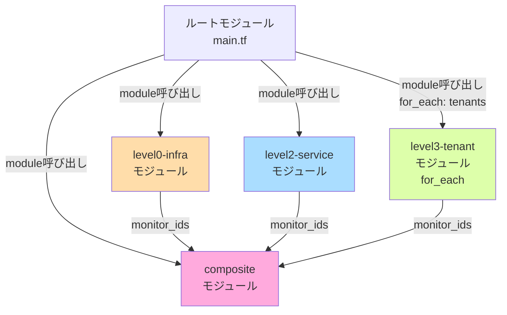

# 詳細設計 INDEX

## 1. プロジェクト概要

### プロジェクト名
Datadog監視基盤構築（Terraform IaC）

### 目的
既存AWS環境（RDS、ECS、ALB、VPC）に対するDatadog監視設定をTerraformでIaC化し、L0（インフラ）、L2（サービス）、L3（テナント）の3層監視とComposite Monitorによるアラート抑制を実現する。

### スコープ
- Datadog Monitor の作成（L0/L2/L3/Composite）
- Terraform モジュール設計（level0-infra、level2-service、level3-tenant、composite）
- テナント動的管理（for_each）
- State管理（S3 + DynamoDB）

### 基本設計との関連
本詳細設計は、以下の基本設計書を実装レベルに具体化したものです。

| 基本設計書 | 詳細設計での対応 |
|-----------|---------------|
| [01_システム構成図.md](../01_基本設計/01_システム構成図.md) | 全モジュールの構成要素定義 |
| [02_ネットワーク設計.md](../01_基本設計/02_ネットワーク設計.md) | AWS環境パラメータの定義 |
| [03_セキュリティ設計.md](../01_基本設計/03_セキュリティ設計.md) | API Key管理、Secret管理 |
| [05_監視設計.md](../01_基本設計/05_監視設計.md) | Monitor定義の詳細仕様 |
| [10_IaC方針.md](../01_基本設計/10_IaC方針.md) | ディレクトリ構成、モジュール設計 |

---

## 2. ドキュメント構成

### 2.1 モジュール別詳細設計

詳細設計は、Terraformモジュール単位で構成します。各モジュールごとに以下の3ファイルを作成します。

| ドキュメント | 概要 | レビュー状況 |
|------------|------|-------------|
| **level0-infra モジュール** | | |
| [level0-infra/01_モジュール詳細設計.md](level0-infra/01_モジュール詳細設計.md) | リソース定義、変数定義、出力定義 | 🔲 未着手 |
| [level0-infra/02_パラメータシート.md](level0-infra/02_パラメータシート.md) | 閾値、通知先、タグ定義 | 🔲 未着手 |
| [level0-infra/03_構築手順書.md](level0-infra/03_構築手順書.md) | terraform apply 手順、確認方法 | 🔲 未着手 |
| **level2-service モジュール** | | |
| [level2-service/01_モジュール詳細設計.md](level2-service/01_モジュール詳細設計.md) | リソース定義、変数定義、出力定義 | 🔲 未着手 |
| [level2-service/02_パラメータシート.md](level2-service/02_パラメータシート.md) | 閾値、通知先、タグ定義 | 🔲 未着手 |
| [level2-service/03_構築手順書.md](level2-service/03_構築手順書.md) | terraform apply 手順、確認方法 | 🔲 未着手 |
| **level3-tenant モジュール** | | |
| [level3-tenant/01_モジュール詳細設計.md](level3-tenant/01_モジュール詳細設計.md) | リソース定義、変数定義、出力定義（for_each対応） | 🔲 未着手 |
| [level3-tenant/02_パラメータシート.md](level3-tenant/02_パラメータシート.md) | テナント別閾値、通知先、タグ定義 | 🔲 未着手 |
| [level3-tenant/03_構築手順書.md](level3-tenant/03_構築手順書.md) | テナント追加・削除手順、確認方法 | 🔲 未着手 |
| **composite モジュール** | | |
| [composite/01_モジュール詳細設計.md](composite/01_モジュール詳細設計.md) | Composite Monitor 定義、親子関係 | 🔲 未着手 |
| [composite/02_パラメータシート.md](composite/02_パラメータシート.md) | 抑制ルール、通知先 | 🔲 未着手 |
| [composite/03_構築手順書.md](composite/03_構築手順書.md) | terraform apply 手順、確認方法 | 🔲 未着手 |
| **ルートモジュール** | | |
| [root/01_ルートモジュール詳細設計.md](root/01_ルートモジュール詳細設計.md) | main.tf、variables.tf、providers.tf、backend.tf | 🔲 未着手 |
| [root/02_環境別パラメータ.md](root/02_環境別パラメータ.md) | terraform.tfvars の定義、環境差分管理 | 🔲 未着手 |
| [root/03_デプロイ手順書.md](root/03_デプロイ手順書.md) | 初回デプロイ、変更デプロイ、削除手順 | 🔲 未着手 |

### 2.2 ドキュメント構成の凡例

**レビュー状況**:
- 🔲 未着手
- 🔄 作成中
- ✅ 完了（レビュー中）
- ✔️ 承認済み

---

## 3. モジュール概要

### 3.1 level0-infra モジュール

**責務**: L0 インフラ監視 Monitor の作成

**監視対象リソース**:
- RDS PostgreSQL（CPU、接続数、メモリ、ストレージ）
- ECS Cluster（Running Tasks 数）
- VPC Flow Logs（異常パターン検知）
- Datadog Agent（死活監視）

**入力パラメータ例**:
- `rds_instance_id`: RDS インスタンス識別子
- `ecs_cluster_name`: ECS Cluster 名
- `rds_cpu_threshold`: RDS CPU使用率の閾値（%）

**出力**:
- `monitor_ids`: 作成した Monitor のIDリスト（Composite Monitor で参照）

**基本設計との対応**:
- [05_監視設計.md § 2.1 L0監視](../01_基本設計/05_監視設計.md)
- [10_IaC方針.md § 3.1](../01_基本設計/10_IaC方針.md)

---

### 3.2 level2-service モジュール

**責務**: L2 サービス監視 Monitor の作成

**監視対象リソース**:
- ALB（Target Group Health、レスポンスタイム）
- ECS Task（タスク状態、リソース使用率）
- ECR（イメージ脆弱性スキャン）

**入力パラメータ例**:
- `alb_target_group`: ALB Target Group 名
- `ecs_service_name`: ECS Service 名
- `alb_response_time_threshold`: レスポンスタイム閾値（ms）

**出力**:
- `monitor_ids`: 作成した Monitor のIDリスト（Composite Monitor で参照）

**基本設計との対応**:
- [05_監視設計.md § 2.2 L2監視](../01_基本設計/05_監視設計.md)
- [10_IaC方針.md § 3.2](../01_基本設計/10_IaC方針.md)

---

### 3.3 level3-tenant モジュール

**責務**: L3 テナント監視 Monitor の作成（for_each でテナントごとに動的展開）

**監視対象リソース**:
- テナント別ヘルスチェック（/{tenant_id}/health エンドポイント）
- テナント別エラーログ（CloudWatch Logs）
- テナント別レイテンシ（p99）

**入力パラメータ例**:
- `tenant_id`: テナント識別子（例: tenant-a）
- `health_check_url`: ヘルスチェックURL
- `errors_threshold`: エラーログ数の閾値（5分間）
- `latency_threshold`: レイテンシ閾値（ms、p99）

**出力**:
- `monitor_ids`: 作成した Monitor のIDリスト（テナントごと）

**基本設計との対応**:
- [05_監視設計.md § 2.3 L3監視](../01_基本設計/05_監視設計.md)
- [10_IaC方針.md § 3.3](../01_基本設計/10_IaC方針.md)

---

### 3.4 composite モジュール

**責務**: Composite Monitor の作成（L0/L2/L3の親子関係によるアラート抑制）

**監視対象**:
- L0 Composite Monitor（インフラ基盤障害判定）
- L2 Composite Monitor（サービス障害判定、L0障害時は抑制）
- L3 Composite Monitor（テナント障害判定、L0/L2障害時は抑制）

**入力パラメータ例**:
- `l0_monitor_ids`: L0 Monitor のIDリスト
- `l2_monitor_ids`: L2 Monitor のIDリスト
- `l3_monitor_ids`: L3 Monitor のIDリスト（テナントごと）

**出力**:
- `composite_ids`: 作成した Composite Monitor のIDリスト

**基本設計との対応**:
- [05_監視設計.md § 2.4 Composite Monitor](../01_基本設計/05_監視設計.md)
- [10_IaC方針.md § 3.4](../01_基本設計/10_IaC方針.md)

---

### 3.5 ルートモジュール

**責務**: 各モジュールの呼び出し、変数定義、State管理

**主要ファイル**:
- `main.tf`: モジュール呼び出し（level0-infra、level2-service、level3-tenant（for_each）、composite）
- `variables.tf`: 入力変数定義（AWS リソース識別子、閾値、テナント定義）
- `terraform.tfvars`: 変数値（Gitにコミットしない）
- `providers.tf`: Provider設定（Datadog、AWS）
- `backend.tf`: State管理（S3 + DynamoDB）
- `outputs.tf`: 出力定義（Monitor ID等）

**基本設計との対応**:
- [10_IaC方針.md § 4](../01_基本設計/10_IaC方針.md)

---

## 4. モジュール間の依存関係

### 4.1 依存関係図（Mermaid）



**凡例**:
- オレンジ: L0 インフラ監視
- 青: L2 サービス監視
- 緑: L3 テナント監視
- ピンク: Composite Monitor

### 4.2 実装順序

1. **level0-infra モジュール** → L0 Monitor 作成
2. **level2-service モジュール** → L2 Monitor 作成
3. **level3-tenant モジュール** → L3 Monitor 作成（for_each でテナント展開）
4. **composite モジュール** → Composite Monitor 作成（L0/L2/L3のIDを参照）
5. **ルートモジュール** → 全モジュールの統合

**重要**: Composite Monitor は L0/L2/L3 の Monitor ID に依存するため、**最後に実装**します。

---

## 5. パラメータ管理

### 5.1 環境別パラメータ管理方針

**PoCでの環境管理**:
- 1環境（poc）のみ
- `terraform.tfvars` で管理
- 環境変数（TF_VAR_*）で API Key/APP Key を注入

**本番移行時の環境管理**（参考）:
- 環境ごとに `terraform.tfvars` を分割
- `environments/poc/terraform.tfvars`
- `environments/staging/terraform.tfvars`
- `environments/production/terraform.tfvars`

### 5.2 共通パラメータ

| パラメータ名 | 値の例 | 環境差分 | 備考 |
|------------|--------|---------|------|
| `datadog_api_key` | 環境変数 | なし | Secret（Gitコミット禁止） |
| `datadog_app_key` | 環境変数 | なし | Secret（Gitコミット禁止） |
| `rds_instance_id` | myapp-db | **あり** | 環境ごとに異なる |
| `ecs_cluster_name` | myapp-cluster | **あり** | 環境ごとに異なる |
| `alb_target_group` | myapp-tg | **あり** | 環境ごとに異なる |
| `tenants` | {tenant-a, tenant-b, tenant-c} | **あり** | 環境ごとに異なる |

**基本設計との対応**:
- [10_IaC方針.md § 5 環境差分管理](../01_基本設計/10_IaC方針.md)

### 5.3 テナント定義の例

```hcl
tenants = {
  tenant-a = {
    errors_threshold  = 10
    latency_threshold = 1000
  }
  tenant-b = {
    errors_threshold  = 10
    latency_threshold = 1000
  }
  tenant-c = {
    errors_threshold  = 10
    latency_threshold = 1000
  }
}
```

**テナント追加**:
- `terraform.tfvars` に1行追加 → `terraform apply`
- **既存テナントに影響なし**（for_each の仕組み）

---

## 6. 構築手順の概要

### 6.1 初回デプロイ

```powershell
# 1. 環境変数を設定
$env:TF_VAR_datadog_api_key = $env:DD_API_KEY
$env:TF_VAR_datadog_app_key = $env:DD_APP_KEY

# 2. Terraform 初期化
terraform init

# 3. plan（dry-run）
terraform plan -out=tfplan

# 4. 確認後、apply
terraform apply tfplan
```

### 6.2 テナント追加デプロイ

```powershell
# terraform.tfvars を編集（tenant-d を追加）

# 1. plan（dry-run）
terraform plan -out=tfplan

# 2. 差分確認（L3 Monitor 4個追加を確認）
# Plan: 4 to add, 0 to change, 0 to destroy.

# 3. apply
terraform apply tfplan
```

### 6.3 削除（PoC終了時）

```powershell
# ⚠️ 全ての Monitor を削除
terraform destroy
```

**基本設計との対応**:
- [10_IaC方針.md § 7 デプロイ手順](../01_基本設計/10_IaC方針.md)

---

## 7. 詳細設計ドキュメントの構成

### 7.1 各モジュールの詳細設計ファイル

各モジュールごとに、以下の3ファイルを作成します。

#### 01_モジュール詳細設計.md

**目的**: Terraform コードの設計仕様を記載

**内容**:
1. モジュール概要
2. ディレクトリ構成
3. `variables.tf` の詳細（変数名、型、デフォルト値、説明）
4. `main.tf` の詳細（リソース定義）
5. `monitors.tf` の詳細（Monitor 定義）
6. `outputs.tf` の詳細（出力定義）
7. 依存関係
8. 実装時の注意事項

#### 02_パラメータシート.md

**目的**: 環境別パラメータ値を定義

**内容**:
1. 閾値の定義（Critical、Warning）
2. 通知先の定義（Slack、Email、PagerDuty等）
3. タグの定義（layer、resource、severity、tenant）
4. 環境別の差分（PoCでは1環境のみ）

#### 03_構築手順書.md

**目的**: Terraform 実行手順を記載

**内容**:
1. 事前準備（環境変数設定、AWS CLI設定）
2. terraform init（初回のみ）
3. terraform plan（dry-run）
4. terraform apply（本番実行）
5. 確認方法（Datadog UI でMonitor確認）
6. トラブルシューティング

### 7.2 ルートモジュールの詳細設計ファイル

#### 01_ルートモジュール詳細設計.md

**内容**:
1. `main.tf`（モジュール呼び出し）
2. `variables.tf`（変数定義）
3. `providers.tf`（Datadog Provider、AWS Provider）
4. `backend.tf`（S3 + DynamoDB State管理）
5. `outputs.tf`（Monitor ID等）
6. `versions.tf`（Terraform/Provider バージョン）

#### 02_環境別パラメータ.md

**内容**:
1. `terraform.tfvars` の定義（PoCスコープ）
2. `terraform.tfvars.example` の定義（サンプル）
3. 環境別の管理方針（本番移行時）

#### 03_デプロイ手順書.md

**内容**:
1. 初回デプロイ手順
2. 変更デプロイ手順
3. テナント追加・削除手順
4. ロールバック手順
5. 削除手順（PoC終了時）

---

## 8. 実装者向けガイド

### 8.1 実装開始時に参照すべきドキュメント

| ドキュメント | パス | 目的 |
|------------|------|------|
| **基本設計書** | | |
| システム構成図 | [../01_基本設計/01_システム構成図.md](../01_基本設計/01_システム構成図.md) | 全体像の理解 |
| 監視設計 | [../01_基本設計/05_監視設計.md](../01_基本設計/05_監視設計.md) | Monitor定義の仕様 |
| IaC方針 | [../01_基本設計/10_IaC方針.md](../01_基本設計/10_IaC方針.md) | ディレクトリ構成、モジュール設計 |
| セキュリティ設計 | [../01_基本設計/03_セキュリティ設計.md](../01_基本設計/03_セキュリティ設計.md) | API Key管理 |
| **技術標準** | | |
| Terraform技術標準 | .claude/docs/40_standards/42_infra/iac/terraform.md | ベストプラクティス |
| **詳細設計書（本INDEX）** | | |
| このINDEX | [INDEX.md](INDEX.md) | モジュール構成、依存関係 |
| level0-infra 詳細設計 | [level0-infra/01_モジュール詳細設計.md](level0-infra/01_モジュール詳細設計.md) | L0 Monitor 定義 |
| level2-service 詳細設計 | [level2-service/01_モジュール詳細設計.md](level2-service/01_モジュール詳細設計.md) | L2 Monitor 定義 |
| level3-tenant 詳細設計 | [level3-tenant/01_モジュール詳細設計.md](level3-tenant/01_モジュール詳細設計.md) | L3 Monitor 定義（for_each） |
| composite 詳細設計 | [composite/01_モジュール詳細設計.md](composite/01_モジュール詳細設計.md) | Composite Monitor 定義 |
| ルートモジュール詳細設計 | [root/01_ルートモジュール詳細設計.md](root/01_ルートモジュール詳細設計.md) | main.tf、variables.tf等 |

### 8.2 実装の推奨順序

1. **level0-infra モジュール**（L0 Monitor）
2. **level2-service モジュール**（L2 Monitor）
3. **level3-tenant モジュール**（L3 Monitor、for_each対応）
4. **composite モジュール**（Composite Monitor、L0/L2/L3のIDを参照）
5. **ルートモジュール**（全モジュールの統合）

**重要**: 各モジュール実装後、独立してテスト可能です。

---

## 9. セキュリティ考慮事項

### 9.1 機密情報の管理

| 機密情報 | 管理方法 | Gitコミット |
|---------|---------|-----------|
| Datadog API Key | 環境変数 `TF_VAR_datadog_api_key` | ❌ 禁止 |
| Datadog APP Key | 環境変数 `TF_VAR_datadog_app_key` | ❌ 禁止 |
| terraform.tfvars | ローカルファイル | ❌ 禁止（.gitignore） |
| terraform.tfvars.example | サンプル | ✅ コミット可（機密情報なし） |

### 9.2 .gitignore の設定

```
# Terraform State（機密情報含む）
*.tfstate
*.tfstate.backup
.terraform/
.terraform.lock.hcl

# 変数ファイル（機密情報含む）
terraform.tfvars
*.auto.tfvars

# ログファイル
terraform-debug.log
crash.log
```

**基本設計との対応**:
- [03_セキュリティ設計.md § 3 API Key管理](../01_基本設計/03_セキュリティ設計.md)

---

## 10. テスト方針

### 10.1 単体テスト（モジュールごと）

各モジュールを独立してテストします。

**例: level0-infra モジュールのテスト**

```powershell
# modules/level0-infra ディレクトリでテスト
cd modules/level0-infra

# terraform init
terraform init

# terraform plan（変数を渡す）
terraform plan -var="rds_instance_id=myapp-db" -var="ecs_cluster_name=myapp-cluster"
```

### 10.2 統合テスト（ルートモジュール）

全モジュールを統合してテストします。

```powershell
# ルートディレクトリでテスト
terraform plan -out=tfplan

# 期待される出力:
# Plan: 16 to add, 0 to change, 0 to destroy.
#   - L0 Monitor: 7個
#   - L2 Monitor: 3個
#   - L3 Monitor: 3個（tenant-a/b/c、各3個 = 9個）
#   - Composite Monitor: 3個（L0/L2/L3）
#   合計: 7 + 3 + 9 + 3 = 22個（※Composite含む）
```

### 10.3 確認テスト（Datadog UI）

Terraform apply 後、Datadog UI で以下を確認します。

- Monitor が作成されているか
- タグが正しいか（layer:l0、tenant:tenant-a 等）
- 閾値が正しいか
- Composite Monitor の親子関係が正しいか

---

## 11. トラブルシューティング

### 11.1 よくあるエラー

| エラー | 原因 | 対処 |
|------|------|------|
| `Error: Invalid provider credentials` | Datadog API Key/APP Key が未設定 | 環境変数 `TF_VAR_datadog_api_key` を設定 |
| `Error: Backend initialization required` | backend.tf の S3バケットが存在しない | S3バケットを作成 |
| `Error: Monitor already exists` | 手動作成したMonitorと名前が重複 | 既存Monitorを削除、または terraform import |
| `Error: for_each argument is invalid` | `tenants` 変数がmap型でない | terraform.tfvars を確認 |

### 11.2 デバッグ方法

```powershell
# Terraform ログレベルを DEBUG に設定
$env:TF_LOG = "DEBUG"
terraform plan

# ログをファイルに保存
terraform plan 2>&1 | Out-File -FilePath terraform-debug.log
```

**基本設計との対応**:
- [10_IaC方針.md § 10 トラブルシューティング](../01_基本設計/10_IaC方針.md)

---

## 12. 重要な設計判断（ADR サマリー）

### ADR-001: モジュール分割方針

**決定**: L0/L2/L3/Composite を独立したモジュールに分割

**理由**:
- 保守性向上（各モジュールを独立して修正可能）
- テスト容易性（単体テスト可能）
- 再利用性（他プロジェクトで再利用可能）

### ADR-002: テナント管理に for_each を採用

**決定**: L3 Monitor の作成に `for_each` を使用

**理由**:
- テナント追加時、terraform.tfvars に1行追加するだけ
- 既存テナントに影響なし
- 100テナントまでスケール可能

### ADR-003: State管理に S3 + DynamoDB を採用

**決定**: State管理に S3 バケット + DynamoDB テーブルを使用

**理由**:
- チーム共有（複数人で同時作業可能）
- State ロック（競合防止）
- State バックアップ（S3のバージョニング）

**基本設計との対応**:
- [10_IaC方針.md § 4.6 backend.tf](../01_基本設計/10_IaC方針.md)

---

## 13. レビュー・承認

### 13.1 レビュー担当者

| 役割 | 担当者 | レビュー観点 |
|------|-------|-----------|
| PM | [未定] | ビジネス要件整合性 |
| SRE | [未定] | 実装可能性、ベストプラクティス準拠 |
| Infra-Architect（作成者） | [未定] | 基本設計との整合性 |

### 13.2 承認フロー

```
1. Infra-Architect が詳細設計作成
     ↓
2. PM が基本設計との整合性をレビュー
     ↓
3. SRE が実装可能性をレビュー
     ↓
4. PM がユーザー承認を得る
     ↓
5. SRE が実装開始
```

---

## 14. 次のステップ

### 14.1 詳細設計ドキュメントの作成

本INDEXで定義した各ファイルを作成します。

**作成順序**:
1. level0-infra モジュール（3ファイル）
2. level2-service モジュール（3ファイル）
3. level3-tenant モジュール（3ファイル）
4. composite モジュール（3ファイル）
5. ルートモジュール（3ファイル）

**合計**: 15ファイル（5モジュール × 3ファイル）

### 14.2 実装フェーズへの移行

詳細設計が完了し、ユーザー承認を得たら、SRE が実装フェーズに進みます。

---

## 15. 関連ドキュメント

| ドキュメント | パス |
|------------|------|
| 基本設計書（全体） | [../01_基本設計/](../01_基本設計/) |
| システム構成図 | [../01_基本設計/01_システム構成図.md](../01_基本設計/01_システム構成図.md) |
| ネットワーク設計 | [../01_基本設計/02_ネットワーク設計.md](../01_基本設計/02_ネットワーク設計.md) |
| セキュリティ設計 | [../01_基本設計/03_セキュリティ設計.md](../01_基本設計/03_セキュリティ設計.md) |
| 監視設計 | [../01_基本設計/05_監視設計.md](../01_基本設計/05_監視設計.md) |
| IaC方針 | [../01_基本設計/10_IaC方針.md](../01_基本設計/10_IaC方針.md) |
| 要件定義書 | [../../02_要件定義/要件定義書.md](../../02_要件定義/要件定義書.md) |

---

**作成日**: 2025-12-28
**作成者**: Infra-Architect
**バージョン**: 1.0
**ステータス**: Draft
**重要度**: ★★★★★（詳細設計の目次）
