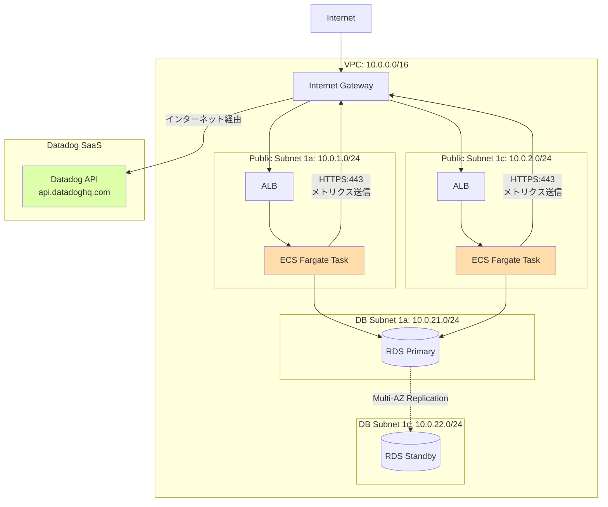

# VPC設計

## 1. 概要

AWS検証アカウントに新規VPCを構築します。マルチテナント対応のECS環境を想定し、コスト最適化（NAT Gateway 不要）を実現します。

## 2. VPC設計

### 2.1 VPC CIDR

| 項目 | 値 | 備考 |
|------|-----|------|
| VPC CIDR | `10.0.0.0/16` | 65536個のIPアドレス |
| リージョン | `ap-northeast-1` | 東京リージョン |
| DNS解決 | `true` | 必須（Datadogドメイン解決用） |
| DNSホスト名 | `true` | 必須 |
| タグ | `Name=datadog-poc-vpc` | 識別用 |

### 2.2 Terraform 実装

```hcl
# vpc.tf
resource "aws_vpc" "main" {
  cidr_block           = "10.0.0.0/16"
  enable_dns_support   = true
  enable_dns_hostnames = true

  tags = {
    Name        = "datadog-poc-vpc"
    Environment = "poc"
    Project     = "datadog-monitoring"
  }
}
```

## 3. Subnet 設計

### 3.1 Subnet 構成

**重要**: Fargate を Public Subnet に配置し、NAT Gateway を使用しません（ADR-AWS-001）

| Subnet名 | CIDR | AZ | 種別 | 用途 |
|---------|------|-----|------|------|
| `public-subnet-1a` | `10.0.1.0/24` | ap-northeast-1a | Public | **ALB, ECS Fargate** |
| `public-subnet-1c` | `10.0.2.0/24` | ap-northeast-1c | Public | **ALB, ECS Fargate** |
| `db-subnet-1a` | `10.0.21.0/24` | ap-northeast-1a | Private | RDS Primary |
| `db-subnet-1c` | `10.0.22.0/24` | ap-northeast-1c | Private | RDS Standby（Multi-AZ） |

**設計判断**:
- Public Subnet: 2つ（Multi-AZ）
- Private Subnet: 不要（Fargateは Public Subnet に配置）
- DB Subnet: 2つ（RDS Multi-AZ 要件）

### 3.2 Terraform 実装

```hcl
# vpc.tf (続き)

# Public Subnet (AZ-1a)
resource "aws_subnet" "public_1a" {
  vpc_id                  = aws_vpc.main.id
  cidr_block              = "10.0.1.0/24"
  availability_zone       = "ap-northeast-1a"
  map_public_ip_on_launch = true  # Public IP 自動割り当て

  tags = {
    Name = "datadog-poc-public-subnet-1a"
    Tier = "Public"
  }
}

# Public Subnet (AZ-1c)
resource "aws_subnet" "public_1c" {
  vpc_id                  = aws_vpc.main.id
  cidr_block              = "10.0.2.0/24"
  availability_zone       = "ap-northeast-1c"
  map_public_ip_on_launch = true

  tags = {
    Name = "datadog-poc-public-subnet-1c"
    Tier = "Public"
  }
}

# DB Subnet (AZ-1a)
resource "aws_subnet" "db_1a" {
  vpc_id            = aws_vpc.main.id
  cidr_block        = "10.0.21.0/24"
  availability_zone = "ap-northeast-1a"

  tags = {
    Name = "datadog-poc-db-subnet-1a"
    Tier = "Database"
  }
}

# DB Subnet (AZ-1c)
resource "aws_subnet" "db_1c" {
  vpc_id            = aws_vpc.main.id
  cidr_block        = "10.0.22.0/24"
  availability_zone = "ap-northeast-1c"

  tags = {
    Name = "datadog-poc-db-subnet-1c"
    Tier = "Database"
  }
}

# DB Subnet Group（RDS用）
resource "aws_db_subnet_group" "main" {
  name       = "datadog-poc-db-subnet-group"
  subnet_ids = [
    aws_subnet.db_1a.id,
    aws_subnet.db_1c.id
  ]

  tags = {
    Name = "datadog-poc-db-subnet-group"
  }
}
```

## 4. Internet Gateway

### 4.1 設計

| 項目 | 値 | 備考 |
|------|-----|------|
| IGW名 | `datadog-poc-igw` | VPCに1つ |
| アタッチ先 | `datadog-poc-vpc` | - |

### 4.2 Terraform 実装

```hcl
# vpc.tf (続き)

resource "aws_internet_gateway" "main" {
  vpc_id = aws_vpc.main.id

  tags = {
    Name = "datadog-poc-igw"
  }
}
```

## 5. Route Table

### 5.1 Public Subnet Route Table

| 宛先 | ターゲット | 用途 |
|------|-----------|------|
| `10.0.0.0/16` | local | VPC内通信 |
| `0.0.0.0/0` | Internet Gateway | インターネット通信（ALB、Fargate → Datadog API） |

### 5.2 DB Subnet Route Table

| 宛先 | ターゲット | 用途 |
|------|-----------|------|
| `10.0.0.0/16` | local | VPC内通信のみ |

**セキュリティ**: DBサブネットはインターネットアクセス不可

### 5.3 Terraform 実装

```hcl
# vpc.tf (続き)

# Public Route Table
resource "aws_route_table" "public" {
  vpc_id = aws_vpc.main.id

  route {
    cidr_block = "0.0.0.0/0"
    gateway_id = aws_internet_gateway.main.id
  }

  tags = {
    Name = "datadog-poc-public-rt"
    Tier = "Public"
  }
}

# Public Subnet Association
resource "aws_route_table_association" "public_1a" {
  subnet_id      = aws_subnet.public_1a.id
  route_table_id = aws_route_table.public.id
}

resource "aws_route_table_association" "public_1c" {
  subnet_id      = aws_subnet.public_1c.id
  route_table_id = aws_route_table.public.id
}

# DB Route Table（デフォルトルートテーブル利用、local のみ）
# 明示的な設定不要（デフォルトで VPC内通信のみ許可）
```

## 6. Security Groups

### 6.1 ALB Security Group

| 方向 | プロトコル | ポート | 送信元/送信先 | 用途 |
|------|-----------|--------|--------------|------|
| Inbound | HTTP | 80 | `0.0.0.0/0` | インターネットからのHTTP |
| Outbound | HTTP | 8080 | ECS SG | ECS Fargateへの転送 |

### 6.2 ECS Security Group

| 方向 | プロトコル | ポート | 送信元/送信先 | 用途 |
|------|-----------|--------|--------------|------|
| Inbound | HTTP | 8080 | ALB SG | ALBからのトラフィック |
| Outbound | HTTPS | 443 | `0.0.0.0/0` | **Datadog API通信（必須）** |
| Outbound | PostgreSQL | 5432 | RDS SG | RDSへの接続 |

**重要**: Outbound HTTPS (443) は Datadog Agent がメトリクスを送信するため必須

### 6.3 RDS Security Group

| 方向 | プロトコル | ポート | 送信元/送信先 | 用途 |
|------|-----------|--------|--------------|------|
| Inbound | PostgreSQL | 5432 | ECS SG | ECSからのDB接続 |
| Outbound | - | - | - | 不要（DBは受信のみ） |

### 6.4 Terraform 実装

```hcl
# vpc.tf (続き)

# ALB Security Group
resource "aws_security_group" "alb" {
  name        = "datadog-poc-alb-sg"
  description = "Security group for ALB"
  vpc_id      = aws_vpc.main.id

  ingress {
    description = "HTTP from Internet"
    from_port   = 80
    to_port     = 80
    protocol    = "tcp"
    cidr_blocks = ["0.0.0.0/0"]
  }

  egress {
    description     = "HTTP to ECS"
    from_port       = 8080
    to_port         = 8080
    protocol        = "tcp"
    security_groups = [aws_security_group.ecs.id]
  }

  tags = {
    Name = "datadog-poc-alb-sg"
  }
}

# ECS Security Group
resource "aws_security_group" "ecs" {
  name        = "datadog-poc-ecs-sg"
  description = "Security group for ECS Fargate"
  vpc_id      = aws_vpc.main.id

  ingress {
    description     = "HTTP from ALB"
    from_port       = 8080
    to_port         = 8080
    protocol        = "tcp"
    security_groups = [aws_security_group.alb.id]
  }

  egress {
    description = "HTTPS to Datadog API"
    from_port   = 443
    to_port     = 443
    protocol    = "tcp"
    cidr_blocks = ["0.0.0.0/0"]
  }

  egress {
    description     = "PostgreSQL to RDS"
    from_port       = 5432
    to_port         = 5432
    protocol        = "tcp"
    security_groups = [aws_security_group.rds.id]
  }

  tags = {
    Name = "datadog-poc-ecs-sg"
  }
}

# RDS Security Group
resource "aws_security_group" "rds" {
  name        = "datadog-poc-rds-sg"
  description = "Security group for RDS PostgreSQL"
  vpc_id      = aws_vpc.main.id

  ingress {
    description     = "PostgreSQL from ECS"
    from_port       = 5432
    to_port         = 5432
    protocol        = "tcp"
    security_groups = [aws_security_group.ecs.id]
  }

  tags = {
    Name = "datadog-poc-rds-sg"
  }
}
```

## 7. VPC Flow Logs

### 7.1 設計

Datadog L0 監視要件（FR-001-6）のため、VPC Flow Logs を有効化します。

| 項目 | 値 | 備考 |
|------|-----|------|
| 対象 | VPC全体 | - |
| 送信先 | CloudWatch Logs | ログ保持期間: 7日 |
| フィルタ | `ALL`（Accept + Reject） | Datadog で異常パターン検知 |
| ログフォーマット | デフォルト | - |

### 7.2 Terraform 実装

```hcl
# cloudwatch.tf（またはvpc.tf）

# VPC Flow Logs 用 CloudWatch Logs グループ
resource "aws_cloudwatch_log_group" "vpc_flow_logs" {
  name              = "/aws/vpc/flowlogs"
  retention_in_days = 7

  tags = {
    Name = "datadog-poc-vpc-flow-logs"
  }
}

# VPC Flow Logs 用 IAM Role
resource "aws_iam_role" "vpc_flow_logs" {
  name = "datadog-poc-vpc-flow-logs-role"

  assume_role_policy = jsonencode({
    Version = "2012-10-17"
    Statement = [
      {
        Action = "sts:AssumeRole"
        Effect = "Allow"
        Principal = {
          Service = "vpc-flow-logs.amazonaws.com"
        }
      }
    ]
  })
}

resource "aws_iam_role_policy" "vpc_flow_logs" {
  name = "datadog-poc-vpc-flow-logs-policy"
  role = aws_iam_role.vpc_flow_logs.id

  policy = jsonencode({
    Version = "2012-10-17"
    Statement = [
      {
        Action = [
          "logs:CreateLogGroup",
          "logs:CreateLogStream",
          "logs:PutLogEvents",
          "logs:DescribeLogGroups",
          "logs:DescribeLogStreams"
        ]
        Effect   = "Allow"
        Resource = "*"
      }
    ]
  })
}

# VPC Flow Logs
resource "aws_flow_log" "main" {
  vpc_id          = aws_vpc.main.id
  traffic_type    = "ALL"
  iam_role_arn    = aws_iam_role.vpc_flow_logs.arn
  log_destination = aws_cloudwatch_log_group.vpc_flow_logs.arn

  tags = {
    Name = "datadog-poc-vpc-flow-logs"
  }
}
```

## 8. ネットワーク構成図



**凡例**:
- オレンジ: ECS Fargate（Public Subnet配置）
- 緑: Datadog SaaS

## 9. IPアドレス管理

### 9.1 CIDR アロケーション

| Subnet | CIDR | 利用可能IP数 | 想定用途 |
|--------|------|------------|---------|
| public-subnet-1a | `10.0.1.0/24` | 251個 | ALB (3), ECS (10) |
| public-subnet-1c | `10.0.2.0/24` | 251個 | ALB (3), ECS (10) |
| db-subnet-1a | `10.0.21.0/24` | 251個 | RDS Primary (1) |
| db-subnet-1c | `10.0.22.0/24` | 251個 | RDS Standby (1) |

**注**: ECS Fargate は ENI を自動割り当て（固定IP不要）

### 9.2 予約IPアドレス

AWSは各サブネットで以下のIPアドレスを予約します:

| IP | 用途 |
|----|------|
| `x.x.x.0` | ネットワークアドレス |
| `x.x.x.1` | VPCルーター |
| `x.x.x.2` | DNSサーバー |
| `x.x.x.3` | AWS予約（将来用） |
| `x.x.x.255` | ブロードキャスト |

実質的に利用可能なIPアドレスは `/24` で **251個**

## 10. DNS設定

### 10.1 VPC DNS

| 項目 | 設定 | 備考 |
|------|------|------|
| DNS解決 | 有効 | `enable_dns_support = true` |
| DNSホスト名 | 有効 | `enable_dns_hostnames = true` |

### 10.2 Route53（オプション）

PoCではRoute53は使用しません。ALB の DNS名を直接使用します。

## 11. コスト試算

### 11.1 VPC関連コスト（月額）

| リソース | 料金 | 数量 | 月額（USD） |
|---------|------|------|-----------|
| VPC | $0 | 1 | $0 |
| Subnet | $0 | 4 | $0 |
| Internet Gateway | $0 | 1 | $0 |
| **NAT Gateway** | **$0**（不使用） | 0 | **$0** |
| VPC Flow Logs（CloudWatch Logs） | $0.50/GB | 1 GB | $0.50 |
| **合計** | - | - | **$0.50** |

**コスト削減効果**: NAT Gateway 不使用により **$32.4/月 削減**

## 12. セキュリティ考慮事項

### 12.1 Security Group 設計原則

- **最小権限の原則**: 必要最小限の通信のみ許可
- **送信元/送信先の明示**: CIDR `0.0.0.0/0` は HTTPS:443（Datadog API）のみ
- **インバウンドルールの制限**: ECS は ALB からのみ受信

### 12.2 Network ACL

PoCではデフォルトNetwork ACL（全許可）を使用します。本番環境では明示的なACL設定を推奨。

## 13. 運用考慮事項

### 13.1 トラブルシューティング

| 症状 | 原因 | 対処 |
|------|------|------|
| Datadog にメトリクスが届かない | ECS SG の Outbound HTTPS:443 未許可 | Security Group 修正 |
| RDS に接続できない | ECS SG の Outbound PostgreSQL:5432 未許可 | Security Group 修正 |
| ALB からECSに到達しない | ECS SG の Inbound HTTP:8080 未許可 | Security Group 修正 |

### 13.2 確認コマンド

```bash
# VPC Flow Logs 確認
aws logs describe-log-groups --log-group-name-prefix /aws/vpc/flowlogs

# Security Group 確認
aws ec2 describe-security-groups --filters "Name=vpc-id,Values=<VPC_ID>"

# Subnet 確認
aws ec2 describe-subnets --filters "Name=vpc-id,Values=<VPC_ID>"
```

## 14. 関連ドキュメント

| ドキュメント | パス |
|-------------|------|
| INDEX | [INDEX.md](INDEX.md) |
| ECS設計 | [02_ECS設計.md](02_ECS設計.md) |
| ALB設計 | [03_ALB設計.md](03_ALB設計.md) |
| RDS設計 | [04_RDS設計.md](04_RDS設計.md) |

---

**作成日**: 2025-12-29
**作成者**: Infra-Architect
**バージョン**: 1.0
**ステータス**: Draft
