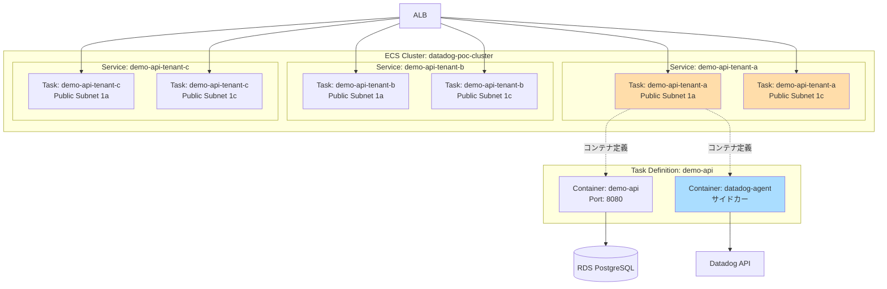

# ECS設計

## 1. 概要

ECS Fargate でマルチテナント対応のコンテナアプリケーションを実行します。
`for_each` パターンでテナントごとに Service を作成します。

## 2. ECS Cluster

### 2.1 Cluster 設計

| 項目 | 値 | 備考 |
|------|-----|------|
| Cluster名 | `datadog-poc-cluster` | 全テナント共通 |
| 起動タイプ | Fargate | サーバーレス |
| Container Insights | 有効 | CloudWatch Container Insights |

### 2.2 Terraform 実装

```hcl
# ecs.tf

resource "aws_ecs_cluster" "main" {
  name = "datadog-poc-cluster"

  setting {
    name  = "containerInsights"
    value = "enabled"  # CloudWatch Container Insights 有効化
  }

  tags = {
    Name        = "datadog-poc-cluster"
    Environment = "poc"
  }
}
```

## 3. Task Definition

### 3.1 タスク定義（テナント共通）

| 項目 | 値 | 備考 |
|------|-----|------|
| Family | `demo-api` | テナント共通のタスク定義 |
| 起動タイプ | `FARGATE` | - |
| ネットワークモード | `awsvpc` | Fargate必須 |
| CPU | `256`（0.25 vCPU） | テナント単位で調整可能 |
| Memory | `512` MB | テナント単位で調整可能 |
| Task Role | `ecs-task-role`（IAM設計参照） | アプリケーションが使用 |
| Execution Role | `ecs-execution-role`（IAM設計参照） | ECS Agentが使用 |

### 3.2 コンテナ定義（2コンテナ）

#### アプリケーションコンテナ

| 項目 | 値 | 備考 |
|------|-----|------|
| コンテナ名 | `demo-api` | - |
| イメージ | `<ECR_URI>/demo-api:latest` | ECR Repository |
| ポート | `8080` | アプリケーションポート |
| CPU | `128` | 0.125 vCPU |
| Memory（ハード制限） | `256` MB | - |
| Memory（ソフト制限） | `256` MB | - |
| ヘルスチェック | `/health` | - |

**環境変数**:

| 環境変数名 | 値 | 用途 |
|------------|-----|------|
| `DB_HOST` | `${RDS_ENDPOINT}` | RDS接続先 |
| `DB_PORT` | `5432` | PostgreSQL |
| `DB_NAME` | `demo` | データベース名 |
| `DB_USER` | `postgres` | データベースユーザー |
| `DB_PASSWORD` | `${DB_PASSWORD}`（SSM Parameter） | セキュアな管理 |
| `DD_AGENT_HOST` | `localhost` | Datadog Agent（サイドカー）への接続 |
| `DD_TRACE_ENABLED` | `true` | APM有効化（オプション） |

#### Datadog Agentコンテナ（サイドカー）

| 項目 | 値 | 備考 |
|------|-----|------|
| コンテナ名 | `datadog-agent` | - |
| イメージ | `public.ecr.aws/datadog/agent:latest` | Datadog公式イメージ |
| CPU | `128` | 0.125 vCPU |
| Memory（ハード制限） | `256` MB | - |
| Memory（ソフト制限） | `256` MB | - |

**環境変数**:

| 環境変数名 | 値 | 用途 |
|------------|-----|------|
| `DD_API_KEY` | `${DD_API_KEY}`（環境変数） | Datadog API Key |
| `DD_SITE` | `datadoghq.com` | Datadogサイト（US1） |
| `DD_APM_ENABLED` | `true` | APM有効化 |
| `DD_LOGS_ENABLED` | `true` | ログ収集有効化 |
| `ECS_FARGATE` | `true` | Fargate用設定 |

### 3.3 Terraform 実装

```hcl
# ecs.tf (続き)

# Task Definition（テナント共通）
resource "aws_ecs_task_definition" "demo_api" {
  family                   = "demo-api"
  network_mode             = "awsvpc"
  requires_compatibilities = ["FARGATE"]
  cpu                      = "256"
  memory                   = "512"
  execution_role_arn       = aws_iam_role.ecs_execution_role.arn
  task_role_arn            = aws_iam_role.ecs_task_role.arn

  container_definitions = jsonencode([
    {
      name      = "demo-api"
      image     = "${aws_ecr_repository.demo_api.repository_url}:latest"
      cpu       = 128
      memory    = 256
      essential = true
      portMappings = [
        {
          containerPort = 8080
          hostPort      = 8080
          protocol      = "tcp"
        }
      ]
      environment = [
        {
          name  = "DB_HOST"
          value = aws_db_instance.main.address
        },
        {
          name  = "DB_PORT"
          value = "5432"
        },
        {
          name  = "DB_NAME"
          value = "demo"
        },
        {
          name  = "DB_USER"
          value = "postgres"
        },
        {
          name  = "DD_AGENT_HOST"
          value = "localhost"
        },
        {
          name  = "DD_TRACE_ENABLED"
          value = "true"
        }
      ]
      secrets = [
        {
          name      = "DB_PASSWORD"
          valueFrom = aws_ssm_parameter.db_password.arn
        }
      ]
      healthCheck = {
        command     = ["CMD-SHELL", "curl -f http://localhost:8080/health || exit 1"]
        interval    = 30
        timeout     = 5
        retries     = 3
        startPeriod = 60
      }
      logConfiguration = {
        logDriver = "awslogs"
        options = {
          "awslogs-group"         = aws_cloudwatch_log_group.ecs.name
          "awslogs-region"        = "ap-northeast-1"
          "awslogs-stream-prefix" = "demo-api"
        }
      }
    },
    {
      name      = "datadog-agent"
      image     = "public.ecr.aws/datadog/agent:latest"
      cpu       = 128
      memory    = 256
      essential = false  # アプリコンテナが停止しても Agent は継続
      environment = [
        {
          name  = "DD_API_KEY"
          value = var.dd_api_key
        },
        {
          name  = "DD_SITE"
          value = "datadoghq.com"
        },
        {
          name  = "DD_APM_ENABLED"
          value = "true"
        },
        {
          name  = "DD_LOGS_ENABLED"
          value = "true"
        },
        {
          name  = "ECS_FARGATE"
          value = "true"
        }
      ]
      logConfiguration = {
        logDriver = "awslogs"
        options = {
          "awslogs-group"         = aws_cloudwatch_log_group.ecs.name
          "awslogs-region"        = "ap-northeast-1"
          "awslogs-stream-prefix" = "datadog-agent"
        }
      }
    }
  ])

  tags = {
    Name = "demo-api"
  }
}
```

## 4. ECS Service（for_each パターン）

### 4.1 Service 設計

**重要**: テナントごとに Service を作成し、ALB Target Group に登録します。

| 項目 | 値 | 備考 |
|------|-----|------|
| Service名 | `demo-api-${tenant_id}` | tenant-a, tenant-b, tenant-c |
| 起動タイプ | `FARGATE` | - |
| Desired Count | `2` | Multi-AZ（1a, 1c）で各1タスク |
| デプロイ戦略 | Rolling Update | - |
| ヘルスチェック猶予期間 | `60` 秒 | ALBヘルスチェック待ち時間 |
| ネットワーク設定 | Public Subnet（1a, 1c） | **Public IP割り当て有効** |
| Security Group | `datadog-poc-ecs-sg` | 全テナント共通 |
| ロードバランサー | ALB Target Group（テナント別） | - |

### 4.2 Terraform 実装（for_each）

```hcl
# ecs.tf (続き)

# ECS Service（テナント別）
resource "aws_ecs_service" "demo_api" {
  for_each = var.tenants

  name            = "demo-api-${each.key}"
  cluster         = aws_ecs_cluster.main.id
  task_definition = aws_ecs_task_definition.demo_api.arn
  desired_count   = 2
  launch_type     = "FARGATE"

  network_configuration {
    subnets = [
      aws_subnet.public_1a.id,
      aws_subnet.public_1c.id
    ]
    security_groups  = [aws_security_group.ecs.id]
    assign_public_ip = true  # Public IP 割り当て（Datadog API通信用）
  }

  load_balancer {
    target_group_arn = aws_lb_target_group.demo_api[each.key].arn
    container_name   = "demo-api"
    container_port   = 8080
  }

  health_check_grace_period_seconds = 60

  depends_on = [
    aws_lb_listener.http
  ]

  tags = {
    Name     = "demo-api-${each.key}"
    TenantID = each.key
  }
}
```

## 5. Auto Scaling（オプション）

PoCではAuto Scalingは設定しませんが、本番環境では以下の設定を推奨します。

### 5.1 Auto Scaling 設計（参考）

| 項目 | 値 | 備考 |
|------|-----|------|
| Min Capacity | `2` | Multi-AZ最小構成 |
| Max Capacity | `10` | テナント単位で調整 |
| Target Tracking | CPU使用率 70% | - |
| Scale-out Cooldown | `60` 秒 | - |
| Scale-in Cooldown | `300` 秒 | 急激な縮小を防ぐ |

### 5.2 Terraform 実装（参考、コメントアウト）

```hcl
# ecs.tf (続き)

# # Auto Scaling Target（テナント別）
# resource "aws_appautoscaling_target" "ecs" {
#   for_each = var.tenants
#
#   max_capacity       = 10
#   min_capacity       = 2
#   resource_id        = "service/${aws_ecs_cluster.main.name}/${aws_ecs_service.demo_api[each.key].name}"
#   scalable_dimension = "ecs:service:DesiredCount"
#   service_namespace  = "ecs"
# }
#
# # Auto Scaling Policy（CPU Target Tracking）
# resource "aws_appautoscaling_policy" "ecs_cpu" {
#   for_each = var.tenants
#
#   name               = "demo-api-${each.key}-cpu-scaling"
#   policy_type        = "TargetTrackingScaling"
#   resource_id        = aws_appautoscaling_target.ecs[each.key].resource_id
#   scalable_dimension = aws_appautoscaling_target.ecs[each.key].scalable_dimension
#   service_namespace  = aws_appautoscaling_target.ecs[each.key].service_namespace
#
#   target_tracking_scaling_policy_configuration {
#     target_value = 70.0
#
#     predefined_metric_specification {
#       predefined_metric_type = "ECSServiceAverageCPUUtilization"
#     }
#
#     scale_in_cooldown  = 300
#     scale_out_cooldown = 60
#   }
# }
```

## 6. CloudWatch Logs

### 6.1 ログ設計

| 項目 | 値 | 備考 |
|------|-----|------|
| ロググループ名 | `/ecs/demo-api` | 全テナント共通 |
| ログストリーム | `demo-api/{task_id}`, `datadog-agent/{task_id}` | タスクごと |
| 保持期間 | `7` 日 | PoC用、本番では30日推奨 |

### 6.2 Terraform 実装

```hcl
# cloudwatch.tf（またはecs.tf）

resource "aws_cloudwatch_log_group" "ecs" {
  name              = "/ecs/demo-api"
  retention_in_days = 7

  tags = {
    Name = "demo-api-logs"
  }
}
```

## 7. デプロイ戦略

### 7.1 Rolling Update

| 項目 | 値 | 備考 |
|------|-----|------|
| デプロイタイプ | Rolling Update | デフォルト |
| Minimum Healthy Percent | `50%` | 最低1タスクは稼働維持 |
| Maximum Percent | `200%` | 新旧タスクが同時稼働可能 |

### 7.2 Blue/Green デプロイ（参考）

本番環境では CodeDeploy によるBlue/Greenデプロイを推奨しますが、PoCではRolling Updateを使用します。

## 8. SSM Parameter（DBパスワード）

### 8.1 設計

| 項目 | 値 | 備考 |
|------|-----|------|
| パラメータ名 | `/datadog-poc/db-password` | - |
| タイプ | `SecureString` | KMS暗号化 |
| KMS Key | デフォルトキー | `alias/aws/ssm` |

### 8.2 Terraform 実装

```hcl
# ecs.tf（またはrds.tf）

resource "aws_ssm_parameter" "db_password" {
  name  = "/datadog-poc/db-password"
  type  = "SecureString"
  value = random_password.db_password.result

  tags = {
    Name = "datadog-poc-db-password"
  }
}

# ランダムパスワード生成
resource "random_password" "db_password" {
  length  = 16
  special = true
}
```

## 9. 変数定義

### 9.1 テナント変数

```hcl
# variables.tf

variable "tenants" {
  description = "Tenant configurations"
  type = map(object({
    name   = string
    cpu    = number
    memory = number
  }))
}
```

### 9.2 tenants.tfvars（共有）

```hcl
# terraform/shared/tenants.tfvars

tenants = {
  tenant-a = {
    name   = "tenant-a"
    cpu    = 256
    memory = 512
  }
  tenant-b = {
    name   = "tenant-b"
    cpu    = 256
    memory = 512
  }
  tenant-c = {
    name   = "tenant-c"
    cpu    = 256
    memory = 512
  }
}
```

## 10. ECS構成図



## 11. コスト試算

### 11.1 ECS Fargate コスト（月額）

| 項目 | 単価 | 数量 | 月額（USD） |
|------|------|------|-----------|
| vCPU | $0.04048/vCPU/時間 | 0.25 vCPU × 6タスク × 730時間 | $44.32 |
| Memory | $0.004445/GB/時間 | 0.5 GB × 6タスク × 730時間 | $9.74 |
| **合計** | - | - | **$54.06** |

**注**: 3テナント、各2タスク（Multi-AZ）= 計6タスク

### 11.2 CloudWatch Logs コスト（月額）

| 項目 | 単価 | 数量 | 月額（USD） |
|------|------|------|-----------|
| ログ取り込み | $0.50/GB | 1 GB | $0.50 |
| ログ保存（7日） | $0.03/GB | 1 GB | $0.03 |
| **合計** | - | - | **$0.53** |

## 12. セキュリティ考慮事項

### 12.1 コンテナイメージ

- **ECR脆弱性スキャン**: Push時に自動スキャン（FR-002-3）
- **イメージタグ**: `latest` タグは検証用、本番では Git SHA 推奨

### 12.2 シークレット管理

- **DB_PASSWORD**: SSM Parameter（SecureString）で管理
- **DD_API_KEY**: 環境変数で渡す（Task Definition には**ハードコード禁止**）

### 12.3 IAM Role

- **Task Role**: アプリケーションが使用（RDS接続、S3アクセス等）
- **Execution Role**: ECS Agentが使用（ECRプル、CloudWatch Logs書き込み）

詳細は [06_IAM設計.md](06_IAM設計.md) を参照。

## 13. 運用考慮事項

### 13.1 タスク起動確認

```bash
# タスク一覧
aws ecs list-tasks --cluster datadog-poc-cluster --region ap-northeast-1

# タスク詳細
aws ecs describe-tasks --cluster datadog-poc-cluster --tasks <TASK_ARN> --region ap-northeast-1
```

### 13.2 ログ確認

```bash
# CloudWatch Logs 確認
aws logs tail /ecs/demo-api --follow --region ap-northeast-1

# 特定ログストリーム
aws logs tail /ecs/demo-api --log-stream-name-prefix demo-api/tenant-a --follow
```

### 13.3 トラブルシューティング

| 症状 | 原因 | 対処 |
|------|------|------|
| タスクが起動しない | ECRイメージが存在しない | ECRにイメージをプッシュ |
| | Execution Role に権限不足 | IAM Policy 確認 |
| ヘルスチェック失敗 | `/health` エンドポイントが200を返さない | アプリケーションログ確認 |
| Datadog にメトリクスが届かない | DD_API_KEY 誤り | 環境変数確認 |
| | Security Group で HTTPS:443 未許可 | VPC設計確認 |

## 14. 関連ドキュメント

| ドキュメント | パス |
|-------------|------|
| INDEX | [INDEX.md](INDEX.md) |
| VPC設計 | [01_VPC設計.md](01_VPC設計.md) |
| ALB設計 | [03_ALB設計.md](03_ALB設計.md) |
| RDS設計 | [04_RDS設計.md](04_RDS設計.md) |
| ECR設計 | [05_ECR設計.md](05_ECR設計.md) |
| IAM設計 | [06_IAM設計.md](06_IAM設計.md) |
| CloudWatch設計 | [07_CloudWatch設計.md](07_CloudWatch設計.md) |

---

**作成日**: 2025-12-29
**作成者**: Infra-Architect
**バージョン**: 1.0
**ステータス**: Draft
