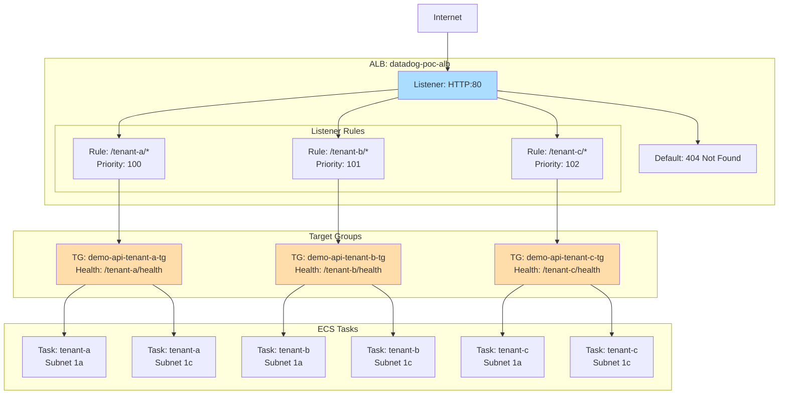

# ALB設計

## 1. 概要

Application Load Balancer（ALB）でマルチテナント環境のトラフィックを分散します。
パスベースルーティング（`/{tenant_id}/*`）でテナント別ECS Serviceに振り分けます。

## 2. ALB 設計

### 2.1 基本設定

| 項目 | 値 | 備考 |
|------|-----|------|
| ALB名 | `datadog-poc-alb` | - |
| スキーム | `internet-facing` | インターネット公開 |
| IPアドレスタイプ | `ipv4` | - |
| Subnet | Public Subnet（1a, 1c） | Multi-AZ |
| Security Group | `datadog-poc-alb-sg` | - |
| アクセスログ | 無効 | PoCのため省略 |

### 2.2 Terraform 実装

```hcl
# alb.tf

resource "aws_lb" "main" {
  name               = "datadog-poc-alb"
  internal           = false
  load_balancer_type = "application"
  security_groups    = [aws_security_group.alb.id]
  subnets = [
    aws_subnet.public_1a.id,
    aws_subnet.public_1c.id
  ]

  enable_deletion_protection = false  # PoC用、本番ではtrue推奨

  tags = {
    Name        = "datadog-poc-alb"
    Environment = "poc"
  }
}
```

## 3. Target Group（for_each パターン）

### 3.1 Target Group 設計

**重要**: テナントごとに Target Group を作成し、パスベースルーティングで振り分けます。

| 項目 | 値 | 備考 |
|------|-----|------|
| TG名 | `demo-api-${tenant_id}-tg` | tenant-a, tenant-b, tenant-c |
| ターゲットタイプ | `ip` | Fargate は IP ターゲット |
| プロトコル | `HTTP` | - |
| ポート | `8080` | ECS コンテナポート |
| VPC | `datadog-poc-vpc` | - |
| ヘルスチェックパス | `/${tenant_id}/health` | テナント別 |
| ヘルスチェック間隔 | `30` 秒 | - |
| ヘルスチェックタイムアウト | `5` 秒 | - |
| 正常閾値 | `2` 回連続 | - |
| 異常閾値 | `3` 回連続 | - |
| Deregistration Delay | `30` 秒 | タスク停止時の待機時間 |

### 3.2 Terraform 実装（for_each）

```hcl
# alb.tf (続き)

resource "aws_lb_target_group" "demo_api" {
  for_each = var.tenants

  name        = "demo-api-${each.key}-tg"
  port        = 8080
  protocol    = "HTTP"
  vpc_id      = aws_vpc.main.id
  target_type = "ip"

  health_check {
    enabled             = true
    healthy_threshold   = 2
    unhealthy_threshold = 3
    timeout             = 5
    interval            = 30
    path                = "/${each.key}/health"
    matcher             = "200"
  }

  deregistration_delay = 30

  tags = {
    Name     = "demo-api-${each.key}-tg"
    TenantID = each.key
  }
}
```

## 4. Listener

### 4.1 HTTP Listener（Port 80）

| 項目 | 値 | 備考 |
|------|-----|------|
| プロトコル | `HTTP` | 本番ではHTTPS推奨 |
| ポート | `80` | - |
| デフォルトアクション | 404 固定レスポンス | パスマッチしない場合 |

### 4.2 Terraform 実装

```hcl
# alb.tf (続き)

resource "aws_lb_listener" "http" {
  load_balancer_arn = aws_lb.main.arn
  port              = 80
  protocol          = "HTTP"

  # デフォルトアクション: 404 Not Found
  default_action {
    type = "fixed-response"

    fixed_response {
      content_type = "text/plain"
      message_body = "404 Not Found: Invalid tenant path"
      status_code  = "404"
    }
  }
}
```

## 5. Listener Rules（パスベースルーティング）

### 5.1 ルーティング設計

| パス | ターゲット | 用途 |
|------|----------|------|
| `/tenant-a/*` | `demo-api-tenant-a-tg` | tenant-a 向けトラフィック |
| `/tenant-b/*` | `demo-api-tenant-b-tg` | tenant-b 向けトラフィック |
| `/tenant-c/*` | `demo-api-tenant-c-tg` | tenant-c 向けトラフィック |
| その他 | 404 固定レスポンス | デフォルトアクション |

### 5.2 Terraform 実装（for_each）

```hcl
# alb.tf (続き)

resource "aws_lb_listener_rule" "demo_api" {
  for_each = var.tenants

  listener_arn = aws_lb_listener.http.arn
  priority     = 100 + index(keys(var.tenants), each.key)

  action {
    type             = "forward"
    target_group_arn = aws_lb_target_group.demo_api[each.key].arn
  }

  condition {
    path_pattern {
      values = ["/${each.key}/*"]
    }
  }
}
```

**注**: `priority` は自動的に割り当て（100, 101, 102...）

## 6. HTTPS Listener（オプション、本番推奨）

### 6.1 HTTPS 設計（参考）

本番環境では HTTPS を使用し、ACM（AWS Certificate Manager）で証明書を管理します。

| 項目 | 値 | 備考 |
|------|-----|------|
| プロトコル | `HTTPS` | - |
| ポート | `443` | - |
| SSL証明書 | ACM証明書 | Route53 + ACM で自動更新 |
| SSL Policy | `ELBSecurityPolicy-TLS-1-2-2017-01` | TLS 1.2 以上 |

### 6.2 Terraform 実装（参考、コメントアウト）

```hcl
# alb.tf (続き)

# # HTTPS Listener（本番環境用）
# resource "aws_lb_listener" "https" {
#   load_balancer_arn = aws_lb.main.arn
#   port              = 443
#   protocol          = "HTTPS"
#   ssl_policy        = "ELBSecurityPolicy-TLS-1-2-2017-01"
#   certificate_arn   = aws_acm_certificate.main.arn
#
#   default_action {
#     type = "fixed-response"
#
#     fixed_response {
#       content_type = "text/plain"
#       message_body = "404 Not Found: Invalid tenant path"
#       status_code  = "404"
#     }
#   }
# }
#
# # HTTP → HTTPS リダイレクト
# resource "aws_lb_listener" "http_redirect" {
#   load_balancer_arn = aws_lb.main.arn
#   port              = 80
#   protocol          = "HTTP"
#
#   default_action {
#     type = "redirect"
#
#     redirect {
#       port        = "443"
#       protocol    = "HTTPS"
#       status_code = "HTTP_301"
#     }
#   }
# }
```

## 7. ALB 構成図



## 8. アクセスログ（オプション）

### 8.1 アクセスログ設計（参考）

本番環境ではアクセスログをS3に保存し、Datadogで分析します。

| 項目 | 値 | 備考 |
|------|-----|------|
| S3バケット | `datadog-poc-alb-logs` | - |
| プレフィックス | `alb/` | - |
| 保持期間 | 30日 | S3 Lifecycle Policy |

### 8.2 Terraform 実装（参考、コメントアウト）

```hcl
# alb.tf (続き)

# # S3 Bucket（ALBログ用）
# resource "aws_s3_bucket" "alb_logs" {
#   bucket = "datadog-poc-alb-logs"
#
#   tags = {
#     Name = "datadog-poc-alb-logs"
#   }
# }
#
# resource "aws_s3_bucket_lifecycle_configuration" "alb_logs" {
#   bucket = aws_s3_bucket.alb_logs.id
#
#   rule {
#     id     = "delete-old-logs"
#     status = "Enabled"
#
#     expiration {
#       days = 30
#     }
#   }
# }
#
# # ALB にアクセスログ設定
# resource "aws_lb" "main" {
#   # ... 既存設定 ...
#
#   access_logs {
#     bucket  = aws_s3_bucket.alb_logs.bucket
#     prefix  = "alb"
#     enabled = true
#   }
# }
```

## 9. 出力値

### 9.1 Outputs

```hcl
# outputs.tf

output "alb_dns_name" {
  description = "ALB DNS Name"
  value       = aws_lb.main.dns_name
}

output "alb_zone_id" {
  description = "ALB Zone ID（Route53用）"
  value       = aws_lb.main.zone_id
}

output "target_group_arns" {
  description = "Target Group ARNs（テナント別）"
  value = {
    for k, tg in aws_lb_target_group.demo_api : k => tg.arn
  }
}
```

## 10. アクセステスト

### 10.1 テストシナリオ

```bash
# ALB DNS Name取得
ALB_DNS=$(terraform output -raw alb_dns_name)

# tenant-a ヘルスチェック
curl http://${ALB_DNS}/tenant-a/health
# Expected: {"status":"ok","tenant":"tenant-a"}

# tenant-b ヘルスチェック
curl http://${ALB_DNS}/tenant-b/health
# Expected: {"status":"ok","tenant":"tenant-b"}

# tenant-c ヘルスチェック
curl http://${ALB_DNS}/tenant-c/health
# Expected: {"status":"ok","tenant":"tenant-c"}

# 存在しないパス（404エラー）
curl http://${ALB_DNS}/invalid-path
# Expected: 404 Not Found: Invalid tenant path
```

### 10.2 Target Group ヘルス確認

```bash
# Target Group のヘルス状態確認
aws elbv2 describe-target-health \
  --target-group-arn $(terraform output -json target_group_arns | jq -r '.["tenant-a"]') \
  --region ap-northeast-1
```

## 11. コスト試算

### 11.1 ALB コスト（月額）

| 項目 | 単価 | 数量 | 月額（USD） |
|------|------|------|-----------|
| ALB 時間料金 | $0.0243/時間 | 730時間 | $17.74 |
| LCU（Load Balancer Capacity Unit） | $0.008/LCU/時間 | 10 LCU × 730時間 | $58.40 |
| **合計** | - | - | **$76.14** |

**注**: LCU は以下の4項目のうち最大値で計算
- 新規接続数: 25/秒
- アクティブ接続数: 3000
- 処理バイト数: 1 GB/時間
- ルール評価数: 1000

PoCでは低トラフィックのため、約10 LCU を想定。

## 12. セキュリティ考慮事項

### 12.1 Security Group

- **Inbound**: HTTP:80（インターネットから `0.0.0.0/0`）
- **Outbound**: HTTP:8080（ECS SG のみ）

### 12.2 本番環境への移行時の推奨事項

- HTTPS 有効化（ACM証明書）
- WAF 統合（SQLインジェクション、XSS対策）
- Shield Standard（DDoS対策、無料）
- アクセスログ有効化（S3 + Datadog分析）

## 13. 運用考慮事項

### 13.1 トラブルシューティング

| 症状 | 原因 | 対処 |
|------|------|------|
| 502 Bad Gateway | ECS Task が停止している | ECS Service 確認 |
| | Target Group のヘルスチェック失敗 | `/health` エンドポイント確認 |
| 504 Gateway Timeout | ECS Task の応答が遅い | アプリケーションログ確認 |
| 404 Not Found | パスが一致しない | Listener Rule 確認 |

### 13.2 監視項目

Datadog L2 監視（FR-002-1）で以下を監視:
- `aws.applicationelb.target_response_time.average`: レスポンスタイム
- `aws.applicationelb.healthy_host_count`: Healthy Hosts 数
- `aws.applicationelb.unhealthy_host_count`: Unhealthy Hosts 数
- `aws.applicationelb.request_count`: リクエスト数

## 14. 関連ドキュメント

| ドキュメント | パス |
|-------------|------|
| INDEX | [INDEX.md](INDEX.md) |
| VPC設計 | [01_VPC設計.md](01_VPC設計.md) |
| ECS設計 | [02_ECS設計.md](02_ECS設計.md) |
| RDS設計 | [04_RDS設計.md](04_RDS設計.md) |

---

**作成日**: 2025-12-29
**作成者**: Infra-Architect
**バージョン**: 1.0
**ステータス**: Draft
