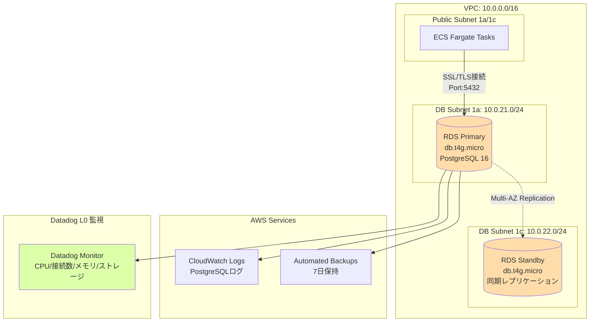

# RDS設計

## 1. 概要

RDS PostgreSQL（Multi-AZ）をDatadog L0監視対象として構築します。
検証環境のため、最小インスタンス（t4g.micro）を使用します。

## 2. RDS インスタンス設計

### 2.1 基本設定

| 項目 | 値 | 備考 |
|------|-----|------|
| エンジン | PostgreSQL | - |
| エンジンバージョン | `16.x`（最新） | 自動マイナーバージョンアップグレード有効 |
| インスタンスクラス | `db.t4g.micro` | 2 vCPU, 1 GB RAM（検証環境用） |
| ストレージタイプ | gp3（汎用SSD） | - |
| ストレージサイズ | `20` GB | 最小サイズ |
| ストレージ自動拡張 | 有効 | 最大 `100` GB |
| Multi-AZ | **有効** | **L0監視検証のため必須** |
| DB識別子 | `datadog-poc-db` | - |
| マスターユーザー名 | `postgres` | デフォルト |
| マスターパスワード | ランダム生成（16文字） | SSM Parameter に保存 |

### 2.2 Terraform 実装

```hcl
# rds.tf

resource "aws_db_instance" "main" {
  identifier = "datadog-poc-db"

  # エンジン設定
  engine               = "postgres"
  engine_version       = "16"
  instance_class       = "db.t4g.micro"
  allocated_storage    = 20
  max_allocated_storage = 100
  storage_type         = "gp3"
  storage_encrypted    = true  # 暗号化有効

  # マスター認証情報
  username = "postgres"
  password = random_password.db_password.result

  # ネットワーク設定
  db_subnet_group_name   = aws_db_subnet_group.main.name
  vpc_security_group_ids = [aws_security_group.rds.id]
  publicly_accessible    = false

  # Multi-AZ（重要）
  multi_az = true

  # バックアップ設定
  backup_retention_period = 7
  backup_window          = "03:00-04:00"  # JST 12:00-13:00
  maintenance_window     = "mon:04:00-mon:05:00"  # JST 月曜 13:00-14:00

  # パラメータグループ
  parameter_group_name = aws_db_parameter_group.main.name

  # オプショングループ
  # PostgreSQL はオプショングループ不要

  # 削除保護
  deletion_protection = false  # PoC用、本番ではtrue推奨

  # 自動マイナーバージョンアップグレード
  auto_minor_version_upgrade = true

  # 最終スナップショット
  skip_final_snapshot       = true  # PoC用、本番ではfalse推奨
  # final_snapshot_identifier = "datadog-poc-db-final-snapshot"

  tags = {
    Name        = "datadog-poc-db"
    Environment = "poc"
  }
}

# ランダムパスワード生成
resource "random_password" "db_password" {
  length  = 16
  special = true
}
```

## 3. DB Subnet Group

### 3.1 設計

| 項目 | 値 | 備考 |
|------|-----|------|
| サブネットグループ名 | `datadog-poc-db-subnet-group` | - |
| サブネット | `db-subnet-1a`, `db-subnet-1c` | Multi-AZ |

### 3.2 Terraform 実装

```hcl
# vpc.tf（再掲）

resource "aws_db_subnet_group" "main" {
  name       = "datadog-poc-db-subnet-group"
  subnet_ids = [
    aws_subnet.db_1a.id,
    aws_subnet.db_1c.id
  ]

  tags = {
    Name = "datadog-poc-db-subnet-group"
  }
}
```

## 4. Parameter Group

### 4.1 設計

**重要**: SSL/TLS接続を必須化します（セキュリティ要件）

| 項目 | 値 | 備考 |
|------|-----|------|
| パラメータグループ名 | `datadog-poc-pg16` | - |
| ファミリー | `postgres16` | - |
| パラメータ | `rds.force_ssl = 1` | **SSL必須** |
| | `log_connections = 1` | 接続ログ有効化 |
| | `log_disconnections = 1` | 切断ログ有効化 |

### 4.2 Terraform 実装

```hcl
# rds.tf (続き)

resource "aws_db_parameter_group" "main" {
  name   = "datadog-poc-pg16"
  family = "postgres16"

  parameter {
    name  = "rds.force_ssl"
    value = "1"  # SSL必須
  }

  parameter {
    name  = "log_connections"
    value = "1"
  }

  parameter {
    name  = "log_disconnections"
    value = "1"
  }

  tags = {
    Name = "datadog-poc-pg16"
  }
}
```

## 5. 初期データベース作成

### 5.1 設計

| 項目 | 値 | 備考 |
|------|-----|------|
| データベース名 | `demo` | アプリケーション用 |
| 文字セット | `UTF8` | デフォルト |

### 5.2 Terraform 実装（初期DB作成）

```hcl
# rds.tf (続き)

resource "aws_db_instance" "main" {
  # ... 既存設定 ...

  # 初期データベース作成
  db_name = "demo"

  # ... 既存設定 ...
}
```

## 6. CloudWatch Logs

### 6.1 ログ設計

| ログタイプ | 有効化 | 用途 |
|----------|--------|------|
| `postgresql` | 有効 | PostgreSQLログ |
| `upgrade` | 無効 | アップグレードログ（PoC不要） |

### 6.2 Terraform 実装

```hcl
# rds.tf (続き)

resource "aws_db_instance" "main" {
  # ... 既存設定 ...

  enabled_cloudwatch_logs_exports = ["postgresql"]

  # ... 既存設定 ...
}
```

## 7. バックアップ設計

### 7.1 自動バックアップ

| 項目 | 値 | 備考 |
|------|-----|------|
| 保持期間 | `7` 日 | PoC用、本番では30日推奨 |
| バックアップウィンドウ | `03:00-04:00` UTC | JST 12:00-13:00 |
| スナップショット | 自動（日次） | - |

### 7.2 手動スナップショット

本番移行前に手動スナップショットを取得:

```bash
aws rds create-db-snapshot \
  --db-instance-identifier datadog-poc-db \
  --db-snapshot-identifier datadog-poc-db-manual-snapshot \
  --region ap-northeast-1
```

## 8. メンテナンスウィンドウ

### 8.1 設計

| 項目 | 値 | 備考 |
|------|-----|------|
| メンテナンスウィンドウ | `mon:04:00-mon:05:00` UTC | JST 月曜 13:00-14:00 |
| 自動マイナーバージョンアップグレード | 有効 | セキュリティパッチ自動適用 |

## 9. 暗号化設計

### 9.1 保存時の暗号化

| 項目 | 値 | 備考 |
|------|-----|------|
| 暗号化 | 有効 | AES-256 |
| KMS Key | デフォルトキー | `alias/aws/rds` |

### 9.2 通信時の暗号化

| 項目 | 値 | 備考 |
|------|-----|------|
| SSL/TLS | 必須 | Parameter Group で `rds.force_ssl = 1` |
| TLSバージョン | 1.2以上 | PostgreSQL 16 デフォルト |

## 10. RDS構成図



## 11. 接続情報

### 11.1 エンドポイント

```hcl
# outputs.tf

output "rds_endpoint" {
  description = "RDS Endpoint"
  value       = aws_db_instance.main.endpoint
}

output "rds_address" {
  description = "RDS Address（ホスト名のみ）"
  value       = aws_db_instance.main.address
}

output "rds_port" {
  description = "RDS Port"
  value       = aws_db_instance.main.port
}
```

### 11.2 接続テスト（ECS Task内から）

```bash
# ECS Task内で実行
psql "host=${DB_HOST} port=5432 dbname=demo user=postgres password=${DB_PASSWORD} sslmode=require"

# SSL接続確認
psql -c "SHOW ssl;" "host=${DB_HOST} dbname=demo user=postgres sslmode=require"
# 期待される出力: on
```

## 12. コスト試算

### 12.1 RDS コスト（月額）

| 項目 | 単価 | 数量 | 月額（USD） |
|------|------|------|-----------|
| インスタンス（Multi-AZ） | $0.034/時間 × 2（Primary + Standby） | 730時間 | $49.64 |
| ストレージ（gp3） | $0.138/GB/月 × 2（Multi-AZ） | 20 GB | $5.52 |
| バックアップストレージ | $0.095/GB/月 | 20 GB（7日保持） | $1.90 |
| **合計** | - | - | **$57.06** |

**注**: Multi-AZ は Primary + Standby で2倍の料金

## 13. Datadog L0 監視項目

### 13.1 監視メトリクス（FR-001）

| メトリクス | 閾値 | アラート条件 |
|---------|------|------------|
| `aws.rds.cpuutilization` | 95% | 5分間連続で超過 |
| `aws.rds.database_connections` | 上限の90%（約90接続） | 3分間連続で超過 |
| `aws.rds.freeable_memory` | 総メモリの10%未満（約100 MB） | 5分間連続 |
| `aws.rds.free_storage_space` | 5%未満（約1 GB） | - |

**注**: t4g.micro の最大接続数は約100（`max_connections` パラメータ）

## 14. セキュリティ考慮事項

### 14.1 アクセス制御

- **Security Group**: ECS SG からのみ接続許可（PostgreSQL:5432）
- **Public Access**: 無効（`publicly_accessible = false`）
- **SSL/TLS**: 必須（`rds.force_ssl = 1`）

### 14.2 認証情報管理

- **マスターパスワード**: SSM Parameter（SecureString）で管理
- **環境変数**: ECS Task Definition で `DB_PASSWORD` をSecrets から取得

```hcl
# ecs.tf（再掲）

secrets = [
  {
    name      = "DB_PASSWORD"
    valueFrom = aws_ssm_parameter.db_password.arn
  }
]
```

## 15. 運用考慮事項

### 15.1 トラブルシューティング

| 症状 | 原因 | 対処 |
|------|------|------|
| 接続できない | Security Group で 5432 未許可 | VPC設計確認 |
| SSL接続エラー | `sslmode=require` 未指定 | 接続文字列確認 |
| CPU使用率高騰 | スロークエリ | CloudWatch Logs 確認 |
| ストレージ枯渇 | 自動拡張が未動作 | ストレージ拡張設定確認 |

### 15.2 確認コマンド

```bash
# RDS インスタンス確認
aws rds describe-db-instances --db-instance-identifier datadog-poc-db --region ap-northeast-1

# RDS ログ確認
aws logs tail /aws/rds/instance/datadog-poc-db/postgresql --follow --region ap-northeast-1

# RDS スナップショット確認
aws rds describe-db-snapshots --db-instance-identifier datadog-poc-db --region ap-northeast-1
```

### 15.3 Multi-AZ フェイルオーバーテスト

```bash
# 手動フェイルオーバー（検証用）
aws rds reboot-db-instance \
  --db-instance-identifier datadog-poc-db \
  --force-failover \
  --region ap-northeast-1

# フェイルオーバー時間: 通常1〜2分
```

## 16. 本番環境への移行時の推奨事項

### 16.1 スケールアップ

- インスタンスクラス: `db.t4g.micro` → `db.r6g.large` 以上
- ストレージ: 20 GB → 100 GB 以上
- バックアップ保持期間: 7日 → 30日

### 16.2 セキュリティ強化

- 削除保護: `deletion_protection = true`
- 最終スナップショット: `skip_final_snapshot = false`
- KMS Custom Key: カスタムKMSキーで暗号化

### 16.3 パフォーマンス監視

- Performance Insights 有効化
- Enhanced Monitoring 有効化（60秒間隔）

## 17. 関連ドキュメント

| ドキュメント | パス |
|-------------|------|
| INDEX | [INDEX.md](INDEX.md) |
| VPC設計 | [01_VPC設計.md](01_VPC設計.md) |
| ECS設計 | [02_ECS設計.md](02_ECS設計.md) |
| IAM設計 | [06_IAM設計.md](06_IAM設計.md) |

---

**作成日**: 2025-12-29
**作成者**: Infra-Architect
**バージョン**: 1.0
**ステータス**: Draft
