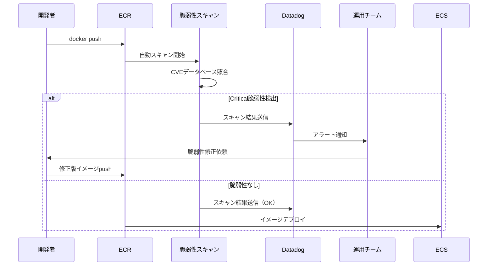

# ECR設計

## 1. 概要

ECR（Elastic Container Registry）でDockerイメージを管理します。
脆弱性スキャンを有効化し、Datadog L2監視対象とします。

## 2. ECR Repository

### 2.1 設計

| 項目 | 値 | 備考 |
|------|-----|------|
| Repository名 | `demo-api` | - |
| イメージタグミュータビリティ | `MUTABLE` | `latest` タグ上書き可能 |
| スキャン設定 | Push時に自動スキャン | **脆弱性スキャン有効** |
| 暗号化 | AES-256 | デフォルト |
| ライフサイクルポリシー | 未タグイメージ7日後削除 | ストレージ節約 |

### 2.2 Terraform 実装

```hcl
# ecr.tf

resource "aws_ecr_repository" "demo_api" {
  name                 = "demo-api"
  image_tag_mutability = "MUTABLE"

  # 脆弱性スキャン設定
  image_scanning_configuration {
    scan_on_push = true  # Push時に自動スキャン
  }

  # 暗号化設定
  encryption_configuration {
    encryption_type = "AES256"
  }

  tags = {
    Name        = "demo-api"
    Environment = "poc"
  }
}
```

## 3. ライフサイクルポリシー

### 3.1 設計

**目的**: 未タグイメージ（ビルド途中など）を自動削除し、ストレージコストを削減

| 項目 | 値 | 備考 |
|------|-----|------|
| ルール1 | 未タグイメージを7日後削除 | - |
| ルール2（オプション） | `latest` 以外の古いイメージを30個まで保持 | 本番環境推奨 |

### 3.2 Terraform 実装

```hcl
# ecr.tf (続き)

resource "aws_ecr_lifecycle_policy" "demo_api" {
  repository = aws_ecr_repository.demo_api.name

  policy = jsonencode({
    rules = [
      {
        rulePriority = 1
        description  = "未タグイメージを7日後削除"
        selection = {
          tagStatus   = "untagged"
          countType   = "sinceImagePushed"
          countUnit   = "days"
          countNumber = 7
        }
        action = {
          type = "expire"
        }
      },
      # オプション: 本番環境では以下も追加推奨
      # {
      #   rulePriority = 2
      #   description  = "latest以外のイメージを30個まで保持"
      #   selection = {
      #     tagStatus     = "tagged"
      #     tagPrefixList = ["v"]
      #     countType     = "imageCountMoreThan"
      #     countNumber   = 30
      #   }
      #   action = {
      #     type = "expire"
      #   }
      # }
    ]
  })
}
```

## 4. Repository Policy（オプション）

### 4.1 設計（参考）

本番環境では、特定のAWSアカウントからのみPull可能にするポリシーを設定します。

```hcl
# ecr.tf (続き)

# resource "aws_ecr_repository_policy" "demo_api" {
#   repository = aws_ecr_repository.demo_api.name
#
#   policy = jsonencode({
#     Version = "2012-10-17"
#     Statement = [
#       {
#         Sid    = "AllowPullFromECSExecutionRole"
#         Effect = "Allow"
#         Principal = {
#           AWS = aws_iam_role.ecs_execution_role.arn
#         }
#         Action = [
#           "ecr:GetDownloadUrlForLayer",
#           "ecr:BatchGetImage",
#           "ecr:BatchCheckLayerAvailability"
#         ]
#       }
#     ]
#   })
# }
```

## 5. 脆弱性スキャン

### 5.1 スキャン設計

| 項目 | 値 | 備考 |
|------|-----|------|
| スキャンタイミング | Push時に自動実行 | - |
| スキャン対象 | すべてのイメージ | - |
| 脆弱性データベース | AWS管理（CVE） | 自動更新 |

### 5.2 Datadog L2 監視（FR-002-3）

Datadog で以下を監視:
- ECR スキャン結果の Critical 脆弱性検出
- 閾値: Critical 脆弱性 ≥ 1 でアラート

**実装**: `terraform/datadog/modules/level2-service/` で設定

## 6. イメージプッシュ手順

### 6.1 ローカル環境からのプッシュ

```bash
# 1. ECR ログイン
aws ecr get-login-password --region ap-northeast-1 | \
  docker login --username AWS --password-stdin <AWS_ACCOUNT_ID>.dkr.ecr.ap-northeast-1.amazonaws.com

# 2. イメージビルド
cd app
docker build -t demo-api .

# 3. イメージタグ付け
docker tag demo-api:latest <ECR_URI>/demo-api:latest

# 4. イメージプッシュ
docker push <ECR_URI>/demo-api:latest

# 5. 脆弱性スキャン結果確認（数分後）
aws ecr describe-image-scan-findings \
  --repository-name demo-api \
  --image-id imageTag=latest \
  --region ap-northeast-1
```

### 6.2 CI/CD（GitHub Actions）からのプッシュ（参考）

```yaml
# .github/workflows/deploy.yml（参考）

name: Deploy to ECS

on:
  push:
    branches:
      - main

jobs:
  deploy:
    runs-on: ubuntu-latest
    steps:
      - uses: actions/checkout@v3

      - name: Configure AWS credentials
        uses: aws-actions/configure-aws-credentials@v2
        with:
          aws-access-key-id: ${{ secrets.AWS_ACCESS_KEY_ID }}
          aws-secret-access-key: ${{ secrets.AWS_SECRET_ACCESS_KEY }}
          aws-region: ap-northeast-1

      - name: Login to Amazon ECR
        id: login-ecr
        uses: aws-actions/amazon-ecr-login@v1

      - name: Build and push image
        env:
          ECR_REGISTRY: ${{ steps.login-ecr.outputs.registry }}
          ECR_REPOSITORY: demo-api
          IMAGE_TAG: ${{ github.sha }}
        run: |
          docker build -t $ECR_REGISTRY/$ECR_REPOSITORY:$IMAGE_TAG ./app
          docker push $ECR_REGISTRY/$ECR_REPOSITORY:$IMAGE_TAG
          docker tag $ECR_REGISTRY/$ECR_REPOSITORY:$IMAGE_TAG $ECR_REGISTRY/$ECR_REPOSITORY:latest
          docker push $ECR_REGISTRY/$ECR_REPOSITORY:latest
```

## 7. 出力値

### 7.1 Outputs

```hcl
# outputs.tf

output "ecr_repository_url" {
  description = "ECR Repository URL"
  value       = aws_ecr_repository.demo_api.repository_url
}

output "ecr_repository_arn" {
  description = "ECR Repository ARN"
  value       = aws_ecr_repository.demo_api.arn
}
```

## 8. ECR構成図

```mermaid
graph LR
    subgraph "開発環境"
        Local[ローカル開発<br/>Docker Build]
        CI[GitHub Actions<br/>CI/CD]
    end

    subgraph "ECR: demo-api"
        Repo[ECR Repository<br/>脆弱性スキャン有効]
        Latest[Image: latest]
        Sha[Image: git-sha]
    end

    subgraph "ECS"
        ECS[ECS Task<br/>Image Pull]
    end

    subgraph "Datadog L2 監視"
        DD[Datadog Monitor<br/>Critical脆弱性検出]
    end

    Local -->|docker push| Repo
    CI -->|docker push| Repo
    Repo --> Latest
    Repo --> Sha
    Repo -->|自動スキャン| DD
    Latest --> ECS
    Sha --> ECS

    style Repo fill:#ffddaa
    style DD fill:#ddffaa
```

## 9. コスト試算

### 9.1 ECR コスト（月額）

| 項目 | 単価 | 数量 | 月額（USD） |
|------|------|------|-----------|
| ストレージ | $0.10/GB/月 | 1 GB（イメージサイズ） | $0.10 |
| データ転送（Pull） | $0.09/GB（最初の1GBは無料） | 5 GB/月 | $0.36 |
| **合計** | - | - | **$0.46** |

**注**: データ転送はECS Fargateへのイメージプル時に発生（同一リージョン内は無料）

## 10. セキュリティ考慮事項

### 10.1 脆弱性対応フロー



### 10.2 脆弱性修正プロセス

1. Datadog L2 監視で Critical 脆弱性検出
2. 開発者にSlack通知
3. 脆弱性のあるパッケージをアップデート
4. 新バージョンをECRにプッシュ
5. 再スキャンで脆弱性解消確認
6. ECS Serviceを更新デプロイ

## 11. 運用考慮事項

### 11.1 イメージ管理

| タグ | 用途 | 備考 |
|------|------|------|
| `latest` | 検証環境 | 常に最新版 |
| `<git-sha>` | 本番環境 | バージョン追跡可能 |
| `v1.0.0` | リリースタグ | セマンティックバージョニング |

### 11.2 トラブルシューティング

| 症状 | 原因 | 対処 |
|------|------|------|
| `docker push` 失敗 | ECRログイン期限切れ | `aws ecr get-login-password` 再実行 |
| ECS Taskが起動しない | ECRイメージが存在しない | `aws ecr describe-images` で確認 |
| 脆弱性スキャン失敗 | イメージが破損 | 再ビルド・再プッシュ |

### 11.3 確認コマンド

```bash
# ECRイメージ一覧
aws ecr list-images --repository-name demo-api --region ap-northeast-1

# イメージ詳細
aws ecr describe-images --repository-name demo-api --region ap-northeast-1

# 脆弱性スキャン結果
aws ecr describe-image-scan-findings \
  --repository-name demo-api \
  --image-id imageTag=latest \
  --region ap-northeast-1 \
  --query 'imageScanFindings.findings[?severity==`CRITICAL`]'

# ECRログイン
aws ecr get-login-password --region ap-northeast-1 | \
  docker login --username AWS --password-stdin <AWS_ACCOUNT_ID>.dkr.ecr.ap-northeast-1.amazonaws.com
```

## 12. 本番環境への移行時の推奨事項

### 12.1 イメージタグ戦略

- `latest` タグは使用せず、Git SHA または セマンティックバージョニング（`v1.0.0`）
- CI/CD でタグを自動生成

### 12.2 Repository Policy

- ECS Execution Role のみ Pull 可能に制限
- 他のAWSアカウントからのアクセスは明示的に許可

### 12.3 ライフサイクルポリシー

- 本番環境では30個までのイメージを保持
- ロールバック用に過去バージョンを残す

## 13. 関連ドキュメント

| ドキュメント | パス |
|-------------|------|
| INDEX | [INDEX.md](INDEX.md) |
| ECS設計 | [02_ECS設計.md](02_ECS設計.md) |
| IAM設計 | [06_IAM設計.md](06_IAM設計.md) |

---

**作成日**: 2025-12-29
**作成者**: Infra-Architect
**バージョン**: 1.0
**ステータス**: Draft
