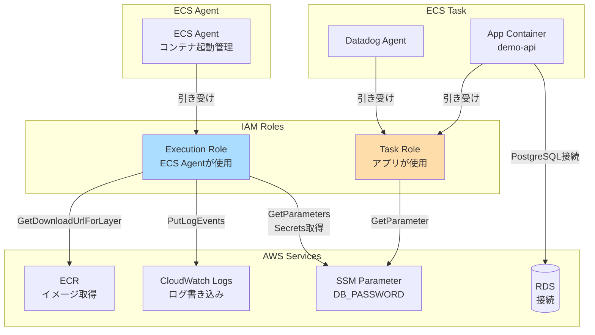

# IAM設計

## 1. 概要

ECS Fargate に必要な IAM Role を設計します。
- **Task Role**: アプリケーションが使用（RDS接続、S3アクセス等）
- **Execution Role**: ECS Agent が使用（ECRプル、CloudWatch Logs書き込み）

## 2. ECS Task Role

### 2.1 設計

**用途**: アプリケーションコンテナが使用するロール

| 項目 | 値 | 備考 |
|------|-----|------|
| ロール名 | `datadog-poc-ecs-task-role` | - |
| 信頼ポリシー | `ecs-tasks.amazonaws.com` | ECS Taskが引き受け可能 |
| ポリシー | カスタムポリシー | RDS接続、SSM Parameter読み取り |

### 2.2 許可する権限

| アクション | リソース | 用途 |
|---------|---------|------|
| `rds:DescribeDBInstances` | `*` | RDS情報取得（オプション） |
| `ssm:GetParameter` | `/datadog-poc/*` | SSM Parameterから設定取得 |
| `ssm:GetParameters` | `/datadog-poc/*` | 複数パラメータ取得 |

**注**: RDS接続自体はIAM権限不要（PostgreSQL認証）

### 2.3 Terraform 実装

```hcl
# iam.tf

# ECS Task Role
resource "aws_iam_role" "ecs_task_role" {
  name = "datadog-poc-ecs-task-role"

  assume_role_policy = jsonencode({
    Version = "2012-10-17"
    Statement = [
      {
        Action = "sts:AssumeRole"
        Effect = "Allow"
        Principal = {
          Service = "ecs-tasks.amazonaws.com"
        }
      }
    ]
  })

  tags = {
    Name = "datadog-poc-ecs-task-role"
  }
}

# ECS Task Policy
resource "aws_iam_role_policy" "ecs_task_policy" {
  name = "datadog-poc-ecs-task-policy"
  role = aws_iam_role.ecs_task_role.id

  policy = jsonencode({
    Version = "2012-10-17"
    Statement = [
      {
        Effect = "Allow"
        Action = [
          "ssm:GetParameter",
          "ssm:GetParameters"
        ]
        Resource = "arn:aws:ssm:ap-northeast-1:*:parameter/datadog-poc/*"
      }
    ]
  })
}
```

## 3. ECS Execution Role

### 3.1 設計

**用途**: ECS Agent が使用するロール（ECRプル、CloudWatch Logs書き込み）

| 項目 | 値 | 備考 |
|------|-----|------|
| ロール名 | `datadog-poc-ecs-execution-role` | - |
| 信頼ポリシー | `ecs-tasks.amazonaws.com` | ECS Taskが引き受け可能 |
| マネージドポリシー | `AmazonECSTaskExecutionRolePolicy` | AWS管理ポリシー |
| 追加ポリシー | SSM Parameter取得（Secrets用） | - |

### 3.2 許可する権限

| アクション | リソース | 用途 |
|---------|---------|------|
| `ecr:GetAuthorizationToken` | `*` | ECRログイン |
| `ecr:BatchCheckLayerAvailability` | ECR Repository | イメージレイヤー確認 |
| `ecr:GetDownloadUrlForLayer` | ECR Repository | イメージダウンロード |
| `ecr:BatchGetImage` | ECR Repository | イメージ取得 |
| `logs:CreateLogStream` | CloudWatch Logs | ログストリーム作成 |
| `logs:PutLogEvents` | CloudWatch Logs | ログ書き込み |
| `ssm:GetParameters` | `/datadog-poc/*` | Secrets（DB_PASSWORD）取得 |

### 3.3 Terraform 実装

```hcl
# iam.tf (続き)

# ECS Execution Role
resource "aws_iam_role" "ecs_execution_role" {
  name = "datadog-poc-ecs-execution-role"

  assume_role_policy = jsonencode({
    Version = "2012-10-17"
    Statement = [
      {
        Action = "sts:AssumeRole"
        Effect = "Allow"
        Principal = {
          Service = "ecs-tasks.amazonaws.com"
        }
      }
    ]
  })

  tags = {
    Name = "datadog-poc-ecs-execution-role"
  }
}

# AWS管理ポリシーをアタッチ
resource "aws_iam_role_policy_attachment" "ecs_execution_role_policy" {
  role       = aws_iam_role.ecs_execution_role.name
  policy_arn = "arn:aws:iam::aws:policy/service-role/AmazonECSTaskExecutionRolePolicy"
}

# 追加ポリシー: SSM Parameter 取得（Secrets用）
resource "aws_iam_role_policy" "ecs_execution_ssm_policy" {
  name = "datadog-poc-ecs-execution-ssm-policy"
  role = aws_iam_role.ecs_execution_role.id

  policy = jsonencode({
    Version = "2012-10-17"
    Statement = [
      {
        Effect = "Allow"
        Action = [
          "ssm:GetParameters"
        ]
        Resource = "arn:aws:ssm:ap-northeast-1:*:parameter/datadog-poc/*"
      }
    ]
  })
}
```

## 4. VPC Flow Logs IAM Role

### 4.1 設計

**用途**: VPC Flow Logs が CloudWatch Logs に書き込むためのロール

| 項目 | 値 | 備考 |
|------|-----|------|
| ロール名 | `datadog-poc-vpc-flow-logs-role` | - |
| 信頼ポリシー | `vpc-flow-logs.amazonaws.com` | - |
| ポリシー | CloudWatch Logs 書き込み | - |

### 4.2 Terraform 実装

```hcl
# vpc.tf（再掲）

resource "aws_iam_role" "vpc_flow_logs" {
  name = "datadog-poc-vpc-flow-logs-role"

  assume_role_policy = jsonencode({
    Version = "2012-10-17"
    Statement = [
      {
        Action = "sts:AssumeRole"
        Effect = "Allow"
        Principal = {
          Service = "vpc-flow-logs.amazonaws.com"
        }
      }
    ]
  })

  tags = {
    Name = "datadog-poc-vpc-flow-logs-role"
  }
}

resource "aws_iam_role_policy" "vpc_flow_logs" {
  name = "datadog-poc-vpc-flow-logs-policy"
  role = aws_iam_role.vpc_flow_logs.id

  policy = jsonencode({
    Version = "2012-10-17"
    Statement = [
      {
        Action = [
          "logs:CreateLogGroup",
          "logs:CreateLogStream",
          "logs:PutLogEvents",
          "logs:DescribeLogGroups",
          "logs:DescribeLogStreams"
        ]
        Effect   = "Allow"
        Resource = "*"
      }
    ]
  })
}
```

## 5. IAM Role 構成図



## 6. 最小権限の原則

### 6.1 Task Role vs Execution Role の使い分け

| アクション | 使用するロール | 理由 |
|---------|-------------|------|
| RDS接続 | Task Role | アプリケーションの操作 |
| S3アクセス（将来） | Task Role | アプリケーションの操作 |
| ECRイメージプル | Execution Role | ECS Agentの操作 |
| CloudWatch Logs書き込み | Execution Role | ECS Agentの操作 |
| Secrets（SSM Parameter）取得 | **両方** | Execution: Task起動時、Task: 実行時 |

### 6.2 リソースベースのポリシー

```hcl
# iam.tf（推奨パターン）

# ❌ Bad: Resource = "*"（広すぎる）
# policy = jsonencode({
#   Statement = [
#     {
#       Action   = "ssm:GetParameter"
#       Resource = "*"  # すべてのSSM Parameterにアクセス可能
#     }
#   ]
# })

# ✅ Good: Resource = 特定のパス
policy = jsonencode({
  Statement = [
    {
      Action   = "ssm:GetParameter"
      Resource = "arn:aws:ssm:ap-northeast-1:*:parameter/datadog-poc/*"
    }
  ]
})
```

## 7. 出力値

### 7.1 Outputs

```hcl
# outputs.tf

output "ecs_task_role_arn" {
  description = "ECS Task Role ARN"
  value       = aws_iam_role.ecs_task_role.arn
}

output "ecs_execution_role_arn" {
  description = "ECS Execution Role ARN"
  value       = aws_iam_role.ecs_execution_role.arn
}
```

## 8. セキュリティ考慮事項

### 8.1 IAM Policy のベストプラクティス

| 項目 | 推奨 | 理由 |
|------|------|------|
| `Resource` | 特定のARN | 最小権限の原則 |
| `Action` | 必要最小限 | 過剰な権限付与を防ぐ |
| `Condition` | 必要に応じて追加 | さらに厳格な制御 |

### 8.2 Secrets 管理

**重要**: ECS Task Definition で Secrets を参照する場合、Execution Role に SSM Parameter 取得権限が必要

```hcl
# ecs.tf（再掲）

secrets = [
  {
    name      = "DB_PASSWORD"
    valueFrom = aws_ssm_parameter.db_password.arn  # SSM Parameter ARN
  }
]
```

Execution Role に以下の権限が必要:
- `ssm:GetParameters`
- リソース: `arn:aws:ssm:ap-northeast-1:*:parameter/datadog-poc/*`

## 9. トラブルシューティング

### 9.1 よくあるエラー

| エラー | 原因 | 対処 |
|------|------|------|
| `CannotPullContainerError` | Execution Role に ECR Pull 権限不足 | `AmazonECSTaskExecutionRolePolicy` アタッチ確認 |
| `ResourceInitializationError` | Execution Role に Secrets 取得権限不足 | `ssm:GetParameters` 権限追加 |
| Task内でSSM Parameter取得失敗 | Task Role に SSM 権限不足 | `ssm:GetParameter` 権限追加 |

### 9.2 確認コマンド

```bash
# IAM Role 確認
aws iam get-role --role-name datadog-poc-ecs-task-role
aws iam get-role --role-name datadog-poc-ecs-execution-role

# アタッチされたポリシー確認
aws iam list-attached-role-policies --role-name datadog-poc-ecs-execution-role

# インラインポリシー確認
aws iam list-role-policies --role-name datadog-poc-ecs-task-role
aws iam get-role-policy --role-name datadog-poc-ecs-task-role --policy-name datadog-poc-ecs-task-policy
```

## 10. 本番環境への移行時の推奨事項

### 10.1 IAM Policy の厳格化

- `Resource` を具体的なARNに限定
- `Condition` を使用して、特定のIPアドレスからのみアクセス可能にする

### 10.2 IAM Access Analyzer

- IAM Access Analyzer を有効化し、外部エンティティへのアクセスを検出

### 10.3 AWS CloudTrail

- IAM操作のログを CloudTrail で記録し、Datadog で監視

## 11. 関連ドキュメント

| ドキュメント | パス |
|-------------|------|
| INDEX | [INDEX.md](INDEX.md) |
| ECS設計 | [02_ECS設計.md](02_ECS設計.md) |
| RDS設計 | [04_RDS設計.md](04_RDS設計.md) |
| ECR設計 | [05_ECR設計.md](05_ECR設計.md) |
| CloudWatch設計 | [07_CloudWatch設計.md](07_CloudWatch設計.md) |

---

**作成日**: 2025-12-29
**作成者**: Infra-Architect
**バージョン**: 1.0
**ステータス**: Draft
