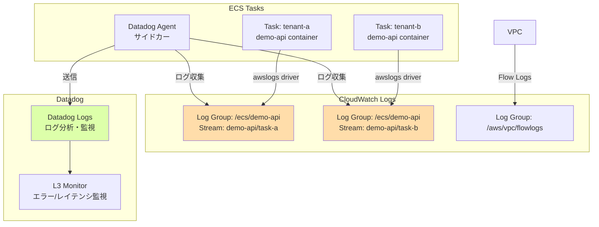

# CloudWatch設計

## 1. 概要

CloudWatch Logs でECS Task ログとVPC Flow Logs を管理します。
Datadog が CloudWatch Logs を収集し、L0/L2/L3 監視に使用します。

## 2. CloudWatch Logs Groups

### 2.1 ECS Task Logs

| 項目 | 値 | 備考 |
|------|-----|------|
| ロググループ名 | `/ecs/demo-api` | 全テナント共通 |
| ログストリーム | `demo-api/{task_id}` | タスクごと |
| | `datadog-agent/{task_id}` | Datadog Agent用 |
| 保持期間 | `7` 日 | PoC用、本番では30日推奨 |
| 暗号化 | デフォルト | AES-256 |

### 2.2 VPC Flow Logs

| 項目 | 値 | 備考 |
|------|-----|------|
| ロググループ名 | `/aws/vpc/flowlogs` | - |
| 保持期間 | `7` 日 | PoC用、本番では30日推奨 |
| 暗号化 | デフォルト | AES-256 |

### 2.3 RDS Logs

| 項目 | 値 | 備考 |
|------|-----|------|
| ロググループ名 | `/aws/rds/instance/datadog-poc-db/postgresql` | 自動作成 |
| 保持期間 | `7` 日 | デフォルト |

## 3. Terraform 実装

### 3.1 ECS Task Logs

```hcl
# cloudwatch.tf

# ECS Task Logs
resource "aws_cloudwatch_log_group" "ecs" {
  name              = "/ecs/demo-api"
  retention_in_days = 7

  tags = {
    Name        = "demo-api-logs"
    Environment = "poc"
  }
}
```

### 3.2 VPC Flow Logs

```hcl
# cloudwatch.tf (続き)

# VPC Flow Logs
resource "aws_cloudwatch_log_group" "vpc_flow_logs" {
  name              = "/aws/vpc/flowlogs"
  retention_in_days = 7

  tags = {
    Name = "datadog-poc-vpc-flow-logs"
  }
}
```

## 4. ログフォーマット

### 4.1 ECS Task Logs（JSON形式）

アプリケーションログはJSON形式で出力し、Datadog で構造化ログとして解析します。

**推奨フォーマット**:
```json
{
  "timestamp": "2025-12-29T12:00:00Z",
  "level": "INFO",
  "tenant_id": "tenant-a",
  "message": "Health check OK",
  "latency_ms": 15
}
```

### 4.2 VPC Flow Logs（デフォルトフォーマット）

```
version account-id interface-id srcaddr dstaddr srcport dstport protocol packets bytes start end action log-status
```

**例**:
```
2 123456789012 eni-1234567890abcdef0 10.0.1.5 10.0.21.10 49152 5432 6 20 4000 1640000000 1640000060 ACCEPT OK
```

## 5. Datadog ログ収集設定

### 5.1 ECS Task からの直接送信

Datadog Agent コンテナ（サイドカー）が ECS Task ログを収集し、Datadog SaaS へ送信します。

**ECS Task Definition（再掲）**:
```hcl
# ecs.tf

container_definitions = jsonencode([
  {
    name = "demo-api"
    # ... 既存設定 ...
    logConfiguration = {
      logDriver = "awslogs"
      options = {
        "awslogs-group"         = aws_cloudwatch_log_group.ecs.name
        "awslogs-region"        = "ap-northeast-1"
        "awslogs-stream-prefix" = "demo-api"
      }
    }
  },
  {
    name = "datadog-agent"
    # ... 既存設定 ...
    environment = [
      {
        name  = "DD_LOGS_ENABLED"
        value = "true"
      },
      {
        name  = "DD_LOGS_CONFIG_CONTAINER_COLLECT_ALL"
        value = "true"  # すべてのコンテナログを収集
      }
    ]
  }
])
```

### 5.2 CloudWatch Logs → Datadog Lambda Forwarder（オプション）

**オプション**: CloudWatch Logs を Lambda Forwarder 経由で Datadog に送信する方法もあります。

**メリット**:
- ECS Task に Datadog Agent 不要
- VPC Flow Logs も同じ方法で収集可能

**デメリット**:
- Lambda 実行コスト
- レイテンシが高い（数秒遅延）

**PoCでは ECS Taskサイドカー方式を採用**

## 6. ログ保持期間

### 6.1 設計方針

| ロググループ | 保持期間 | 理由 |
|-----------|---------|------|
| `/ecs/demo-api` | 7日 | PoC用、本番では30日推奨 |
| `/aws/vpc/flowlogs` | 7日 | PoC用、本番では30日推奨 |
| `/aws/rds/instance/.../postgresql` | 7日 | デフォルト |

**注**: Datadog にログを送信後、CloudWatch Logs は短期保持でコスト削減可能

## 7. CloudWatch Logs Insights

### 7.1 クエリ例（テナント別エラーログ）

```sql
fields @timestamp, @message
| filter tenant_id = "tenant-a" and level = "ERROR"
| sort @timestamp desc
| limit 100
```

### 7.2 クエリ例（レイテンシ分析）

```sql
fields @timestamp, tenant_id, latency_ms
| filter tenant_id = "tenant-a"
| stats avg(latency_ms), max(latency_ms), pct(latency_ms, 99) by bin(5m)
```

## 8. Datadog L3 監視との連携

### 8.1 ログベース監視（FR-003-2）

Datadog Monitor で以下のログを監視:

**エラーログ監視**:
- クエリ: `source:ecs service:demo-api tenant_id:tenant-a status:error`
- 閾値: 5分間で10件以上のエラー

**レイテンシ監視（FR-003-3）**:
- クエリ: `source:ecs service:demo-api tenant_id:tenant-a`
- メトリクス: `latency_ms` のp99
- 閾値: p99 > 500ms

**実装**: `terraform/datadog/modules/level3-tenant/` で設定

## 9. CloudWatch Logs 構成図



## 10. コスト試算

### 10.1 CloudWatch Logs コスト（月額）

| 項目 | 単価 | 数量 | 月額（USD） |
|------|------|------|-----------|
| ログ取り込み | $0.50/GB | 2 GB | $1.00 |
| ログ保存（7日） | $0.03/GB | 2 GB | $0.06 |
| Logs Insights クエリ | $0.005/GB | 0.5 GB | $0.003 |
| **合計** | - | - | **$1.06** |

**注**: 想定ログ量は1日約70 MB（3テナント、7日保持で約500 MB）

## 11. セキュリティ考慮事項

### 11.1 ログの暗号化

| 項目 | 設定 | 備考 |
|------|------|------|
| 保存時の暗号化 | デフォルト有効 | AES-256 |
| KMS Key | デフォルトキー | `alias/aws/logs` |
| 通信時の暗号化 | HTTPS | Datadog API 通信 |

### 11.2 ログアクセス制御

- **IAM Policy**: Execution Role のみ CloudWatch Logs 書き込み可能
- **VPC Endpoint**（オプション）: CloudWatch Logs へのプライベート接続

## 12. 運用考慮事項

### 12.1 ログ確認コマンド

```bash
# リアルタイムログ監視
aws logs tail /ecs/demo-api --follow --region ap-northeast-1

# 特定ログストリーム
aws logs tail /ecs/demo-api --log-stream-name-prefix demo-api/tenant-a --follow

# VPC Flow Logs 確認
aws logs tail /aws/vpc/flowlogs --follow --region ap-northeast-1

# Logs Insights クエリ実行
aws logs start-query \
  --log-group-name /ecs/demo-api \
  --start-time $(date -u -d '1 hour ago' +%s) \
  --end-time $(date -u +%s) \
  --query-string 'fields @timestamp, @message | filter level = "ERROR"'
```

### 12.2 トラブルシューティング

| 症状 | 原因 | 対処 |
|------|------|------|
| ログが表示されない | Execution Role に CloudWatch Logs 書き込み権限不足 | IAM設計確認 |
| | ログドライバー設定ミス | Task Definition 確認 |
| ログ保持期間が無期限 | `retention_in_days` 未設定 | Terraform で設定 |
| Datadog にログが届かない | Datadog Agent の `DD_LOGS_ENABLED` が `false` | 環境変数確認 |

## 13. 本番環境への移行時の推奨事項

### 13.1 ログ保持期間

- ECS Logs: 30日
- VPC Flow Logs: 30日
- RDS Logs: 30日

### 13.2 CloudWatch Logs Subscription Filter

本番環境では、CloudWatch Logs Subscription Filter で以下を設定:
- 特定のエラーログを SNS 経由で即座に通知
- Lambda Forwarder で Datadog に送信（冗長化）

### 13.3 ログアーカイブ

長期保存が必要な場合、S3 にエクスポート:

```bash
aws logs create-export-task \
  --log-group-name /ecs/demo-api \
  --from $(date -u -d '30 days ago' +%s)000 \
  --to $(date -u +%s)000 \
  --destination s3-bucket-name \
  --destination-prefix ecs-logs/
```

## 14. 関連ドキュメント

| ドキュメント | パス |
|-------------|------|
| INDEX | [INDEX.md](INDEX.md) |
| VPC設計 | [01_VPC設計.md](01_VPC設計.md) |
| ECS設計 | [02_ECS設計.md](02_ECS設計.md) |
| RDS設計 | [04_RDS設計.md](04_RDS設計.md) |
| IAM設計 | [06_IAM設計.md](06_IAM設計.md) |

---

**作成日**: 2025-12-29
**作成者**: Infra-Architect
**バージョン**: 1.0
**ステータス**: Draft
