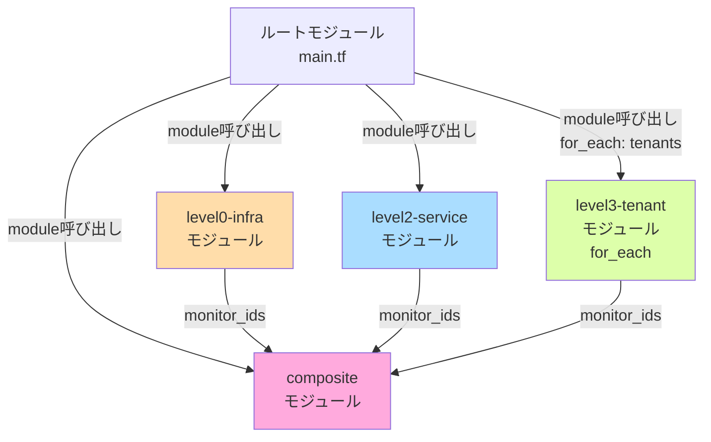

# Datadog 監視設計 INDEX

## 概要

本ディレクトリは、Datadog監視設定のTerraform詳細設計を格納します。

### 監視階層構造

```
[L0] RDS/ECS基盤監視（親）
     ↓ OKなら
[L2] テナント別ヘルスチェック
     ↓ OKなら
[L3] テナント別詳細監視（子）← エラーログ、レイテンシ、エラー率
```

### Composite Monitor によるアラート抑制

- L0（インフラ基盤）障害時 → L2/L3 アラートを抑制
- L2（サービス）障害時 → L3 アラートを抑制
- これにより、根本原因のみ通知されます

---

## ドキュメント構成

| モジュール | 詳細設計 | パラメータシート | 構築手順書 | 概要 |
|----------|----------|--------------|-----------|------|
| **level0-infra** | [01_モジュール詳細設計.md](level0-infra/01_モジュール詳細設計.md) | [02_パラメータシート.md](level0-infra/02_パラメータシート.md) | [03_構築手順書.md](level0-infra/03_構築手順書.md) | L0 インフラ監視（RDS、ECS、VPC） |
| **level2-service** | [01_モジュール詳細設計.md](level2-service/01_モジュール詳細設計.md) | [02_パラメータシート.md](level2-service/02_パラメータシート.md) | [03_構築手順書.md](level2-service/03_構築手順書.md) | L2 サービス監視（ALB、ECS Task、ECR） |
| **level3-tenant** | [01_モジュール詳細設計.md](level3-tenant/01_モジュール詳細設計.md) | [02_パラメータシート.md](level3-tenant/02_パラメータシート.md) | [03_構築手順書.md](level3-tenant/03_構築手順書.md) | L3 テナント監視（for_each）|
| **composite** | [01_モジュール詳細設計.md](composite/01_モジュール詳細設計.md) | [02_パラメータシート.md](composite/02_パラメータシート.md) | [03_構築手順書.md](composite/03_構築手順書.md) | Composite Monitor（親子関係） |
| **root** | [01_ルートモジュール詳細設計.md](root/01_ルートモジュール詳細設計.md) | [02_環境別パラメータ.md](root/02_環境別パラメータ.md) | [03_デプロイ手順書.md](root/03_デプロイ手順書.md) | ルートモジュール（main.tf、variables.tf） |

---

## モジュール間の依存関係



**凡例**:
- オレンジ: L0 インフラ監視
- 青: L2 サービス監視
- 緑: L3 テナント監視
- ピンク: Composite Monitor

---

## 実装順序

1. **level0-infra モジュール** → L0 Monitor 作成
2. **level2-service モジュール** → L2 Monitor 作成
3. **level3-tenant モジュール** → L3 Monitor 作成（for_each でテナント展開）
4. **composite モジュール** → Composite Monitor 作成（L0/L2/L3のIDを参照）
5. **ルートモジュール** → 全モジュールの統合

**重要**: Composite Monitor は L0/L2/L3 の Monitor ID に依存するため、**最後に実装**します。

---

## 基本設計との対応

| 基本設計書 | 詳細設計での対応 |
|-----------|---------------|
| [監視設計.md](../../01_基本設計/05_監視設計.md) | 各レベルのMonitor定義を詳細化 |
| [IaC方針.md](../../01_基本設計/10_IaC方針.md) | モジュール構成、ディレクトリ構成を実装レベルで定義 |
| [セキュリティ設計.md](../../01_基本設計/03_セキュリティ設計.md) | API Key管理方針 |

---

## テナント追加・削除

### テナント追加

```powershell
# 1. terraform.tfvars を編集（tenant-d を追加）
tenants = {
  tenant-a = { ... }
  tenant-b = { ... }
  tenant-c = { ... }
  tenant-d = { ... }  # 追加
}

# 2. plan（dry-run）
terraform plan -out=tfplan

# 3. 確認（L3 Monitor 4個追加を確認）
# Plan: 4 to add, 0 to change, 0 to destroy.

# 4. apply
terraform apply tfplan
```

### テナント削除

```powershell
# 1. terraform.tfvars を編集（tenant-c を削除）

# 2. plan（dry-run）
terraform plan -out=tfplan

# 3. 確認（L3 Monitor 4個削除を確認）
# Plan: 0 to add, 0 to change, 4 to destroy.

# 4. apply
terraform apply tfplan
```

**重要**: `for_each` を使用しているため、既存テナントに影響はありません。

---

## セキュリティ考慮事項

| 機密情報 | 管理方法 | Gitコミット |
|---------|---------|-----------|
| Datadog API Key | 環境変数 `TF_VAR_datadog_api_key` | ❌ 禁止 |
| Datadog APP Key | 環境変数 `TF_VAR_datadog_app_key` | ❌ 禁止 |

詳細: [セキュリティ設計.md](../../01_基本設計/03_セキュリティ設計.md)

---

**作成日**: 2025-12-29
**作成者**: Infra-Architect
**バージョン**: 1.0
**ステータス**: Draft
