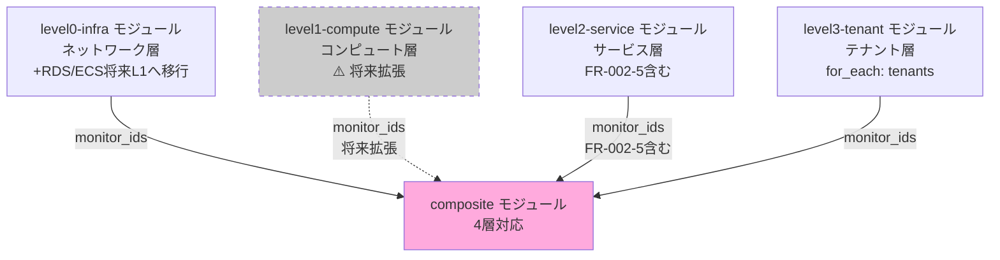

# composite モジュール詳細設計

## 1. モジュール概要

### 責務
Composite Monitor を作成し、**L0/L1/L2/L3の4層親子関係**によるアラート抑制を実現します。

**核心の仕組み**:
```
L0 障害発生 → L1/L2/L3 アラート抑制
L1 障害発生 → L2/L3 アラート抑制（L0正常時のみ）
L2 障害発生 → L3 アラート抑制（L0/L1正常時のみ）
L3 障害発生 → テナント固有の問題として通知
```

### 監視階層の定義（4層モデル）

| レイヤー | 監視対象 | 影響範囲 | 障害時の抑制対象 | PoC実装状況 |
|---------|---------|---------|--------------|------------|
| **L0（ネットワーク）** | VPC Flow Logs、NAT Gateway、ルーティング | 全テナント | L1/L2/L3 | ✅ 実装済み |
| **L1（コンピュート）** | RDS、ECS、ALB、Datadog Agent | 全テナント | L2/L3 | ⚠️ 将来拡張（現在L0に含む） |
| **L2（サービス）** | E2Eヘルスチェック、ECR脆弱性 | 該当サービス | L3 | ✅ 実装済み |
| **L3（テナント）** | テナント別監視（ヘルスチェック、エラーログ、レイテンシ） | 該当テナントのみ | なし | ✅ 実装済み |

**PoC実装範囲**: L0 + L2 + L3（L1は将来拡張）

### Composite Monitor 一覧（PoC実装）

| Composite Monitor | 論理式 | 抑制対象 | 実装状況 |
|------------------|--------|---------|---------|
| L0-Composite | L0-VPC-Flow \|\| L0-Agent \|\| **L0-RDS-CPU** \|\| **L0-RDS-Conn** \|\| ... | L1/L2/L3を抑制 | ✅ 実装済み（ECS/RDSを含む） |
| **L1-Composite** | **L1-RDS-CPU** \|\| **L1-RDS-Conn** \|\| **L1-ECS-Tasks** \|\| ... && NOT L0-Composite | L2/L3を抑制 | ⚠️ 将来拡張 |
| L2-Composite | (L2-E2E-Health \|\| L2-ECR-Vuln) && NOT L0-Composite **&& NOT L1-Composite** | L3を抑制 | ✅ 実装済み（L1対応は将来） |
| L3-Composite（tenant-a） | (L3-Health \|\| L3-Error \|\| L3-Latency) && NOT L0-Composite **&& NOT L1-Composite** && NOT L2-Composite | 抑制なし | ✅ 実装済み（L1対応は将来） |

**注記**: 太字はL1層に移行予定のMonitor（現在はL0に含む）

### 基本設計との対応
- [05_監視設計.md § 3 Composite Monitor の設計](../../01_基本設計/05_監視設計.md)（v1.3 - 4層モデル）
- [10_IaC方針.md § 3.4](../../01_基本設計/10_IaC方針.md)

---

## 2. ディレクトリ構成

```
modules/composite/
├── main.tf           # モジュールのエントリーポイント
├── variables.tf      # 入力変数定義
├── outputs.tf        # 出力定義（Composite Monitor ID等）
└── composites.tf     # Composite Monitor の定義
```

---

## 3. variables.tf の詳細

### 入力変数一覧

| 変数名 | 型 | デフォルト値 | 説明 |
|-------|------|------------|------|
| `l0_monitor_ids` | map(string) | - | L0 Monitor のIDマップ（例: {vpc_flow = "123", ...}） |
| **`l1_monitor_ids`** | **map(string)** | **{}** | **L1 Monitor のIDマップ（将来拡張）** |
| `l2_monitor_ids` | map(string) | - | L2 Monitor のIDマップ（FR-002-5を含む） |
| `l3_monitor_ids` | map(map(string)) | - | L3 Monitor のIDマップ（テナントごと） |
| `tenants` | map(object) | - | テナント定義 |
| `notification_channels` | list(string) | [] | 通知先（Slack、Email等） |
| `tags` | map(string) | {} | Monitor に付与するタグ |

### variables.tf 実装例

```hcl
variable "l0_monitor_ids" {
  description = "L0 Monitor のIDマップ（ネットワーク層）"
  type        = map(string)
}

variable "l1_monitor_ids" {
  description = <<-EOT
    L1 Monitor のIDマップ（コンピュート層、将来拡張）
    例: {
      rds_cpu = "123",
      rds_conn = "456",
      ecs_tasks = "789"
    }
    ⚠️ PoC段階では空mapを渡す（L0にRDS/ECSが含まれているため）
  EOT
  type        = map(string)
  default     = {}
}

variable "l2_monitor_ids" {
  description = <<-EOT
    L2 Monitor のIDマップ（サービス層）
    例: {
      e2e_health_check = "012",
      ecr_vulnerability = "789"
    }
  EOT
  type        = map(string)
}

variable "l3_monitor_ids" {
  description = "L3 Monitor のIDマップ（テナントごと）"
  type        = map(map(string))
  # 例:
  # {
  #   "tenant-a" = { health_check = "123", error_logs = "456", latency = "789" }
  #   "tenant-b" = { health_check = "124", error_logs = "457", latency = "790" }
  # }
}

variable "tenants" {
  description = "テナント定義"
  type = map(object({
    errors_threshold  = number
    latency_threshold = number
  }))
}

variable "notification_channels" {
  description = "通知先（Slack、Email、PagerDuty等）"
  type        = list(string)
  default     = []
}

variable "tags" {
  description = "Monitor に付与するタグ"
  type        = map(string)
  default     = {}
}
```

---

## 4. composites.tf の詳細

### 4.1 L0-Composite Monitor（ネットワーク層）

```hcl
# L0 Composite Monitor（ネットワーク層）
resource "datadog_monitor" "l0_composite" {
  name    = "[L0 Composite] ネットワーク層障害"
  type    = "composite"
  query   = join(" || ", [
    for monitor_id in values(var.l0_monitor_ids) : "${monitor_id}"
  ])
  message = <<-EOT
    [L0 Composite] ネットワーク層で障害が発生しました。
    - 影響: 全テナント
    - 対応: インフラチームが調査中

    詳細: {{#is_alert}}
    以下のL0 Monitorがアラート状態です:
    {{#each alerting_monitors}}
    - {{this.name}}
    {{/each}}
    {{/is_alert}}

    ⚠️ PoC実装範囲: L0にはVPC Flow Logs、Datadog Agent、**RDS、ECS**（将来L1に移行予定）が含まれます。

    ${join("\n", var.notification_channels)}
  EOT

  tags = concat(
    ["layer:l0", "composite:true", "severity:critical"],
    [for k, v in var.tags : "${k}:${v}"]
  )

  notify_no_data    = false
  renotify_interval = 0
}
```

### 4.2 L1-Composite Monitor（コンピュート層、将来拡張）

```hcl
# L1 Composite Monitor（コンピュート層、将来拡張）
resource "datadog_monitor" "l1_composite" {
  count = length(var.l1_monitor_ids) > 0 ? 1 : 0

  name    = "[L1 Composite] コンピュート層障害"
  type    = "composite"
  query   = "(${join(" || ", [for monitor_id in values(var.l1_monitor_ids) : "${monitor_id}"])}) && NOT ${datadog_monitor.l0_composite.id}"
  message = <<-EOT
    [L1 Composite] コンピュート層で障害が発生しました。
    - 影響: 全テナント
    - 対応: インフラチームが調査中

    詳細: {{#is_alert}}
    以下のL1 Monitorがアラート状態です:
    {{#each alerting_monitors}}
    - {{this.name}}
    {{/each}}
    {{/is_alert}}

    注: L0障害中の場合、このアラートは抑制されます。

    ${join("\n", var.notification_channels)}
  EOT

  tags = concat(
    ["layer:l1", "composite:true", "severity:critical"],
    [for k, v in var.tags : "${k}:${v}"]
  )

  notify_no_data    = false
  renotify_interval = 0
}
```

**クエリ構文の説明**:
- `count = length(var.l1_monitor_ids) > 0 ? 1 : 0`: L1 Monitor IDが渡された場合のみ作成
- `(L1-RDS-CPU || L1-RDS-Conn || L1-ECS-Tasks) && NOT L0-Composite`
- PoC段階では `var.l1_monitor_ids = {}`（空map）のため、このリソースは作成されない

### 4.3 L2-Composite Monitor（サービス層）

```hcl
# L2 Composite Monitor（サービス層）
resource "datadog_monitor" "l2_composite" {
  name    = "[L2 Composite] サービス層障害"
  type    = "composite"
  query   = local.l2_composite_query
  message = <<-EOT
    [L2 Composite] サービス層で障害が発生しました。
    - 影響: 該当サービス
    - 対応: アプリケーションチームが調査中

    詳細: {{#is_alert}}
    以下のL2 Monitorがアラート状態です:
    {{#each alerting_monitors}}
    - {{this.name}}
    {{/each}}
    {{/is_alert}}

    注: L0/L1障害中の場合、このアラートは抑制されます。

    ${join("\n", var.notification_channels)}
  EOT

  tags = concat(
    ["layer:l2", "composite:true", "severity:high"],
    [for k, v in var.tags : "${k}:${v}"]
  )

  notify_no_data    = false
  renotify_interval = 0
}

# L2 Composite クエリ生成（L1対応）
locals {
  l2_composite_query = length(var.l1_monitor_ids) > 0 ? (
    "(${join(" || ", [for monitor_id in values(var.l2_monitor_ids) : "${monitor_id}"])}) && NOT ${datadog_monitor.l0_composite.id} && NOT ${datadog_monitor.l1_composite[0].id}"
  ) : (
    "(${join(" || ", [for monitor_id in values(var.l2_monitor_ids) : "${monitor_id}"])}) && NOT ${datadog_monitor.l0_composite.id}"
  )
}
```

**クエリ構文の説明**:
- **PoC実装**: `(L2-E2E-Health || L2-ECR-Vuln) && NOT L0-Composite`
- **将来実装**: `(L2-E2E-Health || L2-ECR-Vuln) && NOT L0-Composite && NOT L1-Composite`
- `local.l2_composite_query` により、L1 Monitor IDの有無で動的にクエリを生成

### 4.4 L3-Composite Monitor（テナント層、テナントごとに for_each で作成）

```hcl
# L3 Composite Monitor（テナントごと）
resource "datadog_monitor" "l3_composite" {
  for_each = var.tenants

  name    = "[L3 Composite] ${each.key} 障害"
  type    = "composite"
  query   = local.l3_composite_query[each.key]
  message = <<-EOT
    [L3 Composite] ${each.key} で障害が発生しました。
    - 影響: ${each.key} のみ
    - 対応: 開発チームが調査中

    詳細: {{#is_alert}}
    以下のL3 Monitorがアラート状態です:
    {{#each alerting_monitors}}
    - {{this.name}}
    {{/each}}
    {{/is_alert}}

    注: L0/L1/L2障害中の場合、このアラートは抑制されます。

    ${join("\n", var.notification_channels)}
  EOT

  tags = concat(
    ["layer:l3", "tenant:${each.key}", "composite:true", "severity:medium"],
    [for k, v in var.tags : "${k}:${v}"]
  )

  notify_no_data    = false
  renotify_interval = 0
}

# L3 Composite クエリ生成（L1対応）
locals {
  l3_composite_query = {
    for tenant_id, tenant in var.tenants :
    tenant_id => length(var.l1_monitor_ids) > 0 ? (
      "(${join(" || ", [for monitor_id in values(var.l3_monitor_ids[tenant_id]) : "${monitor_id}"])}) && NOT ${datadog_monitor.l0_composite.id} && NOT ${datadog_monitor.l1_composite[0].id} && NOT ${datadog_monitor.l2_composite.id}"
    ) : (
      "(${join(" || ", [for monitor_id in values(var.l3_monitor_ids[tenant_id]) : "${monitor_id}"])}) && NOT ${datadog_monitor.l0_composite.id} && NOT ${datadog_monitor.l2_composite.id}"
    )
  }
}
```

**クエリ構文の説明**:
- **PoC実装**: `(L3-Health || L3-Error || L3-Latency) && NOT L0-Composite && NOT L2-Composite`
- **将来実装**: `(L3-Health || L3-Error || L3-Latency) && NOT L0-Composite && NOT L1-Composite && NOT L2-Composite`
- `local.l3_composite_query` により、L1 Monitor IDの有無で動的にクエリを生成

---

## 5. outputs.tf の詳細

### 出力定義

```hcl
output "composite_ids" {
  description = "Composite Monitor のIDリスト"
  value = merge(
    {
      l0 = datadog_monitor.l0_composite.id
      l2 = datadog_monitor.l2_composite.id
    },
    length(var.l1_monitor_ids) > 0 ? {
      l1 = datadog_monitor.l1_composite[0].id
    } : {},
    {
      l3 = {
        for tenant_id, composite_monitor in datadog_monitor.l3_composite :
        tenant_id => composite_monitor.id
      }
    }
  )
}

output "composite_names" {
  description = "Composite Monitor の名前リスト"
  value = merge(
    {
      l0 = datadog_monitor.l0_composite.name
      l2 = datadog_monitor.l2_composite.name
    },
    length(var.l1_monitor_ids) > 0 ? {
      l1 = datadog_monitor.l1_composite[0].name
    } : {},
    {
      l3 = {
        for tenant_id, composite_monitor in datadog_monitor.l3_composite :
        tenant_id => composite_monitor.name
      }
    }
  )
}
```

---

## 6. main.tf の詳細

**注**: このモジュールでは main.tf は空でも問題ありません（すべての Composite Monitor 定義は composites.tf に記載）。

```hcl
# composite モジュール
# Composite Monitor の作成（L0/L1/L2/L3の親子関係によるアラート抑制）
#
# ⚠️ PoC実装範囲: L0 + L2 + L3（L1は将来拡張）
# 依存: composites.tf, variables.tf, outputs.tf
```

---

## 7. アラート抑制の動作確認（4層モデル）

### 7.1 シナリオ1: L0障害（VPC Flow Logs異常）

**発生**:
1. VPC Flow Logsで異常トラフィック検知 → L0-VPC-Flow が ALERT
2. L0-Composite が ALERT（L0-VPC-Flow がトリガー）
3. 派生的に、E2Eヘルスチェック失敗 → L2-E2E-Health が ALERT
4. 派生的に、tenant-a のエラーログが増加 → L3-Error-tenant-a が ALERT

**Composite Monitor の判定**:
- L0-Composite: ALERT（通知する）
- L1-Composite: 作成されていない（PoC範囲外）
- L2-Composite: `(L2-E2E-Health = ALERT) && NOT L0-Composite` → FALSE（通知しない）
- L3-Composite-tenant-a: `(L3-Error-tenant-a = ALERT) && NOT L0-Composite && NOT L2-Composite` → FALSE（通知しない）

**結果**: L0-Composite のアラートのみ通知され、アラート地獄を回避。

### 7.2 シナリオ2: L1障害（RDS CPU高騰、将来実装）

**⚠️ PoC段階では未実装（RDS CPUはL0に含まれる）**

**将来実装時の動作**:
1. RDS CPU使用率が95%を超える → L1-RDS-CPU が ALERT
2. L1-Composite が ALERT（L1-RDS-CPU がトリガー）
3. 派生的に、E2Eヘルスチェック失敗 → L2-E2E-Health が ALERT
4. 派生的に、tenant-a のエラーログが増加 → L3-Error-tenant-a が ALERT

**Composite Monitor の判定（将来）**:
- L0-Composite: OK（L0は正常）
- L1-Composite: ALERT（通知する）
- L2-Composite: `(L2-E2E-Health = ALERT) && NOT L0-Composite && NOT L1-Composite` → FALSE（通知しない）
- L3-Composite-tenant-a: `(L3-Error-tenant-a = ALERT) && NOT L0-Composite && NOT L1-Composite && NOT L2-Composite` → FALSE（通知しない）

**結果**: L1-Composite のアラートのみ通知。

### 7.3 シナリオ3: L2障害（E2Eヘルスチェック失敗、FR-002-5）

**発生**:
1. **ALB→API→RDS のE2Eヘルスチェックが失敗 → FR-002-5 が ALERT**
2. **L2-Composite が ALERT（FR-002-5 がトリガー）**
3. 派生的に、tenant-a のヘルスチェックが失敗 → FR-003-1 が ALERT

**Composite Monitor の判定**:
- L0-Composite: OK（L0は正常）
- L1-Composite: 作成されていない（PoC範囲外）
- **L2-Composite**: `(FR-002-5 = ALERT) && NOT L0-Composite` → **TRUE（通知する）**
- L3-Composite-tenant-a: `(FR-003-1 = ALERT) && NOT L0-Composite && NOT L2-Composite` → FALSE（通知しない）

**結果**: L2-Composite のアラートのみ通知。L3アラートは抑制。

### 7.4 シナリオ4: L3障害（tenant-a のみの問題）

**発生**:
1. tenant-a のアプリケーションコードにバグ → L3-Error-tenant-a が ALERT

**Composite Monitor の判定**:
- L0-Composite: OK
- L1-Composite: 作成されていない（PoC範囲外）
- L2-Composite: OK
- L3-Composite-tenant-a: `(L3-Error-tenant-a = ALERT) && NOT L0-Composite && NOT L2-Composite` → TRUE（通知する）

**結果**: L3-Composite-tenant-a のアラートを通知。

---

## 8. 依存関係

### モジュール間の依存（4層モデル）



### 外部依存

| リソース | 依存内容 |
|---------|---------|
| Datadog Provider | `DataDog/datadog` (~> 3.30) |

**重要**: Composite Monitor は L0/L1/L2/L3 の Monitor ID に依存するため、**最後に実装**します。

---

## 9. 実装時の注意事項

### 9.1 Composite Monitor のクエリ構文

**Datadog Composite Monitor の仕様**:
- 論理演算子: `&&` (AND), `||` (OR), `NOT` (否定)
- Monitor ID参照: `${id}` 形式
- **`!` は使用できません** → `NOT` を使用

**✅ 正しい構文**:
```hcl
query = "(${id1} || ${id2}) && NOT ${id3} && NOT ${id4}"
```

**❌ 間違った構文**:
```hcl
query = "(${id1} || ${id2}) && !${id3}"  # ! は使用できない
```

### 9.2 L1層の将来拡張

**現在のPoC実装**:
- L0にRDS、ECS、ALBが含まれる
- L1-Composite は作成されない（`var.l1_monitor_ids = {}`）

**将来の拡張手順**:
1. **level1-compute モジュールを作成**:
   - `modules/level1-compute/monitors.tf` にRDS、ECS、ALB監視を移行
2. **ルートモジュールで呼び出し**:
   ```hcl
   module "level1_compute" {
     source = "./modules/level1-compute"
     # ...
   }
   ```
3. **composite モジュールに渡す**:
   ```hcl
   module "composite" {
     l1_monitor_ids = module.level1_compute.monitor_ids
     # ...
   }
   ```
4. **L0からRDS/ECS監視を削除**:
   - `modules/level0-infra/monitors.tf` からRDS、ECS監視を削除

### 9.3 Monitor ID の参照

**Terraform リソース参照**:
```hcl
datadog_monitor.l0_composite.id  # L0-Composite Monitor のID
datadog_monitor.l1_composite[0].id  # L1-Composite Monitor のID（作成された場合）
```

**変数からの参照**:
```hcl
var.l0_monitor_ids["vpc_flow"]  # L0-VPC-Flow Monitor のID
var.l1_monitor_ids["rds_cpu"]   # L1-RDS-CPU Monitor のID（将来）
```

### 9.4 L2 Monitor ID の動的取得

**重要**: `var.l2_monitor_ids` は level2-service モジュールの outputs.tf で定義されたすべてのMonitor IDを含みます。

**level2-service モジュールの outputs.tf**:
```hcl
output "monitor_ids" {
  value = merge(
    {
      ecr_vulnerability  = datadog_monitor.ecr_vulnerability.id
    },
    var.e2e_health_check_enabled ? {
      e2e_health_check = datadog_synthetics_test.e2e_health_check[0].monitor_id
    } : {}
  )
}
```

**結果**: `var.l2_monitor_ids` には以下が含まれる（e2e_health_check_enabled=true の場合）:
- `ecr_vulnerability`
- **`e2e_health_check`（FR-002-5）**

**Composite Monitor のクエリ**:
```hcl
query = "(${join(" || ", [for monitor_id in values(var.l2_monitor_ids) : "${monitor_id}"])}) && NOT ${datadog_monitor.l0_composite.id}"
```

**展開後のクエリ**（概念図）:
```
(ecr_vulnerability_id || e2e_health_check_id) && NOT l0_composite_id
```

**メリット**: level2-service モジュールで Monitor を追加しても、composite モジュールの変更は不要。

---

## 10. テスト方法

### 10.1 単体テスト

```powershell
# modules/composite ディレクトリでテスト
cd modules/composite

# terraform init
terraform init

# terraform plan（変数を渡す）
terraform plan \
  -var='l0_monitor_ids={"vpc_flow"="123","rds_cpu"="456"}' \
  -var='l1_monitor_ids={}' \
  -var='l2_monitor_ids={"e2e_health_check"="999"}' \
  -var='l3_monitor_ids={"tenant-a"={"health_check"="789"}}' \
  -var='tenants={"tenant-a"={errors_threshold=10,latency_threshold=1000}}'
```

**期待される出力**:
```
Plan: 3 to add, 0 to change, 0 to destroy.
# L0-Composite, L2-Composite, L3-Composite(tenant-a)
# L1-Composite は作成されない（l1_monitor_ids が空のため）
```

### 10.2 L2-Composite Monitor の確認

**Datadog UI での確認**:
1. **Monitors → Manage Monitors** を開く
2. `[L2 Composite] サービス層障害` を選択
3. **Query** タブで以下を確認:
   ```
   (789 || 999) && NOT 123
   ```
   - `999`: FR-002-5（E2Eヘルスチェック）のMonitor ID
   - `123`: L0-Composite のMonitor ID

---

## 11. 監視数の変更（4層モデル）

### 修正前（3層モデル）

| Composite Monitor | 含まれるMonitor数 |
|------------------|-----------------|
| L0-Composite | 7個 |
| L2-Composite | 4個 |
| L3-Composite（テナントごと） | 3個 |

### 修正後（4層モデル、PoC実装範囲）

| Composite Monitor | 含まれるMonitor数 | 実装状況 |
|------------------|-----------------|---------|
| L0-Composite（ネットワーク + RDS/ECS） | 7個（変更なし） | ✅ 実装済み |
| **L1-Composite（コンピュート）** | **0個（将来拡張）** | ⚠️ 未実装 |
| L2-Composite（サービス） | 2個（E2E Health + ECR Vuln） | ✅ 実装済み |
| L3-Composite（テナントごと） | 3個（変更なし） | ✅ 実装済み |

**影響**: PoC段階ではL1-Composite は作成されない。将来実装時にL0からRDS/ECSを移行。

---

## 12. 関連ドキュメント

| ドキュメント | パス |
|------------|------|
| 基本設計（監視設計 v1.3） | [../../01_基本設計/05_監視設計.md](../../01_基本設計/05_監視設計.md) |
| パラメータシート | [02_パラメータシート.md](02_パラメータシート.md) |
| 構築手順書 | [03_構築手順書.md](03_構築手順書.md) |
| Datadog Composite Monitor ドキュメント | https://docs.datadoghq.com/monitors/types/composite/ |

---

**作成日**: 2025-12-28
**作成者**: Infra-Architect
**バージョン**: 1.2
**ステータス**: Draft
**変更履歴**:
- 1.0 (2025-12-28): 初版作成
- 1.1 (2025-12-28): FR-002-5（E2Eヘルスチェック）がL2-Compositeに自動的に含まれることを明記、動作シナリオ追加
- 1.2 (2025-12-31): 4層モデル（L0/L1/L2/L3）に対応、L1層を将来拡張として位置づけ、PoC実装範囲明記
