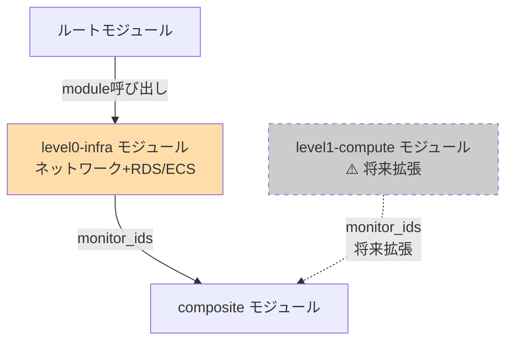

# level0-infra モジュール詳細設計

## 1. モジュール概要

### 責務
**L0（ネットワーク）層の監視Monitor**を作成します。L0障害はL1/L2/L3に影響を及ぼすため、L0 Composite Monitor が発火した際にL1/L2/L3アラートを抑制します。

### 4層監視モデルにおけるL0の位置づけ

| レイヤー | 監視対象 | 影響範囲 | PoC実装状況 |
|---------|---------|---------|------------|
| **L0（ネットワーク）** | VPC Flow Logs、**RDS/ECS（将来L1へ移行予定）**、Datadog Agent | 全テナント | ✅ 実装済み |
| L1（コンピュート） | RDS、ECS、ALB（将来移行） | 全テナント | ⚠️ 将来拡張 |
| L2（サービス） | E2Eヘルスチェック、ECR脆弱性 | 該当サービス | ✅ 実装済み |
| L3（テナント） | テナント別監視 | 該当テナントのみ | ✅ 実装済み |

**PoC実装範囲**: L0にはネットワーク層（VPC Flow Logs、Datadog Agent）に加え、**RDS、ECS**を含む（将来L1に移行予定）

### 監視対象リソース
| Monitor ID | 監視対象 | メトリクス | 影響範囲 | 将来の移行先 |
|-----------|---------|---------|---------|------------|
| L0-VPC-Flow | VPC Flow Logs 異常 | `vpc.flow.anomaly` | 全テナント | L0維持 |
| L0-Agent | Datadog Agent 死活 | `datadog.agent.up` | 全テナント | L0維持 |
| **L0-RDS-CPU** | **RDS CPU使用率** | `aws.rds.cpuutilization` | 全テナント | **→ L1へ移行** |
| **L0-RDS-Conn** | **RDS 接続数** | `aws.rds.database_connections` | 全テナント | **→ L1へ移行** |
| **L0-RDS-Mem** | **RDS メモリ** | `aws.rds.freeable_memory` | 全テナント | **→ L1へ移行** |
| **L0-RDS-Storage** | **RDS ストレージ** | `aws.rds.free_storage_space` | 全テナント | **→ L1へ移行** |
| **L0-ECS-Tasks** | **ECS Running Tasks** | `aws.ecs.running_tasks_count` | 全テナント | **→ L1へ移行** |

**注記**: 太字のMonitorは将来L1層（level1-compute モジュール）に移行予定

### 基本設計との対応
- [05_監視設計.md § 2.1 L0監視](../../01_基本設計/05_監視設計.md)（v1.3 - 4層モデル）
- [10_IaC方針.md § 3.1](../../01_基本設計/10_IaC方針.md)

---

## 2. ディレクトリ構成

```
modules/level0-infra/
├── main.tf           # モジュールのエントリーポイント
├── variables.tf      # 入力変数定義
├── outputs.tf        # 出力定義（Monitor ID等）
└── monitors.tf       # L0 Monitor の定義（7個のMonitor）
```

---

## 3. variables.tf の詳細

### 入力変数一覧

| 変数名 | 型 | デフォルト値 | 説明 | 将来の移行 |
|-------|------|------------|------|----------|
| `rds_instance_id` | string | - | RDS インスタンス識別子（例: myapp-db） | → L1 |
| `ecs_cluster_name` | string | - | ECS Cluster 名（例: myapp-cluster） | → L1 |
| `rds_cpu_threshold` | number | 95 | RDS CPU使用率の閾値（%） | → L1 |
| `rds_cpu_warning` | number | 80 | RDS CPU使用率の警告閾値（%） | → L1 |
| `rds_conn_threshold` | number | 90 | RDS 接続数の閾値（%） | → L1 |
| `rds_mem_threshold` | number | 1073741824 | RDS 空きメモリの閾値（バイト、デフォルト: 1GB） ⭐ | → L1 |
| `rds_storage_threshold` | number | 5 | RDS 空きストレージの閾値（%） | → L1 |
| `ecs_tasks_threshold` | number | 0 | ECS Running Tasks の閾値 | → L1 |
| `notification_channels` | list(string) | [] | 通知先（Slack、Email等） | L0維持 |
| `tags` | map(string) | {} | Monitor に付与するタグ | L0維持 |

### variables.tf 実装例

```hcl
variable "rds_instance_id" {
  description = <<-EOT
    RDS インスタンス識別子（例: myapp-db）
    ⚠️ 将来L1層（level1-compute モジュール）に移行予定
  EOT
  type        = string
}

variable "ecs_cluster_name" {
  description = <<-EOT
    ECS Cluster 名（例: myapp-cluster）
    ⚠️ 将来L1層（level1-compute モジュール）に移行予定
  EOT
  type        = string
}

variable "rds_cpu_threshold" {
  description = "RDS CPU使用率の閾値（%）"
  type        = number
  default     = 95
}

variable "rds_cpu_warning" {
  description = "RDS CPU使用率の警告閾値（%）"
  type        = number
  default     = 80
}

variable "rds_conn_threshold" {
  description = "RDS 接続数の閾値（%）"
  type        = number
  default     = 90
}

variable "rds_mem_threshold" {
  description = <<-EOT
    RDS 空きメモリの閾値（バイト）
    例: 1GB = 1073741824、500MB = 524288000
    ⭐ AWS CloudWatchでは総メモリ量メトリクスが提供されていないため、絶対値で監視
  EOT
  type        = number
  default     = 1073741824  # 1GB
}

variable "rds_storage_threshold" {
  description = "RDS 空きストレージの閾値（%）"
  type        = number
  default     = 5
}

variable "ecs_tasks_threshold" {
  description = "ECS Running Tasks の閾値（この値以下でアラート）"
  type        = number
  default     = 0
}

variable "notification_channels" {
  description = "通知先（Slack、Email、PagerDuty等）"
  type        = list(string)
  default     = []
}

variable "tags" {
  description = "Monitor に付与するタグ"
  type        = map(string)
  default     = {}
}
```

---

## 4. monitors.tf の詳細

### 4.1 L0-RDS-CPU Monitor（将来L1へ移行）

```hcl
resource "datadog_monitor" "rds_cpu" {
  name    = "[L0] RDS CPU使用率"
  type    = "metric alert"
  query   = "avg(last_5m):avg:aws.rds.cpuutilization{dbinstanceidentifier:${var.rds_instance_id}} > ${var.rds_cpu_threshold}"
  message = <<-EOT
    [L0] RDS CPU使用率が${var.rds_cpu_threshold}%を超えました。
    - DB: ${var.rds_instance_id}
    - CPU: {{value}}%
    - 影響: 全テナント

    ⚠️ 将来L1層（コンピュート層）に移行予定

    ${join("\n", var.notification_channels)}
  EOT

  thresholds = {
    critical = var.rds_cpu_threshold
    warning  = var.rds_cpu_warning
  }

  tags = concat(
    ["layer:l0", "resource:rds", "severity:critical", "future_layer:l1"],
    [for k, v in var.tags : "${k}:${v}"]
  )

  notify_no_data    = false
  renotify_interval = 0
}
```

### 4.2 L0-RDS-Conn Monitor（将来L1へ移行）

```hcl
resource "datadog_monitor" "rds_conn" {
  name    = "[L0] RDS 接続数"
  type    = "metric alert"
  query   = "avg(last_5m):(avg:aws.rds.database_connections{dbinstanceidentifier:${var.rds_instance_id}} / avg:aws.rds.database_connections.max{dbinstanceidentifier:${var.rds_instance_id}}) * 100 > ${var.rds_conn_threshold}"
  message = <<-EOT
    [L0] RDS 接続数が${var.rds_conn_threshold}%を超えました。
    - DB: ${var.rds_instance_id}
    - 接続数: {{value}}%
    - 影響: 全テナント

    ⚠️ 将来L1層（コンピュート層）に移行予定

    ${join("\n", var.notification_channels)}
  EOT

  thresholds = {
    critical = var.rds_conn_threshold
    warning  = 70
  }

  tags = concat(
    ["layer:l0", "resource:rds", "severity:critical", "future_layer:l1"],
    [for k, v in var.tags : "${k}:${v}"]
  )

  notify_no_data    = false
  renotify_interval = 0
}
```

### 4.3 L0-RDS-Mem Monitor（将来L1へ移行）

**修正前の問題点**:
- `aws.rds.freeable_memory.used` メトリクスは存在しない
- AWS CloudWatchではRDS総メモリ量メトリクスが提供されていない

**修正後のアプローチ（バイト値での絶対値監視）**:

```hcl
resource "datadog_monitor" "rds_mem" {
  name    = "[L0] RDS 空きメモリ"
  type    = "metric alert"
  query   = "avg(last_5m):avg:aws.rds.freeable_memory{dbinstanceidentifier:${var.rds_instance_id}} < ${var.rds_mem_threshold}"
  message = <<-EOT
    [L0] RDS 空きメモリが${var.rds_mem_threshold}バイト（${floor(var.rds_mem_threshold / 1073741824)}GB）を下回りました。
    - DB: ${var.rds_instance_id}
    - 空きメモリ: {{value}}バイト
    - 影響: 全テナント

    対応: RDSインスタンスタイプの変更を検討してください。

    ⚠️ 将来L1層（コンピュート層）に移行予定

    ${join("\n", var.notification_channels)}
  EOT

  thresholds = {
    critical = var.rds_mem_threshold
    warning  = var.rds_mem_threshold * 2  # 空きメモリが2GB以下で警告
  }

  tags = concat(
    ["layer:l0", "resource:rds", "severity:critical", "future_layer:l1"],
    [for k, v in var.tags : "${k}:${v}"]
  )

  notify_no_data    = false
  renotify_interval = 0
}
```

**閾値設定例**:
```hcl
# terraform.tfvars
rds_mem_threshold = 1073741824      # 1GB（db.t3.micro等の小規模インスタンス）
# rds_mem_threshold = 2147483648    # 2GB（db.t3.small等の中規模インスタンス）
# rds_mem_threshold = 4294967296    # 4GB（db.t3.medium等の大規模インスタンス）
```

**代替アプローチ（パーセンテージ監視、手動設定が必要）**:

RDSインスタンスタイプごとに総メモリ量を手動で設定する場合:

```hcl
variable "rds_total_memory" {
  description = "RDS総メモリ量（バイト）。インスタンスタイプに応じて手動設定"
  type        = number
  default     = 1073741824  # db.t3.micro: 1GB
  # db.t3.small: 2147483648 (2GB)
  # db.t3.medium: 4294967296 (4GB)
  # db.m5.large: 8589934592 (8GB)
}

resource "datadog_monitor" "rds_mem_percent" {
  name    = "[L0] RDS 空きメモリ（%）"
  type    = "metric alert"
  query   = "avg(last_5m):(avg:aws.rds.freeable_memory{dbinstanceidentifier:${var.rds_instance_id}} / ${var.rds_total_memory}) * 100 < 10"
  message = <<-EOT
    [L0] RDS 空きメモリが10%を下回りました。
    - DB: ${var.rds_instance_id}
    - 空きメモリ: {{value}}%
    - 影響: 全テナント

    ⚠️ 将来L1層（コンピュート層）に移行予定

    ${join("\n", var.notification_channels)}
  EOT

  thresholds = {
    critical = 10
    warning  = 20
  }

  tags = concat(
    ["layer:l0", "resource:rds", "severity:critical", "future_layer:l1"],
    [for k, v in var.tags : "${k}:${v}"]
  )

  notify_no_data    = false
  renotify_interval = 0
}
```

**PoC推奨**: バイト値での絶対値監視（上記の修正版）を使用。本番環境では、RDSインスタンスタイプ変更時に閾値を見直す運用フローを確立。

### 4.4 L0-RDS-Storage Monitor（将来L1へ移行）

```hcl
resource "datadog_monitor" "rds_storage" {
  name    = "[L0] RDS ストレージ"
  type    = "metric alert"
  query   = "avg(last_5m):(avg:aws.rds.free_storage_space{dbinstanceidentifier:${var.rds_instance_id}} / avg:aws.rds.allocated_storage{dbinstanceidentifier:${var.rds_instance_id}}) * 100 < ${var.rds_storage_threshold}"
  message = <<-EOT
    [L0] RDS 空きストレージが${var.rds_storage_threshold}%を下回りました。
    - DB: ${var.rds_instance_id}
    - 空きストレージ: {{value}}%
    - 影響: 全テナント

    ⚠️ 将来L1層（コンピュート層）に移行予定

    ${join("\n", var.notification_channels)}
  EOT

  thresholds = {
    critical = var.rds_storage_threshold
    warning  = 10
  }

  tags = concat(
    ["layer:l0", "resource:rds", "severity:critical", "future_layer:l1"],
    [for k, v in var.tags : "${k}:${v}"]
  )

  notify_no_data    = false
  renotify_interval = 0
}
```

### 4.5 L0-ECS-Tasks Monitor（将来L1へ移行）

```hcl
resource "datadog_monitor" "ecs_tasks" {
  name    = "[L0] ECS Running Tasks"
  type    = "metric alert"
  query   = "avg(last_5m):avg:aws.ecs.running_tasks_count{clustername:${var.ecs_cluster_name}} <= ${var.ecs_tasks_threshold}"
  message = <<-EOT
    [L0] ECS Clusterでタスクが0になりました。
    - Cluster: ${var.ecs_cluster_name}
    - Running Tasks: {{value}}
    - 影響: 全テナント（サービス停止）

    ⚠️ 将来L1層（コンピュート層）に移行予定

    ${join("\n", var.notification_channels)}
  EOT

  thresholds = {
    critical = var.ecs_tasks_threshold
    warning  = 1
  }

  tags = concat(
    ["layer:l0", "resource:ecs", "severity:critical", "future_layer:l1"],
    [for k, v in var.tags : "${k}:${v}"]
  )

  notify_no_data    = false
  renotify_interval = 0
}
```

### 4.6 L0-VPC-Flow Monitor（L0維持）

**注**: VPC Flow Logs の異常検知は高度な実装が必要なため、PoC段階では簡易的な実装とします。

```hcl
resource "datadog_monitor" "vpc_flow" {
  name    = "[L0] VPC Flow Logs 異常"
  type    = "log alert"
  query   = "logs(\"source:vpc-flow-logs status:reject\").rollup(\"count\").last(\"5m\") > 100"
  message = <<-EOT
    [L0] VPC Flow Logsで異常なトラフィックを検知しました。
    - Rejected Packets: {{value}}
    - 影響: 全テナント

    ✅ L0維持（ネットワーク層）

    ${join("\n", var.notification_channels)}
  EOT

  thresholds = {
    critical = 100
    warning  = 50
  }

  tags = concat(
    ["layer:l0", "resource:vpc", "severity:high"],
    [for k, v in var.tags : "${k}:${v}"]
  )

  notify_no_data    = false
  renotify_interval = 0

  # VPC Flow Logsの収集設定が必要
  # require_full_window = false
}
```

### 4.7 L0-Agent Monitor（L0維持）

```hcl
resource "datadog_monitor" "agent" {
  name    = "[L0] Datadog Agent 死活"
  type    = "service check"
  query   = "\"datadog.agent.up\".over(\"*\").by(\"host\").last(2).count_by_status()"
  message = <<-EOT
    [L0] Datadog Agentが停止しました。
    - Host: {{host.name}}
    - 影響: 該当ホストの監視停止

    ✅ L0維持（ネットワーク層）

    ${join("\n", var.notification_channels)}
  EOT

  thresholds = {
    critical = 1
    ok       = 1
  }

  tags = concat(
    ["layer:l0", "resource:agent", "severity:critical"],
    [for k, v in var.tags : "${k}:${v}"]
  )

  notify_no_data    = true
  no_data_timeframe = 10
  renotify_interval = 0
}
```

---

## 5. outputs.tf の詳細

### 出力定義

```hcl
output "monitor_ids" {
  description = "L0 Monitor のIDリスト（Composite Monitor で参照）"
  value = {
    rds_cpu     = datadog_monitor.rds_cpu.id      # → 将来L1へ移行
    rds_conn    = datadog_monitor.rds_conn.id     # → 将来L1へ移行
    rds_mem     = datadog_monitor.rds_mem.id      # → 将来L1へ移行
    rds_storage = datadog_monitor.rds_storage.id  # → 将来L1へ移行
    ecs_tasks   = datadog_monitor.ecs_tasks.id    # → 将来L1へ移行
    vpc_flow    = datadog_monitor.vpc_flow.id     # L0維持
    agent       = datadog_monitor.agent.id        # L0維持
  }
}

output "monitor_names" {
  description = "L0 Monitor の名前リスト"
  value = {
    rds_cpu     = datadog_monitor.rds_cpu.name
    rds_conn    = datadog_monitor.rds_conn.name
    rds_mem     = datadog_monitor.rds_mem.name
    rds_storage = datadog_monitor.rds_storage.name
    ecs_tasks   = datadog_monitor.ecs_tasks.name
    vpc_flow    = datadog_monitor.vpc_flow.name
    agent       = datadog_monitor.agent.name
  }
}
```

---

## 6. main.tf の詳細

**注**: このモジュールでは main.tf は空でも問題ありません（すべての Monitor 定義は monitors.tf に記載）。

```hcl
# level0-infra モジュール
# L0 インフラ監視 Monitor の作成
#
# ⚠️ PoC実装範囲: ネットワーク層（VPC Flow Logs、Datadog Agent）+ RDS/ECS（将来L1に移行予定）
# 依存: monitors.tf, variables.tf, outputs.tf
```

---

## 7. 依存関係

### モジュール間の依存



### 外部依存

| リソース | 依存内容 |
|---------|---------|
| Datadog Provider | `DataDog/datadog` (~> 3.30) |
| AWS メトリクス | RDS、ECS の Datadog Integration が有効である必要あり |
| VPC Flow Logs | CloudWatch Logs → Datadog Log Collection が有効である必要あり |
| Datadog Agent | ECS タスクまたはEC2インスタンスに Datadog Agent がインストール済み |

---

## 8. 実装時の注意事項

### 8.1 メトリクス収集の前提条件

**RDS監視**:
- Datadog AWS Integration が有効であること
- RDS インスタンスに `dbinstanceidentifier` タグが付与されていること

**ECS監視**:
- Datadog AWS Integration が有効であること
- ECS Cluster に `clustername` タグが付与されていること

**VPC Flow Logs監視**:
- VPC Flow Logs が CloudWatch Logs に送信されていること
- Datadog Log Forwarder Lambda が CloudWatch Logs からログを収集していること

**Datadog Agent監視**:
- ECS タスクまたはEC2インスタンスに Datadog Agent がインストールされていること
- Agent が正常に起動していること（`datadog.agent.up` メトリクスを送信）

### 8.2 RDS メモリ監視の閾値設定

**RDSインスタンスタイプごとの推奨閾値**:

| インスタンスタイプ | 総メモリ | 推奨閾値（バイト） | 推奨閾値（GB） |
|---------------|---------|-----------------|--------------|
| db.t3.micro | 1GB | 1073741824 | 1GB |
| db.t3.small | 2GB | 2147483648 | 2GB |
| db.t3.medium | 4GB | 4294967296 | 4GB |
| db.m5.large | 8GB | 8589934592 | 8GB |

**terraform.tfvars での設定例**:
```hcl
# db.t3.small の場合
rds_mem_threshold = 2147483648  # 2GB

# db.m5.large の場合
rds_mem_threshold = 8589934592  # 8GB
```

**運用上の注意**:
- RDSインスタンスタイプを変更した場合、`rds_mem_threshold` も合わせて更新する
- 本番環境では、変更管理手順に「RDS監視閾値の見直し」を追加

### 8.3 閾値のカスタマイズ

terraform.tfvars で閾値をカスタマイズ可能です。

**例**:
```hcl
rds_cpu_threshold = 90  # 95% → 90% に変更
rds_cpu_warning   = 75  # 80% → 75% に変更
```

### 8.4 通知先の設定

**Slack通知の例**:
```hcl
notification_channels = [
  "@slack-ops-alerts-critical"
]
```

**PagerDuty通知の例**:
```hcl
notification_channels = [
  "@pagerduty-infra-team"
]
```

**メール通知の例**:
```hcl
notification_channels = [
  "@ops-team@example.com"
]
```

### 8.5 タグの付与

**共通タグの例**:
```hcl
tags = {
  project     = "datadog-poc"
  environment = "poc"
  managed_by  = "terraform"
}
```

Monitor には以下のタグが自動付与されます:
- `layer:l0`
- `resource:rds` / `resource:ecs` / `resource:vpc` / `resource:agent`
- `severity:critical` / `severity:high`
- `future_layer:l1`（RDS/ECS監視のみ）

### 8.6 L1層への移行計画

**将来実装時の手順**:
1. **level1-compute モジュールを作成**:
   ```
   modules/level1-compute/
   ├── main.tf
   ├── variables.tf
   ├── outputs.tf
   └── monitors.tf  # RDS、ECS、ALB監視を移行
   ```
2. **ルートモジュールで呼び出し**:
   ```hcl
   module "level1_compute" {
     source = "./modules/level1-compute"
     rds_instance_id     = var.rds_instance_id
     ecs_cluster_name    = var.ecs_cluster_name
     # ...
   }
   ```
3. **composite モジュールに渡す**:
   ```hcl
   module "composite" {
     l0_monitor_ids = {
       vpc_flow = module.level0_infra.monitor_ids["vpc_flow"]
       agent    = module.level0_infra.monitor_ids["agent"]
     }
     l1_monitor_ids = module.level1_compute.monitor_ids
     # ...
   }
   ```
4. **L0からRDS/ECS監視を削除**:
   - `modules/level0-infra/monitors.tf` からRDS、ECS監視を削除
   - `modules/level0-infra/variables.tf` から関連変数を削除

---

## 9. テスト方法

### 9.1 単体テスト

```powershell
# modules/level0-infra ディレクトリでテスト
cd modules/level0-infra

# terraform init
terraform init

# terraform plan（変数を渡す）
terraform plan -var="rds_instance_id=myapp-db" -var="ecs_cluster_name=myapp-cluster"
```

**期待される出力**:
```
Plan: 7 to add, 0 to change, 0 to destroy.
```

### 9.2 Monitor の確認

Terraform apply 後、Datadog UI で以下を確認:

1. **Monitors → Manage Monitors** を開く
2. タグフィルター: `layer:l0` で絞り込み
3. 7個の Monitor が作成されていることを確認
   - [L0] RDS CPU使用率（⚠️ 将来L1へ移行）
   - [L0] RDS 接続数（⚠️ 将来L1へ移行）
   - [L0] RDS 空きメモリ（⚠️ 将来L1へ移行）
   - [L0] RDS ストレージ（⚠️ 将来L1へ移行）
   - [L0] ECS Running Tasks（⚠️ 将来L1へ移行）
   - [L0] VPC Flow Logs 異常（✅ L0維持）
   - [L0] Datadog Agent 死活（✅ L0維持）

---

## 10. 関連ドキュメント

| ドキュメント | パス |
|------------|------|
| 基本設計（監視設計 v1.3） | [../../01_基本設計/05_監視設計.md](../../01_基本設計/05_監視設計.md) |
| 基本設計（IaC方針） | [../../01_基本設計/10_IaC方針.md](../../01_基本設計/10_IaC方針.md) |
| パラメータシート | [02_パラメータシート.md](02_パラメータシート.md) |
| 構築手順書 | [03_構築手順書.md](03_構築手順書.md) |
| Datadog Provider ドキュメント | https://registry.terraform.io/providers/DataDog/datadog/latest/docs/resources/monitor |

---

**作成日**: 2025-12-28
**作成者**: Infra-Architect
**バージョン**: 1.2
**ステータス**: Draft
**変更履歴**:
- 1.0 (2025-12-28): 初版作成
- 1.1 (2025-12-28): RDS Memメトリクス計算式修正（Medium優先度 #2 対応）、バイト値での絶対値監視に変更
- 1.2 (2025-12-31): 4層モデル（L0/L1/L2/L3）に対応、RDS/ECS監視を「将来L1に移行予定」として明記
