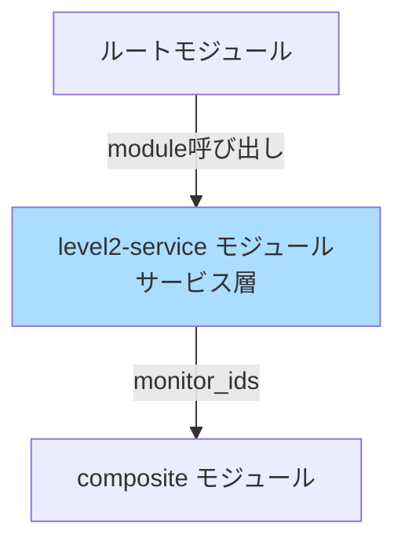

# level2-service モジュール詳細設計

## 1. モジュール概要

### 責務
**L2（サービス）層の監視Monitor**を作成します。L2障害はテナントに影響を及ぼすため、L2 Composite Monitor が発火した際にL3アラートを抑制します。

### 4層監視モデルにおけるL2の位置づけ

| レイヤー | 監視対象 | 影響範囲 | PoC実装状況 |
|---------|---------|---------|------------|
| L0（ネットワーク） | VPC Flow Logs、RDS/ECS（将来L1へ移行予定） | 全テナント | ✅ 実装済み |
| L1（コンピュート） | RDS、ECS、ALB（将来移行） | 全テナント | ⚠️ 将来拡張 |
| **L2（サービス）** | **E2Eヘルスチェック、ECR脆弱性** | 該当サービス | ✅ 実装済み |
| L3（テナント） | テナント別監視 | 該当テナントのみ | ✅ 実装済み |

**PoC実装範囲**: L2はサービス層（E2Eヘルスチェック、ECR脆弱性）に特化

### 監視対象リソース
| Monitor ID | 監視対象 | メトリクス/イベント | 影響範囲 | 備考 |
|-----------|---------|-----------------|---------|------|
| **FR-002-5** | **ALB→API→RDS E2Eヘルスチェック** | **Synthetic Monitoring** | **全テナント** | **サービス層の中核** |
| L2-ECR-Vuln | ECR 脆弱性 | `aws.ecr.vulnerability.critical` | 該当イメージ | サービス品質管理 |

**注記**: L2-ALB-Health、L2-ECS-Task は将来L1層（level1-compute モジュール）に移行予定

### 基本設計との対応
- [05_監視設計.md § 2.2 L2監視](../../01_基本設計/05_監視設計.md)（v1.3 - 4層モデル）
- [10_IaC方針.md § 3.2](../../01_基本設計/10_IaC方針.md)

---

## 2. ディレクトリ構成

```
modules/level2-service/
├── main.tf           # モジュールのエントリーポイント
├── variables.tf      # 入力変数定義
├── outputs.tf        # 出力定義（Monitor ID等）
└── monitors.tf       # L2 Monitor の定義（2個のMonitor）
```

---

## 3. variables.tf の詳細

### 入力変数一覧

| 変数名 | 型 | デフォルト値 | 説明 |
|-------|------|------------|------|
| `alb_fqdn` | string | - | ALB FQDN（例: myapp-1234567890.ap-northeast-1.elb.amazonaws.com） |
| `ecr_repository_name` | string | - | ECR リポジトリ名（例: myapp） |
| `e2e_health_check_enabled` | bool | true | E2Eヘルスチェック有効化フラグ |
| `notification_channels` | list(string) | [] | 通知先（Slack、Email等） |
| `tags` | map(string) | {} | Monitor に付与するタグ |

### variables.tf 実装例

```hcl
variable "alb_fqdn" {
  description = "ALB FQDN（例: myapp-1234567890.ap-northeast-1.elb.amazonaws.com）"
  type        = string
}

variable "ecr_repository_name" {
  description = "ECR リポジトリ名（例: myapp）"
  type        = string
  default     = "myapp"
}

variable "e2e_health_check_enabled" {
  description = "E2Eヘルスチェック有効化フラグ（Synthetic Monitoring使用）"
  type        = bool
  default     = true
}

variable "notification_channels" {
  description = "通知先（Slack、Email、PagerDuty等）"
  type        = list(string)
  default     = []
}

variable "tags" {
  description = "Monitor に付与するタグ"
  type        = map(string)
  default     = {}
}
```

---

## 4. monitors.tf の詳細

### 4.1 FR-002-5: ALB→API→RDS E2Eヘルスチェック（サービス層の中核）

**目的**: ALB経由でECS→RDSのエンドツーエンド疎通を確認。

**監視方式**: Datadog Synthetic Monitoring（HTTP Check）

**実装方法の選択肢**:

| 方法 | Datadog リソース | メリット | デメリット | 推奨 |
|------|----------------|---------|----------|------|
| A. Synthetic Monitoring | `datadog_synthetics_test` | 外部からの死活監視、E2E疎通確認、リトライ制御可能 | コスト高（月額料金） | **本番推奨** |
| B. HTTP Check (Agent) | `datadog_monitor` (service check) | Agent側でチェック実行、コスト低 | Agent設定が必要 | PoC可（コスト重視） |

**本ドキュメントでは A. Synthetic Monitoring を推奨します。**

```hcl
resource "datadog_synthetics_test" "e2e_health_check" {
  count = var.e2e_health_check_enabled ? 1 : 0

  name    = "[L2] ALB→API→RDS E2Eヘルスチェック"
  type    = "api"
  subtype = "http"
  status  = "live"

  request_definition {
    method = "GET"
    url    = "https://${var.alb_fqdn}/health"
  }

  assertion {
    type     = "statusCode"
    operator = "is"
    target   = "200"
  }

  assertion {
    type     = "responseTime"
    operator = "lessThan"
    target   = "5000"  # 5秒
  }

  assertion {
    type     = "body"
    operator = "contains"
    target   = "\"status\":\"ok\""
  }

  locations = ["aws:ap-northeast-1"]

  options_list {
    tick_every = 300  # 5分ごと
    retry {
      count    = 2
      interval = 300  # 5分間隔でリトライ
    }
  }

  message = <<-EOT
    [L2] ALB→API→RDS E2Eヘルスチェックが失敗しました。
    - URL: https://${var.alb_fqdn}/health
    - 影響: 全テナント（サービス停止の可能性）
    - 確認内容: ALB → ECS → RDS 疎通

    対応: ALB、ECS、RDSの疎通を確認してください。

    ✅ L2維持（サービス層）

    ${join("\n", var.notification_channels)}
  EOT

  tags = concat(
    ["layer:l2", "resource:e2e", "severity:critical"],
    [for k, v in var.tags : "${k}:${v}"]
  )
}
```

**Synthetics Test の重要なパラメータ**:

| パラメータ | 説明 | 設定値 |
|---------|------|--------|
| `type` | Synthetic Test タイプ | `api`（APIテスト） |
| `subtype` | APIテストのサブタイプ | `http`（HTTPリクエスト） |
| `status` | テストの状態 | `live`（有効） |
| `locations` | 実行ロケーション | `aws:ap-northeast-1`（東京リージョン） |
| `tick_every` | 実行頻度（秒） | `300`（5分ごと） |
| `retry.count` | リトライ回数 | `2`（3回連続失敗でアラート） |
| `retry.interval` | リトライ間隔（秒） | `300`（5分） |

**アサーション（検証内容）**:
1. **HTTP ステータスコード**: 200であること
2. **応答時間**: 5秒未満であること
3. **レスポンスボディ**: `"status":"ok"` を含むこと

**アプリケーション側の実装要件**:
- `/health` エンドポイントを実装
- RDSへの疎通確認（`SELECT 1` クエリ実行）
- レスポンス例:
  ```json
  {
    "status": "ok",
    "database": "connected",
    "timestamp": "2025-12-28T12:34:56.789Z"
  }
  ```

**参照**: アプリケーション設計書（存在する場合）と整合させてください。

### 4.2 L2-ECR-Vuln Monitor（サービス品質管理）

**注**: ECR 脆弱性スキャンは Datadog Security Monitoring の機能を使用します。

```hcl
resource "datadog_monitor" "ecr_vulnerability" {
  name    = "[L2] ECR 脆弱性（Critical）"
  type    = "metric alert"
  query   = "avg(last_15m):sum:aws.ecr.vulnerability.critical{repository_name:${var.ecr_repository_name}} > 0"
  message = <<-EOT
    [L2] ECR イメージにCritical脆弱性が検出されました。
    - Repository: ${var.ecr_repository_name}
    - Critical Vulnerabilities: {{value}}
    - 影響: 該当イメージを使用している環境

    対応: イメージを最新化してください。

    ✅ L2維持（サービス層）

    ${join("\n", var.notification_channels)}
  EOT

  thresholds = {
    critical = 0
  }

  tags = concat(
    ["layer:l2", "resource:ecr", "severity:high"],
    [for k, v in var.tags : "${k}:${v}"]
  )

  notify_no_data    = false
  renotify_interval = 0
}
```

**前提条件**:
- ECR の脆弱性スキャン（Enhanced Scanning または Basic Scanning）が有効であること
- Datadog AWS Integration で ECR にチェックが入っていること

---

## 5. outputs.tf の詳細

### 出力定義

```hcl
output "monitor_ids" {
  description = "L2 Monitor のIDリスト（Composite Monitor で参照）"
  value = merge(
    {
      ecr_vulnerability  = datadog_monitor.ecr_vulnerability.id
    },
    var.e2e_health_check_enabled ? {
      e2e_health_check = datadog_synthetics_test.e2e_health_check[0].monitor_id
    } : {}
  )
}

output "monitor_names" {
  description = "L2 Monitor の名前リスト"
  value = merge(
    {
      ecr_vulnerability  = datadog_monitor.ecr_vulnerability.name
    },
    var.e2e_health_check_enabled ? {
      e2e_health_check = datadog_synthetics_test.e2e_health_check[0].name
    } : {}
  )
}

output "synthetics_test_id" {
  description = "E2E Synthetics Test ID（デバッグ用）"
  value       = var.e2e_health_check_enabled ? datadog_synthetics_test.e2e_health_check[0].id : null
}
```

**重要な変更点**:
- `monitor_ids` に E2E Health Check の Monitor ID を追加
- `var.e2e_health_check_enabled` フラグで有効/無効を切り替え可能
- Synthetics Test の `monitor_id` 属性を使用（自動生成されるMonitor ID）

---

## 6. main.tf の詳細

**注**: このモジュールでは main.tf は空でも問題ありません（すべての Monitor 定義は monitors.tf に記載）。

```hcl
# level2-service モジュール
# L2 サービス監視 Monitor の作成
#
# ⚠️ PoC実装範囲: サービス層（E2Eヘルスチェック、ECR脆弱性）に特化
# 依存: monitors.tf, variables.tf, outputs.tf
```

---

## 7. 依存関係

### モジュール間の依存



### 外部依存

| リソース | 依存内容 |
|---------|---------|
| Datadog Provider | `DataDog/datadog` (~> 3.30) |
| ECR 脆弱性スキャン | ECR Enhanced Scanning または Basic Scanning が有効である必要あり |
| **Synthetics Monitoring** | **Datadog Synthetics Monitoring が有効である必要あり** |

---

## 8. 実装時の注意事項

### 8.1 ECR 脆弱性スキャンの前提条件

**ECR Enhanced Scanning の有効化**:
```bash
# AWS CLI で ECR Enhanced Scanning を有効化
aws ecr put-registry-scanning-configuration \
  --scan-type ENHANCED \
  --rules '[{"repositoryFilters":[{"filter":"*","filterType":"WILDCARD"}],"scanFrequency":"SCAN_ON_PUSH"}]'
```

**Datadog Integration の確認**:
1. Datadog UI → Integrations → AWS → ECR にチェック
2. 脆弱性メトリクスが収集されることを確認

### 8.2 Synthetics Monitoring のコスト

**重要**: Datadog Synthetics Monitoring は有料機能です。

| プラン | API テスト | 月額費用（概算） |
|------|-----------|---------------|
| Pro | 10,000 テスト実行/月 | 含まれる（プランによる） |
| 追加 | +10,000 テスト実行 | $5/月（概算） |

**本設計での実行頻度**:
- 1個のE2Eヘルスチェック
- 5分ごと実行
- 月間実行回数: 30日 × 24時間 × 12回/時 = **8,640回/月**

**コスト削減オプション**:
1. **実行頻度を下げる**: `tick_every = 600`（10分ごと）→ 4,320回/月
2. **PoC期間のみ有効化**: `var.e2e_health_check_enabled = false` で無効化可能

### 8.3 通知先の設定

**Slack通知の例**:
```hcl
notification_channels = [
  "@slack-ops-alerts-high"
]
```

**Email通知の例**:
```hcl
notification_channels = [
  "@app-team@example.com"
]
```

### 8.4 タグの付与

**共通タグの例**:
```hcl
tags = {
  project     = "datadog-poc"
  environment = "poc"
  managed_by  = "terraform"
}
```

Monitor には以下のタグが自動付与されます:
- `layer:l2`
- `resource:e2e` / `resource:ecr`
- `severity:critical` / `severity:high`

---

## 9. テスト方法

### 9.1 単体テスト

```powershell
# modules/level2-service ディレクトリでテスト
cd modules/level2-service

# terraform init
terraform init

# terraform plan（変数を渡す）
terraform plan \
  -var="alb_fqdn=myapp-1234567890.ap-northeast-1.elb.amazonaws.com"
```

**期待される出力**:
```
Plan: 2 to add, 0 to change, 0 to destroy.
# - datadog_monitor.ecr_vulnerability
# - datadog_synthetics_test.e2e_health_check[0]
```

### 9.2 Monitor の確認

Terraform apply 後、Datadog UI で以下を確認:

1. **Monitors → Manage Monitors** を開く
2. タグフィルター: `layer:l2` で絞り込み
3. 2個の Monitor が作成されていることを確認
   - [L2] ALB→API→RDS E2Eヘルスチェック
   - [L2] ECR 脆弱性（Critical）

### 9.3 Synthetics Test の確認

1. **Datadog UI → Synthetic Monitoring → Tests** を開く
2. `[L2] ALB→API→RDS E2Eヘルスチェック` を確認
3. **Run Test Now** で手動実行し、結果を確認

---

## 10. 監視数の変更（4層モデル）

### 修正前（3層モデル）

| Monitor | 個数 |
|---------|------|
| L2-ALB-Health | 1 |
| L2-ECS-Task | 1 |
| L2-ECR-Vuln | 1 |
| **FR-002-5（E2Eヘルスチェック）** | **1** |
| **合計** | **4個** |

### 修正後（4層モデル、PoC実装範囲）

| Monitor | 個数 | 備考 |
|---------|------|------|
| **FR-002-5（E2Eヘルスチェック）** | **1** | ✅ L2維持（サービス層） |
| L2-ECR-Vuln | 1 | ✅ L2維持（サービス層） |
| **合計** | **2個** | L2-ALB-Health、L2-ECS-Task は将来L1へ移行 |

**影響**: パラメータシートの更新が必要。L2はサービス層に特化。

---

## 11. 関連ドキュメント

| ドキュメント | パス |
|------------|------|
| 基本設計（監視設計 v1.3） | [../../01_基本設計/05_監視設計.md](../../01_基本設計/05_監視設計.md) |
| 基本設計（IaC方針） | [../../01_基本設計/10_IaC方針.md](../../01_基本設計/10_IaC方針.md) |
| パラメータシート | [02_パラメータシート.md](02_パラメータシート.md) |
| 構築手順書 | [03_構築手順書.md](03_構築手順書.md) |
| Datadog Synthetics Monitoring ドキュメント | https://docs.datadoghq.com/synthetics/ |

---

**作成日**: 2025-12-28
**作成者**: Infra-Architect
**バージョン**: 1.2
**ステータス**: Draft
**変更履歴**:
- 1.0 (2025-12-28): 初版作成
- 1.1 (2025-12-28): FR-002-5（ALB→API→RDS E2Eヘルスチェック）追加、Synthetics Monitoring実装例追加
- 1.2 (2025-12-31): 4層モデル（L0/L1/L2/L3）に対応、L2をサービス層に特化（E2Eヘルスチェック、ECR脆弱性）
