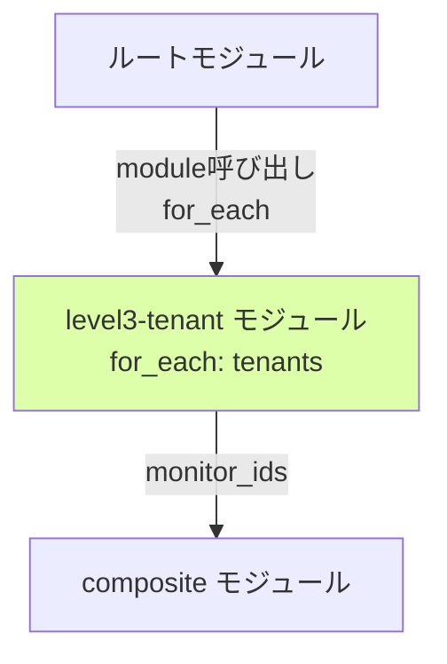

# level3-tenant モジュール詳細設計

## 1. モジュール概要

### 責務
L3（テナント）層の監視Monitorを作成します。**for_each によるテナント動的管理**により、terraform.tfvars に1行追加するだけでテナント監視を追加できます。

### 監視対象リソース
| Monitor ID（例: tenant-a） | 監視対象 | メトリクス/チェック | 影響範囲 |
|---------------------------|---------|------------------|---------|
| FR-003-1 | **ヘルスチェック（RDS疎通含む）** | `http.check` (Service Check) または Synthetics | tenant-a のみ |
| L3-Error-tenant-a | エラーログ数 | `log.error{tenant:tenant-a}` | tenant-a のみ |
| L3-Latency-tenant-a | レイテンシ（p99） | `trace.web.request.duration.p99{tenant:tenant-a}` | tenant-a のみ |

### 基本設計との対応
- [05_監視設計.md § 2.3 L3監視](../../01_基本設計/05_監視設計.md)
- [10_IaC方針.md § 3.3](../../01_基本設計/10_IaC方針.md)

---

## 2. ディレクトリ構成

```
modules/level3-tenant/
├── main.tf           # モジュールのエントリーポイント
├── variables.tf      # 入力変数定義
├── outputs.tf        # 出力定義（Monitor ID等）
└── monitors.tf       # L3 Monitor の定義（3個のMonitor、テナント変数使用）
```

---

## 3. variables.tf の詳細

### 入力変数一覧

| 変数名 | 型 | デフォルト値 | 説明 |
|-------|------|------------|------|
| `tenant_id` | string | - | テナント識別子（例: tenant-a） |
| `health_check_url` | string | - | ヘルスチェックURL（例: https://myapp.example.com/tenant-a/health） |
| `errors_threshold` | number | 10 | エラーログ数の閾値（5分間） |
| `latency_threshold` | number | 1000 | レイテンシ閾値（ms、p99） |
| `notification_channels` | list(string) | [] | 通知先（Slack、Email等） |
| `tags` | map(string) | {} | Monitor に付与するタグ |

### variables.tf 実装例

```hcl
variable "tenant_id" {
  description = "テナント識別子（例: tenant-a）"
  type        = string
}

variable "health_check_url" {
  description = "ヘルスチェックURL（例: https://myapp.example.com/tenant-a/health）"
  type        = string
}

variable "errors_threshold" {
  description = "エラーログ数の閾値（5分間）"
  type        = number
  default     = 10
}

variable "latency_threshold" {
  description = "レイテンシ閾値（ms、p99）"
  type        = number
  default     = 1000
}

variable "notification_channels" {
  description = "通知先（Slack、Email、PagerDuty等）"
  type        = list(string)
  default     = []
}

variable "tags" {
  description = "Monitor に付与するタグ"
  type        = map(string)
  default     = {}
}
```

---

## 4. monitors.tf の詳細

### 4.1 FR-003-1: ヘルスチェック（RDS疎通含む）

**目的**: テナントごとにALB → ECS → RDS のエンドツーエンド疎通を確認。

**重要な変更点**:
- **RDS疎通確認を含むことを明記**
- ヘルスチェックエンドポイントは `/{tenant_id}/health`
- アプリケーション側で `SELECT 1 FROM {tenant_table} WHERE tenant_id = '{tenant_id}' LIMIT 1` クエリを実行

**実装方法の選択肢**:

| 方法 | Datadog リソース | メリット | デメリット | 推奨 |
|------|----------------|---------|----------|------|
| A. Synthetics Test | `datadog_synthetics_test` (type: `api`) | 外部からの死活監視、SSL証明書チェック可能、**RDS疎通確認** | コスト高（テナント数 × 月額料金） | 本番推奨 |
| B. Service Check Monitor | `datadog_monitor` (type: `service check`) + Agent HTTP Check | Agent側でHTTPチェック実行、コスト低 | Agent設定が必要 | PoC推奨 |

**PoC推奨実装（B. Service Check Monitor）**:

```hcl
resource "datadog_monitor" "health_check" {
  name    = "[L3] ${var.tenant_id} ヘルスチェック（RDS疎通含む）"
  type    = "service check"
  query   = "\"http.check\".over(\"url:${var.health_check_url}\").by(\"*\").last(2).count_by_status()"
  message = <<-EOT
    [L3] ${var.tenant_id} のヘルスチェック（RDS疎通含む）が失敗しました。
    - URL: ${var.health_check_url}
    - 影響: ${var.tenant_id} のみ
    - 確認内容: ALB → ECS → RDS（tenant_id='${var.tenant_id}'）疎通

    対応: 以下を確認してください。
    1. ${var.tenant_id} のアプリケーションが正常に動作しているか
    2. RDSへの接続が正常か（tenant_idでフィルタしたクエリが実行できるか）
    3. /{tenant_id}/health エンドポイントが正常にレスポンスを返すか

    ${join("\n", var.notification_channels)}
  EOT

  thresholds = {
    critical = 1
    ok       = 1
  }

  tags = concat(
    ["layer:l3", "tenant:${var.tenant_id}", "severity:high"],
    [for k, v in var.tags : "${k}:${v}"]
  )

  notify_no_data    = true
  no_data_timeframe = 10
  renotify_interval = 0
}
```

**前提条件**: Datadog Agentで以下の設定が必要（`datadog.yaml` または ECS Task Definition）:

```yaml
# Datadog Agent 設定（ECS Task Definition環境変数）
DD_HTTP_CHECK_CONFIG: |
  instances:
    - name: ${var.tenant_id}-health
      url: ${var.health_check_url}
      timeout: 5
      tags:
        - tenant:${var.tenant_id}
```

**アプリケーション側の実装要件**:
- `/{tenant_id}/health` エンドポイントを実装
- **RDSへの疎通確認（テナントIDでフィルタしたクエリを実行）**
- レスポンス例:
  ```json
  {
    "status": "ok",
    "tenant_id": "tenant-a",
    "database": "connected",
    "query": "SELECT 1 FROM tenants WHERE tenant_id = 'tenant-a' LIMIT 1",
    "timestamp": "2025-12-28T12:34:56.789Z"
  }
  ```

**L2（FR-002-5）との違い**:

| 項目 | L2（FR-002-5） | L3（FR-003-1） |
|------|---------------|---------------|
| エンドポイント | `/health` | `/{tenant_id}/health` |
| テナント識別 | なし | あり |
| RDSクエリ | `SELECT 1` | `SELECT 1 FROM {tenant_table} WHERE tenant_id = '{tenant_id}' LIMIT 1` |
| 影響範囲 | 全テナント | 該当テナントのみ |
| アラート抑制 | L0障害時に抑制 | L0/L2障害時に抑制 |

**本番推奨実装（A. Synthetics Test）**:

```hcl
# 本番環境では Synthetics Test を使用
resource "datadog_synthetics_test" "health_check" {
  name    = "[L3] ${var.tenant_id} ヘルスチェック（RDS疎通含む）"
  type    = "api"
  subtype = "http"
  status  = "live"

  request_definition {
    method = "GET"
    url    = var.health_check_url
  }

  assertion {
    type     = "statusCode"
    operator = "is"
    target   = "200"
  }

  assertion {
    type     = "responseTime"
    operator = "lessThan"
    target   = "5000"
  }

  assertion {
    type     = "body"
    operator = "contains"
    target   = "\"status\":\"ok\""
  }

  assertion {
    type     = "body"
    operator = "contains"
    target   = "\"database\":\"connected\""
  }

  locations = ["aws:ap-northeast-1"]

  options_list {
    tick_every = 300  # 5分ごと
    retry {
      count    = 1
      interval = 300
    }
  }

  message = <<-EOT
    [L3] ${var.tenant_id} のヘルスチェック（RDS疎通含む）が失敗しました。
    - URL: ${var.health_check_url}
    - 影響: ${var.tenant_id} のみ
    - 確認内容: ALB → ECS → RDS（tenant_id='${var.tenant_id}'）疎通

    対応: 以下を確認してください。
    1. ${var.tenant_id} のアプリケーションが正常に動作しているか
    2. RDSへの接続が正常か（tenant_idでフィルタしたクエリが実行できるか）
    3. /{tenant_id}/health エンドポイントが正常にレスポンスを返すか

    ${join("\n", var.notification_channels)}
  EOT

  tags = ["layer:l3", "tenant:${var.tenant_id}"]
}
```

**アサーション（検証内容）**:
1. **HTTP ステータスコード**: 200であること
2. **応答時間**: 5秒未満であること
3. **レスポンスボディ**: `"status":"ok"` を含むこと
4. **レスポンスボディ**: `"database":"connected"` を含むこと（**RDS疎通確認の証跡**）

### 4.2 L3-Error Monitor（Log Monitor）

```hcl
resource "datadog_monitor" "error_logs" {
  name    = "[L3] ${var.tenant_id} エラーログ数"
  type    = "log alert"
  query   = "logs(\"status:error tenant:${var.tenant_id}\").rollup(\"count\").last(\"5m\") > ${var.errors_threshold}"
  message = <<-EOT
    [L3] ${var.tenant_id} のエラーログが5分間で${var.errors_threshold}件を超えました。
    - Count: {{value}}
    - 影響: ${var.tenant_id} のみ

    詳細: {{log.message}}

    ${join("\n", var.notification_channels)}
  EOT

  thresholds = {
    critical = var.errors_threshold
    warning  = floor(var.errors_threshold / 2)
  }

  tags = concat(
    ["layer:l3", "tenant:${var.tenant_id}", "severity:medium"],
    [for k, v in var.tags : "${k}:${v}"]
  )

  notify_no_data    = false
  renotify_interval = 0
}
```

**前提条件**:
- アプリケーションログに `tenant:${var.tenant_id}` タグが付与されていること
- ログが構造化ログ（JSON形式）で出力されていること
- Datadog Log Collection が有効であること

### 4.3 L3-Latency Monitor（APM Monitor）

```hcl
resource "datadog_monitor" "latency" {
  name    = "[L3] ${var.tenant_id} レイテンシ（p99）"
  type    = "metric alert"
  query   = "avg(last_5m):p99:trace.web.request.duration{service:myapp,tenant:${var.tenant_id}} > ${var.latency_threshold}"
  message = <<-EOT
    [L3] ${var.tenant_id} のレイテンシ（p99）が${var.latency_threshold}msを超えました。
    - Latency: {{value}}ms
    - 影響: ${var.tenant_id} のみ

    ${join("\n", var.notification_channels)}
  EOT

  thresholds = {
    critical = var.latency_threshold
    warning  = floor(var.latency_threshold * 0.5)
  }

  tags = concat(
    ["layer:l3", "tenant:${var.tenant_id}", "severity:medium"],
    [for k, v in var.tags : "${k}:${v}"]
  )

  notify_no_data    = false
  renotify_interval = 0
}
```

**前提条件**:
- Datadog APM が有効であること
- アプリケーショントレースに `tenant:${var.tenant_id}` タグが付与されていること

---

## 5. outputs.tf の詳細

### 出力定義

```hcl
output "monitor_ids" {
  description = "L3 Monitor のIDリスト（テナントごと）"
  value = {
    health_check = datadog_monitor.health_check.id
    error_logs   = datadog_monitor.error_logs.id
    latency      = datadog_monitor.latency.id
  }
}

output "monitor_names" {
  description = "L3 Monitor の名前リスト"
  value = {
    health_check = datadog_monitor.health_check.name
    error_logs   = datadog_monitor.error_logs.name
    latency      = datadog_monitor.latency.name
  }
}

output "tenant_id" {
  description = "テナント識別子"
  value       = var.tenant_id
}
```

---

## 6. main.tf の詳細

**注**: このモジュールでは main.tf は空でも問題ありません（すべての Monitor 定義は monitors.tf に記載）。

```hcl
# level3-tenant モジュール
# L3 テナント監視 Monitor の作成（for_each 対応）
#
# 依存: monitors.tf, variables.tf, outputs.tf
```

---

## 7. for_each によるテナント動的管理

### 7.1 ルートモジュールでの呼び出し

**main.tf（ルートモジュール）**:
```hcl
# L3 テナント監視モジュール（for_each でテナント展開）
module "level3_tenant" {
  for_each = var.tenants
  source   = "./modules/level3-tenant"

  tenant_id          = each.key
  health_check_url   = "https://${var.app_domain}/${each.key}/health"
  errors_threshold   = each.value.errors_threshold
  latency_threshold  = each.value.latency_threshold

  notification_channels = var.notification_channels
  tags                  = merge(var.common_tags, { tenant = each.key })
}
```

### 7.2 terraform.tfvars でのテナント定義

```hcl
# テナント定義⭐
tenants = {
  tenant-a = {
    errors_threshold  = 10
    latency_threshold = 1000
  }
  tenant-b = {
    errors_threshold  = 10
    latency_threshold = 1000
  }
  tenant-c = {
    errors_threshold  = 10
    latency_threshold = 1000
  }
}
```

### 7.3 テナント追加時の動作

**terraform.tfvars に1行追加**:
```hcl
tenants = {
  tenant-a = { errors_threshold = 10, latency_threshold = 1000 }
  tenant-b = { errors_threshold = 10, latency_threshold = 1000 }
  tenant-c = { errors_threshold = 10, latency_threshold = 1000 }
  tenant-d = { errors_threshold = 10, latency_threshold = 1000 }  # ← 追加
}
```

**terraform plan の結果**:
```
Plan: 3 to add, 0 to change, 0 to destroy.

  # module.level3_tenant["tenant-d"] が作成される
  # - FR-003-1: ヘルスチェック（RDS疎通含む）
  # - L3-Error-tenant-d
  # - L3-Latency-tenant-d
```

**重要**: 既存テナント（tenant-a/b/c）には影響なし。

---

## 8. 依存関係

### モジュール間の依存



### 外部依存

| リソース | 依存内容 |
|---------|---------|
| Datadog Provider | `DataDog/datadog` (~> 3.30) |
| Datadog Agent | HTTP Check 機能（ヘルスチェック用） |
| Datadog Log Collection | ログ収集（エラーログ監視用） |
| Datadog APM | トレース収集（レイテンシ監視用） |

---

## 9. 実装時の注意事項

### 9.1 テナント識別子のタグ付与

**アプリケーション側の実装**:
- ログに `tenant:${tenant_id}` タグを付与
- トレースに `tenant:${tenant_id}` タグを付与

**例（Node.js + Winston）**:
```javascript
const logger = winston.createLogger({
  defaultMeta: { tenant: req.tenant_id }  // リクエストコンテキストから取得
});
```

**例（Python + structlog）**:
```python
logger.info("User login", tenant=request.tenant_id)
```

### 9.2 ヘルスチェックエンドポイント（RDS疎通含む）

**アプリケーション側の実装**:
- `/{tenant_id}/health` エンドポイントを実装
- **RDS疎通確認（テナントIDでフィルタしたクエリを実行）**
- HTTP 200 を返す（正常時）
- HTTP 500 を返す（異常時）

**実装例（Express.js）**:
```javascript
app.get('/:tenant_id/health', async (req, res) => {
  const { tenant_id } = req.params;

  try {
    // RDS疎通確認（テナントIDでフィルタしたクエリ）
    const result = await db.query(
      'SELECT 1 FROM tenants WHERE tenant_id = $1 LIMIT 1',
      [tenant_id]
    );

    if (result.rows.length === 0) {
      return res.status(500).json({
        status: 'error',
        tenant_id,
        database: 'tenant_not_found'
      });
    }

    res.status(200).json({
      status: 'ok',
      tenant_id,
      database: 'connected',
      query: `SELECT 1 FROM tenants WHERE tenant_id = '${tenant_id}' LIMIT 1`,
      timestamp: new Date().toISOString()
    });
  } catch (error) {
    res.status(500).json({
      status: 'error',
      tenant_id,
      database: 'disconnected',
      error: error.message
    });
  }
});
```

**実装例（Python Flask）**:
```python
@app.route('/<tenant_id>/health')
def health_check(tenant_id):
    try:
        # RDS疎通確認（テナントIDでフィルタしたクエリ）
        cursor = db.cursor()
        cursor.execute(
            "SELECT 1 FROM tenants WHERE tenant_id = %s LIMIT 1",
            (tenant_id,)
        )
        result = cursor.fetchone()

        if not result:
            return jsonify({
                'status': 'error',
                'tenant_id': tenant_id,
                'database': 'tenant_not_found'
            }), 500

        return jsonify({
            'status': 'ok',
            'tenant_id': tenant_id,
            'database': 'connected',
            'query': f"SELECT 1 FROM tenants WHERE tenant_id = '{tenant_id}' LIMIT 1",
            'timestamp': datetime.utcnow().isoformat() + 'Z'
        }), 200
    except Exception as e:
        return jsonify({
            'status': 'error',
            'tenant_id': tenant_id,
            'database': 'disconnected',
            'error': str(e)
        }), 500
```

### 9.3 テナント別の閾値カスタマイズ

```hcl
# terraform.tfvars
tenants = {
  tenant-a = {
    errors_threshold  = 10  # デフォルト
    latency_threshold = 1000
  }
  tenant-premium = {
    errors_threshold  = 5   # プレミアムプランは厳しい閾値
    latency_threshold = 500
  }
}
```

---

## 10. テスト方法

### 10.1 単体テスト

```powershell
# modules/level3-tenant ディレクトリでテスト
cd modules/level3-tenant

# terraform init
terraform init

# terraform plan（変数を渡す）
terraform plan \
  -var="tenant_id=tenant-a" \
  -var="health_check_url=https://myapp.example.com/tenant-a/health"
```

**期待される出力**:
```
Plan: 3 to add, 0 to change, 0 to destroy.
```

### 10.2 ヘルスチェックエンドポイントのテスト

**手動テスト**:
```bash
# ヘルスチェックエンドポイントにHTTPリクエスト
curl -X GET https://myapp.example.com/tenant-a/health

# 期待されるレスポンス（正常時）
{
  "status": "ok",
  "tenant_id": "tenant-a",
  "database": "connected",
  "query": "SELECT 1 FROM tenants WHERE tenant_id = 'tenant-a' LIMIT 1",
  "timestamp": "2025-12-28T12:34:56.789Z"
}
```

---

## 11. 関連ドキュメント

| ドキュメント | パス |
|------------|------|
| 基本設計（監視設計） | [../../01_基本設計/05_監視設計.md](../../01_基本設計/05_監視設計.md) |
| 基本設計（IaC方針） | [../../01_基本設計/10_IaC方針.md](../../01_基本設計/10_IaC方針.md) |
| パラメータシート | [02_パラメータシート.md](02_パラメータシート.md) |
| 構築手順書 | [03_構築手順書.md](03_構築手順書.md) |

---

**作成日**: 2025-12-28
**作成者**: Infra-Architect
**バージョン**: 1.1
**ステータス**: Draft
**変更履歴**:
- 1.0 (2025-12-28): 初版作成
- 1.1 (2025-12-28): FR-003-1（ヘルスチェック）がRDS疎通を含むことを明記、アプリケーション実装例追加、L2との違いを明確化
