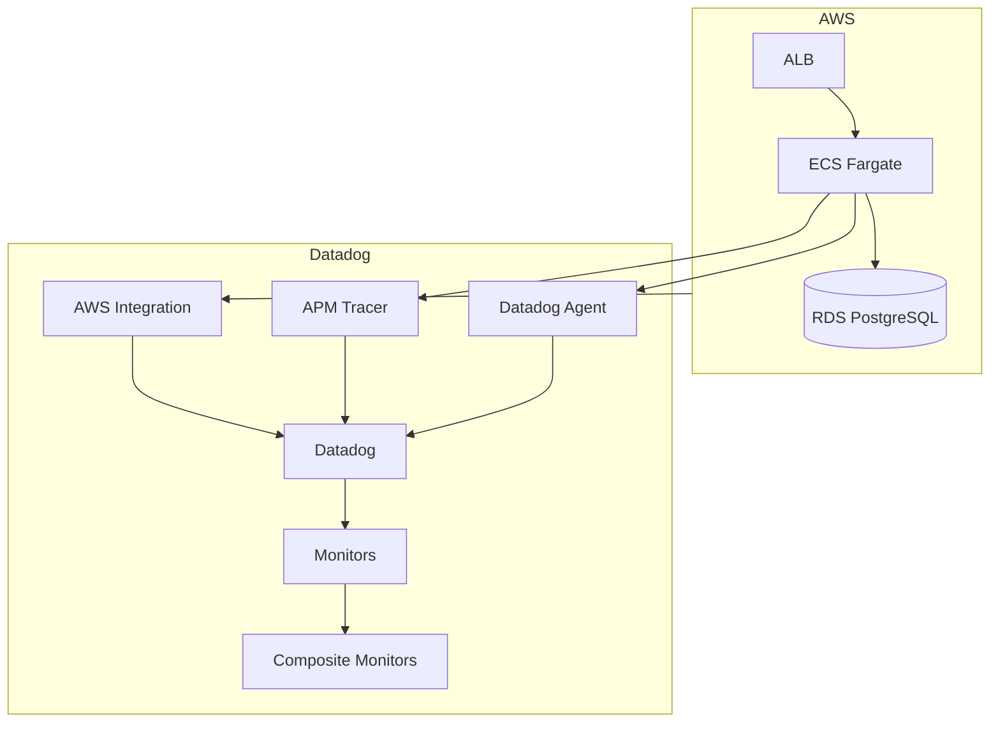
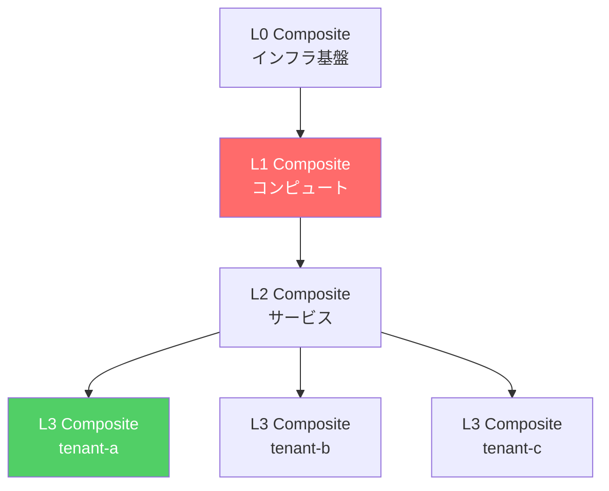
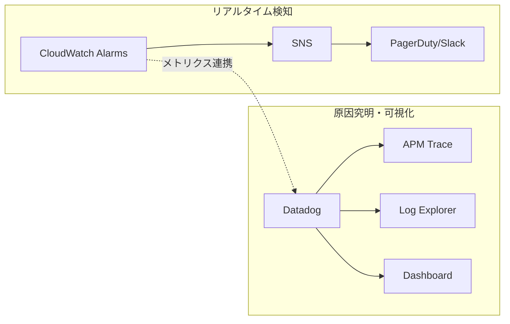

# Datadog Composite Monitor PoC 検証報告書

## 1. エグゼクティブサマリー

| 項目 | 結果 |
|------|------|
| **検証目的** | Composite Monitor によるアラートストーム抑制 |
| **検証結果** | **成功** |
| **検証日** | 2025-12-31 |

**結論**: 親レイヤー（L1）が Alert の間、子レイヤー（L3）の Composite Monitor は OK を維持し、オペレーターへの通知を抑制できることを確認した。

---

## 2. 背景・目的

### 2.1 背景

マルチテナント SaaS 環境において、インフラ障害発生時に大量のアラートが同時発報する「アラートストーム」が運用課題となっている。

- RDS 障害 → 全テナントでエラー → 数十件のアラート同時発報
- オペレーターがどのアラートに対応すべきか判断困難
- 根本原因（インフラ）への対応が遅延

### 2.2 目的

Datadog Composite Monitor を使用して、以下を検証する。

1. **階層型監視の実現**: L0（基盤）→ L1（コンピュート）→ L2（サービス）→ L3（テナント）
2. **アラート抑制**: 親レイヤー障害時に子レイヤーのアラートを抑制
3. **Terraform による IaC 管理**: テナント追加時の自動スケール

### 2.3 検証仮説

> 「Composite Monitor で親子関係を定義すれば、インフラ障害時にアプリケーションレイヤーのアラートを抑制できる」

---

## 3. 検証環境

### 3.1 構成図



### 3.2 環境詳細

| 項目 | 値 |
|------|-----|
| AWS リージョン | ap-northeast-1 |
| ECS クラスター | datadog-poc-cluster |
| RDS インスタンス | db.t4g.micro |
| テナント数 | 3（tenant-a, tenant-b, tenant-c） |
| Datadog サイト | AP1（api.ap1.datadoghq.com） |

### 3.3 Monitor 構成

| レイヤー | Monitor 数 | 監視対象 |
|----------|-----------|----------|
| L0 | 1 | APM トレース疎通 |
| L1 | 4 | RDS CPU/メモリ/接続数/ストレージ |
| L2 | 2 | ALB Health, ECS Task 停止 |
| L3 | 3 x 3テナント | APM エラー, ログエラー, レイテンシ |
| Composite | 6 | L0/L1/L2/L3(x3) |

---

## 4. 検証結果

### 4.1 アラートストーム抑制テスト

```
テスト条件:
- L1 Composite = Alert（RDS 空きメモリ不足）
- L3 エラー注入: 15件の 500 エラー（しきい値 10件超過）

結果:
- [L3 APM] tenant-a = Alert（エラー検知）
- [L3 Composite] tenant-a = OK（抑制成功）
```

| パターン | 条件 | 期待結果 | 実結果 |
|----------|------|----------|--------|
| 抑制あり | L1=Alert, L3個別=Alert | L3 Composite=OK | **OK（成功）** |

### 4.2 Composite Monitor 構成



**抑制ロジック**: `(L3個別 Alert) && !L0 && !L1 && !L2`
- L1 が Alert の場合、`!L1 = false` となり、全体が false → L3 Composite は OK

---

## 5. 技術的課題と解決策

### 5.1 Composite Monitor NO DATA 問題

| 原因 | 解決策 |
|------|--------|
| 演算子優先度（`&&` が `||` より優先） | クエリに括弧を追加: `(A \|\| B) && !C` |
| Synthetics Alert が Composite で評価されない | L2 outputs から Synthetics monitor を除外 |

**修正前**: `A || B || C && !D && !E` → 誤った評価

**修正後**: `(A || B || C) && !D && !E` → 正しい評価

### 5.2 L1 監視の課題

| 現状 | 課題 | 改善案 |
|------|------|--------|
| RDS メモリ < 50MB | 通常運用でも Alert | ON/OFF 監視（ECS running=0） |
| しきい値ベース | 頻繁なアラート | プロセス監視（稼働/停止） |

---

## 6. Terraform Provider ノウハウ

### 6.1 Datadog Provider

```hcl
# Composite Monitor クエリの括弧は必須
query = "(${join(" || ", [...])}) && !${l0_id} && !${l1_id}"

# for_each でテナント別リソース作成
resource "datadog_monitor" "l3_composite" {
  for_each = var.tenants
  name     = "[L3 Composite] ${each.key} 障害"
}

# NO DATA 通知を抑制
notify_no_data = false
```

**注意点**:
- Synthetics Alert タイプは Composite Monitor で正しく評価されない
- monitor_id は数値だが、クエリでは文字列として扱う

### 6.2 Datadog データソース別の遅延

| データソース | 遅延 | 用途 |
|-------------|------|------|
| **Datadog Agent メトリクス** | 10-15秒 | ホスト/コンテナメトリクス |
| **Datadog Agent ログ** | ほぼリアルタイム | アプリログ監視 |
| **APM トレース** | リアルタイム | リクエスト追跡 |
| **AWS Integration** | **1-2分** | CloudWatch メトリクス（RDS, ECS等） |

```
リアルタイム監視:
  Datadog Agent → メトリクス/ログ → Datadog（10-15秒）
  APM Tracer → トレース → Datadog（即時）

遅延あり監視:
  AWS CloudWatch → Datadog Integration → Datadog（1-2分）
```

**重要**: リアルタイムでインフラ監視するなら **Agent + APM + ログ転送**がセット。
AWS Integration 経由の RDS/ECS メトリクスは 1-2分の遅延があるため、
クリティカル検知には CloudWatch Alarms を併用すべき。

| 項目 | 詳細 |
|------|------|
| **ECS Fargate 制約** | `datadog.agent.up` サービスチェック使用不可 |
| **代替手段** | APM トレースベース監視（`trace.fastapi.request.hits`） |

---

## 7. アーキテクチャ考察

### 7.1 リアルタイム検知 vs 可視化・分析

| 観点 | CloudWatch | Datadog |
|------|-----------|---------|
| **検知速度** | リアルタイム（秒単位） | 1-2分遅延 |
| **アラート抑制** | SNS 連携で可能 | Composite Monitor |
| **原因究明** | 限定的 | APM/ログ相関で強力 |
| **ダッシュボード** | 基本的 | 高度な可視化 |
| **コスト** | 従量課金 | ホスト/メトリクス課金 |

### 7.2 推奨運用パターン



**役割分担**:
- **CloudWatch**: クリティカル検知（RDS 停止、ECS タスク 0）
- **Datadog**: 原因究明、トレンド分析、ダッシュボード

### 7.3 SLO設計の考慮点

| 指標 | 目標値 | 測定方法 |
|------|--------|----------|
| 可用性 | 99.9% | Synthetics Test の成功率 |
| レイテンシ | p99 < 1000ms | APM レイテンシ監視 |
| エラー率 | < 0.1% | APM エラー率監視 |

**エラーバジェットの考え方**:
- 月間許容ダウンタイム: 43.2分（99.9%の場合）
- アラート発報からのMTTR目標設定

---

## 8. 今後の課題

| 優先度 | 課題 | 対応案 |
|--------|------|--------|
| 高 | L1 ON/OFF 監視への移行 | ECS running=0, RDS 接続不可で検知 |
| 高 | SLO/SLI設計 | 可用性目標の数値化、エラーバジェット導入 |
| 高 | Runbook整備 | アラート発報時の対応手順書作成 |
| 中 | 抑制なしパターンの追加検証 | L1=OK 時に L3 Composite が発報するか確認 |
| 中 | CloudWatch + Datadog 連携設計 | リアルタイム検知と分析の役割分担 |
| 低 | 本番環境向けしきい値チューニング | 実運用データに基づく調整 |

---

## 9. 結論

### 9.1 PoC 検証結果

Composite Monitor によるアラートストーム抑制は **実現可能**。

- 親レイヤー（L1/L2）が Alert の間、子レイヤー（L3）の Composite は OK を維持
- オペレーターは根本原因（L1）のみ対応すればよい

### 9.2 本番導入に向けた提言

1. **AWS Integration の遅延を考慮**
   - クリティカル検知は CloudWatch Alarms で即時対応
   - Datadog は原因究明・可視化に活用

2. **L1 監視の見直し**
   - しきい値ベースから ON/OFF 監視へ
   - ECS/RDS の稼働状態を直接監視

3. **Terraform 運用**
   - Composite Monitor クエリの括弧を忘れずに
   - Synthetics は Composite から除外

4. **SLO/SLI設計**
   - 可用性、レイテンシ、エラー率のSLO目標を数値化
   - エラーバジェットに基づくアラート閾値設定

5. **Runbook整備**
   - アラート発報時の対応手順書を作成
   - エスカレーションフローを明確化

---

## 付録: 修正ファイル一覧

| ファイル | 修正内容 |
|----------|----------|
| `modules/composite/composites.tf` | クエリに括弧追加 |
| `modules/level2-service/outputs.tf` | Synthetics を monitor_ids から除外 |
| `terraform.tfvars` | RDS メモリしきい値調整（検証用） |

---

*作成日: 2025-12-31*
*作成者: PM + SRE*
